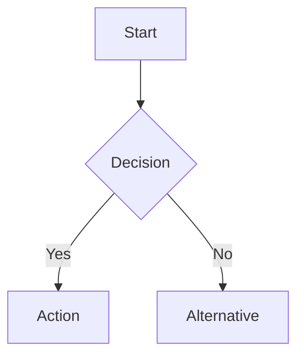
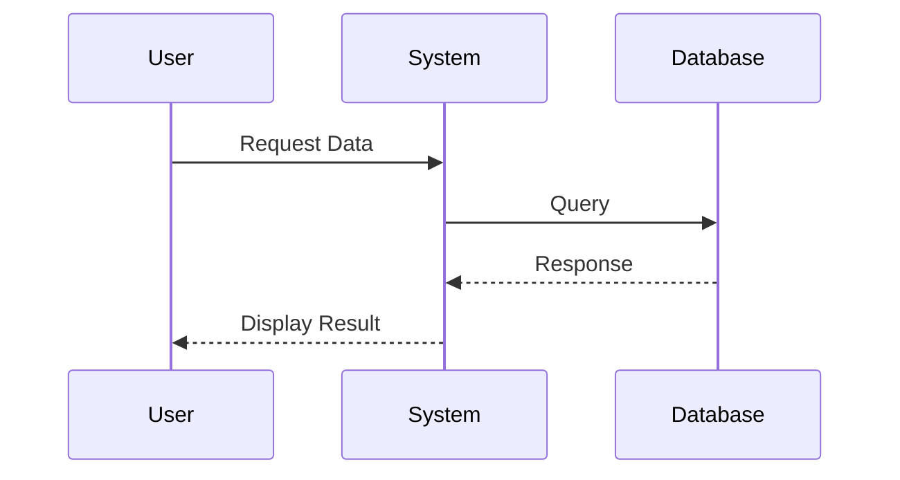

---

title: Documentation Standards

type: guide

status: draft

created: 2024-02-12

tags:

  - documentation

  - standards

  - guidelines

semantic_relations:

  - type: implements

    links: [[ai_documentation_style]]

  - type: relates

    links:

      - [[package_documentation]]

      - [[implementation_guides]]

---

# Documentation Standards

## Overview

This guide establishes documentation standards for the cognitive modeling framework, ensuring consistency, clarity, and completeness across all documentation.

## Documentation Types

### 1. Code Documentation

- Docstrings

- Comments

- Type hints

- Examples

### 2. API Documentation

- Function signatures

- Class interfaces

- Module descriptions

- Usage examples

### 3. Guides and Tutorials

- Getting started

- How-to guides

- Best practices

- Advanced topics

### 4. Knowledge Base

- Theoretical foundations

- Implementation details

- Design decisions

- Research connections

## File Organization

### Directory Structure

```text

docs/

├── api/              # API documentation

├── guides/           # User guides

├── tutorials/        # Step-by-step tutorials

├── examples/         # Code examples

└── templates/        # Documentation templates

```

### File Naming

- Use lowercase

- Separate words with underscores

- Be descriptive and specific

- Include category prefixes

## Documentation Format

### Markdown Standards

```markdown

# Title

## Overview

Brief description of the topic.

## Section

Detailed content with:

- Bullet points

- Code examples

- Diagrams

- Links

### Subsection

More specific details.

```

### Code Examples

```python

def example_function():

    """Example function demonstrating documentation.

    This function shows how to document code with:

    - Clear descriptions

    - Usage examples

    - Parameter details

    - Return value specifications

    Returns:

        str: A description of the example

    """

    return "Example documentation"

```

## Style Guidelines

### Writing Style

- Be clear and concise

- Use active voice

- Maintain technical accuracy

- Include examples

### Formatting

- Consistent headers

- Clear hierarchy

- Proper spacing

- Code highlighting

### Links and References

- Use relative links

- Include section anchors

- Cross-reference related docs

- Cite external sources

## Documentation Components

### Headers

- Title

- Overview

- Prerequisites

- Main content

- Related topics

### Metadata

```yaml

---

title: Document Title

type: documentation_type

status: draft/stable

created: YYYY-MM-DD

tags:

  - relevant

  - tags

---

```

### Code Blocks

- Include language

- Show output

- Highlight important parts

- Explain complex sections

## Diagram Standards

### Mermaid Diagrams



#### Diagram Types

1. **Flow Diagrams**

   - Use for processes and workflows

   - Clear direction flow

   - Consistent node shapes

   - Meaningful labels

1. **Sequence Diagrams**

   - Use for interaction flows

   - Clear actor naming

   - Proper message formatting

   - Time sequence clarity

1. **Class Diagrams**

   - Use for structure documentation

   - Clear relationships

   - Proper inheritance

   - Complete attributes

#### Style Guidelines

- Use consistent colors

- Clear node labels

- Meaningful relationships

- Proper spacing

- Readable font sizes

#### Example Usage



### PlantUML Diagrams

- Use for complex system diagrams

- Follow similar style guidelines

- Maintain consistency with Mermaid

- Choose appropriate diagram type

## Best Practices

### Content

- Keep it up to date

- Be comprehensive

- Include examples

- Explain why, not just how

### Structure

- Logical organization

- Clear hierarchy

- Consistent formatting

- Easy navigation

### Maintenance

- Regular reviews

- Version updates

- Link checking

- Content validation

## Tools and Automation

### Documentation Tools

- MkDocs

- Sphinx

- Docusaurus

- Custom generators

### Quality Checks

- Link validation

- Style checking

- Spell checking

- Format verification

### Generation Tools

- API doc generators

- Diagram generators

- Code example runners

- Test documentation

## Review Process

### Documentation Review

- Technical accuracy

- Completeness

- Clarity

- Style compliance

### Update Process

- Version tracking

- Change logging

- Review cycles

- Publication workflow

## Related Documentation

- [[ai_documentation_style]]

- [[package_documentation]]

- [[implementation_guides]]

