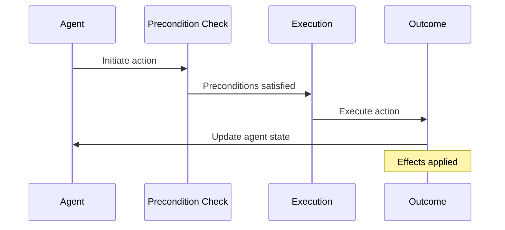

# Action: {{action_name}}

## Metadata
- **Type**: {{action_type}}
- **Domain**: {{domain}}
- **Purpose**: {{purpose}}
- **Status**: {{status}}
- **Version**: {{version}}

## Overview
{{action_description}}

## Structure
### Action Hierarchy
```mermaid
graph TD
    A[Action: {{action_name}}] --> B[Sub-Action 1]
    A --> C[Sub-Action 2]
    D[Parent Action] --> A
    A --> E[Effect 1]
    A --> F[Effect 2]
```

### Parameters
```yaml
parameters:
  param1:
    type: {{param1_type}}
    default: {{param1_default}}
    bounds: [{{param1_min}}, {{param1_max}}]
  param2:
    type: {{param2_type}}
    default: {{param2_default}}
    bounds: [{{param2_min}}, {{param2_max}}]
```

### Preconditions
- Required states
- Resource requirements
- Contextual conditions
- [[precondition/precondition_1|Precondition 1]]
- [[precondition/precondition_2|Precondition 2]]

## Execution
### Process Flow


### Implementation
```python
class {{action_class_name}}(Action):
    def __init__(self, parameters):
        super().__init__(parameters)
        self.parameters = self.validate_parameters(parameters)
        
    def can_execute(self, agent_state, environment_state):
        # Check if preconditions are satisfied
        pass
        
    def execute(self, agent_state, environment_state):
        # Execute the action and return effects
        pass
        
    def predict_outcome(self, agent_state, environment_state):
        # Predict the outcome without executing
        pass
```

### Execution Modes
- Synchronous execution
- Asynchronous execution
- Parallel execution
- Sequential execution

## Effects
### Primary Effects
- Direct outcomes
- State changes
- [[effect/effect_1|Effect 1]]
- [[effect/effect_2|Effect 2]]

### Side Effects
- Indirect outcomes
- Emergent effects
- [[side_effect/side_effect_1|Side Effect 1]]
- [[side_effect/side_effect_2|Side Effect 2]]

### Temporal Dynamics

```mermaid

gantt

    title Action Timeline

    dateFormat  s

    axisFormat %S

    Preparation :prep, 0, 2s

    Execution   :exec, after prep, 3s

    Primary Effect :effect1, after exec, 5s

    Secondary Effect :effect2, after effect1, 10s

```


## Decision Process
### Selection Criteria
- Utility calculation
- Expected value
- Risk assessment
- Resource efficiency

### Policy Integration
- Policy constraints
- Action priorities
- Selection probability
- [[policy/policy_1|Policy 1]]
- [[policy/policy_2|Policy 2]]

## Relationships
### Dependencies
- Required resources
- External dependencies
- [[dependency/dependency_1|Dependency 1]]
- [[dependency/dependency_2|Dependency 2]]

### Interactions
- Agent interactions
- Environment interactions
- Action combinations
- [[interaction/interaction_1|Interaction 1]]
- [[interaction/interaction_2|Interaction 2]]

## Evaluation
### Performance Metrics
- Success rate
- Efficiency
- Cost-benefit ratio
- Execution time

### Validation Methods
- Simulation testing
- Real-world validation
- Comparative analysis

## Implementation Details
### Parameters
```yaml
cost: {{cost}}
duration: {{duration}}
success_probability: {{success_probability}}
utility_function: "{{utility_function}}"
risk_factor: {{risk_factor}}
```

### Active Inference Configuration
```yaml
expected_free_energy: {{expected_free_energy}}
precision: {{precision}}
temporal_horizon: {{temporal_horizon}}
```

## Notes
- Implementation details
- Performance observations
- Optimization opportunities
- Known limitations

## References
- Related research
- Documentation links
- External resources
- [[reference/reference_1|Reference 1]]
- [[reference/reference_2|Reference 2]]

## Related Actions
- [[action/related_1|Related Action 1]]
- [[action/related_2|Related Action 2]] 