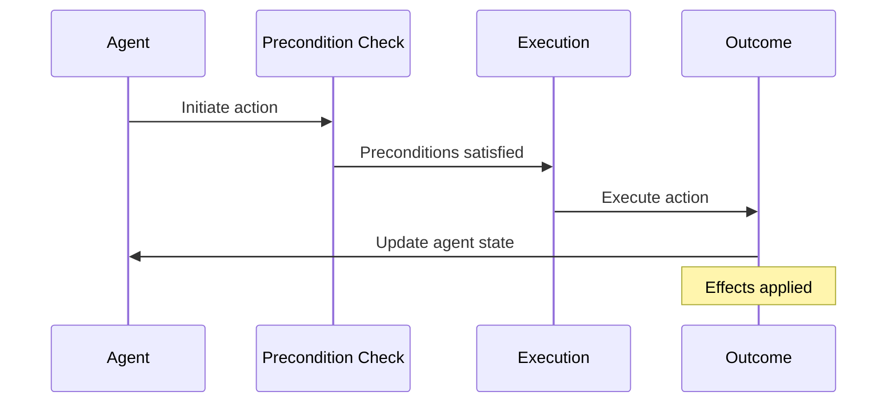

---

type: action

id: "{{action_id}}"

created: "{{date}}"

modified: "{{date}}"

tags: [action, cognitive-model, behavior]

aliases: ["{{action_name}}", "{{action_alias}}"]

related_actions: ["{{related_action_1}}", "{{related_action_2}}"]

---

# Action: {{action_name}}

## Metadata

- **Type**: {{action_type}}

- **Domain**: {{domain}}

- **Purpose**: {{purpose}}

- **Status**: {{status}}

- **Version**: {{version}}

## Overview

{{action_description}}

## Structure

### Action Hierarchy

```mermaid

graph TD

    A[Action: {{action_name}}] --> B[Sub-Action 1]

    A --> C[Sub-Action 2]

    D[Parent Action] --> A

    A --> E[Effect 1]

    A --> F[Effect 2]

```

### Parameters

```yaml

parameters:

  param1:

    type: {{param1_type}}

    default: {{param1_default}}

    bounds: [{{param1_min}}, {{param1_max}}]

  param2:

    type: {{param2_type}}

    default: {{param2_default}}

    bounds: [{{param2_min}}, {{param2_max}}]

```

### Preconditions

- Required states

- Resource requirements

- Contextual conditions

- Precondition 1

- Precondition 2

## Execution

### Process Flow


```mermaid

sequenceDiagram

    participant A as Agent

    participant P as Precondition Check

    participant E as Execution

    participant O as Outcome

    A->>P: Initiate action

    P->>E: Preconditions satisfied

    E->>O: Execute action

    O->>A: Update agent state

    Note over O: Effects applied

```

### Implementation

See the canonical package documentation for a complete runnable example.


### Execution Modes

- Synchronous execution

- Asynchronous execution

- Parallel execution

- Sequential execution

## Effects

### Primary Effects

- Direct outcomes

- State changes

- Effect 1

- Effect 2

### Side Effects

- Indirect outcomes

- Emergent effects

- Side Effect 1

- Side Effect 2

### Temporal Dynamics


```mermaid

gantt

    title Action Timeline

    dateFormat  s

    axisFormat %S

    Preparation :prep, 0, 2s

    Execution   :exec, after prep, 3s

    Primary Effect :effect1, after exec, 5s

    Secondary Effect :effect2, after effect1, 10s

```

## Decision Process

### Selection Criteria

- Utility calculation

- Expected value

- Risk assessment

- Resource efficiency

### Policy Integration

- Policy constraints

- Action priorities

- Selection probability

- Policy 1

- Policy 2

## Relationships

### Dependencies

- Required resources

- External dependencies

- Dependency 1

- Dependency 2

### Interactions

- Agent interactions

- Environment interactions

- Action combinations

- Interaction 1

- Interaction 2

## Evaluation

### Performance Metrics

- Success rate

- Efficiency

- Cost-benefit ratio

- Execution time

### Validation Methods

- Simulation testing

- Real-world validation

- Comparative analysis

## Implementation Details

### Parameters

```yaml

cost: {{cost}}

duration: {{duration}}

success_probability: {{success_probability}}

utility_function: "{{utility_function}}"

risk_factor: {{risk_factor}}

```

### Active Inference Configuration

```yaml

expected_free_energy: {{expected_free_energy}}

precision: {{precision}}

temporal_horizon: {{temporal_horizon}}

```

## Notes

- Implementation details

- Performance observations

- Optimization opportunities

- Known limitations

## References

- Related research

- Documentation links

- External resources

- Reference 1

- Reference 2

## Related Actions

- Related Action 1

- Related Action 2

