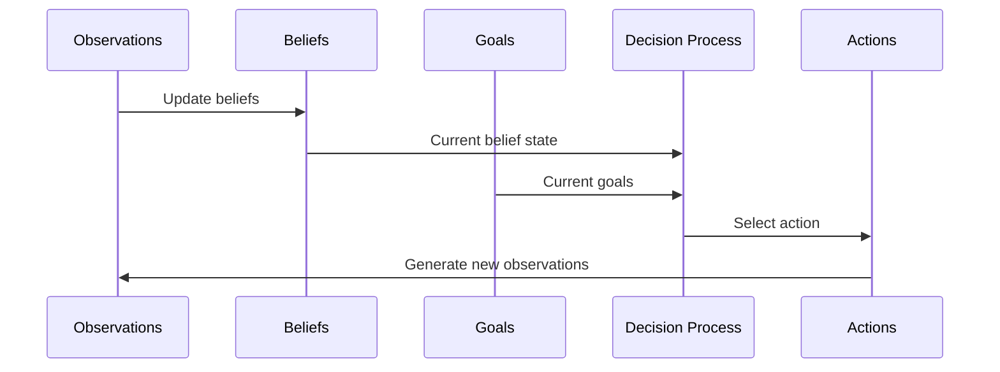

# Agent: {{agent_name}}

## Metadata
- **Type**: {{agent_type}}
- **Domain**: {{domain}}
- **Purpose**: {{purpose}}
- **Version**: {{version}}
- **Status**: {{status}}

## Overview
{{agent_description}}

## Architecture
```mermaid
graph TD
    A[Agent: {{agent_name}}] --> B[Beliefs]
    A --> C[Goals]
    A --> D[Actions]
    A --> E[Observations]
    B --> F[Decision Process]
    C --> F
    F --> D
    E --> B
    E --> F
    
    %% Additional connections specific to this agent
    %% F --> G[Custom Process]
```

## Properties
### Beliefs
- Initial beliefs and priors
- Belief update mechanisms
- [[belief_template|Belief Structure]]
- Related beliefs:
  - [[belief/belief_1|Belief 1]]
  - [[belief/belief_2|Belief 2]]

### Goals
- Primary objectives
- Secondary objectives
- Goal hierarchy
- [[goal_template|Goal Structure]]
- Related goals:
  - [[goal/goal_1|Goal 1]]
  - [[goal/goal_2|Goal 2]]

### Actions
- Available actions
- Action constraints
- Action selection policy
- [[action_template|Action Structure]]
- Related actions:
  - [[action/action_1|Action 1]]
  - [[action/action_2|Action 2]]

### Observations
- Observation space
- Sensory capabilities
- Attention mechanisms
- [[observation_template|Observation Structure]]
- Related observations:
  - [[observation/observation_1|Observation 1]]
  - [[observation/observation_2|Observation 2]]

## State
### Current State
```yaml
active_beliefs:
  - belief_id: "belief_1"
    confidence: 0.85
  - belief_id: "belief_2"
    confidence: 0.72

current_goals:
  - goal_id: "goal_1"
    priority: 0.9
  - goal_id: "goal_2"
    priority: 0.6

recent_actions:
  - action_id: "action_1"
    timestamp: "2023-01-01T12:00:00Z"
  - action_id: "action_2"
    timestamp: "2023-01-01T12:05:00Z"

latest_observations:
  - observation_id: "observation_1"
    timestamp: "2023-01-01T12:04:30Z"
  - observation_id: "observation_2"
    timestamp: "2023-01-01T12:04:45Z"
```

### History
- State transitions
- Decision history
- Learning progress
- Performance metrics

## Decision Process


## Relationships
### Dependencies
- Required resources
- External dependencies
- [[dependency/dependency_1|Dependency 1]]
- [[dependency/dependency_2|Dependency 2]]

### Interactions
- Agent interactions
- Environment interactions
- [[agent/agent_1|Agent 1]]
- [[environment/environment_1|Environment 1]]

## Implementation
### Parameters
```yaml
learning_rate: 0.01
exploration_rate: 0.1
discount_factor: 0.95
memory_capacity: 1000
attention_threshold: 0.3
```

### Active Inference Configuration
```yaml
precision: high
temporal_horizon: 5
inference_depth: 3
free_energy_threshold: 0.01
belief_update_rate: 0.2
```

### Code Reference
```python
class {{agent_class_name}}(Agent):
    def __init__(self, config):
        super().__init__(config)
        self.beliefs = initialize_beliefs(config.initial_beliefs)
        self.goals = initialize_goals(config.goals)
        self.action_space = ActionSpace(config.actions)
        self.observation_model = ObservationModel(config.observation_space)
        
    def update_beliefs(self, observation):
        # Update beliefs based on new observation
        pass
        
    def select_action(self):
        # Select action based on current beliefs and goals
        pass
```

## Evaluation
### Performance Metrics
- Metric 1: Description and target values
- Metric 2: Description and target values
- Metric 3: Description and target values

### Validation Methods
- Method 1: Description
- Method 2: Description
- Method 3: Description

## Notes
- Implementation details
- Performance observations
- Optimization opportunities
- Known limitations

## References
- Related research
- Documentation links
- External resources
- [[reference/reference_1|Reference 1]]
- [[reference/reference_2|Reference 2]]

## Related Components
- [[component/component_1|Component 1]]
- [[component/component_2|Component 2]] 