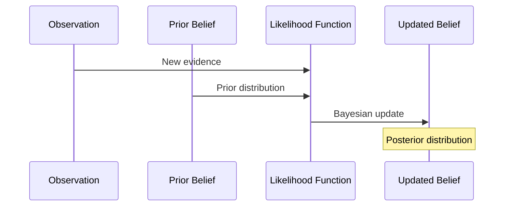

---

type: belief

id: "{{belief_id}}"

created: {{date}}

modified: {{date}}

tags: [belief, cognitive-model, knowledge-representation]

aliases: ["{{belief_name}}", "{{belief_alias}}"]

related_beliefs: ["{{related_belief_1}}", "{{related_belief_2}}"]

---

# Belief: {{belief_name}}

## Metadata

- **Type**: {{belief_type}}

- **Domain**: {{domain}}

- **Confidence**: {{confidence_level}}

- **Status**: {{status}}

- **Version**: {{version}}

## Overview

{{belief_description}}

## Structure

### Belief Network

```mermaid

graph TD

    A[Belief: {{belief_name}}] --> B[Dependent Belief 1]

    A --> C[Dependent Belief 2]

    D[Parent Belief 1] --> A

    E[Parent Belief 2] --> A

    A --> F[Influenced Action]

    G[Evidence] --> A

```

### Prior Distribution

```yaml

distribution_type: {{distribution}}

parameters:

  mean: {{mean_value}}

  variance: {{variance}}

  bounds: [{{lower_bound}}, {{upper_bound}}]

  skew: {{skew}}

  kurtosis: {{kurtosis}}

```

### Dependencies

- Conditional dependencies

- Causal relationships

- [[belief/dependency_1|Dependency 1]]

- [[belief/dependency_2|Dependency 2]]

## Content

### Semantic Description

- Belief description

- Context

- Implications

- Scope and limitations

### Evidence

- Supporting observations

- Historical data

- Confidence metrics

- [[evidence/evidence_1|Evidence 1]]

- [[evidence/evidence_2|Evidence 2]]

## Dynamics

### Update Process



### Update Rules

- Learning rate: {{learning_rate}}

- Update conditions

- Temporal dynamics

- Decay function

### Constraints

- Logical constraints

- Domain constraints

- Value bounds

- Consistency requirements

## Relationships

### Influences

- Affected beliefs

- Influenced actions

- Decision impact

- [[belief/influenced_1|Influenced Belief 1]]

- [[action/influenced_1|Influenced Action 1]]

### Sources

- Information sources

- Reliability metrics

- Source diversity

- [[source/source_1|Source 1]]

- [[source/source_2|Source 2]]

## Implementation

### Mathematical Formulation

```latex

P({{belief_name}} | evidence) = \frac{P(evidence | {{belief_name}}) \cdot P({{belief_name}})}{P(evidence)}

```

### Parameters

```yaml

precision: {{precision}}

learning_rate: {{learning_rate}}

decay_factor: {{decay_factor}}

update_threshold: {{update_threshold}}

confidence_interval: [{{ci_lower}}, {{ci_upper}}]

```

### Active Inference Integration

```yaml

free_energy_contribution: {{contribution}}

precision_weight: {{weight}}

prediction_error_sensitivity: {{sensitivity}}

```

### Code Reference

```python

class {{belief_class_name}}(Belief):

    def __init__(self, prior_params):

        super().__init__(prior_params)

        self.distribution = Distribution(prior_params)

    def update(self, evidence):

        # Bayesian update based on new evidence

        likelihood = self.compute_likelihood(evidence)

        self.distribution = self.distribution.bayesian_update(likelihood)

    def compute_likelihood(self, evidence):

        # Compute likelihood of evidence given current belief

        pass

```

## Evaluation

### Accuracy Metrics

- Prediction accuracy

- Calibration measures

- Uncertainty quantification

### Validation Methods

- Empirical validation

- Cross-validation

- Sensitivity analysis

## Notes

- Uncertainty considerations

- Update history

- Performance metrics

- Known limitations

## References

- Related beliefs

- Documentation

- Research basis

- [[reference/reference_1|Reference 1]]

- [[reference/reference_2|Reference 2]]

## Related Beliefs

- [[belief/related_1|Related Belief 1]]

- [[belief/related_2|Related Belief 2]]

