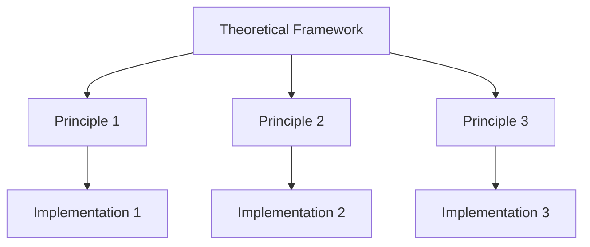
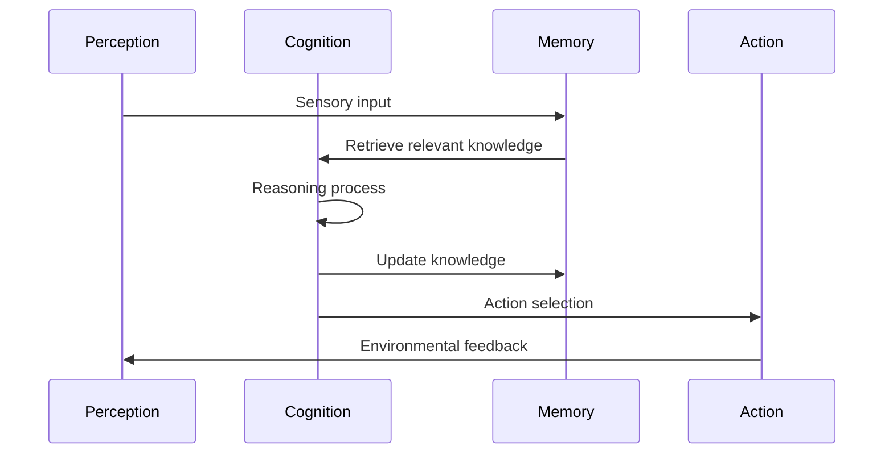
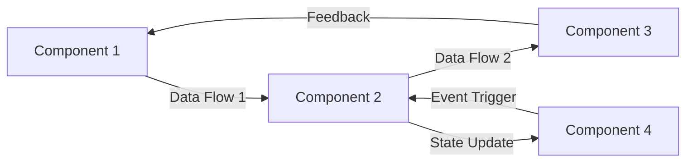
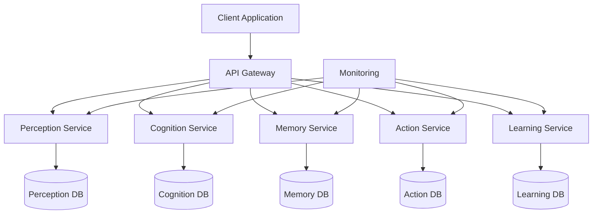

# Cognitive Architecture: {{architecture_name}}

## Metadata
- **Type**: {{architecture_type}}
- **Domain**: {{domain}}
- **Purpose**: {{purpose}}
- **Status**: {{status}}
- **Version**: {{version}}
- **Maturity**: {{maturity_level}}

## Overview
{{architecture_description}}

## Theoretical Foundation
### Core Principles
- Principle 1: Description
- Principle 2: Description
- Principle 3: Description
- [[principle/principle_1|Principle 1]]
- [[principle/principle_2|Principle 2]]

### Theoretical Framework


### Research Basis
- Research area 1
- Research area 2
- Research area 3
- [[research/research_1|Research 1]]
- [[research/research_2|Research 2]]

## Architecture
### System Overview
```mermaid
graph TD
    A[Architecture: {{architecture_name}}] --> B[Perception Module]
    A --> C[Cognitive Module]
    A --> D[Action Module]
    A --> E[Memory Module]
    A --> F[Learning Module]
    
    B --> G[Sensory Processing]
    C --> H[Reasoning]
    C --> I[Planning]
    D --> J[Motor Control]
    E --> K[Working Memory]
    E --> L[Long-term Memory]
    F --> M[Reinforcement Learning]
    F --> N[Unsupervised Learning]
```

### Component Hierarchy
```yaml
components:
  - name: "{{component_1}}"
    type: "{{component_1_type}}"
    purpose: "{{component_1_purpose}}"
    subcomponents:
      - "{{subcomponent_1_1}}"
      - "{{subcomponent_1_2}}"
  
  - name: "{{component_2}}"
    type: "{{component_2_type}}"
    purpose: "{{component_2_purpose}}"
    subcomponents:
      - "{{subcomponent_2_1}}"
      - "{{subcomponent_2_2}}"
```

### Information Flow


## Components
### Agents
- [[agent/agent_1|Agent 1]]: Description
- [[agent/agent_2|Agent 2]]: Description
- [[agent/agent_3|Agent 3]]: Description

### Belief Systems
- [[belief_system/belief_system_1|Belief System 1]]: Description
- [[belief_system/belief_system_2|Belief System 2]]: Description

### Memory Structures
- [[memory/memory_1|Memory Structure 1]]: Description
- [[memory/memory_2|Memory Structure 2]]: Description

### Learning Mechanisms
- [[learning/learning_1|Learning Mechanism 1]]: Description
- [[learning/learning_2|Learning Mechanism 2]]: Description

## Integration
### Component Interactions


### Communication Protocols
```yaml
protocols:
  - name: "{{protocol_1}}"
    type: "{{protocol_1_type}}"
    format: "{{protocol_1_format}}"
    endpoints:
      - source: "{{source_1}}"
        destination: "{{destination_1}}"
  
  - name: "{{protocol_2}}"
    type: "{{protocol_2_type}}"
    format: "{{protocol_2_format}}"
    endpoints:
      - source: "{{source_2}}"
        destination: "{{destination_2}}"
```

### Resource Management
- Computational resource allocation
- Memory management
- Attention mechanisms
- Priority scheduling

## Implementation
### System Requirements
```yaml
requirements:
  hardware:
    cpu: "{{cpu_requirement}}"
    memory: "{{memory_requirement}}"
    gpu: "{{gpu_requirement}}"
  
  software:
    platform: "{{platform}}"
    dependencies:
      - "{{dependency_1}}"
      - "{{dependency_2}}"
```

### Code Structure
```python
class {{architecture_class_name}}:
    def __init__(self, config):
        self.perception = PerceptionModule(config.perception)
        self.cognition = CognitionModule(config.cognition)
        self.memory = MemoryModule(config.memory)
        self.action = ActionModule(config.action)
        self.learning = LearningModule(config.learning)
        
    def initialize(self):
        # Initialize all components
        pass
        
    def process_input(self, sensory_input):
        # Process input through the architecture
        perception_output = self.perception.process(sensory_input)
        memory_context = self.memory.retrieve_relevant(perception_output)
        cognitive_result = self.cognition.reason(perception_output, memory_context)
        self.memory.update(cognitive_result)
        action = self.action.select(cognitive_result)
        self.learning.update(sensory_input, action, cognitive_result)
        return action
```

### Deployment Architecture


## Capabilities
### Core Functionalities
- Functionality 1: Description
- Functionality 2: Description
- Functionality 3: Description

### Emergent Behaviors
- Emergent behavior 1: Description
- Emergent behavior 2: Description
- Emergent behavior 3: Description

### Limitations
- Limitation 1: Description
- Limitation 2: Description
- Limitation 3: Description

## Evaluation
### Performance Metrics
```yaml
metrics:
  - name: "{{metric_1}}"
    description: "{{metric_1_description}}"
    target_value: {{metric_1_target}}
    
  - name: "{{metric_2}}"
    description: "{{metric_2_description}}"
    target_value: {{metric_2_target}}
```

### Benchmark Results
- Benchmark 1: Results and comparison
- Benchmark 2: Results and comparison
- Benchmark 3: Results and comparison

### Validation Methods
- Method 1: Description
- Method 2: Description
- Method 3: Description

## Applications
### Use Cases
- Use case 1: Description
- Use case 2: Description
- Use case 3: Description

### Case Studies
- [[case_study/case_study_1|Case Study 1]]: Summary
- [[case_study/case_study_2|Case Study 2]]: Summary

### Deployment Examples
- Deployment 1: Description
- Deployment 2: Description

## Future Development
### Roadmap
```mermaid
gantt
    title Development Roadmap
    dateFormat  YYYY-MM-DD
    
    section Phase 1
    Component 1 Development :p1, {{phase_1_start}}, {{phase_1_duration}}
    Component 2 Development :p2, after p1, {{phase_2_duration}}
    
    section Phase 2
    Integration Testing :p3, after p2, {{phase_3_duration}}
    Performance Optimization :p4, after p3, {{phase_4_duration}}
    
    section Phase 3
    Deployment :p5, after p4, {{phase_5_duration}}
    Monitoring & Maintenance :p6, after p5, {{phase_6_duration}}
```

### Planned Enhancements
- Enhancement 1: Description
- Enhancement 2: Description
- Enhancement 3: Description

### Research Directions
- Research direction 1: Description
- Research direction 2: Description
- Research direction 3: Description

## Notes
- Implementation details
- Performance observations
- Integration challenges
- Known limitations

## References
- Related research
- Documentation links
- External resources
- [[reference/reference_1|Reference 1]]
- [[reference/reference_2|Reference 2]]

## Related Architectures
- [[architecture/related_1|Related Architecture 1]]
- [[architecture/related_2|Related Architecture 2]] 