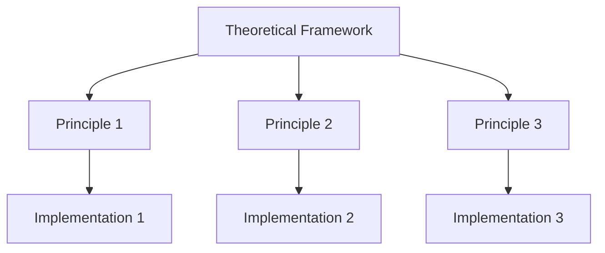
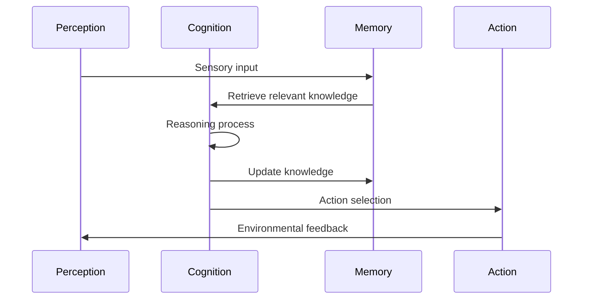
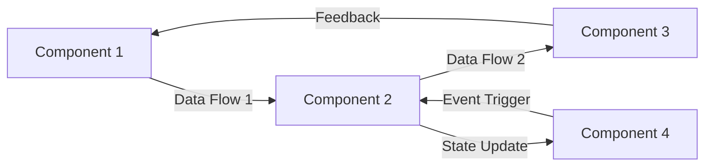
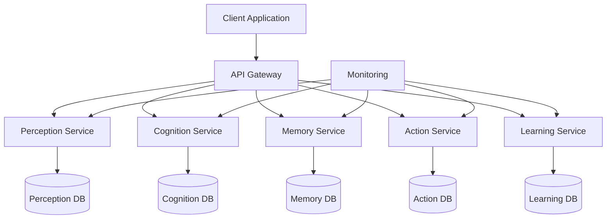

---

type: cognitive-architecture

id: "{{architecture_id}}"

created: "{{date}}"

modified: "{{date}}"

tags: [cognitive-architecture, system, integration]

aliases: ["{{architecture_name}}", "{{architecture_alias}}"]

related_architectures: ["{{related_architecture_1}}", "{{related_architecture_2}}"]

---

# Cognitive Architecture: {{architecture_name}}

## Metadata

- **Type**: {{architecture_type}}

- **Domain**: {{domain}}

- **Purpose**: {{purpose}}

- **Status**: {{status}}

- **Version**: {{version}}

- **Maturity**: {{maturity_level}}

## Overview

{{architecture_description}}

## Theoretical Foundation

### Core Principles

- Principle 1: Description

- Principle 2: Description

- Principle 3: Description

- Principle 1

- Principle 2

### Theoretical Framework


```mermaid

graph TD

    A[Theoretical Framework] --> B[Principle 1]

    A --> C[Principle 2]

    A --> D[Principle 3]

    B --> E[Implementation 1]

    C --> F[Implementation 2]

    D --> G[Implementation 3]

```

### Research Basis

- Research area 1

- Research area 2

- Research area 3

- Research 1

- Research 2

## Architecture

### System Overview

```mermaid

graph TD

    A[Architecture: {{architecture_name}}] --> B[Perception Module]

    A --> C[Cognitive Module]

    A --> D[Action Module]

    A --> E[Memory Module]

    A --> F[Learning Module]

    B --> G[Sensory Processing]

    C --> H[Reasoning]

    C --> I[Planning]

    D --> J[Motor Control]

    E --> K[Working Memory]

    E --> L[Long-term Memory]

    F --> M[Reinforcement Learning]

    F --> N[Unsupervised Learning]

```

### Component Hierarchy

```yaml

components:

  - name: "{{component_1}}"

    type: "{{component_1_type}}"

    purpose: "{{component_1_purpose}}"

    subcomponents:

      - "{{subcomponent_1_1}}"

      - "{{subcomponent_1_2}}"

  - name: "{{component_2}}"

    type: "{{component_2_type}}"

    purpose: "{{component_2_purpose}}"

    subcomponents:

      - "{{subcomponent_2_1}}"

      - "{{subcomponent_2_2}}"

```

### Information Flow


```mermaid

sequenceDiagram

    participant P as Perception

    participant C as Cognition

    participant M as Memory

    participant A as Action

    P->>M: Sensory input

    M->>C: Retrieve relevant knowledge

    C->>C: Reasoning process

    C->>M: Update knowledge

    C->>A: Action selection

    A->>P: Environmental feedback

```

## Components

### Agents

- Agent 1: Description

- Agent 2: Description

- Agent 3: Description

### Belief Systems

- Belief System 1: Description

- Belief System 2: Description

### Memory Structures

- Memory Structure 1: Description

- Memory Structure 2: Description

### Learning Mechanisms

- Learning Mechanism 1: Description

- Learning Mechanism 2: Description

## Integration

### Component Interactions


```mermaid

graph LR

    A[Component 1] -- "Data Flow 1" --> B[Component 2]

    B -- "Data Flow 2" --> C[Component 3]

    C -- "Feedback" --> A

    D[Component 4] -- "Event Trigger" --> B

    B -- "State Update" --> D

```

### Communication Protocols

```yaml

protocols:

  - name: "{{protocol_1}}"

    type: "{{protocol_1_type}}"

    format: "{{protocol_1_format}}"

    endpoints:

      - source: "{{source_1}}"

        destination: "{{destination_1}}"

  - name: "{{protocol_2}}"

    type: "{{protocol_2_type}}"

    format: "{{protocol_2_format}}"

    endpoints:

      - source: "{{source_2}}"

        destination: "{{destination_2}}"

```

### Resource Management

- Computational resource allocation

- Memory management

- Attention mechanisms

- Priority scheduling

## Implementation

### System Requirements

```yaml

requirements:

  hardware:

    cpu: "{{cpu_requirement}}"

    memory: "{{memory_requirement}}"

    gpu: "{{gpu_requirement}}"

  software:

    platform: "{{platform}}"

    dependencies:

      - "{{dependency_1}}"

      - "{{dependency_2}}"

```

### Code Structure

See `docs/examples/README.md` for runnable examples.


### Deployment Architecture


```mermaid

flowchart TD

    A[Client Application] --> B[API Gateway]

    B --> C[Perception Service]

    B --> D[Cognition Service]

    B --> E[Memory Service]

    B --> F[Action Service]

    B --> G[Learning Service]

    C --> H[(Perception DB)]

    D --> I[(Cognition DB)]

    E --> J[(Memory DB)]

    F --> K[(Action DB)]

    G --> L[(Learning DB)]

    M[Monitoring] --> C

    M --> D

    M --> E

    M --> F

    M --> G

```

## Capabilities

### Core Functionalities

- Functionality 1: Description

- Functionality 2: Description

- Functionality 3: Description

### Emergent Behaviors

- Emergent behavior 1: Description

- Emergent behavior 2: Description

- Emergent behavior 3: Description

### Limitations

- Limitation 1: Description

- Limitation 2: Description

- Limitation 3: Description

## Evaluation

### Performance Metrics

```yaml

metrics:

  - name: "{{metric_1}}"

    description: "{{metric_1_description}}"

    target_value: {{metric_1_target}}

  - name: "{{metric_2}}"

    description: "{{metric_2_description}}"

    target_value: {{metric_2_target}}

```

### Benchmark Results

- Benchmark 1: Results and comparison

- Benchmark 2: Results and comparison

- Benchmark 3: Results and comparison

### Validation Methods

- Method 1: Description

- Method 2: Description

- Method 3: Description

## Applications

### Use Cases

- Use case 1: Description

- Use case 2: Description

- Use case 3: Description

### Case Studies

- Case Study 1: Summary

- Case Study 2: Summary

### Deployment Examples

- Deployment 1: Description

- Deployment 2: Description

## Future Development

### Roadmap

```mermaid

gantt

    title Development Roadmap

    dateFormat  YYYY-MM-DD

    section Phase 1

    Component 1 Development :p1, {{phase_1_start}}, {{phase_1_duration}}

    Component 2 Development :p2, after p1, {{phase_2_duration}}

    section Phase 2

    Integration Testing :p3, after p2, {{phase_3_duration}}

    Performance Optimization :p4, after p3, {{phase_4_duration}}

    section Phase 3

    Deployment :p5, after p4, {{phase_5_duration}}

    Monitoring & Maintenance :p6, after p5, {{phase_6_duration}}

```

### Planned Enhancements

- Enhancement 1: Description

- Enhancement 2: Description

- Enhancement 3: Description

### Research Directions

- Research direction 1: Description

- Research direction 2: Description

- Research direction 3: Description

## Notes

- Implementation details

- Performance observations

- Integration challenges

- Known limitations

## References

- Related research

- Documentation links

- External resources

- Reference 1

- Reference 2

## Related Architectures

- Related Architecture 1

- Related Architecture 2

