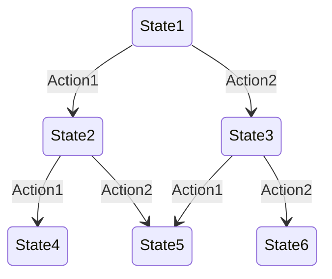
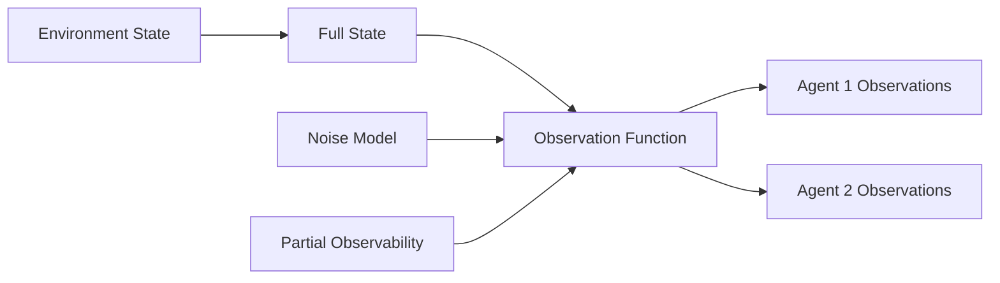

---

type: environment

id: "{{environment_id}}"

created: {{date}}

modified: {{date}}

tags: [environment, cognitive-model, simulation]

aliases: ["{{environment_name}}", "{{environment_alias}}"]

related_environments: ["{{related_environment_1}}", "{{related_environment_2}}"]

---

# Environment: {{environment_name}}

## Metadata

- **Type**: {{environment_type}}

- **Domain**: {{domain}}

- **Complexity**: {{complexity}}

- **Status**: {{status}}

- **Version**: {{version}}

## Overview

{{environment_description}}

## Structure

### Environment Architecture

```mermaid

graph TD

    A[Environment: {{environment_name}}] --> B[State Space]

    A --> C[Action Space]

    A --> D[Observation Space]

    A --> E[Reward Function]

    A --> F[Transition Function]

    A --> G[Agents]

    B --> H[State Variables]

    C --> I[Available Actions]

    D --> J[Observable Features]

    G --> K[Agent Interactions]

```

### State Space

```yaml

state_variables:

  variable1:

    type: {{variable1_type}}

    range: [{{variable1_min}}, {{variable1_max}}]

    resolution: {{variable1_resolution}}

  variable2:

    type: {{variable2_type}}

    range: [{{variable2_min}}, {{variable2_max}}]

    resolution: {{variable2_resolution}}

```

### Action Space

- Available actions

- Action constraints

- Action effects

- [[action/action_1|Action 1]]

- [[action/action_2|Action 2]]

## Dynamics

### Transition Model



### Implementation

```python

class {{environment_class_name}}(Environment):

    def __init__(self, config):

        super().__init__(config)

        self.state = self.initialize_state(config.initial_state)

        self.agents = self.initialize_agents(config.agents)

    def step(self, actions):

        # Update environment state based on actions

        next_state = self.transition_function(self.state, actions)

        observations = self.observation_function(next_state)

        rewards = self.reward_function(self.state, actions, next_state)

        done = self.termination_condition(next_state)

        self.state = next_state

        return observations, rewards, done, {}

    def reset(self):

        # Reset environment to initial state

        self.state = self.initialize_state(self.config.initial_state)

        return self.observation_function(self.state)

```

### Stochasticity

- Random processes

- Noise models

- Uncertainty sources

- Probability distributions

## Interaction

### Observation Model



### Reward Structure

- Reward functions

- Incentive mechanisms

- Penalty systems

- [[reward/reward_1|Reward Function 1]]

- [[reward/reward_2|Reward Function 2]]

### Multi-Agent Dynamics

- Agent interactions

- Competition dynamics

- Cooperation mechanisms

- Communication channels

## Scenarios

### Default Scenario

```yaml

initial_state:

  variable1: {{initial_value1}}

  variable2: {{initial_value2}}

agents:

  - id: "agent1"

    type: "{{agent1_type}}"

  - id: "agent2"

    type: "{{agent2_type}}"

termination_conditions:

  - condition: "{{termination_condition1}}"

  - condition: "{{termination_condition2}}"

```

### Challenge Scenarios

- Scenario 1: Description

- Scenario 2: Description

- Scenario 3: Description

- [[scenario/scenario_1|Scenario 1]]

- [[scenario/scenario_2|Scenario 2]]

## Evaluation

### Performance Metrics

- Environment complexity

- Task difficulty

- Agent performance metrics

- Benchmark scores

### Validation Methods

- Simulation testing

- Real-world validation

- Comparative analysis

## Implementation Details

### Parameters

```yaml

time_step: {{time_step}}

max_steps: {{max_steps}}

observation_noise: {{observation_noise}}

transition_noise: {{transition_noise}}

reward_scale: {{reward_scale}}

```

### Technical Requirements

```yaml

computational_requirements:

  memory: {{memory_requirement}}

  processing: {{processing_requirement}}

  storage: {{storage_requirement}}

```

## Notes

- Implementation details

- Performance observations

- Optimization opportunities

- Known limitations

## References

- Related research

- Documentation links

- External resources

- [[reference/reference_1|Reference 1]]

- [[reference/reference_2|Reference 2]]

## Related Environments

- [[environment/related_1|Related Environment 1]]

- [[environment/related_2|Related Environment 2]]

