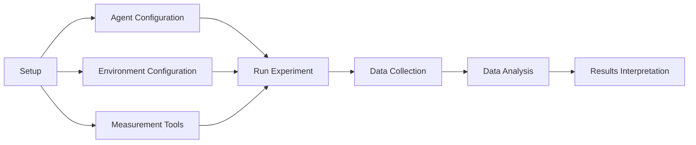
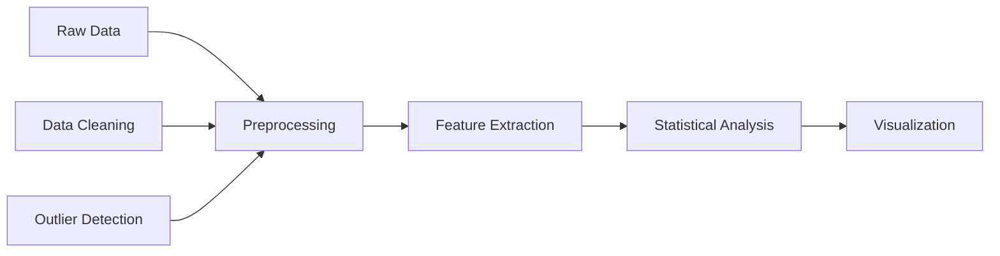
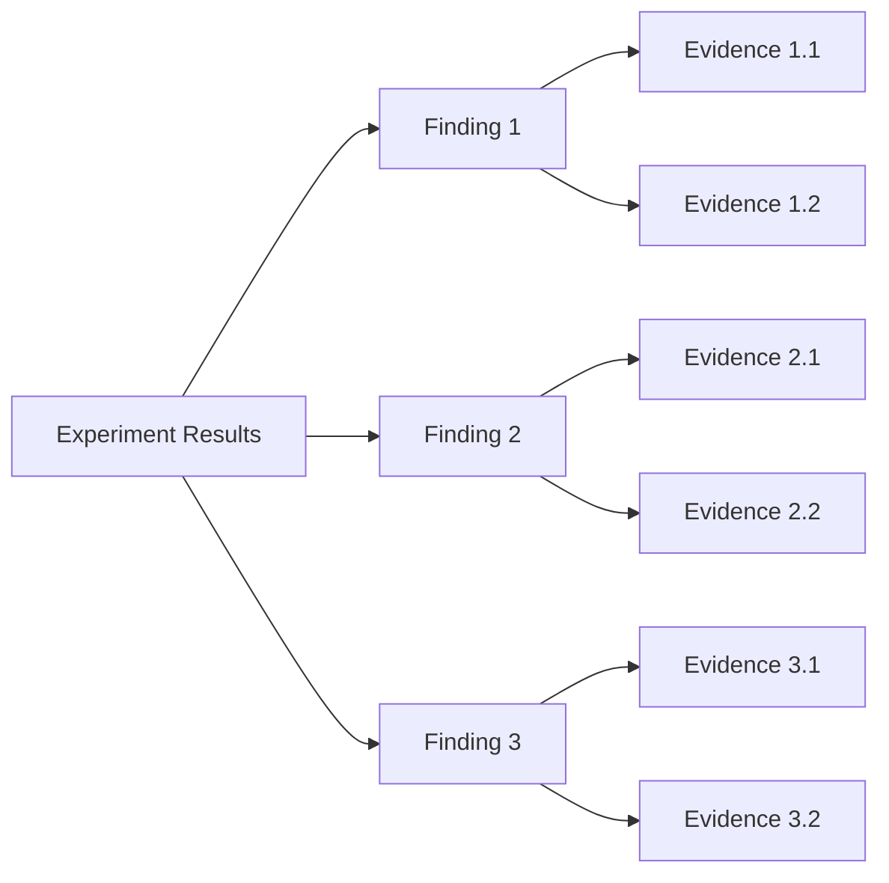

---

type: experiment

id: "{{experiment_id}}"

created: {{date}}

modified: {{date}}

tags: [experiment, cognitive-model, evaluation]

aliases: ["{{experiment_name}}", "{{experiment_alias}}"]

related_experiments: ["{{related_experiment_1}}", "{{related_experiment_2}}"]

---

# Experiment: {{experiment_name}}

## Metadata

- **Type**: {{experiment_type}}

- **Domain**: {{domain}}

- **Status**: {{status}}

- **Version**: {{version}}

- **Date Range**: {{start_date}} to {{end_date}}

- **Researchers**: {{researchers}}

## Overview

{{experiment_description}}

## Objectives

### Research Questions

1. {{research_question_1}}

1. {{research_question_2}}

1. {{research_question_3}}

### Hypotheses

1. {{hypothesis_1}}

1. {{hypothesis_2}}

1. {{hypothesis_3}}

## Experimental Design

### Design Overview

```mermaid

graph TD

    A[Experiment: {{experiment_name}}] --> B[Independent Variables]

    A --> C[Dependent Variables]

    A --> D[Control Variables]

    A --> E[Experimental Groups]

    A --> F[Measurement Methods]

    B --> B1[Variable 1: {{independent_var_1}}]

    B --> B2[Variable 2: {{independent_var_2}}]

    C --> C1[Variable 1: {{dependent_var_1}}]

    C --> C2[Variable 2: {{dependent_var_2}}]

    E --> E1[Group 1: {{group_1}}]

    E --> E2[Group 2: {{group_2}}]

```

### Variables

```yaml

independent_variables:

  - name: {{independent_var_1}}

    type: {{var_1_type}}

    levels: [{{level_1_1}}, {{level_1_2}}, {{level_1_3}}]

  - name: {{independent_var_2}}

    type: {{var_2_type}}

    levels: [{{level_2_1}}, {{level_2_2}}, {{level_2_3}}]

dependent_variables:

  - name: {{dependent_var_1}}

    type: {{dep_var_1_type}}

    measurement: {{measurement_method_1}}

  - name: {{dependent_var_2}}

    type: {{dep_var_2_type}}

    measurement: {{measurement_method_2}}

control_variables:

  - name: {{control_var_1}}

    value: {{control_value_1}}

  - name: {{control_var_2}}

    value: {{control_value_2}}

```

### Experimental Conditions

- Condition 1: Description

- Condition 2: Description

- Condition 3: Description

- [[condition/condition_1|Condition 1]]

- [[condition/condition_2|Condition 2]]

## Implementation

### Experimental Setup



### Code Implementation

```python

class {{experiment_class_name}}(Experiment):

    def __init__(self, config):

        super().__init__(config)

        self.agents = self.initialize_agents(config.agents)

        self.environment = self.initialize_environment(config.environment)

        self.metrics = self.initialize_metrics(config.metrics)

    def run(self):

        # Run the experiment

        results = []

        for condition in self.config.conditions:

            condition_results = self.run_condition(condition)

            results.append(condition_results)

        return results

    def run_condition(self, condition):

        # Run a single experimental condition

        self.setup_condition(condition)

        condition_results = []

        for trial in range(condition.num_trials):

            trial_results = self.run_trial(trial, condition)

            condition_results.append(trial_results)

        return self.aggregate_results(condition_results)

```

### Experimental Protocol

1. Setup phase

1. Training phase

1. Testing phase

1. Data collection

1. Analysis phase

## Data Collection

### Metrics

- Metric 1: Description and measurement method

- Metric 2: Description and measurement method

- Metric 3: Description and measurement method

- [[metric/metric_1|Metric 1]]

- [[metric/metric_2|Metric 2]]

### Data Processing



### Data Storage

- Data format

- Storage location

- Backup procedures

- Access controls

## Analysis

### Statistical Methods

- Method 1: Description and purpose

- Method 2: Description and purpose

- Method 3: Description and purpose

- [[method/method_1|Method 1]]

- [[method/method_2|Method 2]]

### Visualization

```python

def visualize_results(results):

    """Create standard visualizations for experiment results."""

    plt.figure(figsize=(12, 8))

    # Plot main results

    plt.subplot(2, 2, 1)

    # Plot code for main metric

    plt.subplot(2, 2, 2)

    # Plot code for secondary metric

    plt.subplot(2, 2, 3)

    # Plot code for comparison across conditions

    plt.subplot(2, 2, 4)

    # Plot code for time series data

    plt.tight_layout()

    plt.savefig('experiment_results.png')

    plt.show()

```

### Interpretation Framework

- Key indicators

- Success criteria

- Failure analysis

- Comparative benchmarks

## Results

### Summary of Findings



### Key Results

```yaml

primary_results:

  - finding: "{{finding_1}}"

    p_value: {{p_value_1}}

    effect_size: {{effect_size_1}}

    confidence_interval: [{{ci_lower_1}}, {{ci_upper_1}}]

  - finding: "{{finding_2}}"

    p_value: {{p_value_2}}

    effect_size: {{effect_size_2}}

    confidence_interval: [{{ci_lower_2}}, {{ci_upper_2}}]

```

### Hypothesis Evaluation

- Hypothesis 1: Supported/Rejected/Inconclusive

- Hypothesis 2: Supported/Rejected/Inconclusive

- Hypothesis 3: Supported/Rejected/Inconclusive

## Discussion

### Interpretation

- Main interpretation of results

- Alternative explanations

- Limitations of findings

- Theoretical implications

### Practical Implications

- Application to real-world problems

- Implementation considerations

- Performance improvements

- Design recommendations

### Future Work

- Follow-up experiments

- Methodological improvements

- New research questions

- [[experiment/followup_1|Follow-up Experiment 1]]

- [[experiment/followup_2|Follow-up Experiment 2]]

## References

- Related research

- Documentation links

- External resources

- [[reference/reference_1|Reference 1]]

- [[reference/reference_2|Reference 2]]

## Related Experiments

- [[experiment/related_1|Related Experiment 1]]

- [[experiment/related_2|Related Experiment 2]]

