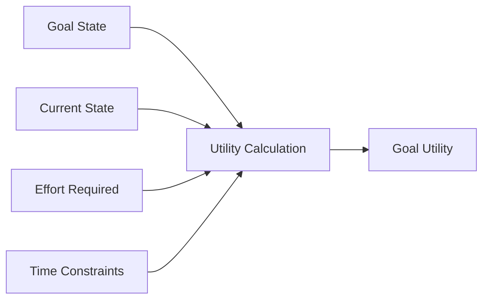
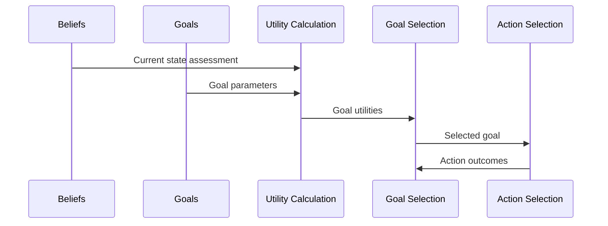

# Goal: {{goal_name}}

## Metadata
- **Type**: {{goal_type}}
- **Domain**: {{domain}}
- **Priority**: {{priority}}
- **Status**: {{status}}
- **Version**: {{version}}
- **Timeframe**: {{timeframe}}

## Overview
{{goal_description}}

## Structure
### Goal Hierarchy
```mermaid
graph TD
    A[Goal: {{goal_name}}] --> B[Sub-Goal 1]
    A --> C[Sub-Goal 2]
    D[Parent Goal] --> A
    A --> E[Action 1]
    A --> F[Action 2]
```

### Parameters
```yaml
parameters:
  priority: {{priority}}
  utility: {{utility}}
  deadline: {{deadline}}
  effort_estimate: {{effort_estimate}}
  success_criteria:
    - {{criterion_1}}
    - {{criterion_2}}
```

### Success Criteria
- Primary criteria
- Secondary criteria
- Measurement methods
- [[criterion/criterion_1|Criterion 1]]
- [[criterion/criterion_2|Criterion 2]]

## Planning
### Action Plan
```mermaid
gantt
    title Goal Achievement Plan
    dateFormat  YYYY-MM-DD
    
    Sub-Goal 1 :sg1, {{start_date_1}}, {{duration_1}}
    Action 1.1 :a11, after sg1, {{duration_1_1}}
    Action 1.2 :a12, after a11, {{duration_1_2}}
    
    Sub-Goal 2 :sg2, {{start_date_2}}, {{duration_2}}
    Action 2.1 :a21, after sg2, {{duration_2_1}}
    Action 2.2 :a22, after a21, {{duration_2_2}}
```

### Implementation
```python
class {{goal_class_name}}(Goal):
    def __init__(self, parameters):
        super().__init__(parameters)
        self.sub_goals = self.initialize_sub_goals(parameters.sub_goals)
        self.success_criteria = parameters.success_criteria
        
    def is_achieved(self, agent_state, environment_state):
        # Check if goal has been achieved
        pass
        
    def get_utility(self, agent_state, environment_state):
        # Calculate current utility of this goal
        pass
        
    def get_next_actions(self, agent_state, environment_state):
        # Determine next actions to achieve this goal
        pass
```

### Planning Strategies
- Hierarchical planning
- Temporal planning
- Resource allocation
- Contingency planning

## Motivation
### Utility Function


### Priority Dynamics
- Initial priority
- Dynamic adjustment
- Context sensitivity
- Competing goals resolution

### Motivation Factors
- Intrinsic motivation
- Extrinsic motivation
- Temporal discounting
- [[motivation/factor_1|Motivation Factor 1]]
- [[motivation/factor_2|Motivation Factor 2]]

## Decision Process
### Goal Selection


### Policy Integration
- Goal-directed policies
- Habitual policies
- Exploration strategies
- [[policy/policy_1|Policy 1]]
- [[policy/policy_2|Policy 2]]

### Conflict Resolution
- Goal conflicts
- Resource conflicts
- Temporal conflicts
- Priority-based resolution

## Relationships
### Dependencies
- Required resources
- Prerequisite goals
- External dependencies
- [[dependency/dependency_1|Dependency 1]]
- [[dependency/dependency_2|Dependency 2]]

### Interactions
- Goal interactions
- Belief interactions
- Action interactions
- [[interaction/interaction_1|Interaction 1]]
- [[interaction/interaction_2|Interaction 2]]

## Evaluation
### Performance Metrics
- Achievement rate
- Efficiency
- Time to completion
- Resource utilization

### Validation Methods
- Progress tracking
- Success verification
- Utility assessment

## Implementation Details
### Parameters
```yaml
expected_utility: {{expected_utility}}
achievement_probability: {{achievement_probability}}
effort_cost: {{effort_cost}}
time_sensitivity: {{time_sensitivity}}
failure_penalty: {{failure_penalty}}
```

### Active Inference Configuration
```yaml
expected_free_energy: {{expected_free_energy}}
precision: {{precision}}
temporal_horizon: {{temporal_horizon}}
exploration_factor: {{exploration_factor}}
```

## Notes
- Implementation details
- Performance observations
- Optimization opportunities
- Known limitations

## References
- Related research
- Documentation links
- External resources
- [[reference/reference_1|Reference 1]]
- [[reference/reference_2|Reference 2]]

## Related Goals
- [[goal/related_1|Related Goal 1]]
- [[goal/related_2|Related Goal 2]] 