# [Learning Path Name]

## Quick Reference
- **Difficulty**: [Beginner/Intermediate/Advanced/Expert]
- **Time Commitment**: [X hours/week for Y weeks]
- **Prerequisites Score**: [X/10] (minimum competency needed)
- **Industry Relevance**: [High/Medium/Low]
- **Hands-on Component**: [X%]
- **Theory Component**: [Y%]

## Executive Summary

### Purpose and Scope
[2-3 sentences describing the core purpose and scope of this learning path]

### Target Audience
- **Primary**: [Description of main target audience]
- **Secondary**: [Description of secondary audience]
- **Career Stage**: [Entry/Mid/Senior level]

### Learning Outcomes
By completing this path, learners will be able to:
1. [Measurable outcome 1]
2. [Measurable outcome 2]
3. [Measurable outcome 3]

### Industry Applications
- Industry 1: [Specific applications]
- Industry 2: [Specific applications]
- Industry 3: [Specific applications]

## Prerequisites

### Required Knowledge
#### Core Competencies
- [[prerequisite1|Prerequisite 1]] - Proficiency Level: [X/10]
  - Key concepts needed: [List]
  - Recommended preparation: [Resources]
- [[prerequisite2|Prerequisite 2]] - Proficiency Level: [X/10]
- [[prerequisite3|Prerequisite 3]] - Proficiency Level: [X/10]

#### Technical Requirements
- Software: [List required software/tools]
- Hardware: [List hardware requirements]
- Access: [List required accounts/permissions]

### Recommended Background
#### Foundational Knowledge
- [[background1|Background 1]]
  - Why it's helpful: [Explanation]
  - Quick prep guide: [Link]
- [[background2|Background 2]]
- [[background3|Background 3]]

#### Supplementary Skills
- Skill 1: [Description and relevance]
- Skill 2: [Description and relevance]

## Learning Progression

### Phase 0: Preparation (Week 0)
#### Setup and Orientation
- Environment setup guide
- Pre-assessment test
- Learning path orientation
- Resource gathering

#### Initial Assessment
- Knowledge baseline test
- Skills inventory
- Learning style assessment
- Goal setting workshop

### Phase 1: Foundation (Weeks 1-2)
#### Core Concepts
- [[concept1|Core Concept 1]]
  - Key Points:
    - [Point 1]
    - [Point 2]
  - Common Pitfalls:
    - [Pitfall 1]
    - [Pitfall 2]
  - Practice Exercises:
    - [Exercise 1]
    - [Exercise 2]
- [[concept2|Core Concept 2]]
- [[concept3|Core Concept 3]]

#### Practical Exercises
- [[exercise1|Exercise 1]]
  - Difficulty: [Basic/Intermediate/Advanced]
  - Time: [X hours]
  - Skills practiced: [List]
  - Success criteria: [List]
- [[exercise2|Exercise 2]]

#### Weekly Milestones
Week 1:
- [ ] Milestone 1
- [ ] Milestone 2

Week 2:
- [ ] Milestone 3
- [ ] Milestone 4

#### Learning Objectives
- Cognitive:
  - [Understanding objective 1]
  - [Analysis objective 2]
- Practical:
  - [Skill objective 1]
  - [Implementation objective 2]
- Professional:
  - [Industry objective 1]
  - [Best practice objective 2]

### Phase 2: Intermediate (Weeks 3-4)
[Similar structure to Phase 1, with advanced content]

### Phase 3: Advanced (Weeks 5-6)
[Similar structure to Phase 1, with specialized content]

### Phase 4: Mastery (Weeks 7-8)
#### Integration Projects
- [[project1|Capstone Project 1]]
  - Objectives:
    - [Objective 1]
    - [Objective 2]
  - Requirements:
    - [Requirement 1]
    - [Requirement 2]
  - Evaluation Criteria:
    - [Criterion 1]
    - [Criterion 2]

#### Industry Applications
- Case Study 1: [Real-world application]
- Case Study 2: [Real-world application]

## Study Resources

### Core Materials
#### Required Reading
- [[reading1|Core Reading 1]]
  - Chapters: [List specific chapters]
  - Key Concepts: [List key takeaways]
  - Estimated Time: [X hours]
- [[reading2|Core Reading 2]]
- [[reading3|Core Reading 3]]

#### Video Content
- Course 1: [Title and Platform]
  - Duration: [X hours]
  - Topics: [List]
  - Access: [Link/Instructions]

#### Code Examples
- [[example1|Example 1]]
  - Purpose: [Description]
  - Key Techniques: [List]
  - Common Issues: [List]
- [[example2|Example 2]]
- [[example3|Example 3]]

### Supplementary Resources
#### Advanced Reading
- [[resource1|Resource 1]]
- [[resource2|Resource 2]]

#### Community Resources
- Forums: [List relevant forums]
- Communities: [List relevant communities]
- Study Groups: [Information about study groups]

#### Tools and References
- Development Tools: [List]
- Documentation: [List]
- Cheat Sheets: [List]

## Assessment Framework

### Continuous Assessment
#### Weekly Quizzes
- Quiz 1: [Topic] - Passing Score: [X%]
- Quiz 2: [Topic] - Passing Score: [X%]

#### Progress Tracking
- Daily Learning Log
- Weekly Reflection
- Peer Review Sessions

### Knowledge Checkpoints
#### Foundation Checkpoint (Week 2)
- Format: [Description]
- Duration: [X hours]
- Topics Covered: [List]
- Minimum Pass Requirements: [Criteria]

#### Intermediate Checkpoint (Week 4)
[Similar structure]

#### Advanced Checkpoint (Week 6)
[Similar structure]

### Projects Portfolio
#### Mini-Projects
1. Project 1: [Title]
   - Scope: [Description]
   - Deliverables: [List]
   - Evaluation Criteria: [List]
2. Project 2: [Title]
3. Project 3: [Title]

#### Final Project
- Description: [Comprehensive description]
- Requirements:
  - Technical: [List]
  - Documentation: [List]
  - Presentation: [List]
- Evaluation Matrix:
  - Technical Implementation: [X%]
  - Documentation: [Y%]
  - Presentation: [Z%]

### Success Criteria
#### Technical Competency
- Skill 1: [Proficiency level required]
- Skill 2: [Proficiency level required]

#### Project Delivery
- Quality Standards: [List]
- Performance Metrics: [List]

#### Professional Development
- Industry Best Practices
- Communication Skills
- Problem-Solving Abilities

## Career Development

### Industry Alignment
#### Job Roles
- Role 1: [How this path prepares you]
- Role 2: [How this path prepares you]

#### Certification Preparation
- Cert 1: [How this aligns]
- Cert 2: [How this aligns]

### Professional Network
#### Mentorship
- Finding Mentors
- Being a Mentor
- Peer Learning Groups

#### Portfolio Building
- Project Showcase
- Documentation
- Presentation Skills

## Next Steps

### Advanced Specializations
- [[specialization1|Specialization 1]]
  - Prerequisites: [List]
  - Focus Areas: [List]
  - Career Impact: [Description]
- [[specialization2|Specialization 2]]
- [[specialization3|Specialization 3]]

### Related Learning Paths
#### Prerequisites
- [[prerequisite_path1|Prerequisite Path 1]]
  - Overlap: [X%]
  - Complementary Skills: [List]
  - Required Proficiency: [Level]
  - Estimated Completion Time: [Duration]
  - Key Learning Outcomes:
    - Outcome 1
    - Outcome 2
  - Success Metrics:
    - Metric 1: [Description]
    - Metric 2: [Description]
  - Integration Points:
    - Point 1: [How it connects]
    - Point 2: [How it connects]
  - Resource Alignment:
    - Shared Resources: [List]
    - Complementary Materials: [List]
- [[prerequisite_path2|Prerequisite Path 2]]
  - [Similar structure as above]

#### Parallel Paths
- [[parallel_path1|Parallel Path 1]]
  - Synergy Points: [List]
  - Combined Benefits: [List]
  - Shared Projects: [List]
  - Combined Timeline: [Duration]
  - Resource Sharing: [Strategy]
- [[parallel_path2|Parallel Path 2]]
  - [Similar structure as above]

#### Advanced Paths
- [[path1|Advanced Path 1]]
  - Natural Progression: [Why]
  - Additional Prerequisites: [List]
  - Career Advancement:
    - Role Progression: [Path]
    - Skill Enhancement: [Areas]
  - Industry Recognition:
    - Certifications: [List]
    - Professional Achievements: [List]
  - Specialization Options:
    - Option 1: [Description]
    - Option 2: [Description]
  - Research Opportunities:
    - Areas: [List]
    - Potential Projects: [List]
- [[path2|Advanced Path 2]]
  - [Similar structure as above]

#### Cross-Disciplinary Paths
- [[cross_path1|Cross-Disciplinary Path 1]]
  - Primary Domain: [Area]
  - Secondary Domain: [Area]
  - Integration Benefits:
    - Skill 1: [How it combines]
    - Skill 2: [How it combines]
  - Unique Opportunities:
    - Opportunity 1: [Description]
    - Opportunity 2: [Description]
  - Market Relevance:
    - Industry Need: [Description]
    - Future Trends: [Analysis]
- [[cross_path2|Cross-Disciplinary Path 2]]
  - [Similar structure as above]

### Path Interconnections

#### Skill Bridges
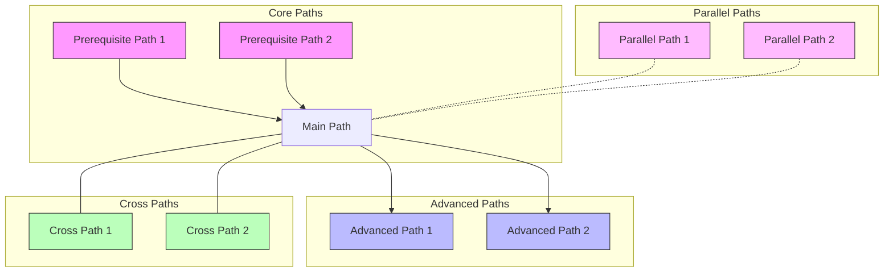

#### Timeline Integration
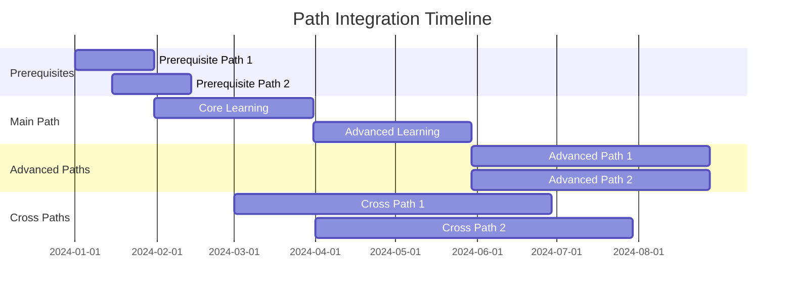

#### Resource Sharing Matrix
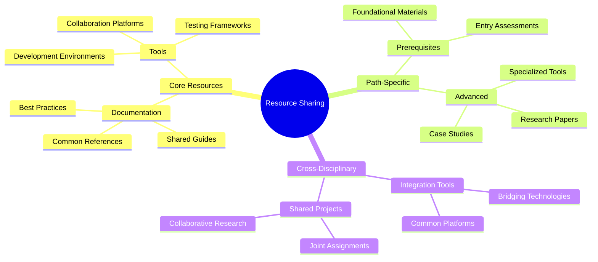

#### Competency Alignment
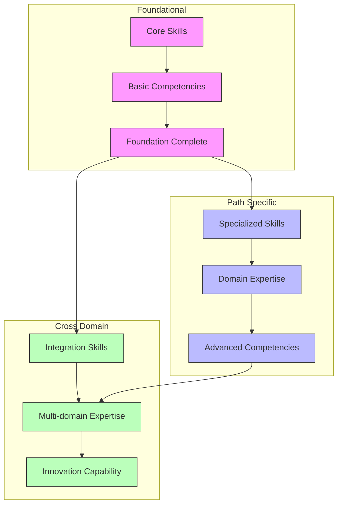

### Path Selection Guide

#### Decision Matrix
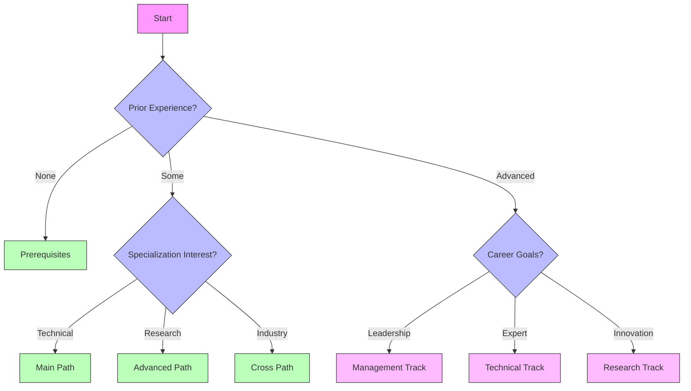

#### Path Comparison
| Aspect | Main Path | Advanced Path | Cross Path | Parallel Path |
|--------|-----------|---------------|------------|---------------|
| Duration | [Time] | [Time] | [Time] | [Time] |
| Difficulty | [Level] | [Level] | [Level] | [Level] |
| Prerequisites | [List] | [List] | [List] | [List] |
| Career Impact | [Impact] | [Impact] | [Impact] | [Impact] |
| Industry Focus | [Focus] | [Focus] | [Focus] | [Focus] |
| Key Outcomes | [List] | [List] | [List] | [List] |

### Integration Strategies

#### Combined Learning Approaches
- Synchronized Milestones
- Shared Projects
- Cross-Path Assessments
- Integrated Portfolios
- Joint Research Opportunities

#### Resource Optimization
- Shared Tool Sets
- Common Documentation
- Unified Assessment Criteria
- Combined Mentorship Programs
- Integrated Learning Platforms

#### Career Alignment
- Industry Track Mapping
- Certification Synergies
- Professional Development Plans
- Leadership Opportunities
- Research Pathways

## Feedback and Improvement

### Path Evaluation
- Student Feedback Form
- Industry Partner Review
- Content Update Log

### Version History
- v2.0.0 (Current)
  - [Major changes]
- v1.1.0
  - [Changes]
- v1.0.0
  - Initial release

### Contribution Guidelines
- Content Updates
- Exercise Additions
- Resource Suggestions

## Support Resources

### Technical Support
- Help Channels
- Debug Guides
- FAQ Repository

### Learning Support
- Study Groups
- Office Hours
- Discussion Forums

### Career Support
- Resume Building
- Interview Prep
- Job Search Strategy

## Visual Diagrams

### Learning Path Flow
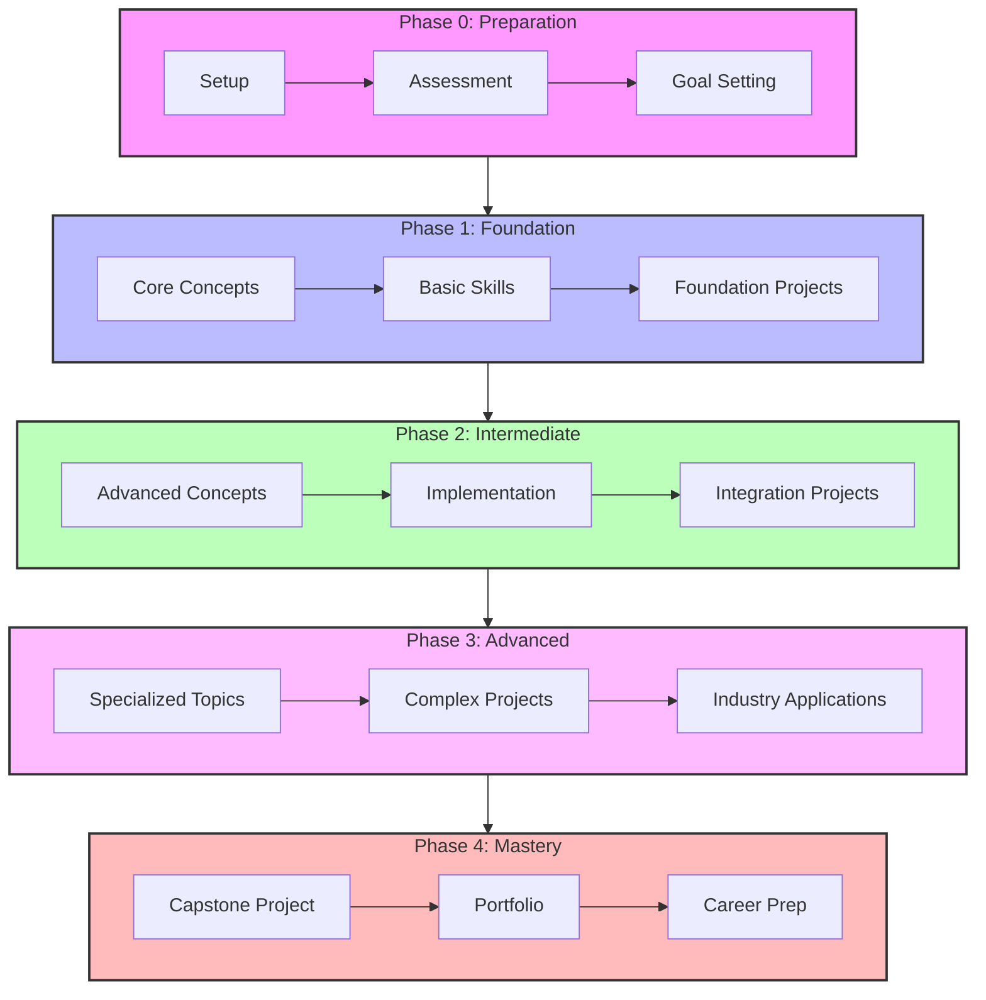

### Skill Dependencies
```mermaid
graph LR
    subgraph Prerequisites
        P1[Core Math] --> P2[Basic Programming]
        P2 --> P3[Data Structures]
    end
    
    subgraph Foundation Skills
        F1[Algorithm Design] --> F2[System Architecture]
        F2 --> F3[Testing Principles]
    end
    
    subgraph Advanced Skills
        A1[Performance Optimization] --> A2[Scalability Patterns]
        A2 --> A3[Enterprise Integration]
    end
    
    P3 --> F1
    F3 --> A1
    
    classDef prereq fill:#ff9,stroke:#333,stroke-width:2px
    classDef foundation fill:#9f9,stroke:#333,stroke-width:2px
    classDef advanced fill:#99f,stroke:#333,stroke-width:2px
    
    class P1,P2,P3 prereq
    class F1,F2,F3 foundation
    class A1,A2,A3 advanced
```

### Assessment Timeline
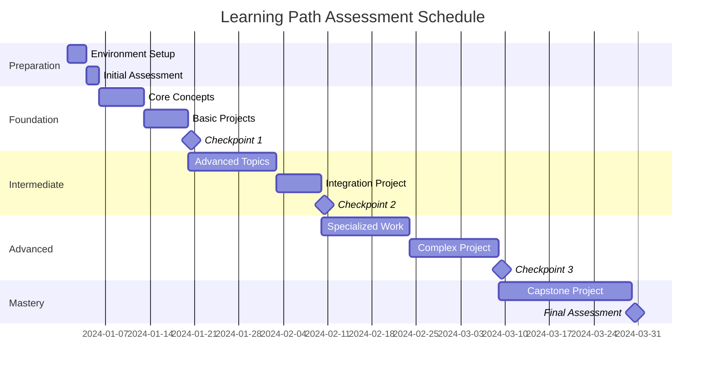

### Competency Matrix
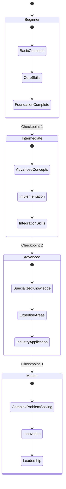

### Resource Utilization
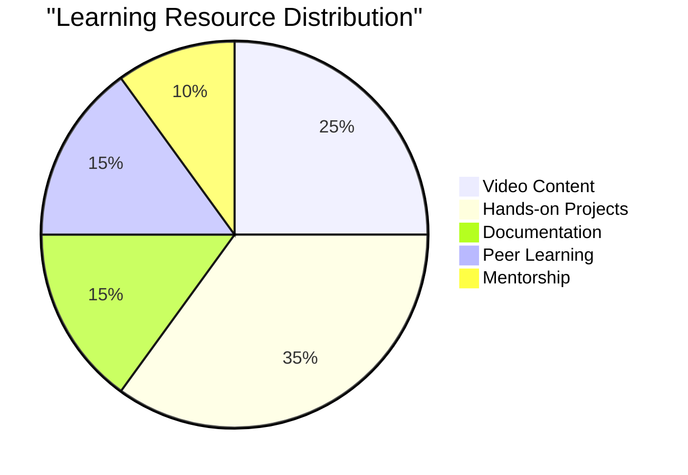

### Learning Pathways
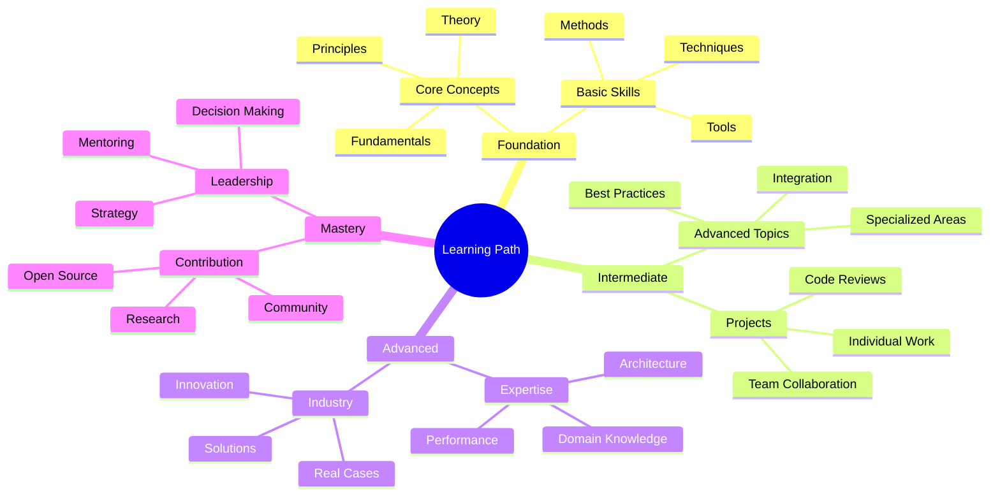

### Feedback Loop
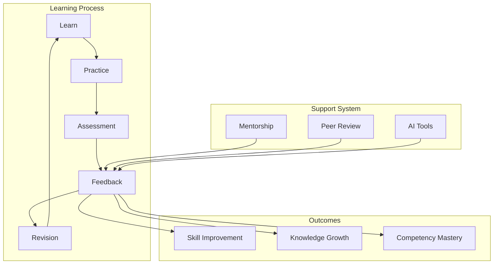

### Project Complexity Growth
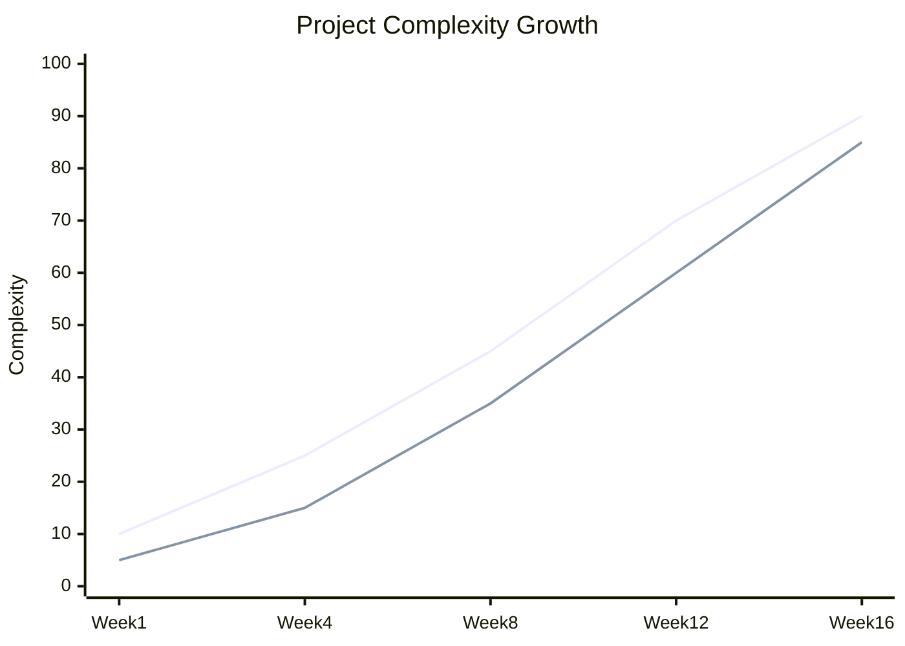