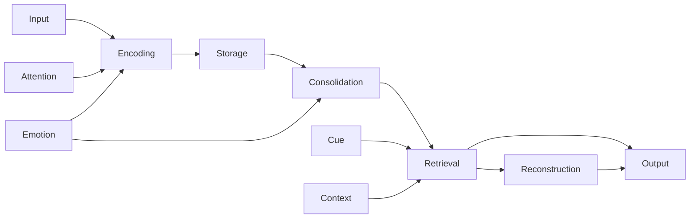
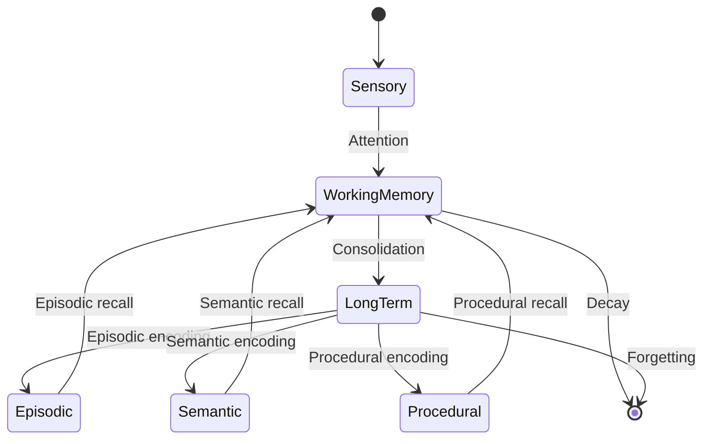
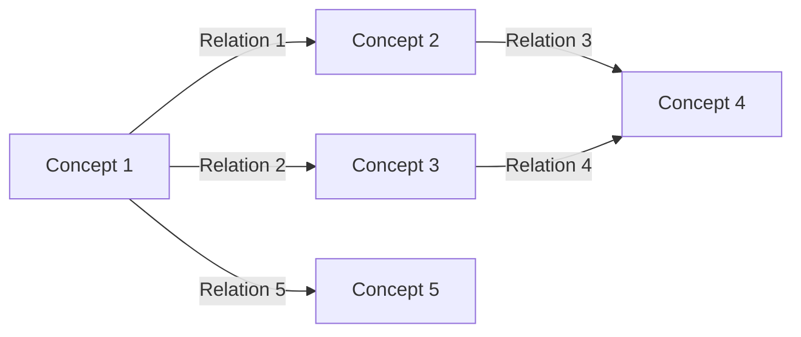
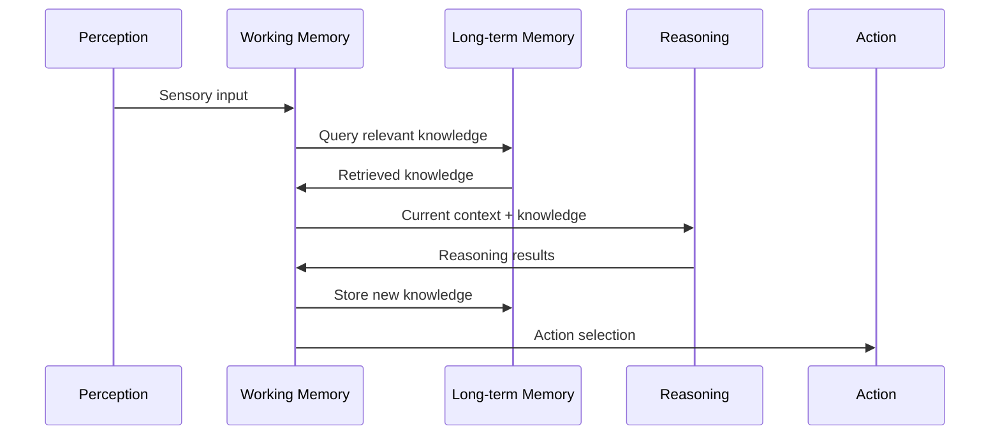

# Memory System: {{memory_name}}

## Metadata
- **Type**: {{memory_type}}
- **Domain**: {{domain}}
- **Purpose**: {{purpose}}
- **Status**: {{status}}
- **Version**: {{version}}

## Overview
{{memory_description}}

## Structure
### Memory Architecture
```mermaid
graph TD
    A[Memory System: {{memory_name}}] --> B[Working Memory]
    A --> C[Long-term Memory]
    A --> D[Episodic Memory]
    A --> E[Semantic Memory]
    A --> F[Procedural Memory]
    
    B --> G[Attention Buffer]
    B --> H[Manipulation Buffer]
    
    C --> I[Knowledge Base]
    C --> J[Belief Network]
    
    D --> K[Episode Store]
    D --> L[Temporal Index]
    
    E --> M[Concept Network]
    E --> N[Relation Store]
    
    F --> O[Skill Repository]
    F --> P[Action Patterns]
```

### Memory Components
```yaml
components:
  - name: "{{component_1}}"
    type: "{{component_1_type}}"
    capacity: {{component_1_capacity}}
    persistence: "{{component_1_persistence}}"
    
  - name: "{{component_2}}"
    type: "{{component_2_type}}"
    capacity: {{component_2_capacity}}
    persistence: "{{component_2_persistence}}"
```

### Data Structures
- Primary data structures
- Indexing mechanisms
- Retrieval structures
- [[data_structure/structure_1|Data Structure 1]]
- [[data_structure/structure_2|Data Structure 2]]

## Operations
### Memory Processes


### Implementation
```python
class {{memory_class_name}}(MemorySystem):
    def __init__(self, config):
        super().__init__(config)
        self.working_memory = WorkingMemory(config.working_memory)
        self.long_term_memory = LongTermMemory(config.long_term_memory)
        self.episodic_memory = EpisodicMemory(config.episodic_memory)
        self.semantic_memory = SemanticMemory(config.semantic_memory)
        self.procedural_memory = ProceduralMemory(config.procedural_memory)
        
    def encode(self, information, context=None):
        # Encode information into memory
        attention_filtered = self.working_memory.filter(information)
        if self.should_store_long_term(attention_filtered):
            self.long_term_memory.store(attention_filtered, context)
        
    def retrieve(self, query, context=None):
        # Retrieve information from memory
        working_results = self.working_memory.query(query)
        if not self.is_sufficient(working_results):
            long_term_results = self.long_term_memory.query(query, context)
            return self.integrate_results(working_results, long_term_results)
        return working_results
        
    def forget(self, pattern, strength=0.5):
        # Implement forgetting mechanism
        pass
```

### Core Functions
- Encoding process
- Storage mechanisms
- Retrieval strategies
- Forgetting dynamics
- Consolidation procedures

## Dynamics
### Memory Lifecycle


### Temporal Dynamics
- Short-term dynamics
- Long-term dynamics
- Decay functions
- Reinforcement mechanisms
- [[dynamic/dynamic_1|Dynamic Process 1]]
- [[dynamic/dynamic_2|Dynamic Process 2]]

### Attention Mechanisms
- Focus selection
- Resource allocation
- Priority management
- Context sensitivity

## Knowledge Representation
### Representation Format
```yaml
representation:
  format: "{{representation_format}}"
  structure: "{{representation_structure}}"
  encoding: "{{encoding_method}}"
  
  example:
    concept: "{{example_concept}}"
    attributes:
      - name: "{{attribute_1}}"
        value: "{{value_1}}"
      - name: "{{attribute_2}}"
        value: "{{value_2}}"
    relations:
      - type: "{{relation_1}}"
        target: "{{target_1}}"
      - type: "{{relation_2}}"
        target: "{{target_2}}"
```

### Semantic Network


### Episodic Structure
- Episode representation
- Temporal indexing
- Contextual binding
- Emotional tagging

## Integration
### System Interactions


### API Specification
```yaml
api:
  - endpoint: "encode"
    parameters:
      - name: "information"
        type: "{{information_type}}"
        description: "Information to be encoded"
      - name: "context"
        type: "{{context_type}}"
        description: "Context of encoding"
        optional: true
    returns:
      type: "{{encode_return_type}}"
      description: "Status of encoding operation"
  
  - endpoint: "retrieve"
    parameters:
      - name: "query"
        type: "{{query_type}}"
        description: "Query pattern"
      - name: "context"
        type: "{{context_type}}"
        description: "Retrieval context"
        optional: true
    returns:
      type: "{{retrieve_return_type}}"
      description: "Retrieved information"
```

### External Connections
- Perception interface
- Reasoning interface
- Action interface
- Learning interface

## Performance
### Capacity Metrics
- Working memory capacity
- Long-term storage capacity
- Retrieval efficiency
- Encoding speed

### Optimization Techniques
- Indexing strategies
- Caching mechanisms
- Parallel processing
- Compression methods

### Scaling Considerations
- Horizontal scaling
- Vertical scaling
- Distributed storage
- Federated memory

## Cognitive Implications
### Memory Effects
- Primacy effect
- Recency effect
- Context-dependent recall
- Emotional influence
- [[effect/effect_1|Memory Effect 1]]
- [[effect/effect_2|Memory Effect 2]]

### Cognitive Biases
- Confirmation bias
- Availability heuristic
- Hindsight bias
- Other relevant biases
- [[bias/bias_1|Cognitive Bias 1]]
- [[bias/bias_2|Cognitive Bias 2]]

### Learning Integration
- Memory-based learning
- Reinforcement mechanisms
- Skill acquisition
- Knowledge consolidation

## Implementation Details
### Parameters
```yaml
parameters:
  working_memory_capacity: {{working_memory_capacity}}
  encoding_rate: {{encoding_rate}}
  retrieval_threshold: {{retrieval_threshold}}
  decay_rate: {{decay_rate}}
  consolidation_interval: {{consolidation_interval}}
```

### Storage Requirements
```yaml
storage:
  format: "{{storage_format}}"
  estimated_size: "{{estimated_size}}"
  indexing_method: "{{indexing_method}}"
  backup_strategy: "{{backup_strategy}}"
```

### Performance Characteristics
- Retrieval latency
- Encoding throughput
- Query complexity
- Scalability limits

## Evaluation
### Benchmark Tests
- Recall accuracy
- Recognition accuracy
- Retrieval speed
- Storage efficiency

### Validation Methods
- Cognitive model comparison
- Human performance comparison
- Task-specific evaluation
- Cross-validation

## Notes
- Implementation details
- Performance observations
- Integration challenges
- Known limitations

## References
- Related research
- Documentation links
- External resources
- [[reference/reference_1|Reference 1]]
- [[reference/reference_2|Reference 2]]

## Related Memory Systems
- [[memory/related_1|Related Memory System 1]]
- [[memory/related_2|Related Memory System 2]] 