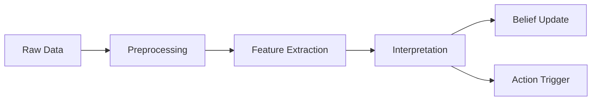
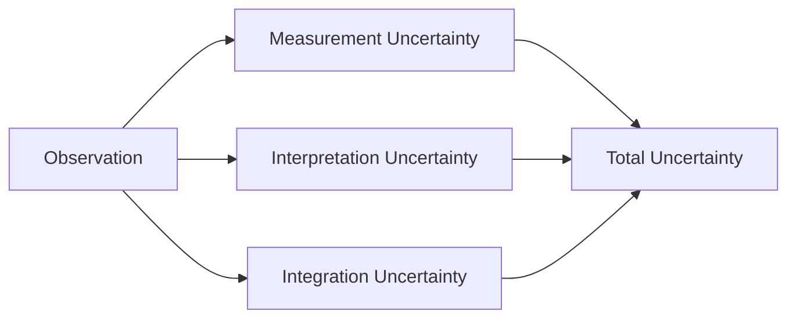
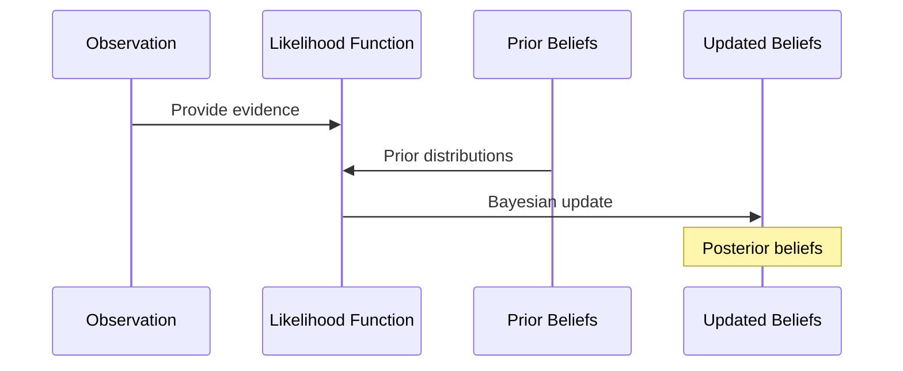

---

type: observation

id: "{{observation_id}}"

created: {{date}}

modified: {{date}}

tags: [observation, cognitive-model, perception]

aliases: ["{{observation_name}}", "{{observation_alias}}"]

related_observations: ["{{related_observation_1}}", "{{related_observation_2}}"]

---

# Observation: {{observation_name}}

## Metadata

- **Type**: {{observation_type}}

- **Domain**: {{domain}}

- **Source**: {{source}}

- **Status**: {{status}}

- **Timestamp**: {{timestamp}}

- **Confidence**: {{confidence}}

## Overview

{{observation_description}}

## Structure

### Observation Hierarchy

```mermaid

graph TD

    A[Observation: {{observation_name}}] --> B[Sub-Observation 1]

    A --> C[Sub-Observation 2]

    D[Parent Observation] --> A

    A --> E[Belief Update 1]

    A --> F[Belief Update 2]

```

### Data Structure

```yaml

data:

  feature1:

    type: {{feature1_type}}

    value: {{feature1_value}}

    uncertainty: {{feature1_uncertainty}}

  feature2:

    type: {{feature2_type}}

    value: {{feature2_value}}

    uncertainty: {{feature2_uncertainty}}

```

### Sensory Modalities

- Primary modality

- Secondary modalities

- Multimodal integration

- [[modality/modality_1|Modality 1]]

- [[modality/modality_2|Modality 2]]

## Processing

### Processing Pipeline



### Implementation

```python

class {{observation_class_name}}(Observation):

    def __init__(self, data, metadata):

        super().__init__(data, metadata)

        self.features = self.extract_features(data)

    def extract_features(self, data):

        # Extract relevant features from raw data

        pass

    def get_likelihood(self, belief):

        # Calculate likelihood of this observation given a belief

        pass

    def get_surprise(self, prior_beliefs):

        # Calculate surprise value relative to prior beliefs

        pass

```

### Processing Stages

- Raw data collection

- Preprocessing

- Feature extraction

- Semantic interpretation

- Belief integration

## Interpretation

### Semantic Content

- Primary meaning

- Context-dependent interpretations

- Ambiguity resolution

- [[interpretation/interpretation_1|Interpretation 1]]

- [[interpretation/interpretation_2|Interpretation 2]]

### Uncertainty



### Temporal Dynamics

- Observation duration

- Decay function

- Recency effects

- Temporal integration

## Belief Integration

### Update Process



### Precision Weighting

- Reliability assessment

- Attention modulation

- Precision factors

- [[precision/precision_1|Precision Factor 1]]

- [[precision/precision_2|Precision Factor 2]]

### Prediction Error

- Expected vs. observed

- Surprise quantification

- Error propagation

- [[prediction_error/error_1|Prediction Error 1]]

- [[prediction_error/error_2|Prediction Error 2]]

## Relationships

### Information Sources

- Sensor types

- Environmental factors

- Source reliability

- [[source/source_1|Source 1]]

- [[source/source_2|Source 2]]

### Influenced Beliefs

- Directly updated beliefs

- Indirectly affected beliefs

- Belief conflicts

- [[belief/belief_1|Belief 1]]

- [[belief/belief_2|Belief 2]]

## Evaluation

### Quality Metrics

- Signal-to-noise ratio

- Information content

- Relevance score

- Novelty assessment

### Validation Methods

- Cross-validation

- Consistency checks

- Source verification

## Implementation Details

### Parameters

```yaml

precision: {{precision}}

reliability: {{reliability}}

information_content: {{information_content}}

novelty_score: {{novelty_score}}

attention_weight: {{attention_weight}}

```

### Active Inference Integration

```yaml

prediction_error: {{prediction_error}}

free_energy_contribution: {{free_energy_contribution}}

precision_weight: {{precision_weight}}

```

## Notes

- Processing details

- Integration challenges

- Quality considerations

- Known limitations

## References

- Related research

- Documentation links

- External resources

- [[reference/reference_1|Reference 1]]

- [[reference/reference_2|Reference 2]]

## Related Observations

- [[observation/related_1|Related Observation 1]]

- [[observation/related_2|Related Observation 2]]

