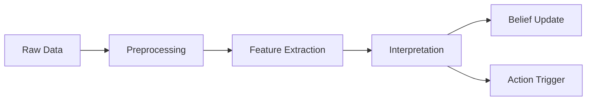
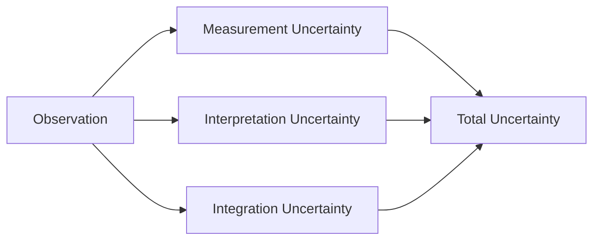
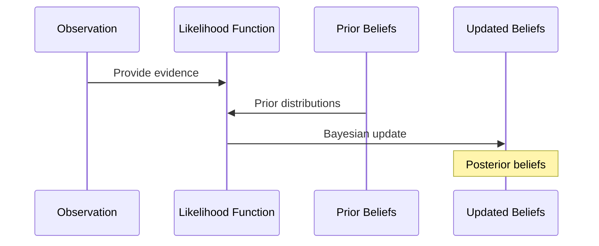

---

type: observation

id: "{{observation_id}}"

created: "{{date}}"

modified: "{{date}}"

tags: [observation, cognitive-model, perception]

aliases: ["{{observation_name}}", "{{observation_alias}}"]

related_observations: ["{{related_observation_1}}", "{{related_observation_2}}"]

---

# Observation: {{observation_name}}

## Metadata

- **Type**: {{observation_type}}

- **Domain**: {{domain}}

- **Source**: {{source}}

- **Status**: {{status}}

- **Timestamp**: {{timestamp}}

- **Confidence**: {{confidence}}

## Overview

{{observation_description}}

## Structure

### Observation Hierarchy

```mermaid

graph TD

    A[Observation: {{observation_name}}] --> B[Sub-Observation 1]

    A --> C[Sub-Observation 2]

    D[Parent Observation] --> A

    A --> E[Belief Update 1]

    A --> F[Belief Update 2]

```

### Data Structure

```yaml

data:

  feature1:

    type: {{feature1_type}}

    value: {{feature1_value}}

    uncertainty: {{feature1_uncertainty}}

  feature2:

    type: {{feature2_type}}

    value: {{feature2_value}}

    uncertainty: {{feature2_uncertainty}}

```

### Sensory Modalities

- Primary modality

- Secondary modalities

- Multimodal integration

- Modality 1

- Modality 2

## Processing

### Processing Pipeline


```mermaid

flowchart LR

    A[Raw Data] --> B[Preprocessing]

    B --> C[Feature Extraction]

    C --> D[Interpretation]

    D --> E[Belief Update]

    D --> F[Action Trigger]

```

### Implementation

See the canonical package documentation for a complete runnable example.


### Processing Stages

- Raw data collection

- Preprocessing

- Feature extraction

- Semantic interpretation

- Belief integration

## Interpretation

### Semantic Content

- Primary meaning

- Context-dependent interpretations

- Ambiguity resolution

- Interpretation 1

- Interpretation 2

### Uncertainty


```mermaid

graph LR

    A[Observation] --> B[Measurement Uncertainty]

    A --> C[Interpretation Uncertainty]

    A --> D[Integration Uncertainty]

    B --> E[Total Uncertainty]

    C --> E

    D --> E

```

### Temporal Dynamics

- Observation duration

- Decay function

- Recency effects

- Temporal integration

## Belief Integration

### Update Process


```mermaid

sequenceDiagram

    participant O as Observation

    participant L as Likelihood Function

    participant P as Prior Beliefs

    participant B as Updated Beliefs

    O->>L: Provide evidence

    P->>L: Prior distributions

    L->>B: Bayesian update

    Note over B: Posterior beliefs

```

### Precision Weighting

- Reliability assessment

- Attention modulation

- Precision factors

- Precision Factor 1

- Precision Factor 2

### Prediction Error

- Expected vs. observed

- Surprise quantification

- Error propagation

- Prediction Error 1

- Prediction Error 2

## Relationships

### Information Sources

- Sensor types

- Environmental factors

- Source reliability

- Source 1

- Source 2

### Influenced Beliefs

- Directly updated beliefs

- Indirectly affected beliefs

- Belief conflicts

- Belief 1

- Belief 2

## Evaluation

### Quality Metrics

- Signal-to-noise ratio

- Information content

- Relevance score

- Novelty assessment

### Validation Methods

- Cross-validation

- Consistency checks

- Source verification

## Implementation Details

### Parameters

```yaml

precision: {{precision}}

reliability: {{reliability}}

information_content: {{information_content}}

novelty_score: {{novelty_score}}

attention_weight: {{attention_weight}}

```

### Active Inference Integration

```yaml

prediction_error: {{prediction_error}}

free_energy_contribution: {{free_energy_contribution}}

precision_weight: {{precision_weight}}

```

## Notes

- Processing details

- Integration challenges

- Quality considerations

- Known limitations

## References

- Related research

- Documentation links

- External resources

- Reference 1

- Reference 2

## Related Observations

- Related Observation 1

- Related Observation 2

