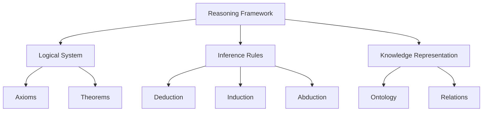
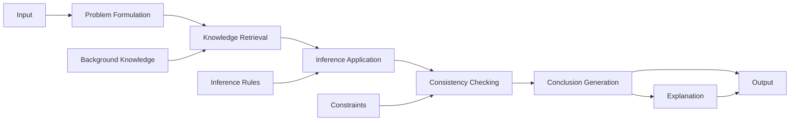
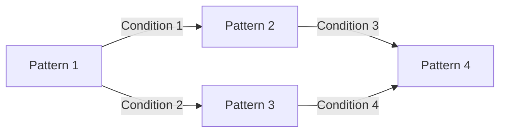
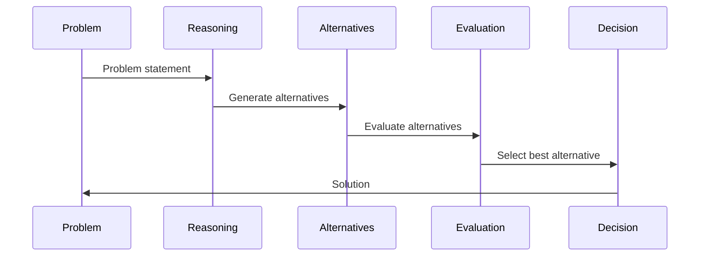
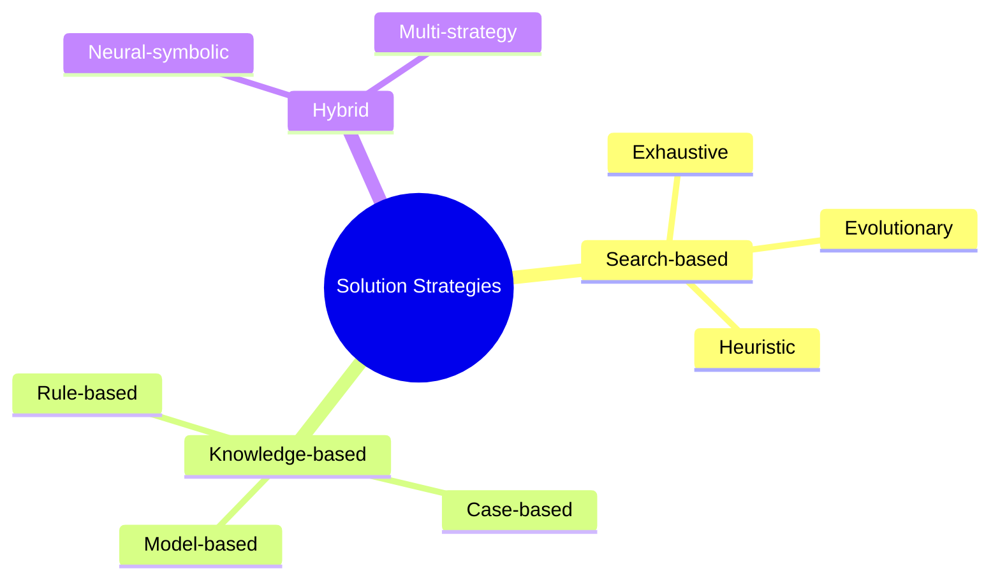
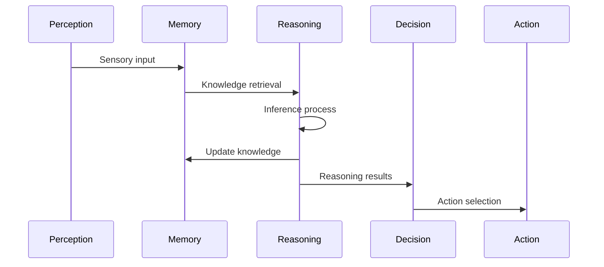

# Reasoning System: {{reasoning_name}}

## Metadata
- **Type**: {{reasoning_type}}
- **Domain**: {{domain}}
- **Purpose**: {{purpose}}
- **Status**: {{status}}
- **Version**: {{version}}

## Overview
{{reasoning_description}}

## Theoretical Foundation
### Reasoning Paradigm
- {{paradigm_description}}
- Theoretical basis
- Key assumptions
- [[paradigm/paradigm_1|Reasoning Paradigm 1]]
- [[paradigm/paradigm_2|Reasoning Paradigm 2]]

### Formal Framework


## Architecture
### System Components
```mermaid
graph TD
    A[Reasoning System: {{reasoning_name}}] --> B[Knowledge Base]
    A --> C[Inference Engine]
    A --> D[Working Memory]
    A --> E[Explanation Module]
    
    B --> F[Domain Knowledge]
    B --> G[Rules]
    
    C --> H[Forward Chaining]
    C --> I[Backward Chaining]
    
    D --> J[Context]
    D --> K[Intermediate Results]
    
    E --> L[Justification]
    E --> M[Trace]
```

### Component Specification
```yaml
components:
  - name: "{{component_1}}"
    type: "{{component_1_type}}"
    purpose: "{{component_1_purpose}}"
    inputs:
      - "{{input_1_1}}"
      - "{{input_1_2}}"
    outputs:
      - "{{output_1_1}}"
      - "{{output_1_2}}"
    
  - name: "{{component_2}}"
    type: "{{component_2_type}}"
    purpose: "{{component_2_purpose}}"
    inputs:
      - "{{input_2_1}}"
      - "{{input_2_2}}"
    outputs:
      - "{{output_2_1}}"
      - "{{output_2_2}}"
```

## Reasoning Mechanisms
### Inference Methods
- Deductive reasoning
- Inductive reasoning
- Abductive reasoning
- Analogical reasoning
- Causal reasoning
- [[method/method_1|Inference Method 1]]
- [[method/method_2|Inference Method 2]]

### Reasoning Process


### Implementation
```python
class {{reasoning_class_name}}(ReasoningSystem):
    def __init__(self, config):
        super().__init__(config)
        self.knowledge_base = KnowledgeBase(config.knowledge_base)
        self.inference_engine = InferenceEngine(config.inference_engine)
        self.working_memory = WorkingMemory(config.working_memory)
        self.explanation_module = ExplanationModule(config.explanation)
        
    def reason(self, problem, context=None):
        # Formulate the problem
        formulated_problem = self.formulate_problem(problem, context)
        
        # Retrieve relevant knowledge
        relevant_knowledge = self.knowledge_base.retrieve(formulated_problem)
        
        # Apply inference rules
        self.working_memory.initialize(formulated_problem, relevant_knowledge)
        inference_result = self.inference_engine.apply(self.working_memory)
        
        # Check consistency
        if not self.check_consistency(inference_result):
            return self.handle_inconsistency(inference_result)
        
        # Generate conclusion and explanation
        conclusion = self.generate_conclusion(inference_result)
        explanation = self.explanation_module.generate(
            problem, relevant_knowledge, inference_result, conclusion
        )
        
        return {
            'conclusion': conclusion,
            'explanation': explanation,
            'confidence': self.calculate_confidence(inference_result)
        }
```

## Knowledge Integration
### Knowledge Representation
```yaml
knowledge:
  format: "{{knowledge_format}}"
  structure: "{{knowledge_structure}}"
  
  example:
    concept: "{{example_concept}}"
    rules:
      - condition: "{{condition_1}}"
        action: "{{action_1}}"
      - condition: "{{condition_2}}"
        action: "{{action_2}}"
    facts:
      - "{{fact_1}}"
      - "{{fact_2}}"
```

### Reasoning Patterns


### Memory Interface
- Working memory integration
- Long-term knowledge access
- Episodic memory utilization
- Semantic network navigation

## Decision Making
### Decision Process


### Evaluation Criteria
```yaml
criteria:
  - name: "{{criterion_1}}"
    weight: {{criterion_1_weight}}
    evaluation_method: "{{criterion_1_method}}"
    
  - name: "{{criterion_2}}"
    weight: {{criterion_2_weight}}
    evaluation_method: "{{criterion_2_method}}"
```

### Uncertainty Handling
- Probabilistic reasoning
- Fuzzy logic
- Confidence metrics
- Belief revision mechanisms

## Problem Solving
### Problem Types
- Constraint satisfaction
- Planning
- Diagnosis
- Classification
- Optimization
- [[problem/problem_1|Problem Type 1]]
- [[problem/problem_2|Problem Type 2]]

### Solution Strategies


### Heuristics
- Domain-specific heuristics
- General problem-solving heuristics
- Meta-reasoning heuristics
- [[heuristic/heuristic_1|Heuristic 1]]
- [[heuristic/heuristic_2|Heuristic 2]]

## Integration
### System Interactions


### API Specification
```yaml
api:
  - endpoint: "reason"
    parameters:
      - name: "problem"
        type: "{{problem_type}}"
        description: "Problem to reason about"
      - name: "context"
        type: "{{context_type}}"
        description: "Reasoning context"
        optional: true
    returns:
      type: "{{reason_return_type}}"
      description: "Reasoning results including conclusion and explanation"
  
  - endpoint: "explain"
    parameters:
      - name: "reasoning_id"
        type: "{{id_type}}"
        description: "ID of reasoning process to explain"
    returns:
      type: "{{explain_return_type}}"
      description: "Detailed explanation of reasoning process"
```

### External Dependencies
- Knowledge base requirements
- Memory system integration
- Perception interface
- Action system interface

## Performance
### Computational Complexity
- Time complexity analysis
- Space complexity analysis
- Scalability considerations
- Optimization opportunities

### Optimization Techniques
- Caching strategies
- Parallel processing
- Incremental reasoning
- Approximate reasoning

## Cognitive Aspects
### Cognitive Plausibility
- Alignment with human reasoning
- Cognitive biases modeling
- Limitations comparison
- [[cognitive/cognitive_1|Cognitive Aspect 1]]
- [[cognitive/cognitive_2|Cognitive Aspect 2]]

### Metacognition
- Self-monitoring capabilities
- Strategy selection
- Resource allocation
- Reasoning about reasoning

## Implementation Details
### Parameters
```yaml
parameters:
  inference_depth: {{inference_depth}}
  confidence_threshold: {{confidence_threshold}}
  timeout: {{timeout_ms}}
  max_alternatives: {{max_alternatives}}
  consistency_check_level: "{{consistency_level}}"
```

### Algorithmic Details
- Core algorithms
- Data structures
- Optimization techniques
- Implementation constraints

## Evaluation
### Performance Metrics
```yaml
metrics:
  - name: "{{metric_1}}"
    description: "{{metric_1_description}}"
    target_value: {{metric_1_target}}
    
  - name: "{{metric_2}}"
    description: "{{metric_2_description}}"
    target_value: {{metric_2_target}}
```

### Benchmark Problems
- Standard reasoning problems
- Domain-specific benchmarks
- Comparative evaluation
- [[benchmark/benchmark_1|Benchmark 1]]
- [[benchmark/benchmark_2|Benchmark 2]]

### Validation Methods
- Formal verification
- Empirical testing
- Human expert comparison
- Cross-validation

## Applications
### Use Cases
- Domain 1 applications
- Domain 2 applications
- Domain 3 applications
- [[use_case/use_case_1|Use Case 1]]
- [[use_case/use_case_2|Use Case 2]]

### Case Studies
- Case study 1 summary
- Case study 2 summary
- Case study 3 summary

## Limitations
- Current limitations
- Edge cases
- Performance bottlenecks
- Theoretical constraints

## Future Development
### Planned Enhancements
- Enhancement 1 description
- Enhancement 2 description
- Enhancement 3 description

### Research Directions
- Research direction 1
- Research direction 2
- Research direction 3

## Notes
- Implementation details
- Performance observations
- Integration challenges
- Known issues

## References
- Related research
- Documentation links
- External resources
- [[reference/reference_1|Reference 1]]
- [[reference/reference_2|Reference 2]]

## Related Systems
- [[system/related_1|Related System 1]]
- [[system/related_2|Related System 2]] 