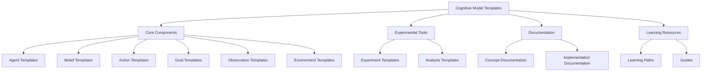

# Cognitive Model Templates Index

## Overview

This index organizes all available templates for documenting cognitive models, their components, experiments, and related concepts. These templates are designed to be comprehensive, modular, and interconnected through Obsidian's linking capabilities.

## Core Component Templates

These templates define the fundamental building blocks of cognitive models.

### Agent Templates
- [[agent_template|Agent Template]] - Template for defining cognitive agents with beliefs, goals, actions, and observations
- **Purpose**: Document the structure and behavior of cognitive agents
- **Key Sections**: Metadata, Properties, State, Relationships, Implementation

### Belief Templates
- [[belief_template|Belief Template]] - Template for defining beliefs and knowledge representations
- **Purpose**: Document the structure and dynamics of beliefs within cognitive models
- **Key Sections**: Prior Distribution, Dependencies, Content, Dynamics, Relationships

### Action Templates
- [[action_template|Action Template]] - Template for defining actions that agents can perform
- **Purpose**: Document the structure, execution, and effects of actions
- **Key Sections**: Parameters, Preconditions, Execution, Effects, Decision Process

### Goal Templates
- [[goal_template|Goal Template]] - Template for defining agent goals and objectives
- **Purpose**: Document the structure, planning, and motivation of goals
- **Key Sections**: Parameters, Planning, Motivation, Decision Process, Evaluation

### Observation Templates
- [[observation_template|Observation Template]] - Template for defining observations from the environment
- **Purpose**: Document the structure, processing, and interpretation of observations
- **Key Sections**: Data Structure, Processing, Interpretation, Belief Integration

### Environment Templates
- [[environment_template|Environment Template]] - Template for defining environments in which agents operate
- **Purpose**: Document the structure, dynamics, and interaction of environments
- **Key Sections**: State Space, Action Space, Dynamics, Interaction, Scenarios

## Experimental Tools

These templates support experimental design, data collection, and analysis.

### Experiment Templates
- [[experiment_template|Experiment Template]] - Template for designing and documenting experiments
- **Purpose**: Document experimental design, implementation, data collection, and results
- **Key Sections**: Objectives, Design, Implementation, Data Collection, Analysis, Results

### Analysis Templates
- [[analysis_template|Analysis Template]] - Template for analyzing experimental results
- **Purpose**: Document analysis methods, visualizations, and interpretations
- **Key Sections**: Data Processing, Statistical Methods, Visualization, Interpretation

## Documentation Templates

These templates support documentation of concepts, implementations, and research.

### Concept Documentation
- [[cognitive_concept|Cognitive Concept Template]] - Template for documenting cognitive science concepts
- **Purpose**: Document theoretical foundations, implementations, and evidence for cognitive concepts
- **Key Sections**: Theoretical Foundations, Implementation, Empirical Evidence, Limitations

### Implementation Documentation
- [[implementation_example|Implementation Example Template]] - Template for documenting implementation examples
- **Purpose**: Document code implementations, configurations, and usage examples
- **Key Sections**: Dependencies, Core Implementation, Configuration, Validation, Results

### Research Documentation
- [[research_document|Research Document Template]] - Template for documenting research findings
- **Purpose**: Document research questions, methods, findings, and implications
- **Key Sections**: Background, Methods, Results, Discussion, Implications

## Learning Resources

These templates support learning and knowledge transfer.

### Learning Paths
- [[learning_path|Learning Path Template]] - Template for creating structured learning paths
- **Purpose**: Document progressive learning journeys through cognitive concepts
- **Key Sections**: Prerequisites, Learning Progression, Study Resources, Assessment

### Guides
- [[guide_template|Guide Template]] - Template for creating instructional guides
- **Purpose**: Document step-by-step instructions for implementing cognitive models
- **Key Sections**: Prerequisites, Steps, Examples, Troubleshooting

## Linking and Organization

### Linking Templates
- [[linking_template|Linking Template]] - Template for creating consistent links between documents
- **Purpose**: Document standard linking patterns and relationship types
- **Key Sections**: Required Link Sections, Link Categories, Link Annotations, Validation Blocks

### Package Components
- [[package_component|Package Component Template]] - Template for documenting software package components
- **Purpose**: Document the structure and usage of software components
- **Key Sections**: Interface, Implementation, Configuration, Examples

## Usage Guidelines

1. **Select the appropriate template** based on the type of content you're documenting
2. **Fill in all required sections** with relevant information
3. **Use consistent linking** to connect related documents
4. **Include Mermaid diagrams** to visualize relationships and processes
5. **Maintain metadata** including creation date, status, and tags

## Template Maintenance

- Templates should be reviewed and updated regularly
- Feedback on template usability should be collected and incorporated
- New templates should be added as needed to support evolving documentation needs

## Related Resources

- [[documentation_templates|Documentation Templates Overview]]
- [[ai_concept_template|AI Concept Template]]
- [[template_guide|Template Usage Guide]] 