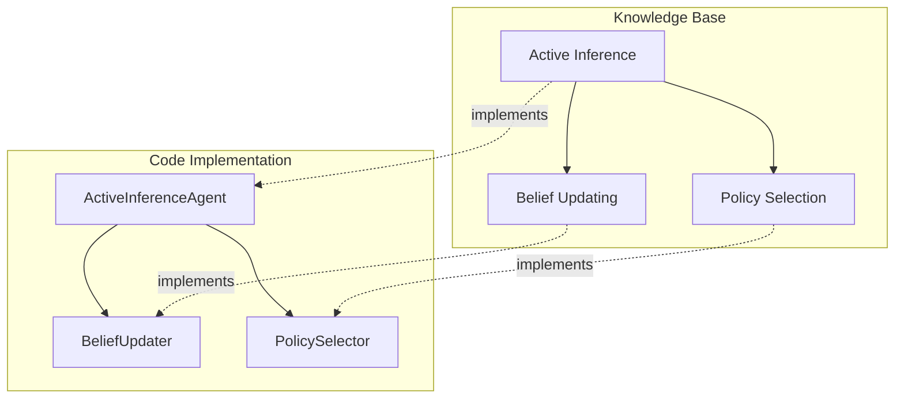

# Git Tools for Cognitive Modeling

---
title: Git Tools for Cognitive Modeling
type: tool-documentation
status: stable
created: 2024-07-25
tags:
  - git
  - version-control
  - knowledge-management
  - collaboration
  - cognitive-modeling
semantic_relations:
  - type: implements
    links: [[git_workflow]]
  - type: relates
    links:
      - [[obsidian_usage]]
      - [[cursor_integration]] 
      - [[knowledge_management]]
      - [[collaboration_tools]]
      - [[continuous_integration]]
---

## Overview

This document details specialized Git tools and configurations designed specifically for cognitive modeling projects, with a focus on maintaining synchronization between code implementation and knowledge base documentation. These tools handle the unique challenges of managing both traditional code repositories and Obsidian-based knowledge graphs within a unified Git workflow.

## Core Git Tools

### Knowledge-Code Synchronization Tools

#### KB-Code Linker (`kb-code-linker`)
Links knowledge base concepts directly to their implementations.

```bash
# Installation
pip install kb-code-linker

# Usage
kb-code-linker scan --knowledge-dir knowledge_base/ --code-dir src/
kb-code-linker report --format markdown > kb_code_links.md
kb-code-linker validate --strict
```

#### Implementation Gap Detector (`impl-gap`)
Identifies concepts documented in the knowledge base but missing in code implementation.

```bash
# Installation
pip install impl-gap

# Usage
impl-gap analyze --kb-path knowledge_base/cognitive/ --impl-path src/cognitive/
impl-gap report --format json > implementation_gaps.json
```

#### Documentation Gap Finder (`doc-gap`)
Identifies code implementations without corresponding knowledge base documentation.

```bash
# Usage
python scripts/doc_gap_finder.py --src-dir src/ --kb-dir knowledge_base/
```

### Git Extensions for Cognitive Projects

#### Cognitive Git Hooks

```bash
# Pre-commit hook for ensuring consistent knowledge-code links
#!/bin/sh
# .git/hooks/pre-commit
python scripts/kb_code_validator.py
if [ $? -ne 0 ]; then
  echo "Knowledge base and code are not in sync. Run kb-code-linker sync before committing."
  exit 1
fi
```

#### Specialized Git Commands

```bash
# Installation
git clone https://github.com/cognitive-modeling/git-cognitive.git
cd git-cognitive
pip install -e .

# Usage
git cognitive kb-update   # Updates knowledge base entries based on code changes
git cognitive code-update # Updates code documentation based on knowledge base
git cognitive status      # Shows knowledge-code synchronization status
```

## Integration Tools

### Obsidian Git Integration

#### Obsidian Git Plugin Configuration

```json
// .obsidian/plugins/obsidian-git/data.json (optimized for cognitive projects)
{
  "autoSaveInterval": 15,
  "autoPullInterval": 30,
  "autoPullOnBoot": true,
  "disablePopups": false,
  "commitMessage": "kb: {{date}} - {{files}}",
  "commitDateFormat": "YYYY-MM-DD HH:mm:ss",
  "autoCommitMessage": "kb: auto-sync {{date}}",
  "pushOnCommit": false,
  "pullBeforePush": true,
  "disablePrompts": false,
  "listChangedFilesInMessageBody": true,
  "showStatusBar": true,
  "updateSubmodules": false,
  "syncMethod": "merge",
  "gitPath": "",
  "customMessageFolder": "templates/commit-messages"
}
```

#### Knowledge Base Git Automation

```bash
# Installation
pip install kb-git-automator

# Usage
kb-git-automator watch --kb-dir knowledge_base/ --auto-commit
```

### Cursor AI Integration

#### Cursor Git Assistant Configuration

```json
// .cursorrules
{
  "git": {
    "suggestCommitMessages": true,
    "suggestFileChanges": true,
    "branchAssistance": true,
    "prReviewAssistance": true,
    "knowledgeBaseAwareness": true
  },
  "documentation": {
    "suggestKnowledgeBaseLinks": true,
    "validateKnowledgeReferences": true
  }
}
```

#### AI-Assisted PR Templates

```markdown
<!-- .github/PULL_REQUEST_TEMPLATE/cognitive_feature.md -->
# Cognitive Feature PR

## Description
<!-- Describe the changes implemented in this PR -->

## Knowledge Base Changes
<!-- List any knowledge base files that were updated -->

## Related Concepts
<!-- Reference related concept documentation -->
- [ ] [[concept1]]
- [ ] [[concept2]]

## Implementation Details
<!-- Technical implementation details -->

## Testing
<!-- How was this change tested? -->

## AI Assistant Notes
<!-- Notes from Cursor AI assistant (if used) -->
```

## Visualization Tools

### Knowledge-Code Graph Visualizer

```bash
# Installation
pip install kb-code-graph

# Usage
kb-code-graph generate --kb-dir knowledge_base/ --code-dir src/ --output graph.html
```

Example Output:


### Git History Visualizer for Cognitive Projects

```bash
# Installation
pip install cognitive-git-viz

# Usage
cognitive-git-viz --repo-path . --output git_history.html
```

## Specialized Git Configurations

### Cognitive Project `.gitattributes`

```
# .gitattributes for cognitive modeling projects
*.md diff=markdown
*.py diff=python
*.ipynb diff=jupyter
knowledge_base/** merge=cognitive-knowledge-merger
src/models/** merge=cognitive-model-merger

# LFS configuration for research data
*.csv filter=lfs diff=lfs merge=lfs -text
*.npy filter=lfs diff=lfs merge=lfs -text
*.pt filter=lfs diff=lfs merge=lfs -text
*.pkl filter=lfs diff=lfs merge=lfs -text
```

### Custom Git Diff and Merge Tools

```bash
# .gitconfig additions for cognitive projects
[diff "markdown"]
  textconv = pandoc --to=plain
  prompt = false
[diff "jupyter"]
  textconv = jupyter nbconvert --to python --stdout
  prompt = false
[merge "cognitive-knowledge-merger"]
  name = Cognitive Knowledge Base Merger
  driver = python scripts/kb_merge_driver.py %O %A %B %P
[merge "cognitive-model-merger"]
  name = Cognitive Model Merger
  driver = python scripts/model_merge_driver.py %O %A %B %P
```

## Automation and CI Tools

### GitHub Actions for Cognitive Projects

```yaml
# .github/workflows/cognitive-sync-validation.yml
name: Knowledge-Code Sync Validation

on:
  push:
    branches: [main, develop]
  pull_request:
    branches: [main, develop]

jobs:
  validate-sync:
    runs-on: ubuntu-latest
    steps:
      - uses: actions/checkout@v3
      
      - name: Set up Python
        uses: actions/setup-python@v4
        with:
          python-version: '3.10'
      
      - name: Install dependencies
        run: |
          python -m pip install --upgrade pip
          pip install kb-code-linker impl-gap
      
      - name: Validate knowledge-code synchronization
        run: kb-code-linker validate --strict
      
      - name: Check for implementation gaps
        run: impl-gap analyze --kb-path knowledge_base/ --impl-path src/ --fail-on-gaps
      
      - name: Generate knowledge graph visualization
        run: |
          pip install kb-code-graph
          kb-code-graph generate --kb-dir knowledge_base/ --code-dir src/ --output artifacts/knowledge_graph.html
      
      - name: Upload artifacts
        uses: actions/upload-artifact@v3
        with:
          name: knowledge-artifacts
          path: artifacts/
```

### Pre-commit Hooks Configuration

```yaml
# .pre-commit-config.yaml
repos:
-   repo: https://github.com/pre-commit/pre-commit-hooks
    rev: v4.4.0
    hooks:
    -   id: trailing-whitespace
    -   id: end-of-file-fixer
    -   id: check-yaml
    -   id: check-added-large-files
        args: ['--maxkb=500']

-   repo: https://github.com/cognitive-modeling/cognitive-hooks
    rev: v1.2.0
    hooks:
    -   id: knowledge-code-sync
        files: '^(knowledge_base|src)/'
    -   id: obsidian-link-checker
        files: '^knowledge_base/.*\.md$'
    -   id: concept-implementation-validator
        files: '^src/.*\.(py|jl)$'
```

## Development Scripts

### Knowledge Base Utilities

```bash
# scripts/update_kb_from_code.py
#!/usr/bin/env python
"""Updates knowledge base entries based on code implementations."""
import sys
import os
import re
from pathlib import Path

def main():
    """Main function to update knowledge base from code."""
    # Implementation details
    pass

if __name__ == "__main__":
    main()
```

### Git Report Generators

```bash
# scripts/kb_contribution_report.py
#!/usr/bin/env python
"""Generates report on knowledge base contributions."""
import subprocess
import datetime
import json

def main():
    """Generate knowledge base contribution report."""
    # Implementation details
    pass

if __name__ == "__main__":
    main()
```

## Installation Guide

### Setting Up Git Tools for Cognitive Modeling

1. Clone the cognitive tools repository:
   ```bash
   git clone https://github.com/cognitive-modeling/cognitive-git-tools.git
   cd cognitive-git-tools
   ```

2. Install the tools:
   ```bash
   pip install -e .
   ```

3. Configure your repository:
   ```bash
   cognitive-git-setup --repo-path /path/to/your/repo
   ```

4. Install pre-commit hooks:
   ```bash
   cd /path/to/your/repo
   pre-commit install
   ```

## Best Practices

### Knowledge-Code Synchronization

1. **Always update knowledge base when implementing concepts**
   - Use `git cognitive kb-update` after implementation
   - Run `kb-code-linker validate` before committing

2. **Update implementation notes when evolving concepts**
   - Flag implementation gaps with `impl-gap` tool
   - Create implementation TODOs for unimplemented concepts

3. **Use consistent linking patterns**
   - Follow the [[linking_patterns]] guidelines
   - Use the `[[concept|Concept Display Name]]` format in knowledge base
   - Use `# Implementation of [[concept]]` in code docstrings

### Collaborative Workflow

1. **Knowledge Base First Approach**
   - Start with concept documentation in knowledge base
   - Create implementation plan with proper links
   - Implement code with reference to knowledge base

2. **Review Both Aspects**
   - For PR reviews, check both code and knowledge changes
   - Ensure consistency between implementation and documentation
   - Use GitHub's "Files Changed" view to see markdown changes

3. **Regular Synchronization**
   - Run `kb-code-linker report` weekly
   - Address gaps in scheduled maintenance tasks
   - Track synchronization metrics over time

## Troubleshooting

### Common Issues

#### Knowledge Base Links Not Detected
- Ensure using correct Obsidian link format: `[[concept]]`
- Verify file extensions are correct
- Run `kb-code-linker scan --verbose` for detailed diagnostics

#### Merge Conflicts in Knowledge Base
- Use `cognitive-merge-tool` for assisted merging
- Run `git cognitive resolve` after manual resolution
- Consider splitting large knowledge base files

#### Git Hooks Failing
- Check error messages in hook output
- Run validation tools manually to identify issues
- Temporarily bypass with `git commit --no-verify` (use sparingly)

## Related Resources

- [[git_workflow|Git Workflow Guide]]
- [[obsidian_usage|Obsidian Usage Guidelines]]
- [[cursor_integration|Cursor AI Integration]]
- [[documentation_guide|Documentation Guide]]
- [[code_review_tools|Code Review Tools]]
- [[continuous_integration|CI/CD Pipeline]]
- [[knowledge_management|Knowledge Management]]

## External Tools and References

- [Obsidian Git Plugin](https://github.com/denolehov/obsidian-git)
- [Pre-commit Framework](https://pre-commit.com/)
- [Git LFS](https://git-lfs.github.com/)
- [GitHub Actions](https://github.com/features/actions)
- [Mermaid Diagramming](https://mermaid-js.github.io/mermaid/)
- [Cursor](https://cursor.sh/)
- [Pandoc](https://pandoc.org/) 