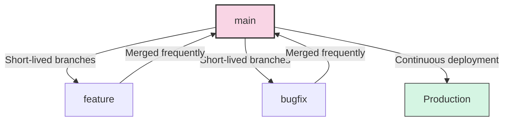
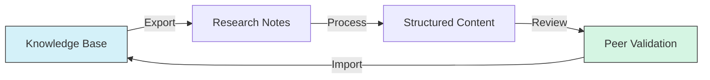

# Git Workflow Guide

## Overview

This guide outlines our Git workflow for managing cognitive modeling projects, integrating with both [[cursor_integration]] and [[obsidian_usage]].

## Repository Structure

### Core Branches

- `main` - Stable production code

- `develop` - Integration branch

- `feature/*` - Feature branches

- `release/*` - Release preparation

- `hotfix/*` - Production fixes

## Workflow Patterns

### Feature Development

1. Create feature branch from `develop`:

   ```bash

   git checkout develop

   git pull origin develop

   git checkout -b feature/new-feature

   ```

1. Develop with [[cursor_integration]]:

   - Use AI assistance

   - Follow [[code_style]]

   - Update [[documentation_guide]]

1. Commit changes:

   ```bash

   git add .

   git commit -m "feat: add new feature

   - Added X functionality

   - Updated Y components

   - Related to #issue"

   ```

### Knowledge Base Changes

#### Working with Obsidian

1. Create knowledge branch:

   ```bash

   git checkout -b kb/topic-name

   ```

1. Update content:

   - Follow [[obsidian_usage]] guidelines

   - Maintain [[linking_patterns]]

   - Update [[node_types]]

1. Commit changes:

   ```bash

   git add knowledge_base/

   git commit -m "kb: update topic structure

   - Added new nodes

   - Updated relationships

   - Fixed broken links"

   ```

## Commit Conventions

### Message Structure

```text

<type>(<scope>): <subject>

<body>

<footer>

```

### Types

- `feat`: New feature

- `fix`: Bug fix

- `docs`: Documentation

- `kb`: Knowledge base

- `refactor`: Code refactoring

- `test`: Testing

- `chore`: Maintenance

### Scopes

- `agent`: Agent-related changes

- `belief`: Belief network updates

- `model`: Model implementation

- `docs`: Documentation

- `kb`: Knowledge base

## Integration Practices

### With Obsidian

- Track `.obsidian/` selectively

- Include templates

- Exclude personal settings

- See [[obsidian_usage]]

### With Cursor

- Include `.cursorrules`

- Track AI configurations

- See [[cursor_integration]]

## Branching Strategy

### Feature Branches

- Branch from: `develop`

- Merge to: `develop`

- Naming: `feature/description`

### Knowledge Base Branches

- Branch from: `main`

- Merge to: `main`

- Naming: `kb/topic`

### Release Branches

- Branch from: `develop`

- Merge to: `main` and `develop`

- Naming: `release/version`

## Code Review

### Process

1. Create Pull Request

1. Use [[cursor_integration]] for review

1. Check [[code_style]] compliance

1. Verify [[testing_guide]] coverage

1. Update [[documentation_guide]]

### Checklist

- [ ] Code follows style guide

- [ ] Tests added/updated

- [ ] Documentation updated

- [ ] Knowledge base links valid

- [ ] CI/CD passes

## Conflict Resolution

### Strategy

1. Keep local branch updated:

   ```bash

   git fetch origin

   git rebase origin/develop

   ```

1. Resolve conflicts:

   - Check [[linking_patterns]]

   - Maintain [[node_types]] integrity

   - Preserve knowledge structure

## Best Practices

### Repository Maintenance

- Regular cleanup

- Archive old branches

- Update documentation

- Follow [[maintenance_guide]]

### Knowledge Management

- Consistent structure

- Clear relationships

- Updated metadata

- See [[obsidian_usage]]

### Collaboration

- Clear communication

- Regular updates

- Proper documentation

- Follow [[workflow_guides]]

## Automation

### Git Hooks

```bash

#!/bin/sh

# pre-commit hook

npm run lint

npm run test

```

### CI/CD Integration

- Automated testing

- Documentation generation

- Knowledge base validation

- See [[deployment_guide]]

## Troubleshooting

### Common Issues

- Merge conflicts

- Lost changes

- Broken links

See [[troubleshooting]] for solutions.

## Related Guides

- [[development_setup]]

- [[workflow_guides]]

- [[deployment_guide]]

## References

- [Git Documentation](https://git-scm.com/doc)

- [[code_organization]]

- [[contribution_guide]]

## Advanced Git Techniques

### Git Worktrees

Worktrees allow you to check out multiple branches simultaneously in separate directories:

```bash

# Create a new worktree for a feature branch

git worktree add ../cognitive-feature-branch feature/new-feature

# List all worktrees

git worktree list

# Remove a worktree when done

git worktree remove ../cognitive-feature-branch

```

### Interactive Rebasing

Rewrite history to create cleaner commits:

```bash

# Rebase the last 3 commits interactively

git rebase -i HEAD~3

# Rebase all commits since branching from develop

git rebase -i develop

```

### Stashing with Purpose

```bash

# Stash changes with a descriptive message

git stash push -m "WIP: Belief update implementation"

# List stashes

git stash list

# Apply a specific stash

git stash apply stash@{1}

# Apply and remove a stash

git stash pop stash@{1}

```

### Bisect for Debugging

Automatically find the commit that introduced a bug:

```bash

# Start a bisect session

git bisect start

# Mark current state as bad

git bisect bad

# Mark a known good commit

git bisect good v1.0.0

# Automated bisect with a test script

git bisect run python tests/test_belief_update.py

```

### Git Reflog Recovery

Recover lost commits or branches:

```bash

# View reflog history

git reflog

# Recover a deleted branch

git checkout -b recovered-branch HEAD@{2}

# Recover after a hard reset

git reset --hard HEAD@{1}

```

## Enhanced Automation Tools

### Husky for Git Hooks

Husky provides a more maintainable way to manage Git hooks:

```json

// package.json

{

  "husky": {

    "hooks": {

      "pre-commit": "lint-staged && npm test",

      "pre-push": "npm run build && npm run test:e2e",

      "commit-msg": "commitlint -E HUSKY_GIT_PARAMS"

    }

  }

}

```

### Lint-Staged for Targeted Linting

Only lint files that will be committed:

```json

// package.json

{

  "lint-staged": {

    "*.py": [

      "black",

      "pytest --check"

    ],

    "*.md": [

      "markdownlint",

      "obsidian-link-checker"

    ],

    "*.{js,jsx,ts,tsx}": [

      "eslint --fix",

      "jest --findRelatedTests"

    ]

  }

}

```

### Commitizen for Standardized Commits

Guided interactive commit message creation:

```bash

# Install commitizen

npm install -g commitizen cz-conventional-changelog

# Configure for project

echo '{ "path": "cz-conventional-changelog" }' > .czrc

# Use for commits

git cz

```

## Monorepo Strategies

### Repository Structure

```text

cognitive/

├── packages/

│   ├── core/

│   ├── agents/

│   ├── environments/

│   └── visualization/

├── knowledge_base/

│   ├── cognitive/

│   ├── mathematics/

│   └── agents/

└── shared/

    ├── utils/

    └── components/

```

### Tools for Monorepo Management

#### Lerna

```bash

# Initialize Lerna

npx lerna init

# Create a new package

npx lerna create @cognitive/new-package

# Install dependencies across packages

npx lerna add dependency-name

# Run scripts across packages

npx lerna run test

```

#### Nx

```bash

# Create a graph visualization of the workspace

nx graph

# Run affected tests based on changed files

nx affected:test

# Run tasks in parallel

nx run-many --target=build --parallel=5

```

## CI/CD Pipeline Integration

### GitHub Actions Workflow

```yaml

# .github/workflows/knowledge-validation.yml

name: Knowledge Base Validation

on:

  push:

    paths:

      - 'knowledge_base/**'

  pull_request:

    paths:

      - 'knowledge_base/**'

jobs:

  validate:

    runs-on: ubuntu-latest

    steps:

      - uses: actions/checkout@v3

      - name: Set up Python

        uses: actions/setup-python@v4

        with:

          python-version: '3.10'

      - name: Install dependencies

        run: pip install -r scripts/requirements.txt

      - name: Validate knowledge base links

        run: python scripts/validate_kb_links.py

      - name: Generate knowledge graph

        run: python scripts/generate_knowledge_graph.py

      - name: Upload knowledge graph artifact

        uses: actions/upload-artifact@v3

        with:

          name: knowledge-graph

          path: artifacts/knowledge_graph.json

```

### Branch Protection Rules

Enforce code quality standards through GitHub branch protection:

- Require pull request reviews before merging

- Require status checks to pass

- Require conversation resolution before merging

- Require signed commits

- Require linear history

## Tool Integration

### VSCode Integration

Configure recommended extensions and settings for consistent development:

```json

// .vscode/extensions.json

{

  "recommendations": [

    "dbaeumer.vscode-eslint",

    "esbenp.prettier-vscode",

    "ms-python.python",

    "bierner.markdown-mermaid",

    "davidanson.vscode-markdownlint",

    "github.vscode-pull-request-github"

  ]

}

```

```json

// .vscode/settings.json

{

  "editor.formatOnSave": true,

  "python.linting.enabled": true,

  "python.linting.pylintEnabled": true,

  "python.testing.pytestEnabled": true,

  "markdown.extension.toc.levels": "2..3",

  "markdown.extension.toc.updateOnSave": true

}

```

### Obsidian Git Plugin

Enhance Obsidian with Git integration:

- Auto backup: Automatic commits at specified intervals

- Pull before push: Ensure synced state

- Custom commit message templates

- Sync conflict detection

- Commit current file or all changes

```text

# .obsidian/plugins/obsidian-git/data.json

{

  "autoSaveInterval": 10,

  "autoPullInterval": 30,

  "autoPullOnBoot": true,

  "disablePopups": false,

  "commitMessage": "vault backup: {{date}}",

  "commitDateFormat": "YYYY-MM-DD HH:mm:ss",

  "autoCommitMessage": "vault backup: {{date}}"

}

```

### Cursor AI Integration

Configure Cursor for optimal Git workflow integration:

```json

// .cursorrules

{

  "git": {

    "suggestCommitMessages": true,

    "suggestFileChanges": true,

    "branchAssistance": true,

    "prReviewAssistance": true

  },

  "codeReview": {

    "standardsCheck": ["code_style", "documentation_style"],

    "suggestImprovements": true

  },

  "knowledgeBase": {

    "integrationAssistance": true

  }

}

```

## Collaborative Git Workflows

### Trunk-Based Development

For faster integration and continuous deployment:



#### Implementation Guidelines

- Short-lived branches (1-2 days max)

- Feature flags for incomplete work

- Frequent integration (multiple times per day)

- Automated testing on every push

- Shift focus from branch management to code quality

### Knowledge Base Collaboration

Specialized workflow for knowledge management:



#### Guidelines

- Use Git LFS for large files (images, datasets)

- Track Obsidian settings with separate branch

- Separate content from presentation

- Implement dual PRs for code and knowledge changes

- Run automated knowledge validation (link checking, structure validation)

## Git LFS Configuration

For managing large files in the repository:

```bash

# Install Git LFS

git lfs install

# Track specific file types

git lfs track "*.png" "*.jpg" "*.pdf" "*.csv" "*.xlsx"

# Verify tracking

git lfs status

# Clone with LFS

git lfs clone git@github.com:organization/cognitive.git

```

## Git Authentication and Security

### SSH Key Management

```bash

# Generate new SSH key

ssh-keygen -t ed25519 -C "user@example.com"

# Add to SSH agent

eval "$(ssh-agent -s)"

ssh-add ~/.ssh/id_ed25519

# Test connection

ssh -T git@github.com

```

### GPG Signing

```bash

# Generate GPG key

gpg --full-generate-key

# Configure Git to use GPG key

git config --global user.signingkey KEY_ID

git config --global commit.gpgsign true

# Sign commits

git commit -S -m "Signed commit message"

```

## Project-Specific Git Configurations

### Directory-Specific Git Configuration

```text

# .git/config in the cognitive repository

[includeIf "gitdir:packages/agents/"]

    path = .gitconfig-agents

[includeIf "gitdir:knowledge_base/"]

    path = .gitconfig-knowledge

```

```text

# .gitconfig-knowledge

[user]

    email = knowledge-curator@example.com

[commit]

    template = .github/COMMIT_TEMPLATE/knowledge.txt

```

### Repo-Specific Git Aliases

```bash

# Set up repository-specific aliases

git config alias.kb-validate "!python scripts/validate_kb_links.py"

git config alias.kb-update "!python scripts/update_kb_metadata.py"

git config alias.code-review "!python scripts/prepare_for_review.py"

```

## Git Command Shortcuts and Aliases

Create powerful aliases for common operations:

```bash

# Add to .gitconfig

[alias]

    # Basic shortcuts

    co = checkout

    br = branch

    ci = commit

    st = status

    # Advanced operations

    unstage = reset HEAD --

    last = log -1 HEAD

    visual = !gitk

    # Project-specific

    kb-sync = "!git pull origin main && git add knowledge_base/ && git commit -m 'kb: sync knowledge base' && git push"

    feature-start = "!f() { git checkout develop && git pull origin develop && git checkout -b feature/$1; }; f"

    feature-update = "!git fetch origin develop && git rebase origin/develop"

    # Log visualization

    graph = log --graph --pretty=format:'%Cred%h%Creset -%C(yellow)%d%Creset %s %Cgreen(%cr) %C(bold blue)<%an>%Creset' --abbrev-commit

    # Cleanup

    cleanup = "!git branch --merged | grep -v '\\*\\|main\\|develop' | xargs -n 1 git branch -d"

    # Knowledge base specific

    kb-validate = "!python scripts/validate_kb.py"

    kb-stats = "!python scripts/kb_stats.py"

    # Interactive workflow

    day-start = "!git fetch --all && git checkout develop && git pull origin develop && echo 'Development environment ready!'"

    # Safety nets

    undo = reset --soft HEAD^

    amend = commit --amend

    nevermind = !git reset --hard HEAD && git clean -d -f

```

## Git Best Practices for Cognitive Modeling

### Knowledge-Code Synchronization

Maintain synchronization between knowledge base and implementation:

```bash

# Update knowledge base to reflect code changes

./scripts/sync_kb_with_code.py

# Generate implementation TODOs from knowledge base gaps

./scripts/generate_todos_from_kb.py

# Validate code implementation against concept documentation

./scripts/validate_implementation.py

```

### Specialized Branch Types

Extend the branching strategy with specialized branches:

- `experiment/*` - For research experiments

- `kb-update/*` - For major knowledge base restructuring

- `viz/*` - For visualization tooling

- `model/*` - For new cognitive models

- `docs/*` - For significant documentation changes

## Training and Onboarding

### Git Training Materials

- [[git_basics|Git Basics]] - Fundamental Git commands

- [[git_advanced|Advanced Git]] - Rebasing, cherry-picking, etc.

- [[obsidian_git_workflow|Obsidian Git Workflow]] - Specific to knowledge base

- [[cursor_git_integration|Cursor Git Integration]] - AI-assisted development

### Onboarding Checklist

```markdown

# Git Onboarding Checklist

## Setup

- [ ] Install Git and configure user info

- [ ] Set up SSH keys for repository access

- [ ] Configure GPG for signed commits

- [ ] Install recommended Git tools

## Knowledge

- [ ] Complete Git basics training

- [ ] Review project-specific workflow documentation

- [ ] Understand branching strategy

- [ ] Learn commit message conventions

## Practical Experience

- [ ] Make first test commit

- [ ] Create branch and submit test PR

- [ ] Resolve a merge conflict exercise

- [ ] Complete rebasing exercise

- [ ] Perform knowledge base update

```

## Visual Git Tools and Integrations

### Recommended Tools

- **GitKraken**: Visual Git client with Obsidian integration

- **Sourcetree**: Git GUI with advanced visualization

- **GitHub Desktop**: Simplified Git client with GitHub integration

- **Git Lens**: VSCode extension for Git blame and history

- **Git Graph**: VSCode extension for visualizing branches

- **Git History**: VSCode extension for file history

### Integration Configuration

```json

// Example GitKraken configuration file (gk-config.json)

{

  "profiles": [{

    "name": "Cognitive Project",

    "repoPath": "/path/to/cognitive",

    "defaultRemote": "origin",

    "defaultBranch": "develop",

    "customCommitTemplates": [

      {

        "name": "Feature",

        "template": "feat({{scope}}): {{subject}}\n\n{{body}}\n\nRefs: #{{issue}}"

      },

      {

        "name": "Knowledge Base",

        "template": "kb({{scope}}): {{subject}}\n\n{{body}}\n\nLinks: [[{{related_nodes}}]]"

      }

    ]

  }]

}

```

## Metrics and Analytics

### Git Repository Analytics

Track project health and development patterns:

```bash

# Generate contribution statistics

git shortlog -sn --all --no-merges

# Recent activity by author

git log --author="username" --since="2 weeks ago" --oneline

# Files with most changes

git log --pretty=format: --name-only | sort | uniq -c | sort -rg | head -10

# Branch activity

git for-each-ref --sort=-committerdate refs/heads/ --format='%(committerdate:short) %(refname:short)'

# Knowledge base growth

git log --oneline --stat --author="username" knowledge_base/

```

### Visualization and Reporting

```bash

# Generate branch visualization

git log --graph --oneline --all > git_history.txt

# Create contributor report

./scripts/generate_contributor_report.py

# Knowledge base contribution heatmap

./scripts/kb_heatmap.py > kb_activity.html

# Code vs documentation balance

./scripts/code_doc_ratio.py

```

## Related Documentation

- [[github_workflows|GitHub Workflows]]

- [[continuous_integration|Continuous Integration]]

- [[knowledge_management|Knowledge Management]]

- [[documentation_automation|Documentation Automation]]

- [[code_quality|Code Quality Tools]]

- [[collaborative_research|Collaborative Research]]

