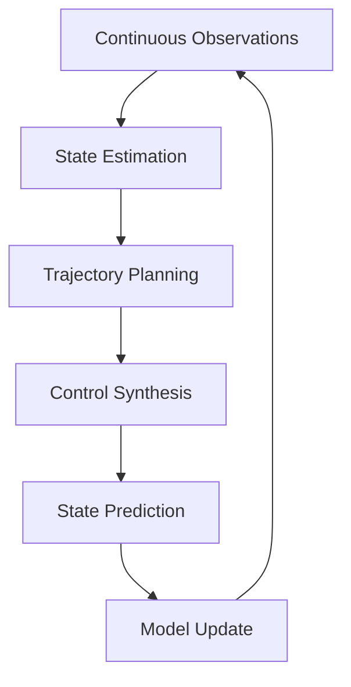

# Continuous-Time Active Inference Implementation Guide

This directory contains implementations of continuous-time Active Inference agents using stochastic differential equations and path integral formulations. Continuous-time approaches provide more biologically plausible and temporally precise models of cognitive processing compared to discrete-time formulations.

## 🌊 Mathematical Foundations

### Continuous-Time Free Energy

The continuous-time formulation of the Free Energy Principle uses path integrals over temporal trajectories:

```math
F = ∫_0^T F(x(t), μ(t), a(t)) dt
```

where:
- `x(t)`: True hidden states over time
- `μ(t)`: Internal model expectations
- `a(t)`: Actions as control signals

### Stochastic Differential Equations

The generative model is formulated as coupled stochastic differential equations:

```math
dx = f(x,v,θ)dt + σ_x dW_x
dy = g(x,v,θ)dt + σ_y dW_y
```

where:
- `f, g`: Deterministic dynamics functions
- `σ_x, σ_y`: Noise amplitudes
- `dW`: Wiener process increments

## 🏗️ Architecture Overview

### Core Components

#### Generative Model
- **State Dynamics**: Continuous-time evolution of hidden states
- **Observation Model**: Mapping from states to observations
- **Policy Representation**: Time-continuous action trajectories
- **Precision Control**: Time-varying uncertainty modulation

#### Inference Mechanisms
- **Path Integral Inference**: Trajectory-based probabilistic inference
- **Kalman Filtering**: Linear-Gaussian state estimation
- **Particle Methods**: Non-linear state estimation
- **Variational Methods**: Approximate continuous-time inference

#### Control Systems
- **Optimal Control**: Trajectory optimization under uncertainty
- **Stochastic Control**: Decision-making in continuous time
- **Adaptive Control**: Online parameter adaptation

### Processing Pipeline



## 📁 Directory Structure

### Core Documentation
- `[[continuous_time_agent]]` - Main implementation guide with mathematical formulations
- `README.md` - This overview and implementation guide

## 🚀 Implementation Examples

### Basic Continuous-Time Agent

```python
import numpy as np
from scipy.integrate import odeint
import matplotlib.pyplot as plt

class ContinuousTimeActiveInferenceAgent:
    """Basic implementation of continuous-time Active Inference agent."""

    def __init__(self, config):
        """Initialize continuous-time agent parameters."""
        # System dimensions
        self.n_states = config.get('n_states', 2)
        self.n_observations = config.get('n_observations', 2)
        self.n_actions = config.get('n_actions', 1)

        # Time parameters
        self.dt = config.get('dt', 0.01)  # Time step
        self.T = config.get('T', 1.0)     # Planning horizon

        # Generative model parameters
        self.A = np.random.randn(self.n_observations, self.n_states)  # Observation matrix
        self.B = np.random.randn(self.n_states, self.n_actions)       # Control matrix
        self.C = np.random.randn(self.n_states, self.n_states)         # State dynamics matrix
        self.D = np.random.randn(self.n_states, self.n_states)         # Process noise matrix

        # Precision parameters
        self.sigma_y = config.get('sigma_y', 0.1)  # Observation noise
        self.sigma_x = config.get('sigma_x', 0.1)  # Process noise

        # Current state estimate
        self.mu = np.zeros(self.n_states)  # Mean state estimate
        self.Sigma = np.eye(self.n_states) * 0.1  # State covariance

    def state_dynamics(self, x, t, u):
        """Continuous-time state dynamics."""
        # Deterministic dynamics: dx/dt = C*x + B*u
        dx_dt = self.C @ x + self.B @ u

        # Add stochastic component
        noise = np.random.multivariate_normal(np.zeros(self.n_states),
                                            self.sigma_x**2 * np.eye(self.n_states))
        dx_dt += noise

        return dx_dt

    def observation_model(self, x):
        """Map states to observations."""
        y = self.A @ x
        # Add observation noise
        y += np.random.multivariate_normal(np.zeros(self.n_observations),
                                         self.sigma_y**2 * np.eye(self.n_observations))
        return y

    def predict_trajectory(self, x0, policy, t_span):
        """Predict state trajectory under a policy."""
        def dynamics(x, t):
            # Get control signal at time t
            u = self.evaluate_policy(policy, t)
            return self.state_dynamics(x, t, u)

        # Integrate dynamics
        t_eval = np.linspace(0, self.T, int(self.T / self.dt))
        trajectory = odeint(dynamics, x0, t_eval)

        return trajectory, t_eval

    def evaluate_policy(self, policy, t):
        """Evaluate control policy at time t."""
        # Simple sinusoidal policy for demonstration
        if policy == 'sinusoidal':
            return np.array([np.sin(2 * np.pi * t)])
        elif policy == 'constant':
            return np.array([0.5])
        else:
            return np.zeros(self.n_actions)

    def compute_expected_free_energy(self, policy):
        """Compute expected free energy for a continuous-time policy."""
        # Simulate trajectory under policy
        trajectory, t_eval = self.predict_trajectory(self.mu, policy, [0, self.T])

        G = 0  # Expected free energy

        for i, (x, t) in enumerate(zip(trajectory, t_eval)):
            # Expected observations
            expected_obs = self.observation_model(x)

            # Pragmatic value (goal achievement)
            # Simplified: prefer states near origin
            pragmatic = -np.sum(x**2)

            # Epistemic value (information gain)
            # Simplified: prefer trajectories that reduce uncertainty
            epistemic = -np.trace(self.Sigma)

            G += pragmatic + epistemic

        G *= self.dt  # Scale by time step

        return G

    def select_policy(self):
        """Select optimal policy by minimizing expected free energy."""
        policies = ['constant', 'sinusoidal']  # Policy set

        # Evaluate expected free energy for each policy
        G_values = [self.compute_expected_free_energy(policy) for policy in policies]

        # Select policy with minimum expected free energy
        optimal_policy = policies[np.argmin(G_values)]

        return optimal_policy

    def update_beliefs(self, observation, action):
        """Update state beliefs using continuous-time Kalman filter."""
        # Prediction step
        # Simplified linear dynamics prediction
        F = np.eye(self.n_states) + self.C * self.dt  # State transition matrix
        Q = self.sigma_x**2 * self.dt * np.eye(self.n_states)  # Process noise

        mu_pred = F @ self.mu
        Sigma_pred = F @ self.Sigma @ F.T + Q

        # Update step
        H = self.A  # Observation matrix
        R = self.sigma_y**2 * np.eye(self.n_observations)  # Observation noise

        # Kalman gain
        S = H @ Sigma_pred @ H.T + R
        K = Sigma_pred @ H.T @ np.linalg.inv(S)

        # Update estimates
        innovation = observation - H @ mu_pred
        self.mu = mu_pred + K @ innovation
        self.Sigma = (np.eye(self.n_states) - K @ H) @ Sigma_pred

    def step(self, observation):
        """Main agent step: observe, plan, act."""
        # Update beliefs
        action = np.zeros(self.n_actions)  # Placeholder action
        self.update_beliefs(observation, action)

        # Select policy
        policy = self.select_policy()

        # Get immediate action
        action = self.evaluate_policy(policy, 0.0)

        return action, policy
```

## 🔧 Advanced Implementation Patterns

### Stochastic Differential Equation Agent

```python
class SDEActiveInferenceAgent(ContinuousTimeActiveInferenceAgent):
    """Agent using full stochastic differential equation formulation."""

    def __init__(self, config):
        super().__init__(config)

        # SDE parameters
        self.drift_functions = config.get('drift_functions', self._default_drift)
        self.diffusion_functions = config.get('diffusion_functions', self._default_diffusion)

    def _default_drift(self, x, u, t):
        """Default drift function for state dynamics."""
        return self.C @ x + self.B @ u

    def _default_diffusion(self, x, u, t):
        """Default diffusion function."""
        return self.sigma_x * np.eye(self.n_states)

    def simulate_sde_trajectory(self, x0, policy, n_steps, dt):
        """Simulate trajectory using Euler-Maruyama method."""
        trajectory = [x0]
        x = x0.copy()

        for step in range(n_steps):
            t = step * dt

            # Get control signal
            u = self.evaluate_policy(policy, t)

            # Euler-Maruyama integration
            drift = self.drift_functions(x, u, t)
            diffusion = self.diffusion_functions(x, u, t)

            # Generate Wiener increment
            dW = np.random.multivariate_normal(np.zeros(self.n_states),
                                             dt * np.eye(self.n_states))

            # Update state
            x = x + drift * dt + diffusion @ dW
            trajectory.append(x.copy())

        return np.array(trajectory)

    def path_integral_inference(self, observations, n_samples=100):
        """Perform path integral inference over trajectories."""
        # Generate trajectory samples
        trajectories = []
        log_probabilities = []

        for _ in range(n_samples):
            # Sample initial state
            x0 = np.random.multivariate_normal(self.mu, self.Sigma)

            # Sample policy
            policy = np.random.choice(['constant', 'sinusoidal'])

            # Simulate trajectory
            trajectory = self.simulate_sde_trajectory(x0, policy, 100, self.dt)

            # Compute trajectory probability
            log_prob = self.compute_trajectory_log_probability(trajectory, observations)
            trajectories.append(trajectory)
            log_probabilities.append(log_prob)

        # Select most probable trajectory
        best_idx = np.argmax(log_probabilities)
        best_trajectory = trajectories[best_idx]

        return best_trajectory

    def compute_trajectory_log_probability(self, trajectory, observations):
        """Compute log probability of trajectory given observations."""
        log_prob = 0

        for i, (x, obs) in enumerate(zip(trajectory, observations)):
            # Expected observation
            expected_obs = self.A @ x

            # Observation likelihood
            innovation = obs - expected_obs
            log_likelihood = -0.5 * (innovation.T @ np.linalg.inv(self.sigma_y**2 * np.eye(self.n_observations)) @ innovation)
            log_likelihood -= 0.5 * self.n_observations * np.log(2 * np.pi * self.sigma_y**2)

            log_prob += log_likelihood

        return log_prob
```

### Path Integral Control Agent

```python
class PathIntegralControlAgent(ContinuousTimeActiveInferenceAgent):
    """Agent using path integral control for trajectory optimization."""

    def __init__(self, config):
        super().__init__(config)

        # Path integral parameters
        self.n_trajectories = config.get('n_trajectories', 100)
        self.temperature = config.get('temperature', 1.0)
        self.path_integral_horizon = config.get('path_integral_horizon', 1.0)

    def path_integral_control(self, current_state):
        """Perform path integral control to select optimal action trajectory."""
        # Sample action trajectories
        trajectories = []
        costs = []

        for _ in range(self.n_trajectories):
            # Sample random action trajectory
            action_trajectory = self.sample_action_trajectory()

            # Simulate state trajectory
            state_trajectory = self.simulate_trajectory(current_state, action_trajectory)

            # Compute trajectory cost
            cost = self.compute_trajectory_cost(state_trajectory, action_trajectory)
            trajectories.append(action_trajectory)
            costs.append(cost)

        # Convert costs to probabilities using softmax
        costs = np.array(costs)
        probabilities = np.exp(-costs / self.temperature)
        probabilities = probabilities / probabilities.sum()

        # Compute optimal action trajectory as expectation
        optimal_trajectory = np.zeros_like(trajectories[0])
        for trajectory, prob in zip(trajectories, probabilities):
            optimal_trajectory += prob * trajectory

        return optimal_trajectory

    def sample_action_trajectory(self):
        """Sample a random action trajectory."""
        # Simple random walk in action space
        trajectory = []
        current_action = np.zeros(self.n_actions)

        n_steps = int(self.path_integral_horizon / self.dt)
        for _ in range(n_steps):
            # Add random increment
            increment = np.random.multivariate_normal(np.zeros(self.n_actions),
                                                    0.1 * np.eye(self.n_actions))
            current_action += increment
            trajectory.append(current_action.copy())

        return np.array(trajectory)

    def simulate_trajectory(self, x0, action_trajectory):
        """Simulate state trajectory under action sequence."""
        trajectory = [x0]
        x = x0.copy()

        for action in action_trajectory:
            # Update state using action
            dx = self.state_dynamics(x, 0, action)  # t=0 for simplicity
            x = x + dx * self.dt
            trajectory.append(x.copy())

        return np.array(trajectory)

    def compute_trajectory_cost(self, state_trajectory, action_trajectory):
        """Compute total cost of trajectory."""
        cost = 0

        for state, action in zip(state_trajectory, action_trajectory):
            # State cost (e.g., distance from goal)
            state_cost = np.sum(state**2)  # Simple quadratic cost

            # Action cost (e.g., energy expenditure)
            action_cost = np.sum(action**2)

            cost += state_cost + 0.1 * action_cost

        cost *= self.dt  # Scale by time

        return cost
```

## 📊 Performance Analysis

### Numerical Integration Methods

```python
def compare_integration_methods(self):
    """Compare different numerical integration methods."""
    methods = ['euler', 'rk4', 'euler-maruyama']
    results = {}

    for method in methods:
        if method == 'euler':
            trajectory = self.euler_integration()
        elif method == 'rk4':
            trajectory = self.rk4_integration()
        elif method == 'euler-maruyama':
            trajectory = self.euler_maruyama_integration()

        results[method] = trajectory

    return results

def euler_integration(self):
    """Basic Euler integration for ODEs."""
    # Implementation of Euler method
    pass

def rk4_integration(self):
    """4th-order Runge-Kutta integration."""
    # Implementation of RK4 method
    pass

def euler_maruyama_integration(self):
    """Euler-Maruyama integration for SDEs."""
    # Implementation for stochastic differential equations
    pass
```

### Accuracy and Stability Analysis

```python
def analyze_numerical_accuracy(self):
    """Analyze numerical accuracy of integration methods."""
    # Compare against analytical solutions
    # Compute convergence rates
    # Assess stability regions
    pass

def stability_analysis(self):
    """Analyze stability of the continuous-time system."""
    # Compute eigenvalues of system matrices
    # Determine stability regions
    # Assess robustness to perturbations
    pass
```

## 🧪 Testing and Validation

### Unit Tests for Continuous-Time Components

```python
def test_continuous_time_inference():
    """Test continuous-time state inference."""
    config = {
        'n_states': 2,
        'n_observations': 2,
        'n_actions': 1,
        'dt': 0.01,
        'T': 1.0
    }

    agent = ContinuousTimeActiveInferenceAgent(config)

    # Test trajectory prediction
    x0 = np.array([1.0, 0.0])
    policy = 'constant'
    trajectory, t_eval = agent.predict_trajectory(x0, policy, [0, 1.0])

    assert len(trajectory) > 1
    assert len(t_eval) == len(trajectory)

    print("Continuous-time inference test passed!")

def test_path_integral_control():
    """Test path integral control functionality."""
    config = {
        'n_states': 2,
        'n_observations': 2,
        'n_actions': 1,
        'n_trajectories': 50,
        'temperature': 1.0
    }

    agent = PathIntegralControlAgent(config)

    current_state = np.array([1.0, 1.0])
    optimal_trajectory = agent.path_integral_control(current_state)

    assert len(optimal_trajectory) > 0
    assert optimal_trajectory.shape[1] == config['n_actions']

    print("Path integral control test passed!")
```

## 📈 Benchmarking and Optimization

### Performance Metrics

```python
def benchmark_continuous_time_agent():
    """Benchmark continuous-time agent performance."""
    import time

    config = {
        'n_states': 4,
        'n_observations': 4,
        'n_actions': 2,
        'dt': 0.01,
        'T': 2.0
    }

    agent = ContinuousTimeActiveInferenceAgent(config)

    # Generate test scenario
    test_observations = [np.random.randn(config['n_observations']) for _ in range(10)]

    start_time = time.time()

    for observation in test_observations:
        action, policy = agent.step(observation)

    end_time = time.time()

    processing_time = end_time - start_time
    avg_time_per_step = processing_time / len(test_observations)

    print(f"Processed {len(test_observations)} time steps")
    print(".3f")
    print(".2f")

    return avg_time_per_step
```

## 🔬 Research Applications

### Neuroscience Modeling
- **Neural Oscillations**: Modeling brain rhythms and synchronization
- **Synaptic Plasticity**: Continuous-time learning rules
- **Neural Dynamics**: Complex neural network behavior

### Robotics and Control
- **Motor Control**: Continuous trajectory planning
- **Sensorimotor Integration**: Real-time sensory-motor coordination
- **Adaptive Robotics**: Online learning and adaptation

### Cognitive Science
- **Temporal Processing**: Modeling time perception and memory
- **Decision Making**: Continuous-time evidence accumulation
- **Attention Dynamics**: Temporal aspects of selective attention

## 📚 Mathematical Background

### Key Concepts
- **Stochastic Calculus**: Ito and Stratonovich integrals
- **Path Integrals**: Feynman path integral formulation
- **Optimal Control**: Pontryagin's minimum principle
- **Kalman Filtering**: Continuous-time state estimation

### Related Mathematics
- [[../../mathematics/path_integral_theory]] - Path integral methods
- [[../../mathematics/stochastic_processes]] - Stochastic process theory
- [[../../mathematics/optimal_control]] - Optimal control theory

## 🔗 Integration and Extensions

### Hybrid Approaches
- **Discrete-Continuous Hybrids**: Combining discrete planning with continuous control
- **Multi-Scale Models**: Integrating different temporal scales
- **Hierarchical Control**: Nested control architectures

### Advanced Topics
- **Quantum Active Inference**: Quantum probability formulations
- **Field Theory**: Continuous field representations
- **Non-Markovian Dynamics**: Memory-dependent processes

---

> **Temporal Precision**: Continuous-time formulations provide more biologically realistic models of cognitive temporal dynamics.

---

> **Computational Challenges**: Require sophisticated numerical methods but offer rich behavioral repertoires.

---

> **Research Frontier**: Active area of development with applications in neuroscience, robotics, and complex systems.
