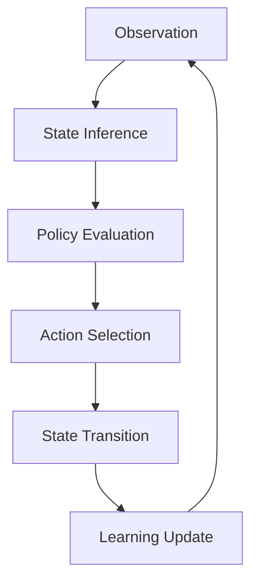

# Generic POMDP Active Inference Implementation

This directory contains a comprehensive implementation of Partially Observable Markov Decision Process (POMDP) agents using Active Inference principles. The GenericPOMDP framework provides a modular, extensible architecture for building cognitive agents that can learn and act in uncertain environments.

## 🏗️ Architecture Overview

### Core Components

#### Generative Model Matrices
The agent maintains a probabilistic generative model through five key matrices:

- **A Matrix**: `p(o|s)` - Observation likelihood model mapping hidden states to observations
- **B Matrix**: `p(s'|s,π)` - State transition model defining dynamics under policies
- **C Matrix**: `p(o*)` - Prior preferences over observations (goal states)
- **D Matrix**: `p(s)` - Prior beliefs over initial states
- **E Matrix**: `p(π)` - Prior preferences over policies

#### State Spaces
- **Observation Space (O)**: Sensory inputs and environmental feedback
- **Hidden State Space (S)**: Internal representations of world states
- **Policy Space (Π)**: Action sequences and behavioral strategies

### Processing Pipeline



## 📁 Directory Structure

### Core Files
- `[[agent_config]]` - Agent configuration and initialization
- `README.md` - This implementation guide

### Matrix Documentation
- `[[matrices/A_matrix]]` - Observation likelihood model
- `[[matrices/B_matrix]]` - State transition dynamics
- `[[matrices/C_matrix]]` - Prior preferences
- `[[matrices/D_matrix]]` - Initial state beliefs
- `[[matrices/E_matrix]]` - Policy preferences

### State Space Documentation
- `[[state_spaces/s_space]]` - Hidden state representations
- `[[state_spaces/o_space]]` - Observation modalities

### Implementation Guides
- `[[guides/a_space_enthusiast]]` - Advanced observation modeling
- `[[guides/b_matrix_basics]]` - Basic transition dynamics
- `[[guides/b_matrix_enthusiast]]` - Advanced state transitions
- `[[guides/o_space_enthusiast]]` - Observation space design
- `[[guides/s_space_enthusiast]]` - State space optimization
- `[[guides/a_space_enthusiast]]` - Action space configuration

## 🚀 Quick Start Implementation

### Basic POMDP Agent

```python
import numpy as np
from scipy.special import softmax

class GenericPOMDPAgent:
    """Basic implementation of Active Inference POMDP agent."""

    def __init__(self, config):
        """Initialize agent with generative model matrices."""
        self.n_states = config.get('n_states', 3)
        self.n_observations = config.get('n_observations', 3)
        self.n_actions = config.get('n_actions', 2)
        self.planning_horizon = config.get('planning_horizon', 2)

        # Initialize generative model matrices
        self.A = self._initialize_A_matrix()
        self.B = self._initialize_B_matrix()
        self.C = self._initialize_C_matrix()
        self.D = self._initialize_D_matrix()
        self.E = self._initialize_E_matrix()

        # Inference parameters
        self.gamma = config.get('gamma', 1.0)  # Precision parameter
        self.beliefs = self.D.copy()  # Current state beliefs

    def _initialize_A_matrix(self):
        """Initialize observation likelihood matrix A."""
        A = np.random.rand(self.n_observations, self.n_states)
        A = A / A.sum(axis=0)  # Normalize columns
        return A

    def _initialize_B_matrix(self):
        """Initialize transition matrix B for each action."""
        B = np.zeros((self.n_states, self.n_states, self.n_actions))

        for action in range(self.n_actions):
            # Create transition matrix for this action
            transition = np.random.rand(self.n_states, self.n_states)

            # Add structure: actions bias toward certain transitions
            if action == 0:  # Action 0: maintain current state tendency
                for i in range(self.n_states):
                    transition[i, i] += 1.0

            transition = transition / transition.sum(axis=0)
            B[:, :, action] = transition

        return B

    def _initialize_C_matrix(self):
        """Initialize preference matrix C."""
        C = np.ones(self.n_observations) / self.n_observations
        # Bias toward certain observations (goals)
        C[0] *= 2.0  # Prefer observation 0
        C = C / C.sum()
        return C

    def _initialize_D_matrix(self):
        """Initialize prior beliefs D."""
        D = np.ones(self.n_states) / self.n_states
        return D

    def _initialize_E_matrix(self):
        """Initialize policy priors E."""
        n_policies = self.n_actions ** self.planning_horizon
        E = np.ones(n_policies) / n_policies
        return E

    def infer_states(self, observation):
        """Perform variational state inference."""
        # Simplified fixed-point iteration
        likelihood = self.A[observation, :]  # Likelihood for this observation

        for _ in range(10):  # Fixed-point iterations
            posterior = self.beliefs * likelihood
            posterior = posterior / posterior.sum()
            self.beliefs = posterior

        return self.beliefs

    def evaluate_policy(self, policy):
        """Evaluate expected free energy for a policy."""
        G = 0  # Expected free energy
        current_beliefs = self.beliefs.copy()

        for t, action in enumerate(policy):
            # Expected state transitions
            next_beliefs = self.B[:, :, action].T @ current_beliefs

            # Expected observations
            expected_obs = self.A @ next_beliefs

            # Epistemic affordance (information gain)
            epistemic_value = 0
            if t < len(policy) - 1:  # Not last time step
                # KL divergence between current and expected next beliefs
                epistemic_value = np.sum(current_beliefs *
                    np.log(current_beliefs / (next_beliefs + 1e-8)))

            # Pragmatic value (goal achievement)
            pragmatic_value = np.sum(expected_obs *
                np.log(expected_obs / (self.C + 1e-8)))

            # Total expected free energy contribution
            G += epistemic_value + pragmatic_value

            current_beliefs = next_beliefs

        return G

    def select_policy(self):
        """Select optimal policy using expected free energy minimization."""
        # Generate all possible policies for planning horizon
        policies = []
        for i in range(self.n_actions ** self.planning_horizon):
            policy = []
            temp = i
            for _ in range(self.planning_horizon):
                policy.append(temp % self.n_actions)
                temp //= self.n_actions
            policies.append(policy)

        # Evaluate each policy
        G_values = [self.evaluate_policy(policy) for policy in policies]

        # Select policy with minimum expected free energy
        optimal_policy_idx = np.argmin(G_values)
        optimal_policy = policies[optimal_policy_idx]

        return optimal_policy

    def select_action(self, observation):
        """Main agent interface: observe and act."""
        # Update beliefs based on observation
        self.beliefs = self.infer_states(observation)

        # Select optimal policy
        optimal_policy = self.select_policy()

        # Return first action of optimal policy
        return optimal_policy[0]

    def learn_from_experience(self, observation, action, next_observation, reward=None):
        """Update generative model based on experience."""
        # This is a simplified learning implementation
        # In practice, would use more sophisticated learning rules

        learning_rate = 0.01

        # Update A matrix (observation model)
        predicted_obs = self.A @ self.beliefs
        obs_error = np.zeros(self.n_observations)
        obs_error[observation] = 1.0  # One-hot encoding
        obs_error = obs_error - predicted_obs

        self.A += learning_rate * np.outer(obs_error, self.beliefs)

        # Ensure non-negativity and renormalization
        self.A = np.maximum(self.A, 0)
        self.A = self.A / (self.A.sum(axis=0) + 1e-8)

        # Update B matrix (transition model)
        # This would require tracking state transitions
        # Simplified version assumes perfect state knowledge
        pass
```

## 🔧 Advanced Implementation Patterns

### Hierarchical POMDP Agent

```python
class HierarchicalPOMDPAgent(GenericPOMDPAgent):
    """Hierarchical extension with multiple temporal scales."""

    def __init__(self, config):
        super().__init__(config)

        # Hierarchical levels
        self.n_levels = config.get('n_levels', 2)
        self.level_horizons = [1, 4]  # Different planning horizons per level

        # Initialize hierarchical models
        self.hierarchical_models = []
        for level in range(self.n_levels):
            level_config = config.copy()
            level_config['planning_horizon'] = self.level_horizons[level]
            level_agent = GenericPOMDPAgent(level_config)
            self.hierarchical_models.append(level_agent)

    def hierarchical_inference(self, observation):
        """Perform hierarchical state inference."""
        level_beliefs = []

        current_obs = observation
        for level_agent in self.hierarchical_models:
            beliefs = level_agent.infer_states(current_obs)
            level_beliefs.append(beliefs)

            # Generate expected observation for next level
            if level_agent != self.hierarchical_models[-1]:
                current_obs = level_agent.A @ beliefs

        return level_beliefs

    def hierarchical_policy_selection(self):
        """Select policies across hierarchical levels."""
        # Start with high-level policy selection
        high_level_policy = self.hierarchical_models[-1].select_policy()

        # Refine with lower-level policies
        refined_policies = []
        for action in high_level_policy:
            # Use action to modulate lower-level policy selection
            lower_level_agent = self.hierarchical_models[0]
            lower_policy = lower_level_agent.select_policy()
            refined_policies.extend(lower_policy)

        return refined_policies
```

### Multi-Modal POMDP Agent

```python
class MultiModalPOMDPAgent(GenericPOMDPAgent):
    """Extension supporting multiple observation modalities."""

    def __init__(self, config):
        super().__init__(config)

        # Multiple observation modalities
        self.modalities = config.get('modalities', ['vision', 'proprioception'])
        self.modality_dimensions = config.get('modality_dimensions', [10, 5])

        # Modality-specific A matrices
        self.A_modalities = {}
        for modality, dim in zip(self.modalities, self.modality_dimensions):
            self.A_modalities[modality] = self._initialize_A_matrix_modality(dim)

    def _initialize_A_matrix_modality(self, n_obs_modality):
        """Initialize A matrix for specific modality."""
        A = np.random.rand(n_obs_modality, self.n_states)
        A = A / A.sum(axis=0)
        return A

    def infer_states_multimodal(self, observations):
        """Perform multimodal state inference."""
        # Combine likelihoods from all modalities
        combined_likelihood = np.ones(self.n_states)

        for modality, observation in observations.items():
            if modality in self.A_modalities:
                modality_likelihood = self.A_modalities[modality][observation, :]
                combined_likelihood *= modality_likelihood

        # Normalize combined likelihood
        combined_likelihood = combined_likelihood / combined_likelihood.sum()

        # Update beliefs
        posterior = self.beliefs * combined_likelihood
        self.beliefs = posterior / posterior.sum()

        return self.beliefs
```

## 📊 Performance Optimization

### Numerical Stability

```python
def stable_normalize(array, axis=None):
    """Numerically stable normalization."""
    array_sum = np.sum(array, axis=axis, keepdims=True)
    # Add small epsilon to avoid division by zero
    return array / (array_sum + 1e-16)
```

### Efficient Policy Evaluation

```python
def efficient_policy_evaluation(self, policies):
    """Vectorized policy evaluation for efficiency."""
    # Vectorized implementation using numpy operations
    n_policies = len(policies)

    # Initialize expected free energies
    G_values = np.zeros(n_policies)

    for t in range(self.planning_horizon):
        # Get actions for this time step across all policies
        actions_t = np.array([policy[t] for policy in policies])

        # Vectorized transition computation
        # This would require more sophisticated indexing
        # Simplified version for conceptual demonstration
        pass

    return G_values
```

## 🧪 Testing and Validation

### Unit Tests

```python
def test_basic_inference():
    """Test basic state inference functionality."""
    config = {
        'n_states': 3,
        'n_observations': 3,
        'n_actions': 2,
        'planning_horizon': 2
    }

    agent = GenericPOMDPAgent(config)

    # Test observation
    observation = 1
    beliefs = agent.infer_states(observation)

    assert len(beliefs) == config['n_states']
    assert np.isclose(beliefs.sum(), 1.0)  # Beliefs should be normalized

    print("Basic inference test passed!")

def test_policy_selection():
    """Test policy selection functionality."""
    config = {
        'n_states': 2,
        'n_observations': 2,
        'n_actions': 2,
        'planning_horizon': 1
    }

    agent = GenericPOMDPAgent(config)
    agent.beliefs = np.array([0.7, 0.3])  # Prior beliefs

    policy = agent.select_policy()

    assert len(policy) == config['planning_horizon']
    assert all(0 <= action < config['n_actions'] for action in policy)

    print("Policy selection test passed!")
```

### Benchmarking

```python
def benchmark_agent_performance():
    """Benchmark agent performance on standard tasks."""
    import time

    config = {'n_states': 10, 'n_observations': 10, 'n_actions': 3, 'planning_horizon': 3}
    agent = GenericPOMDPAgent(config)

    # Generate test observations
    test_observations = np.random.randint(0, config['n_observations'], 100)

    start_time = time.time()
    actions = []

    for obs in test_observations:
        action = agent.select_action(obs)
        actions.append(action)

    end_time = time.time()

    print(f"Processed {len(test_observations)} observations")
    print(".3f")
    print(f"Average inference time: {(end_time - start_time) / len(test_observations) * 1000:.2f} ms")

    return actions
```

## 📚 Advanced Topics

### Theoretical Foundations
- **Partially Observable Markov Decision Processes**: [[../../mathematics/pomdp_framework]]
- **Active Inference Theory**: [[../../mathematics/active_inference_theory]]
- **Free Energy Principle**: [[../../mathematics/free_energy_principle]]

### Implementation Considerations
- **Scalability**: Techniques for large state spaces
- **Approximate Inference**: Variational and sampling methods
- **Online Learning**: Continuous model adaptation

### Applications
- **Robotics**: Sensorimotor control and navigation
- **Game AI**: Strategic decision-making in complex environments
- **Autonomous Systems**: Self-driving vehicles and drones
- **Cognitive Modeling**: Understanding human decision-making

## 🔗 Integration with Other Components

### Environment Interfaces
The POMDP agent integrates with various environment types:
- **Discrete Environments**: Grid worlds and Markov chains
- **Continuous Environments**: Through discretization or function approximation
- **Multi-Agent Environments**: Through extended state representations

### Learning Systems
- **Model Learning**: Updating generative model matrices
- **Meta-Learning**: Learning learning strategies
- **Curriculum Learning**: Progressive task complexity

### Visualization Tools
- **Belief State Visualization**: Real-time belief monitoring
- **Policy Visualization**: Decision tree exploration
- **Learning Curves**: Performance tracking over time

## 🚀 Getting Started

1. **Review Configuration**: Start with `[[agent_config]]`
2. **Understand Matrices**: Study the five generative model matrices
3. **Run Basic Example**: Implement the basic POMDP agent above
4. **Explore Extensions**: Try hierarchical or multi-modal variants
5. **Optimize Performance**: Apply numerical stability and efficiency improvements

## 📖 References

### Core Papers
- Friston, K. et al. (2017). Active Inference: A Process Theory
- Parr, T., Pezzulo, G., & Friston, K. (2019). Active Inference: The Free Energy Principle in Mind, Brain, and Behavior

### Implementation Resources
- [[../../Things/Generic_POMDP/]] - Working implementation examples
- [[../../docs/guides/agent_development]] - Development guidelines

---

> **Modular Architecture**: GenericPOMDP provides a flexible framework for implementing Active Inference agents across diverse domains.

---

> **Extensible Design**: The matrix-based approach allows easy customization for specific applications while maintaining theoretical consistency.

---

> **Research Platform**: Serves as a foundation for exploring Active Inference principles in computational implementations.

