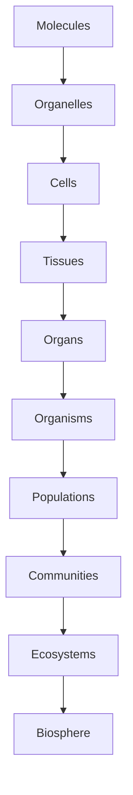

---

title: Levels of Organization in Biology

type: knowledge_base

status: stable

tags: [biology, hierarchy, systems]

semantic_relations:

  - type: relates

    links: [systems_biology, ecological_networks, systems_theory]

---

# Levels of Organization in Biology

Biological phenomena span hierarchical levels from molecules to the biosphere. Understanding cross-level constraints and feedbacks is central to explanation and intervention.

## Canonical hierarchy

- Molecules → Organelles → Cells → Tissues → Organs → Organisms → Populations → Communities → Ecosystems → Biosphere

## Cross-level mechanisms

- Downward constraints (developmental programs) and upward emergence (collective dynamics)

- Control and regulation via feedback across levels (homeostasis, allostasis)

- Information flow and encoding (gene regulation, signaling, neural codes)

## Modeling implications

- Multi-scale models linking cellular dynamics to organismal function

- Network-of-networks for ecological and molecular interactions [[ecological_networks]]

- Intervention design sensitive to level-specific dynamics [[systems_biology]]

See also: [[systems_theory]], [[complex_systems_biology]].

