# Active Inference

## Overview

Active Inference is a framework for understanding perception, learning, and decision-making based on the Free Energy Principle. It proposes that agents minimize expected free energy through both perception (inferring hidden states) and action (selecting policies that minimize expected surprise). Active inference unifies perception, learning, and decision-making under a single imperative: the minimization of variational free energy.

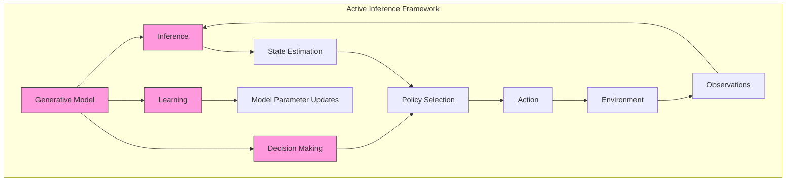

## Historical Development

### Origins and Evolution

Active inference emerged from the Free Energy Principle proposed by Karl Friston in the early 2000s, evolving through several key stages:

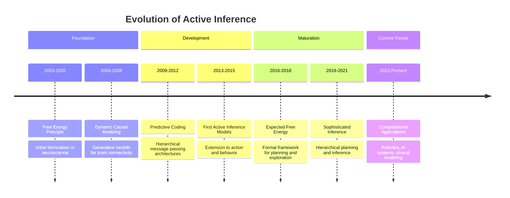

The development of active inference has spanned multiple disciplines:

1. **Neuroscience Phase (2003-2010)**: Initially focused on perceptual inference in the brain
2. **Computational Phase (2010-2017)**: Development of formal mathematical frameworks
3. **Applications Phase (2017-Present)**: Extensions to robotics, psychiatry, and artificial intelligence

### Key Contributors

- **Karl Friston**: Originator of the Free Energy Principle and active inference
- **Christopher Buckley**: Formalized connections to control theory
- **Thomas Parr**: Extended frameworks to hierarchical models
- **Maxwell Ramstead**: Cultural and social applications
- **Lancelot Da Costa**: Connections to stochastic optimal control

## Core Concepts

### Expected Free Energy
```math
G(π) = \sum_τ G(π,τ)
```
where:
- $G(π)$ is expected free energy for policy $π$
- $τ$ is future time point
- $G(π,τ)$ is expected free energy at time $τ$

The expected free energy for a specific time point decomposes into:

```math
G(π,τ) = \underbrace{\mathbb{E}_{q(o_τ,s_τ|π)}[\ln q(s_τ|π) - \ln p(s_τ|o_τ,π)]}_{\text{epistemic value}} + \underbrace{\mathbb{E}_{q(o_τ,s_τ|π)}[\ln q(o_τ|π) - \ln p(o_τ)]}_{\text{pragmatic value}}
```

This decomposition reveals two fundamental components:
1. **Epistemic Value**: Information gain about hidden states (exploration)
2. **Pragmatic Value**: Fulfillment of prior preferences (exploitation)

### Policy Selection
```math
P(π) = σ(-γG(π))
```
where:
- $P(π)$ is policy probability
- $σ$ is softmax function
- $γ$ is precision parameter (inverse temperature)

The parameter $γ$ controls exploration-exploitation:
- Higher $γ$ → more deterministic (exploitation)
- Lower $γ$ → more stochastic (exploration)

## Theoretical Foundations

### Information Geometry Perspective

Active inference can be formulated in terms of information geometry, where perception and action operate on different manifolds:

```math
\begin{aligned}
\text{Perceptual Inference}: \theta^{perc}_{t+1} &= \theta^{perc}_t - \kappa \mathcal{G}^{-1}\nabla_{\theta^{perc}}F \\
\text{Active Inference}: \theta^{act}_{t+1} &= \theta^{act}_t - \kappa \mathcal{G}^{-1}\nabla_{\theta^{act}}G
\end{aligned}
```

where:
- $\mathcal{G}$ is the Fisher information matrix
- $\kappa$ is a learning rate
- $\nabla_{\theta^{perc}}F$ is the gradient of variational free energy
- $\nabla_{\theta^{act}}G$ is the gradient of expected free energy

### Derivation of Expected Free Energy

Starting from the variational free energy:

```math
\begin{aligned}
F &= \mathbb{E}_{q(s)}[\ln q(s) - \ln p(o,s)] \\
&= \mathbb{E}_{q(s)}[\ln q(s) - \ln p(s|o) - \ln p(o)] \\
&= D_{KL}[q(s)||p(s|o)] - \ln p(o)
\end{aligned}
```

The expected free energy extends this to future time points:

```math
\begin{aligned}
G(π,τ) &= \mathbb{E}_{q(o_τ,s_τ|π)}[\ln q(s_τ|π) - \ln p(o_τ,s_τ|π)] \\
&= \mathbb{E}_{q(o_τ,s_τ|π)}[\ln q(s_τ|π) - \ln p(s_τ|o_τ,π) - \ln p(o_τ)] \\
&= \mathbb{E}_{q(o_τ|π)}[D_{KL}[q(s_τ|π)||p(s_τ|o_τ,π)]] - \mathbb{E}_{q(o_τ|π)}[\ln p(o_τ)]
\end{aligned}
```

With further algebraic manipulation and assumptions about conditional independence:

```math
\begin{aligned}
G(π,τ) &= \underbrace{\mathbb{E}_{q(o_τ,s_τ|π)}[\ln q(s_τ|π) - \ln q(s_τ|o_τ,π)]}_{\text{Expected information gain (epistemic value)}} + \underbrace{\mathbb{E}_{q(o_τ|π)}[-\ln p(o_τ)]}_{\text{Expected surprise (pragmatic value)}}
\end{aligned}
```

### Connection to Variational Inference

The relationship between perception (variational inference) and action (active inference) can be formalized as:

```math
\begin{aligned}
\text{Perception}: q^*(s) &= \argmin_q F[q,o] \\
\text{Action}: a^* &= \argmin_a \mathbb{E}_{q(s_t)}[F[q,a]]
\end{aligned}
```

This mathematical formulation shows that both perception and action serve the same objective: minimizing free energy.

## Mathematical Framework

### Discrete Time Active Inference

The discrete time formulation uses VFE for both perception and action:

```math
\begin{aligned}
& \text{Perception (State Inference):} \\
& F_t = \text{KL}[q(s_t)||p(s_t|o_{1:t})] - \ln p(o_t|o_{1:t-1}) \\
& \text{Action Selection:} \\
& a_t^* = \argmin_a \mathbb{E}_{q(s_t)}[F_{t+1}(a)] \\
& \text{Policy Selection:} \\
& P(\pi) = \sigma(-\gamma G(\pi)) \text{ where } G(\pi) = \sum_\tau G(\pi,\tau)
\end{aligned}
```

Where the expected free energy for each policy and time point is:

```math
\begin{aligned}
G(\pi,\tau) &= \mathbb{E}_{q(o_\tau,s_\tau|\pi)}[\ln q(s_\tau|\pi) - \ln p(s_\tau|o_\tau)] \\
&+ \mathbb{E}_{q(o_\tau,s_\tau|\pi)}[\ln q(o_\tau|\pi) - \ln p(o_\tau)]
\end{aligned}
```

### Continuous Time Active Inference

The continuous time extension incorporates path integral formulation:

```math
\begin{aligned}
& \text{State Dynamics:} \\
& dF = \frac{\partial F}{\partial s}ds + \frac{1}{2}\text{tr}\left(\frac{\partial^2 F}{\partial s^2}D\right)dt \\
& \text{Action Selection:} \\
& a^* = \argmin_a \int_t^{t+dt} \mathcal{L}(s(\tau), \dot{s}(\tau), a) d\tau \\
& \text{Policy Selection:} \\
& P(\pi) = \sigma(-\gamma \int_t^{t+T} \mathcal{L}_\pi d\tau)
\end{aligned}
```

Where the Lagrangian $\mathcal{L}$ contains both prediction error and information-theoretic terms.

### Unified Framework

The relationship between discrete and continuous time is bridged by:

```math
\begin{aligned}
& F_{\text{discrete}} = -\ln p(o_t|s_t) - \ln p(s_t|s_{t-1}, a_{t-1}) + \ln q(s_t) \\
& F_{\text{continuous}} = \int_t^{t+dt} [\mathcal{L}(s,\dot{s},a) + \text{KL}[q(s(\tau))||p(s(\tau)|o(\tau))]] d\tau
\end{aligned}
```

## Neural Implementation

### Predictive Coding Architecture

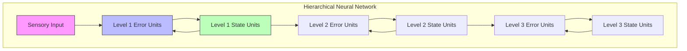

The neural implementation follows a hierarchical predictive coding architecture:

```math
\begin{aligned}
\text{Error Units: } & \varepsilon_l = \mu_l - g(\mu_{l+1}) \\
\text{State Updates: } & \dot{\mu}_l = -\frac{\partial F}{\partial \mu_l} = \kappa_l(\varepsilon_{l-1} - \varepsilon_l) \\
\text{Precision Updates: } & \dot{\pi}_l = -\frac{\partial F}{\partial \pi_l} = \frac{1}{2}(\varepsilon_l^2 - \pi_l^{-1})
\end{aligned}
```

### Message Passing Implementation

Neural populations implement message passing through:

1. **Forward Messages (Bottom-up)**
   ```math
   m_{l \rightarrow l+1} = \Pi_l \varepsilon_l
   ```

2. **Backward Messages (Top-down)**
   ```math
   m_{l+1 \rightarrow l} = \frac{\partial g}{\partial \mu_{l+1}} \Pi_{l+1} \varepsilon_{l+1}
   ```

3. **Lateral Interactions**
   ```math
   m_{l \leftrightarrow l} = \Pi_l \frac{\partial^2 F}{\partial \mu_l^2}
   ```

## Markov Blanket Formulation

### Active Inference and Markov Blankets

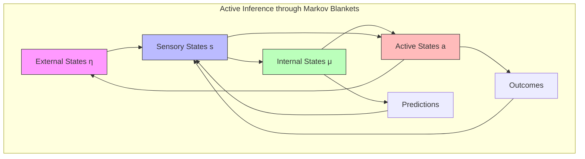

### Dynamical Formulation

```math
\begin{aligned}
& \text{State Dynamics:} \\
& \begin{bmatrix} \dot{η} \\ \dot{s} \\ \dot{a} \\ \dot{μ} \end{bmatrix} = 
\begin{bmatrix} 
f_η(η,s,a) \\
f_s(η,s) \\
f_a(s,a,μ) \\
f_μ(s,a,μ)
\end{bmatrix} + ω \\
& \text{where } ω \text{ is random fluctuation}
\end{aligned}
```

### Conditional Dependencies

```math
\begin{aligned}
& \text{Sensory States:} \quad p(s|η,μ) = p(s|η) \\
& \text{Active States:} \quad p(a|s,η,μ) = p(a|s,μ) \\
& \text{Flow:} \quad \dot{x} = (Q - \Gamma)\nabla_x F
\end{aligned}
```

## Technical Foundations

### Information Geometry of Active Inference

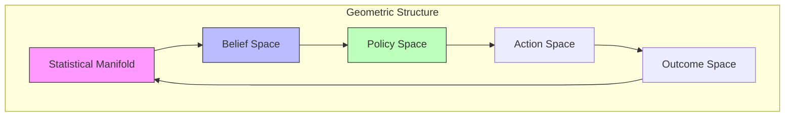

### Variational Derivation

```math
\begin{aligned}
& \text{Expected Free Energy:} \\
& G(π) = \mathbb{E}_{q(o,s|π)}[\ln q(s|π) - \ln p(o,s|π)] \\
& \text{Policy Selection:} \\
& q(π) = σ(-γG(π)) \\
& \text{State Estimation:} \\
& \dot{μ} = -\kappa \frac{\partial F}{\partial μ}
\end{aligned}
```

### Path Integral Policy

```math
\begin{aligned}
& \text{Optimal Policy:} \\
& π^* = \argmin_π \int_t^{t+T} \mathcal{L}(s,a,π)dt \\
& \text{where:} \\
& \mathcal{L}(s,a,π) = G(π) + \frac{1}{2}||a||^2_R
\end{aligned}
```

## Mathematical Connections

### Differential Geometry Framework

```math
\begin{aligned}
& \text{Metric Tensor:} \\
& g_{ij} = \mathbb{E}_q\left[\frac{\partial \ln q}{\partial θ^i}\frac{\partial \ln q}{\partial θ^j}\right] \\
& \text{Natural Gradient Flow:} \\
& \dot{θ} = -g^{ij}\frac{\partial G}{\partial θ^j} \\
& \text{Christoffel Symbols:} \\
& \Gamma^k_{ij} = \frac{1}{2}g^{kl}(\partial_ig_{jl} + \partial_jg_{il} - \partial_lg_{ij})
\end{aligned}
```

### Stochastic Optimal Control

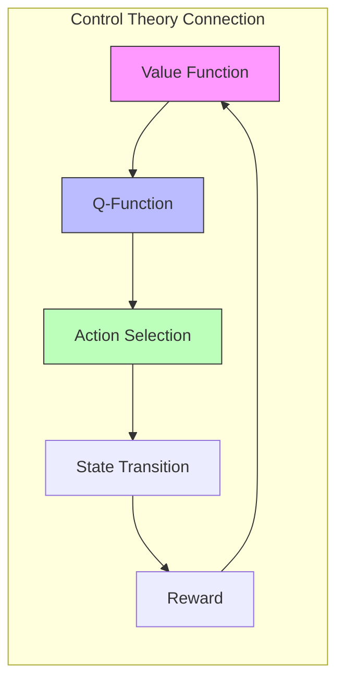

### Hamiltonian Mechanics

```math
\begin{aligned}
& \text{Hamiltonian:} \\
& H(s,p) = p^T f(s) + \frac{1}{2}p^T \Sigma p + V(s) \\
& \text{Hamilton's Equations:} \\
& \dot{s} = \frac{\partial H}{\partial p}, \quad \dot{p} = -\frac{\partial H}{\partial s} \\
& \text{Action:} \\
& S = \int_0^T (p^T \dot{s} - H(s,p))dt
\end{aligned}
```

## Computational Frameworks

### Deep Active Inference

```python
class DeepActiveInference:
    def __init__(self,
                 state_dim: int,
                 obs_dim: int,
                 action_dim: int):
        """Initialize deep active inference model."""
        self.encoder = ProbabilisticEncoder(obs_dim, state_dim)
        self.decoder = ProbabilisticDecoder(state_dim, obs_dim)
        self.transition = StateTransitionModel(state_dim, action_dim)
        self.policy = PolicyNetwork(state_dim, action_dim)
        
    def infer_state(self,
                   obs: torch.Tensor) -> Distribution:
        """Infer latent state from observation."""
        return self.encoder(obs)
        
    def predict_next_state(self,
                          state: torch.Tensor,
                          action: torch.Tensor) -> Distribution:
        """Predict next state given current state and action."""
        return self.transition(state, action)
        
    def compute_free_energy(self,
                          obs: torch.Tensor,
                          state: Distribution) -> torch.Tensor:
        """Compute variational free energy."""
        # Reconstruction term
        expected_llh = self.decoder.expected_log_likelihood(obs, state)
        
        # KL divergence term
        kl_div = kl_divergence(state, self.prior)
        
        return -expected_llh + kl_div
```

### Hierarchical Implementation

```python
class HierarchicalActiveInference:
    def __init__(self,
                 level_dims: List[int],
                 temporal_scales: List[float]):
        """Initialize hierarchical active inference model."""
        self.levels = nn.ModuleList([
            ActiveInferenceLevel(dim_in, dim_out, scale)
            for dim_in, dim_out, scale in zip(level_dims[:-1], level_dims[1:], temporal_scales)
        ])
        
    def update_beliefs(self,
                      obs: torch.Tensor) -> List[Distribution]:
        """Update beliefs across hierarchy."""
        # Bottom-up pass
        prediction_errors = []
        current_input = obs
        for level in self.levels:
            state_dist = level.infer_state(current_input)
            pred_error = level.compute_prediction_error(current_input)
            prediction_errors.append(pred_error)
            current_input = state_dist.mean
            
        # Top-down pass
        for level_idx in reversed(range(len(self.levels))):
            self.levels[level_idx].update_state(prediction_errors[level_idx])
            
        return [level.get_state_distribution() for level in self.levels]
```

## Advanced Applications

### 1. Computational Psychiatry

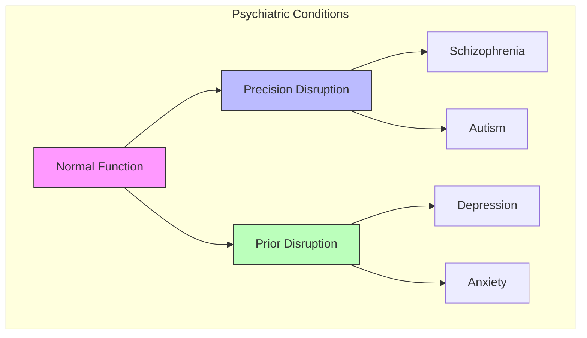

### 2. Robotics and Control

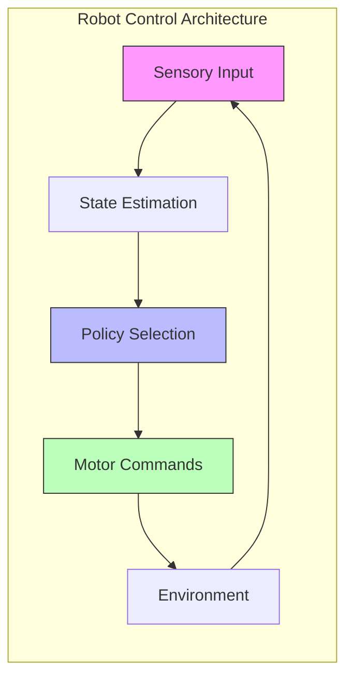

### 3. Social Cognition

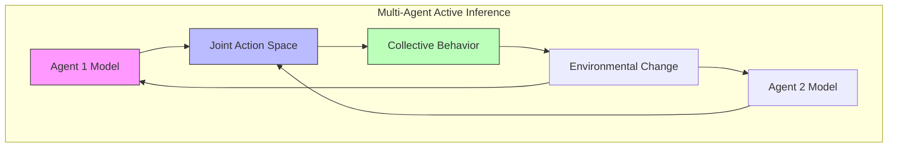

## Connection to Other Frameworks

### Reinforcement Learning

Active inference offers an alternative to reinforcement learning with several key differences:

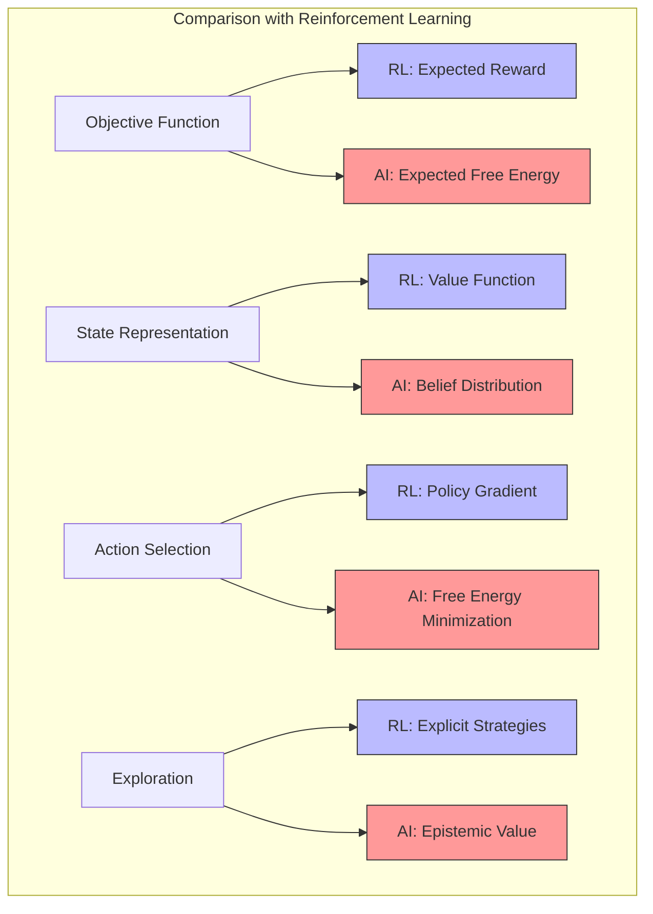

Key mappings between frameworks:
1. **Value Function** ↔ **Negative Expected Free Energy**
2. **Reward** ↔ **Log Prior Probability**
3. **Policy Gradient** ↔ **Free Energy Gradient**
4. **Exploration Bonus** ↔ **Epistemic Value**

### Optimal Control Theory

Active inference can be related to optimal control theory:

```math
\begin{aligned}
\text{LQG Control:} \quad J &= \mathbb{E}\left[\sum_t (x_t^T Q x_t + u_t^T R u_t)\right] \\
\text{Active Inference:} \quad G &= \mathbb{E}\left[\sum_t (-\log p(o_t) + \mathbb{I}[q(s_t|\pi)||q(s_t|o_t,\pi)])\right]
\end{aligned}
```

Where:
- $J$ is the cost functional in optimal control
- $G$ is the expected free energy in active inference
- $Q, R$ are cost matrices
- $\mathbb{I}$ is mutual information

### Planning as Inference

Active inference instantiates planning as probabilistic inference:

```math
\begin{aligned}
p(a|o) &\propto p(o|a)p(a) \\
P(\pi) &\propto \exp(-\gamma G(\pi))
\end{aligned}
```

Where planning is transformed into:
1. Inferring the posterior over policies
2. Selecting actions according to this posterior
3. Updating the model based on new observations

## Computational Complexity Analysis

### Time Complexity

The computational complexity of active inference scales with:

1. **State Dimension**: $O(d_s^3)$ for matrix operations in belief updates
2. **Policy Depth**: $O(T)$ for T-step policies
3. **Policy Breadth**: $O(|\Pi|)$ for number of considered policies

For standard implementations:
- State inference: $O(n_{\text{iter}} \cdot d_s^3)$
- Policy evaluation: $O(|\Pi| \cdot T \cdot d_s^3)$
- Total per step: $O(n_{\text{iter}} \cdot d_s^3 + |\Pi| \cdot T \cdot d_s^3)$

### Space Complexity

Space requirements scale with:
1. **Model Parameters**: $O(d_s^2 \cdot d_a + d_s \cdot d_o)$
2. **Belief States**: $O(d_s)$
3. **Policy Storage**: $O(|\Pi| \cdot T)$

### Approximation Methods

To address computational complexity:

1. **Amortized Inference**: Neural networks to approximate inference
2. **Sparse Precision Matrices**: Exploit structure in covariance
3. **Monte Carlo Methods**: Sample-based approximations of expected free energy
4. **Hierarchical Policies**: Decompose policies into manageable sub-policies

## Best Practices

### Model Design
1. Choose appropriate dimensions
2. Initialize transition models
3. Set precision parameters
4. Design reward function (prior preferences)
5. Structure hierarchical models for efficiency

### Implementation
1. Monitor convergence of inference
2. Handle numerical stability issues
3. Validate inference quality
4. Test policy selection
5. Implement efficient matrix operations

### Training
1. Tune learning rates
2. Adjust temperature (precision) parameters
3. Balance exploration-exploitation
4. Validate performance metrics
5. Implement adaptive precision

## Common Issues

### Technical Challenges
1. State inference instability
2. Policy divergence
3. Reward (preference) specification
4. Local optima
5. Computational scaling

### Solutions
1. Careful initialization and regularization
2. Gradient clipping for stability
3. Preference learning from demonstrations
4. Multiple restarts or annealing
5. Hierarchical decomposition

## Future Directions

### Theoretical Developments
1. **Information Geometry**: Formal connections to differential geometry
2. **Thermodynamic Interpretations**: Links to non-equilibrium statistical physics
3. **Quantum Active Inference**: Extension to quantum probability

### Practical Advances
1. **Large-Scale Models**: Scaling to high-dimensional state spaces
2. **Hardware Implementations**: Neuromorphic computing architectures
3. **Hybrid Systems**: Integration with deep learning and other frameworks

### Emerging Applications
1. **Artificial General Intelligence**: Integrated perception-action systems
2. **Human-AI Interaction**: Modeling and predicting human behavior
3. **Social Systems**: Extending to social cognition and cultural dynamics

## Quantum Active Inference

### Quantum Formulation

The quantum extension of active inference uses quantum probability theory:

```math
\begin{aligned}
\text{Quantum State:} \quad |\psi\rangle &= \sum_s \sqrt{q(s)}|s\rangle \\
\text{Density Matrix:} \quad \rho &= |\psi\rangle\langle\psi| \\
\text{Quantum Free Energy:} \quad F_Q &= \text{Tr}(\rho H) + \text{Tr}(\rho \ln \rho)
\end{aligned}
```

### Quantum Policy Selection

```math
\begin{aligned}
\text{Policy Operator:} \quad \hat{\pi} &= \sum_\pi |\pi\rangle\langle\pi| \\
\text{Expected Free Energy:} \quad G_Q(\pi) &= \text{Tr}(\rho_\pi H) + S(\rho_\pi) \\
\text{Policy Selection:} \quad P(\pi) &= \frac{\exp(-\beta G_Q(\pi))}{Z}
\end{aligned}
```

### Implementation Framework

```python
class QuantumActiveInference:
    def __init__(self,
                 hilbert_dim: int,
                 n_policies: int):
        """Initialize quantum active inference model."""
        self.hilbert_dim = hilbert_dim
        self.n_policies = n_policies
        
        # Initialize quantum operators
        self.hamiltonian = self._init_hamiltonian()
        self.policy_operators = self._init_policy_operators()
        
    def compute_quantum_free_energy(self,
                                  state: np.ndarray) -> float:
        """Compute quantum free energy."""
        # Convert state to density matrix
        rho = self._state_to_density_matrix(state)
        
        # Compute energy term
        energy = np.trace(rho @ self.hamiltonian)
        
        # Compute von Neumann entropy
        entropy = -np.trace(rho @ np.log(rho))
        
        return energy + entropy
```

## Advanced Mathematical Formulations

### Differential Geometry Framework

Active inference can be formulated using differential geometry:

```math
\begin{aligned}
\text{Tangent Space:} \quad T_pM &= \text{span}\{\partial_\theta^i\} \\
\text{Cotangent Space:} \quad T^*_pM &= \text{span}\{d\theta_i\} \\
\text{Metric:} \quad g_{ij} &= \mathbb{E}_{p(o|\theta)}\left[\frac{\partial \ln p}{\partial \theta^i}\frac{\partial \ln p}{\partial \theta^j}\right]
\end{aligned}
```

### Symplectic Structure

```math
\begin{aligned}
\text{Symplectic Form:} \quad \omega &= \sum_i dp_i \wedge dq_i \\
\text{Hamiltonian Flow:} \quad X_H &= \omega^{-1}(dH) \\
\text{Action:} \quad S[q] &= \int_0^T (p\dot{q} - H(p,q))dt
\end{aligned}
```

### Category Theory Perspective

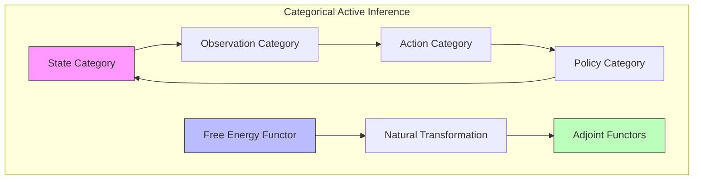

## Advanced Implementation Frameworks

### Deep Active Inference Networks

```python
class DeepActiveInferenceNetwork(nn.Module):
    def __init__(self,
                 state_dim: int,
                 obs_dim: int,
                 latent_dim: int):
        """Initialize deep active inference network."""
        super().__init__()
        
        # Encoder network (recognition model)
        self.encoder = nn.Sequential(
            nn.Linear(obs_dim, 256),
            nn.ReLU(),
            nn.Linear(256, 2 * latent_dim)  # Mean and log variance
        )
        
        # Decoder network (generative model)
        self.decoder = nn.Sequential(
            nn.Linear(latent_dim, 256),
            nn.ReLU(),
            nn.Linear(256, obs_dim)
        )
        
        # Policy network
        self.policy = nn.Sequential(
            nn.Linear(latent_dim, 256),
            nn.ReLU(),
            nn.Linear(256, state_dim)
        )
        
    def encode(self, x: torch.Tensor) -> Tuple[torch.Tensor, torch.Tensor]:
        """Encode observations to latent space."""
        h = self.encoder(x)
        mu, log_var = torch.chunk(h, 2, dim=-1)
        return mu, log_var
        
    def decode(self, z: torch.Tensor) -> torch.Tensor:
        """Decode latent states to observations."""
        return self.decoder(z)
        
    def reparameterize(self,
                      mu: torch.Tensor,
                      log_var: torch.Tensor) -> torch.Tensor:
        """Reparameterization trick."""
        std = torch.exp(0.5 * log_var)
        eps = torch.randn_like(std)
        return mu + eps * std
        
    def forward(self, x: torch.Tensor) -> Dict[str, torch.Tensor]:
        """Forward pass."""
        # Encode
        mu, log_var = self.encode(x)
        
        # Sample latent state
        z = self.reparameterize(mu, log_var)
        
        # Decode
        x_recon = self.decode(z)
        
        # Compute policy
        policy = self.policy(z)
        
        return {
            'mu': mu,
            'log_var': log_var,
            'z': z,
            'x_recon': x_recon,
            'policy': policy
        }
```

### Hierarchical Message Passing

```python
class HierarchicalMessagePassing:
    def __init__(self,
                 n_levels: int,
                 dims_per_level: List[int]):
        """Initialize hierarchical message passing."""
        self.n_levels = n_levels
        self.dims = dims_per_level
        
        # Initialize level-specific networks
        self.level_networks = nn.ModuleList([
            LevelNetwork(dim_in, dim_out)
            for dim_in, dim_out in zip(dims_per_level[:-1], dims_per_level[1:])
        ])
        
    def forward_pass(self,
                    observation: torch.Tensor) -> List[torch.Tensor]:
        """Forward pass through hierarchy."""
        messages = []
        current = observation
        
        # Bottom-up pass
        for network in self.level_networks:
            message = network.forward_message(current)
            messages.append(message)
            current = message
            
        return messages
        
    def backward_pass(self,
                     messages: List[torch.Tensor]) -> List[torch.Tensor]:
        """Backward pass through hierarchy."""
        predictions = []
        current = messages[-1]
        
        # Top-down pass
        for network in reversed(self.level_networks):
            prediction = network.backward_message(current)
            predictions.append(prediction)
            current = prediction
            
        return predictions[::-1]
```

## Advanced Applications

### 1. Neuromorphic Implementation

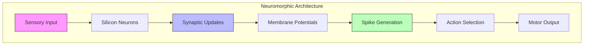

### 2. Quantum Robotics

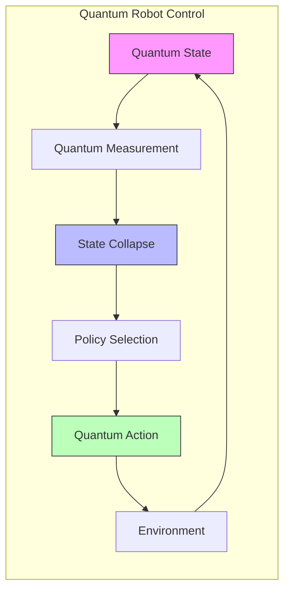

### 3. Social Active Inference

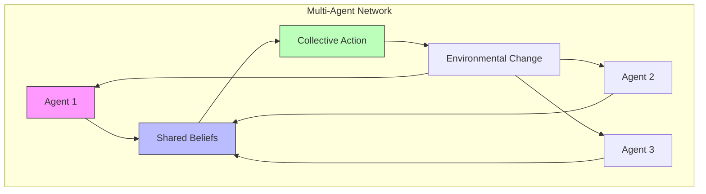

## Related Documentation
- [[free_energy_principle]]
- [[predictive_coding]]
- [[policy_selection]]
- [[variational_inference]]
- [[bayesian_brain_hypothesis]]
- [[reinforcement_learning]]
- [[optimal_control]]
- [[planning_as_inference]]
- [[precision_weighting]]