  - bayesian_inference

  - control_theory

semantic_relations:

  - type: foundation

    links:

      - [[../mathematics/active_inference_theory]]

      - [[free_energy_principle]]

      - [[variational_inference]]

      - [[bayesian_brain_hypothesis]]

  - type: implements

    links:

      - [[../mathematics/expected_free_energy]]

      - [[../mathematics/variational_free_energy]]

      - [[../mathematics/policy_selection]]

  - type: relates

    links:

      - [[predictive_coding]]

      - [[precision_weighting]]

      - [[../mathematics/policy_selection]]

      - [[reinforcement_learning]]

      - [[optimal_control]]

      - [[planning_as_inference]]

      - [[../mathematics/markov_blanket]]

      - [[../mathematics/active_inference_pomdp]]

      - [[continuous_time_active_inference]]

---

# Active Inference

## Overview

Active Inference is a framework for understanding perception, learning, and decision-making based on the  Free Energy Principle. It proposes that agents minimize expected free energy through both perception (inferring hidden states) and action (selecting policies that minimize expected surprise). Active inference unifies perception, learning, and decision-making under a single imperative: the minimization of variational free energy.

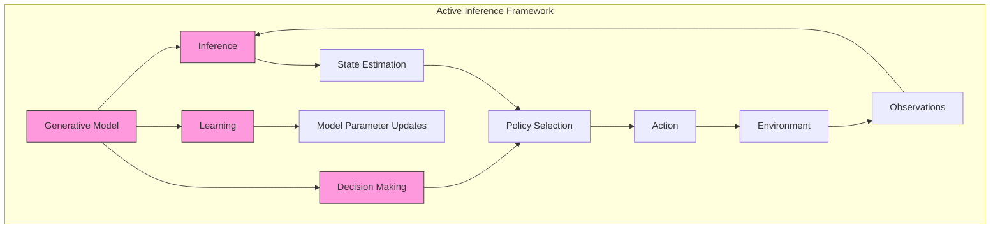

## Historical Development

### Origins and Evolution

Active inference emerged from the Free Energy Principle proposed by Karl Friston in the early 2000s, evolving through several key stages:

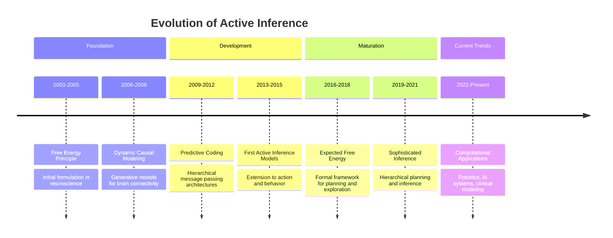

The development of active inference has spanned multiple disciplines:

1. **Neuroscience Phase (2003-2010)**: Initially focused on perceptual inference in the brain

1. **Computational Phase (2010-2017)**: Development of formal mathematical frameworks

1. **Applications Phase (2017-Present)**: Extensions to robotics, psychiatry, and artificial intelligence

### Key Contributors

- **Karl Friston**: Originator of the Free Energy Principle and active inference

- **Christopher Buckley**: Formalized connections to control theory

- **Thomas Parr**: Extended frameworks to hierarchical models

- **Maxwell Ramstead**: Cultural and social applications

- **Lancelot Da Costa**: Connections to stochastic optimal control

## Core Concepts

### Expected Free Energy

```math

G(π) = \sum_τ G(π,τ)

```

where:

- $G(π)$ is expected free energy for policy $π$

- $τ$ is future time point

- $G(π,τ)$ is expected free energy at time $τ$

The expected free energy for a specific time point decomposes into:

```math

G(π,τ) = \underbrace{\mathbb{E}_{q(o_τ,s_τ|π)}[\ln q(s_τ|π) - \ln p(s_τ|o_τ,π)]}_{\text{epistemic value}} + \underbrace{\mathbb{E}_{q(o_τ,s_τ|π)}[\ln q(o_τ|π) - \ln p(o_τ)]}_{\text{pragmatic value}}

```

This decomposition reveals two fundamental components:

1. **Epistemic Value**: Information gain about hidden states (exploration)

1. **Pragmatic Value**: Fulfillment of prior preferences (exploitation)

See also: [[../mathematics/expected_free_energy]], [[../mathematics/epistemic_value]], [[../mathematics/pragmatic_value]].

### Policy Selection

```math

P(π) = σ(-γG(π))

```

where:

- $P(π)$ is policy probability

- $σ$ is softmax function

- $γ$ is precision parameter (inverse temperature)

The parameter $γ$ controls exploration-exploitation:

- Higher $γ$ → more deterministic (exploitation)

- Lower $γ$ → more stochastic (exploration)

See also: [[../mathematics/policy_selection]], [[../mathematics/exploration_exploitation]].

For inverse temperature details, see [[../mathematics/precision_parameter]].

### POMDP Formulation

Active inference is commonly instantiated over POMDPs via a generative model with observation, transition, preference, prior, and policy structures. For a complete reference of matrices \(A, B, C, D, E\), properties, and validation, see [[../mathematics/active_inference_pomdp]].

## Theoretical Foundations

### Information Geometry Perspective

Active inference can be formulated in terms of information geometry, where perception and action operate on different manifolds:

```math

\begin{aligned}

\text{Perceptual Inference}: \theta^{perc}_{t+1} &= \theta^{perc}_t - \kappa \mathcal{G}^{-1}\nabla_{\theta^{perc}}F \\

\text{Active Inference}: \theta^{act}_{t+1} &= \theta^{act}_t - \kappa \mathcal{G}^{-1}\nabla_{\theta^{act}}G

\end{aligned}

```

where:

- $\mathcal{G}$ is the Fisher information matrix

- $\kappa$ is a learning rate

- $\nabla_{\theta^{perc}}F$ is the gradient of variational free energy

- $\nabla_{\theta^{act}}G$ is the gradient of expected free energy

### Derivation of Expected Free Energy

Starting from the variational free energy:

```math

\begin{aligned}

F &= \mathbb{E}_{q(s)}[\ln q(s) - \ln p(o,s)] \\

&= \mathbb{E}_{q(s)}[\ln q(s) - \ln p(s|o) - \ln p(o)] \\

&= D_{KL}[q(s)||p(s|o)] - \ln p(o)

\end{aligned}

```

The expected free energy extends this to future time points:

```math

\begin{aligned}

G(π,τ) &= \mathbb{E}_{q(o_τ,s_τ|π)}[\ln q(s_τ|π) - \ln p(o_τ,s_τ|π)] \\

&= \mathbb{E}_{q(o_τ,s_τ|π)}[\ln q(s_τ|π) - \ln p(s_τ|o_τ,π) - \ln p(o_τ)] \\

&= \mathbb{E}_{q(o_τ|π)}[D_{KL}[q(s_τ|π)||p(s_τ|o_τ,π)]] - \mathbb{E}_{q(o_τ|π)}[\ln p(o_τ)]

\end{aligned}

```

With further algebraic manipulation and assumptions about conditional independence:

```math

\begin{aligned}

G(π,τ) &= \underbrace{\mathbb{E}_{q(o_τ,s_τ|π)}[\ln q(s_τ|π) - \ln q(s_τ|o_τ,π)]}_{\text{Expected information gain (epistemic value)}} + \underbrace{\mathbb{E}_{q(o_τ|π)}[-\ln p(o_τ)]}_{\text{Expected surprise (pragmatic value)}}

\end{aligned}

```

### Connection to Variational Inference

The relationship between perception (variational inference) and action (active inference) can be formalized as:

```math

\begin{aligned}

\text{Perception}: q^*(s) &= \argmin_q F[q,o] \\

\text{Action}: a^* &= \argmin_a \mathbb{E}_{q(s_t)}[F[q,a]]

\end{aligned}

```

This mathematical formulation shows that both perception and action serve the same objective: minimizing free energy.

## Mathematical Framework

### Discrete Time Active Inference

The discrete time formulation uses VFE for both perception and action:

```math

\begin{aligned}

& \text{Perception (State Inference):} \\

& F_t = \text{KL}[q(s_t)||p(s_t|o_{1:t})] - \ln p(o_t|o_{1:t-1}) \\

& \text{Action Selection:} \\

& a_t^* = \argmin_a \mathbb{E}_{q(s_t)}[F_{t+1}(a)] \\

& \text{Policy Selection:} \\

& P(\pi) = \sigma(-\gamma G(\pi)) \text{ where } G(\pi) = \sum_\tau G(\pi,\tau)

\end{aligned}

```

Where the expected free energy for each policy and time point is:

```math

\begin{aligned}

G(\pi,\tau) &= \mathbb{E}_{q(o_\tau,s_\tau|\pi)}[\ln q(s_\tau|\pi) - \ln p(s_\tau|o_\tau)] \\

&+ \mathbb{E}_{q(o_\tau,s_\tau|\pi)}[\ln q(o_\tau|\pi) - \ln p(o_\tau)]

\end{aligned}

```

### Continuous Time Active Inference

The continuous time extension incorporates path integral formulation:

```math

\begin{aligned}

& \text{State Dynamics:} \\

& dF = \frac{\partial F}{\partial s}ds + \frac{1}{2}\text{tr}\left(\frac{\partial^2 F}{\partial s^2}D\right)dt \\

& \text{Action Selection:} \\

& a^* = \argmin_a \int_t^{t+dt} \mathcal{L}(s(\tau), \dot{s}(\tau), a) d\tau \\

& \text{Policy Selection:} \\

& P(\pi) = \sigma(-\gamma \int_t^{t+T} \mathcal{L}_\pi d\tau)

\end{aligned}

```

Where the Lagrangian $\mathcal{L}$ contains both prediction error and information-theoretic terms.

See also: [[continuous_time_active_inference]].

### Unified Framework

The relationship between discrete and continuous time is bridged by:

```math

\begin{aligned}

& F_{\text{discrete}} = -\ln p(o_t|s_t) - \ln p(s_t|s_{t-1}, a_{t-1}) + \ln q(s_t) \\

& F_{\text{continuous}} = \int_t^{t+dt} [\mathcal{L}(s,\dot{s},a) + \text{KL}[q(s(\tau))||p(s(\tau)|o(\tau))]] d\tau

\end{aligned}

```

## Neural Implementation

### Predictive Coding Architecture

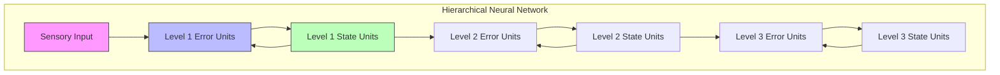

The neural implementation follows a hierarchical predictive coding architecture:

```math

\begin{aligned}

\text{Error Units: } & \varepsilon_l = \mu_l - g(\mu_{l+1}) \\

\text{State Updates: } & \dot{\mu}_l = -\frac{\partial F}{\partial \mu_l} = \kappa_l(\varepsilon_{l-1} - \varepsilon_l) \\

\text{Precision Updates: } & \dot{\pi}_l = -\frac{\partial F}{\partial \pi_l} = \frac{1}{2}(\varepsilon_l^2 - \pi_l^{-1})

\end{aligned}

```

### Message Passing Implementation

Neural populations implement message passing through:

1. **Forward Messages (Bottom-up)**

   ```math

   m_{l \rightarrow l+1} = \Pi_l \varepsilon_l

   ```

1. **Backward Messages (Top-down)**

   ```math

   m_{l+1 \rightarrow l} = \frac{\partial g}{\partial \mu_{l+1}} \Pi_{l+1} \varepsilon_{l+1}

   ```

1. **Lateral Interactions**

   ```math

   m_{l \leftrightarrow l} = \Pi_l \frac{\partial^2 F}{\partial \mu_l^2}

   ```

## Markov Blanket Formulation

### Active Inference and Markov Blankets

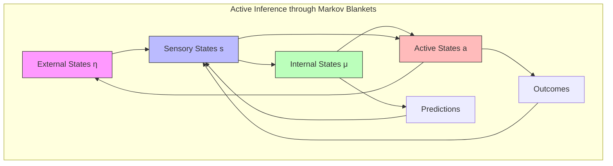

### Dynamical Formulation

```math

\begin{aligned}

& \text{State Dynamics:} \\

& \begin{bmatrix} \dot{η} \\ \dot{s} \\ \dot{a} \\ \dot{μ} \end{bmatrix} = 

\begin{bmatrix} 

f_η(η,s,a) \\

f_s(η,s) \\

f_a(s,a,μ) \\

f_μ(s,a,μ)

\end{bmatrix} + ω \\

& \text{where } ω \text{ is random fluctuation}

\end{aligned}

```

### Conditional Dependencies

```math

\begin{aligned}

& \text{Sensory States:} \quad p(s|η,μ) = p(s|η) \\

& \text{Active States:} \quad p(a|s,η,μ) = p(a|s,μ) \\

& \text{Flow:} \quad \dot{x} = (Q - \Gamma)\nabla_x F

\end{aligned}

```

See also: [[../mathematics/markov_blanket]].

## Technical Foundations

### Information Geometry of Active Inference

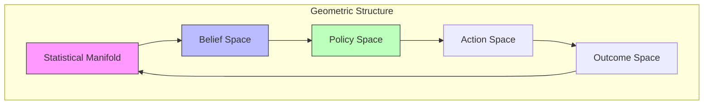

### Variational Derivation

```math

\begin{aligned}

& \text{Expected Free Energy:} \\

& G(π) = \mathbb{E}_{q(o,s|π)}[\ln q(s|π) - \ln p(o,s|π)] \\

& \text{Policy Selection:} \\

& q(π) = σ(-γG(π)) \\

& \text{State Estimation:} \\

& \dot{μ} = -\kappa \frac{\partial F}{\partial μ}

\end{aligned}

```

### Path Integral Policy

```math

\begin{aligned}

& \text{Optimal Policy:} \\

& π^* = \argmin_π \int_t^{t+T} \mathcal{L}(s,a,π)dt \\

& \text{where:} \\

& \mathcal{L}(s,a,π) = G(π) + \frac{1}{2}||a||^2_R

\end{aligned}

```

## Mathematical Connections

### Differential Geometry Framework

```math

\begin{aligned}

& \text{Metric Tensor:} \\

& g_{ij} = \mathbb{E}_q\left[\frac{\partial \ln q}{\partial θ^i}\frac{\partial \ln q}{\partial θ^j}\right] \\

& \text{Natural Gradient Flow:} \\

& \dot{θ} = -g^{ij}\frac{\partial G}{\partial θ^j} \\

& \text{Christoffel Symbols:} \\

& \Gamma^k_{ij} = \frac{1}{2}g^{kl}(\partial_ig_{jl} + \partial_jg_{il} - \partial_lg_{ij})

\end{aligned}

```

### Stochastic Optimal Control

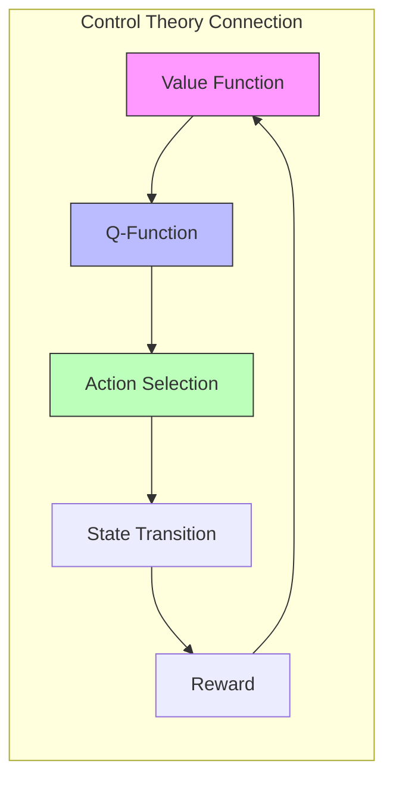

### Hamiltonian Mechanics

```math

\begin{aligned}

& \text{Hamiltonian:} \\

& H(s,p) = p^T f(s) + \frac{1}{2}p^T \Sigma p + V(s) \\

& \text{Hamilton's Equations:} \\

& \dot{s} = \frac{\partial H}{\partial p}, \quad \dot{p} = -\frac{\partial H}{\partial s} \\

& \text{Action:} \\

& S = \int_0^T (p^T \dot{s} - H(s,p))dt

\end{aligned}

```

## Computational Frameworks

### Deep Active Inference

```python

class DeepActiveInference:

    def __init__(self,

                 state_dim: int,

                 obs_dim: int,

                 action_dim: int):

        """Initialize deep active inference model."""

        self.encoder = ProbabilisticEncoder(obs_dim, state_dim)

        self.decoder = ProbabilisticDecoder(state_dim, obs_dim)

        self.transition = StateTransitionModel(state_dim, action_dim)

        self.policy = PolicyNetwork(state_dim, action_dim)

    def infer_state(self,

                   obs: torch.Tensor) -> Distribution:

        """Infer latent state from observation."""

        return self.encoder(obs)

    def predict_next_state(self,

                          state: torch.Tensor,

                          action: torch.Tensor) -> Distribution:

        """Predict next state given current state and action."""

        return self.transition(state, action)

    def compute_free_energy(self,

                          obs: torch.Tensor,

                          state: Distribution) -> torch.Tensor:

        """Compute variational free energy."""

        # Reconstruction term

        expected_llh = self.decoder.expected_log_likelihood(obs, state)

        # KL divergence term

        kl_div = kl_divergence(state, self.prior)

        return -expected_llh + kl_div

```

### Hierarchical Implementation

```python

class HierarchicalActiveInference:

    def __init__(self,

                 level_dims: List[int],

                 temporal_scales: List[float]):

        """Initialize hierarchical active inference model."""

        self.levels = nn.ModuleList([

            ActiveInferenceLevel(dim_in, dim_out, scale)

            for dim_in, dim_out, scale in zip(level_dims[:-1], level_dims[1:], temporal_scales)

        ])

    def update_beliefs(self,

                      obs: torch.Tensor) -> List[Distribution]:

        """Update beliefs across hierarchy."""

        # Bottom-up pass

        prediction_errors = []

        current_input = obs

        for level in self.levels:

            state_dist = level.infer_state(current_input)

            pred_error = level.compute_prediction_error(current_input)

            prediction_errors.append(pred_error)

            current_input = state_dist.mean

        # Top-down pass

        for level_idx in reversed(range(len(self.levels))):

            self.levels[level_idx].update_state(prediction_errors[level_idx])

        return [level.get_state_distribution() for level in self.levels]

```

## Advanced Applications

### 1. Computational Psychiatry

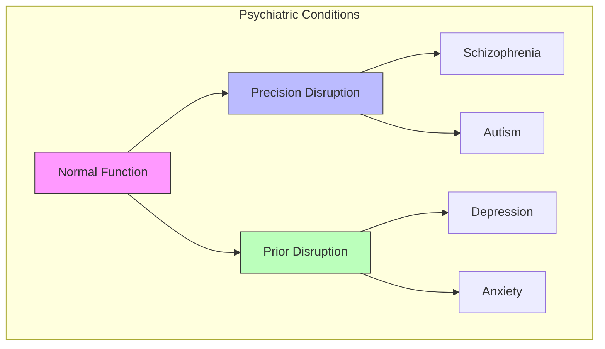

### 2. Robotics and Control

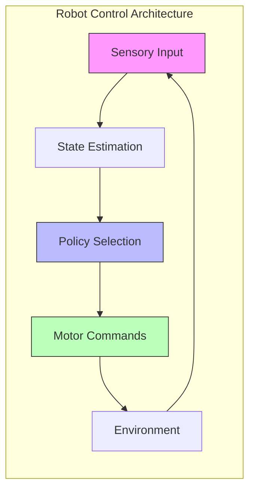

### 3. Social Cognition

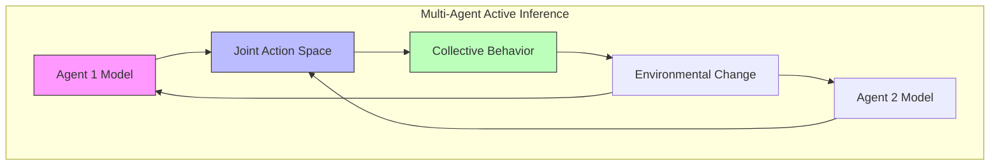

## Connection to Other Frameworks

### Reinforcement Learning

Active inference offers an alternative to reinforcement learning with several key differences:

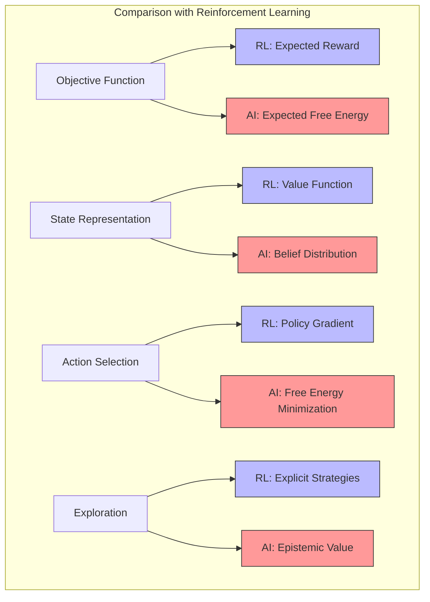

Key mappings between frameworks:

1. **Value Function** ↔ **Negative Expected Free Energy**

1. **Reward** ↔ **Log Prior Probability**

1. **Policy Gradient** ↔ **Free Energy Gradient**

1. **Exploration Bonus** ↔ **Epistemic Value**

### Optimal Control Theory

Active inference can be related to optimal control theory:

```math

\begin{aligned}

\text{LQG Control:} \quad J &= \mathbb{E}\left[\sum_t (x_t^T Q x_t + u_t^T R u_t)\right] \\

\text{Active Inference:} \quad G &= \mathbb{E}\left[\sum_t (-\log p(o_t) + \mathbb{I}[q(s_t|\pi)||q(s_t|o_t,\pi)])\right]

\end{aligned}

```

Where:

- $J$ is the cost functional in optimal control

- $G$ is the expected free energy in active inference

- $Q, R$ are cost matrices

- $\mathbb{I}$ is mutual information

### Planning as Inference

Active inference instantiates planning as probabilistic inference:

```math

\begin{aligned}

p(a|o) &\propto p(o|a)p(a) \\

P(\pi) &\propto \exp(-\gamma G(\pi))

\end{aligned}

```

Where planning is transformed into:

1. Inferring the posterior over policies

1. Selecting actions according to this posterior

1. Updating the model based on new observations

## Computational Complexity Analysis

### Time Complexity

The computational complexity of active inference scales with:

1. **State Dimension**: $O(d_s^3)$ for matrix operations in belief updates

1. **Policy Depth**: $O(T)$ for T-step policies

1. **Policy Breadth**: $O(|\Pi|)$ for number of considered policies

For standard implementations:

- State inference: $O(n_{\text{iter}} \cdot d_s^3)$

- Policy evaluation: $O(|\Pi| \cdot T \cdot d_s^3)$

- Total per step: $O(n_{\text{iter}} \cdot d_s^3 + |\Pi| \cdot T \cdot d_s^3)$

### Space Complexity

Space requirements scale with:

1. **Model Parameters**: $O(d_s^2 \cdot d_a + d_s \cdot d_o)$

1. **Belief States**: $O(d_s)$

1. **Policy Storage**: $O(|\Pi| \cdot T)$

### Approximation Methods

To address computational complexity:

1. **Amortized Inference**: Neural networks to approximate inference

1. **Sparse Precision Matrices**: Exploit structure in covariance

1. **Monte Carlo Methods**: Sample-based approximations of expected free energy

1. **Hierarchical Policies**: Decompose policies into manageable sub-policies

## Best Practices

### Model Design

1. Choose appropriate dimensions

1. Initialize transition models

1. Set precision parameters

1. Design reward function (prior preferences)

1. Structure hierarchical models for efficiency

### Implementation

1. Monitor convergence of inference

1. Handle numerical stability issues

1. Validate inference quality

1. Test policy selection

1. Implement efficient matrix operations

### Training

1. Tune learning rates

1. Adjust temperature (precision) parameters

1. Balance exploration-exploitation

1. Validate performance metrics

1. Implement adaptive precision

## Common Issues

### Technical Challenges

1. State inference instability

1. Policy divergence

1. Reward (preference) specification

1. Local optima

1. Computational scaling

### Solutions

1. Careful initialization and regularization

1. Gradient clipping for stability

1. Preference learning from demonstrations

1. Multiple restarts or annealing

1. Hierarchical decomposition

## Future Directions

### Theoretical Developments

1. **Information Geometry**: Formal connections to differential geometry

1. **Thermodynamic Interpretations**: Links to non-equilibrium statistical physics

1. **Quantum Active Inference**: Extension to quantum probability

### Practical Advances

1. **Large-Scale Models**: Scaling to high-dimensional state spaces

1. **Hardware Implementations**: Neuromorphic computing architectures

1. **Hybrid Systems**: Integration with deep learning and other frameworks

### Emerging Applications

1. **Artificial General Intelligence**: Integrated perception-action systems

1. **Human-AI Interaction**: Modeling and predicting human behavior

1. **Social Systems**: Extending to social cognition and cultural dynamics

## Quantum Active Inference

### Quantum Formulation

The quantum extension of active inference uses quantum probability theory:

```math

\begin{aligned}

\text{Quantum State:} \quad |\psi\rangle &= \sum_s \sqrt{q(s)}|s\rangle \\

\text{Density Matrix:} \quad \rho &= |\psi\rangle\langle\psi| \\

\text{Quantum Free Energy:} \quad F_Q &= \text{Tr}(\rho H) + \text{Tr}(\rho \ln \rho)

\end{aligned}

```

### Quantum Policy Selection

```math

\begin{aligned}

\text{Policy Operator:} \quad \hat{\pi} &= \sum_\pi |\pi\rangle\langle\pi| \\

\text{Expected Free Energy:} \quad G_Q(\pi) &= \text{Tr}(\rho_\pi H) + S(\rho_\pi) \\

\text{Policy Selection:} \quad P(\pi) &= \frac{\exp(-\beta G_Q(\pi))}{Z}

\end{aligned}

```

### Implementation Framework

```python

class QuantumActiveInference:

    def __init__(self,

                 hilbert_dim: int,

                 n_policies: int):

        """Initialize quantum active inference model."""

        self.hilbert_dim = hilbert_dim

        self.n_policies = n_policies

        # Initialize quantum operators

        self.hamiltonian = self._init_hamiltonian()

        self.policy_operators = self._init_policy_operators()

    def compute_quantum_free_energy(self,

                                  state: np.ndarray) -> float:

        """Compute quantum free energy."""

        # Convert state to density matrix

        rho = self._state_to_density_matrix(state)

        # Compute energy term

        energy = np.trace(rho @ self.hamiltonian)

        # Compute von Neumann entropy

        entropy = -np.trace(rho @ np.log(rho))

        return energy + entropy

```

## Advanced Mathematical Formulations

### Differential Geometry Framework

Active inference can be formulated using differential geometry:

```math

\begin{aligned}

\text{Tangent Space:} \quad T_pM &= \text{span}\{\partial_\theta^i\} \\

\text{Cotangent Space:} \quad T^*_pM &= \text{span}\{d\theta_i\} \\

\text{Metric:} \quad g_{ij} &= \mathbb{E}_{p(o|\theta)}\left[\frac{\partial \ln p}{\partial \theta^i}\frac{\partial \ln p}{\partial \theta^j}\right]

\end{aligned}

```

### Symplectic Structure

```math

\begin{aligned}

\text{Symplectic Form:} \quad \omega &= \sum_i dp_i \wedge dq_i \\

\text{Hamiltonian Flow:} \quad X_H &= \omega^{-1}(dH) \\

\text{Action:} \quad S[q] &= \int_0^T (p\dot{q} - H(p,q))dt

\end{aligned}

```

### Category Theory Perspective

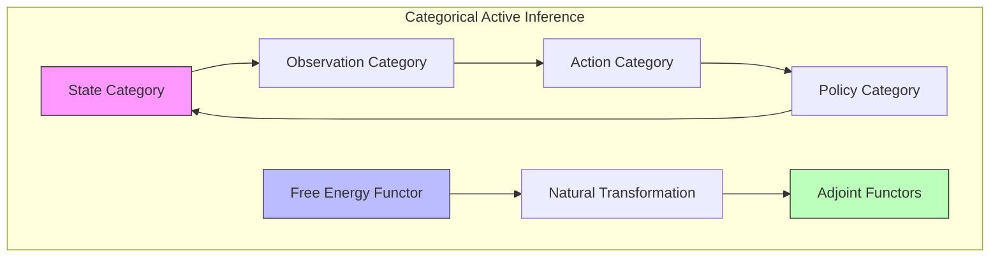

## Advanced Implementation Frameworks

### Deep Active Inference Networks

```python

class DeepActiveInferenceNetwork(nn.Module):

    def __init__(self,

                 state_dim: int,

                 obs_dim: int,

                 latent_dim: int):

        """Initialize deep active inference network."""

        super().__init__()

        # Encoder network (recognition model)

        self.encoder = nn.Sequential(

            nn.Linear(obs_dim, 256),

            nn.ReLU(),

            nn.Linear(256, 2 * latent_dim)  # Mean and log variance

        )

        # Decoder network (generative model)

        self.decoder = nn.Sequential(

            nn.Linear(latent_dim, 256),

            nn.ReLU(),

            nn.Linear(256, obs_dim)

        )

        # Policy network

        self.policy = nn.Sequential(

            nn.Linear(latent_dim, 256),

            nn.ReLU(),

            nn.Linear(256, state_dim)

        )

    def encode(self, x: torch.Tensor) -> Tuple[torch.Tensor, torch.Tensor]:

        """Encode observations to latent space."""

        h = self.encoder(x)

        mu, log_var = torch.chunk(h, 2, dim=-1)

        return mu, log_var

    def decode(self, z: torch.Tensor) -> torch.Tensor:

        """Decode latent states to observations."""

        return self.decoder(z)

    def reparameterize(self,

                      mu: torch.Tensor,

                      log_var: torch.Tensor) -> torch.Tensor:

        """Reparameterization trick."""

        std = torch.exp(0.5 * log_var)

        eps = torch.randn_like(std)

        return mu + eps * std

    def forward(self, x: torch.Tensor) -> Dict[str, torch.Tensor]:

        """Forward pass."""

        # Encode

        mu, log_var = self.encode(x)

        # Sample latent state

        z = self.reparameterize(mu, log_var)

        # Decode

        x_recon = self.decode(z)

        # Compute policy

        policy = self.policy(z)

        return {

            'mu': mu,

            'log_var': log_var,

            'z': z,

            'x_recon': x_recon,

            'policy': policy

        }

```

### Hierarchical Message Passing

```python

class HierarchicalMessagePassing:

    def __init__(self,

                 n_levels: int,

                 dims_per_level: List[int]):

        """Initialize hierarchical message passing."""

        self.n_levels = n_levels

        self.dims = dims_per_level

        # Initialize level-specific networks

        self.level_networks = nn.ModuleList([

            LevelNetwork(dim_in, dim_out)

            for dim_in, dim_out in zip(dims_per_level[:-1], dims_per_level[1:])

        ])

    def forward_pass(self,

                    observation: torch.Tensor) -> List[torch.Tensor]:

        """Forward pass through hierarchy."""

        messages = []

        current = observation

        # Bottom-up pass

        for network in self.level_networks:

            message = network.forward_message(current)

            messages.append(message)

            current = message

        return messages

    def backward_pass(self,

                     messages: List[torch.Tensor]) -> List[torch.Tensor]:

        """Backward pass through hierarchy."""

        predictions = []

        current = messages[-1]

        # Top-down pass

        for network in reversed(self.level_networks):

            prediction = network.backward_message(current)

            predictions.append(prediction)

            current = prediction

        return predictions[::-1]

```

## Advanced Applications

### 1. Neuromorphic Implementation

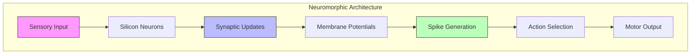

### 2. Quantum Robotics

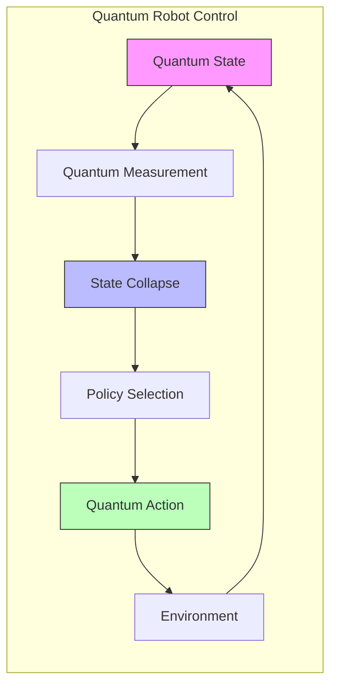

### 3. Social Active Inference

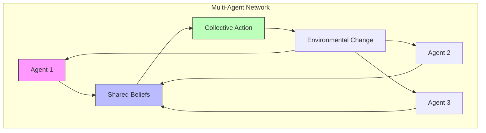

## Recent Developments and Extensions

### Advanced Formulations
- **Continuous-Time Active Inference**: [[continuous_time_active_inference]] - Temporal dynamics and stochastic differential equations
- **Deep Active Inference**: Integration with deep learning architectures for scalable inference
- **Social Active Inference**: Multi-agent frameworks and theory of mind implementations
- **Quantum Active Inference**: Quantum probability formulations for enhanced uncertainty representation

### Computational Advances
- **Scalable Inference Algorithms**: Amortized inference and variational approximations
- **Neuromorphic Implementations**: Hardware-accelerated active inference on specialized chips
- **Hybrid Systems**: Integration with reinforcement learning and optimal control
- **Meta-Learning Extensions**: Learning to learn in active inference frameworks

### Applications and Domains
- **Clinical Applications**: Computational psychiatry and neurological disorder modeling
- **Robotics**: Autonomous systems and human-robot interaction
- **Economics**: Decision-making under uncertainty and behavioral economics
- **Neuroscience**: Large-scale brain simulations and cognitive modeling

## Practical Implementation Guide

### Getting Started
```python
# Basic Active Inference Agent Implementation
import numpy as np
from scipy.special import softmax

class BasicActiveInferenceAgent:
    """Minimal active inference agent for educational purposes."""

    def __init__(self, n_states=3, n_actions=2, n_observations=3):
        # Generative model matrices
        self.A = np.random.rand(n_observations, n_states)  # Observation model
        self.A = self.A / self.A.sum(axis=0)  # Normalize columns

        self.B = np.random.rand(n_states, n_states, n_actions)  # Transition model
        for a in range(n_actions):
            self.B[:, :, a] = self.B[:, :, a] / self.B[:, :, a].sum(axis=0)

        self.C = np.ones(n_observations) / n_observations  # Prior preferences
        self.D = np.ones(n_states) / n_states  # Prior beliefs
        self.E = np.ones(n_actions) / n_actions  # Policy priors

        # Inference parameters
        self.gamma = 1.0  # Precision parameter
        self.beliefs = self.D.copy()

    def infer_states(self, observation):
        """Perform variational state inference."""
        # Simplified fixed-point iteration
        for _ in range(10):
            predicted_obs = self.A @ self.beliefs
            prediction_error = observation - predicted_obs
            self.beliefs = self.beliefs * np.exp(self.gamma * self.A.T @ prediction_error)
            self.beliefs = self.beliefs / self.beliefs.sum()
        return self.beliefs

    def compute_expected_free_energy(self, policy):
        """Compute expected free energy for a policy."""
        G = 0
        current_beliefs = self.beliefs.copy()

        for t in range(len(policy)):
            action = policy[t]

            # Expected state transitions
            next_beliefs = self.B[:, :, action].T @ current_beliefs

            # Expected observations
            expected_obs = self.A @ next_beliefs

            # Epistemic affordance (information gain)
            epistemic = np.sum(current_beliefs * np.log(current_beliefs / next_beliefs))

            # Pragmatic value (preference satisfaction)
            pragmatic = np.sum(expected_obs * np.log(expected_obs / self.C))

            G += epistemic + pragmatic
            current_beliefs = next_beliefs

        return G

    def select_action(self, observation):
        """Select action using active inference."""
        # Update beliefs
        self.beliefs = self.infer_states(observation)

        # Evaluate all possible policies (simplified single-step)
        n_policies = 2  # Consider only immediate actions
        G_values = []

        for action in range(self.E.shape[0]):
            policy = [action]  # Single-step policy
            G = self.compute_expected_free_energy(policy)
            G_values.append(G)

        # Softmax policy selection
        action_probabilities = softmax(-self.gamma * np.array(G_values))
        selected_action = np.random.choice(len(action_probabilities), p=action_probabilities)

        return selected_action
```

### Advanced Implementation Patterns

#### Hierarchical Active Inference
```python
class HierarchicalActiveInferenceAgent(BasicActiveInferenceAgent):
    """Hierarchical extension with multiple temporal scales."""

    def __init__(self, hierarchy_levels=[3, 5, 8]):
        super().__init__()
        self.levels = hierarchy_levels
        self.temporal_scales = [1, 4, 16]  # Increasing temporal horizons

        # Initialize hierarchical generative models
        self.hierarchical_models = []
        for i, n_states in enumerate(hierarchy_levels):
            model = {
                'n_states': n_states,
                'A': np.random.rand(3, n_states),  # Shared observation space
                'B': np.random.rand(n_states, n_states, 2),
                'time_scale': self.temporal_scales[i]
            }
            # Normalize matrices
            model['A'] = model['A'] / model['A'].sum(axis=0)
            for a in range(2):
                model['B'][:, :, a] = model['B'][:, :, a] / model['B'][:, :, a].sum(axis=0)

            self.hierarchical_models.append(model)

    def hierarchical_inference(self, observation):
        """Perform hierarchical inference across time scales."""
        beliefs_hierarchy = []

        for level, model in enumerate(self.hierarchical_models):
            # Level-specific inference
            level_beliefs = self.infer_states_hierarchical(observation, model)
            beliefs_hierarchy.append(level_beliefs)

            # Pass expectations to next level
            if level < len(self.hierarchical_models) - 1:
                observation = model['A'] @ level_beliefs  # Predictive coding

        return beliefs_hierarchy

    def infer_states_hierarchical(self, observation, model):
        """Hierarchical state inference with temporal integration."""
        # Implement temporal smoothing based on level's time scale
        beliefs = np.ones(model['n_states']) / model['n_states']

        for _ in range(model['time_scale']):
            predicted_obs = model['A'] @ beliefs
            prediction_error = observation - predicted_obs
            beliefs = beliefs * np.exp(0.1 * model['A'].T @ prediction_error)
            beliefs = beliefs / beliefs.sum()

        return beliefs
```

#### Active Inference with Learning
```python
class LearningActiveInferenceAgent(BasicActiveInferenceAgent):
    """Active inference agent with online model learning."""

    def __init__(self, learning_rate=0.01):
        super().__init__()
        self.learning_rate = learning_rate
        self.model_history = []  # Track model evolution

    def learn_from_experience(self, observation, action, next_observation):
        """Update generative model based on experience."""

        # Update transition model B
        predicted_next_state = self.B[:, :, action].T @ self.beliefs
        actual_next_beliefs = self.infer_states(next_observation)

        # Learning update for B
        prediction_error = actual_next_beliefs - predicted_next_state
        self.B[:, :, action] += self.learning_rate * np.outer(actual_next_beliefs, self.beliefs)

        # Renormalize
        self.B[:, :, action] = self.B[:, :, action] / self.B[:, :, action].sum(axis=0)

        # Update observation model A
        predicted_obs = self.A @ self.beliefs
        obs_prediction_error = next_observation - predicted_obs

        # Learning update for A
        self.A += self.learning_rate * np.outer(obs_prediction_error, self.beliefs)

        # Ensure non-negative and renormalize
        self.A = np.maximum(self.A, 0)
        self.A = self.A / self.A.sum(axis=0)

        # Store model state for analysis
        self.model_history.append({
            'A': self.A.copy(),
            'B': self.B.copy(),
            'step': len(self.model_history)
        })

    def reflect_on_learning(self):
        """Analyze learning progress and model changes."""
        if len(self.model_history) < 2:
            return {}

        recent = self.model_history[-1]
        previous = self.model_history[-2]

        # Compute model change metrics
        A_change = np.linalg.norm(recent['A'] - previous['A'])
        B_change = np.linalg.norm(recent['B'] - previous['B'])

        return {
            'observation_model_change': A_change,
            'transition_model_change': B_change,
            'learning_progress': len(self.model_history)
        }
```

## Related Documentation

- [[free_energy_principle]]

- [[predictive_coding]]

- [[../mathematics/policy_selection]]

- [[variational_inference]]

- [[bayesian_brain_hypothesis]]

- [[reinforcement_learning]]

- [[optimal_control]]

- [[planning_as_inference]]

- [[precision_weighting]]

- [[../mathematics/variational_free_energy]]

- [[../mathematics/expected_free_energy]]

- [[../mathematics/epistemic_value]]

- [[../mathematics/pragmatic_value]]

- [[../mathematics/active_inference_pomdp]]

- [[../mathematics/markov_blanket]]

- [[continuous_time_active_inference]]

- [[../../Things/ActiveInferenceInstitute/active_inference_institute]]

## Learning Paths

- [[../../docs/guides/learning_paths/index]]

- [[../../docs/guides/learning_paths/active_inference_cognitive_learning_path]]

- [[../../docs/guides/learning_paths/active_inference_mathematical_learning_path]]

- [[../../docs/guides/learning_paths/active_inference_robotics_learning_path]]

- [[../../docs/guides/learning_paths/active_inference_neuroscience_learning_path]]

- [[../../docs/guides/learning_paths/active_inference_agi_learning_path]]

---

> [!note] Open Source and Licensing
> Repository: [ActiveInferenceInstitute/cognitive](https://github.com/ActiveInferenceInstitute/cognitive)
> - Documentation and knowledge base content: [CC BY-NC-SA 4.0](https://creativecommons.org/licenses/by-nc-sa/4.0/)
> - Code and examples: MIT License (see `LICENSE`)

