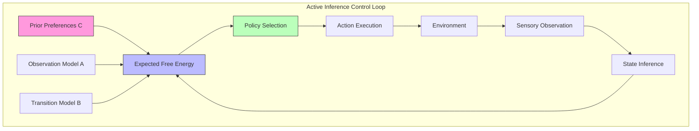

# Active Inference for Control

Active Inference provides a unified framework for understanding biological and artificial control systems by recasting control as inference over actions that minimize expected free energy. Rather than specifying explicit control laws, the agent infers the actions most likely to realize its preferred sensory states.

## Core Framework

### Control as Inference

In Active Inference, control problems are reformulated as inference problems. The agent maintains a generative model encoding preferred outcomes (prior preferences) and infers actions that minimize the divergence between predicted and preferred observations.

```math
\begin{aligned}
& \text{Action Selection:} \\
& a^* = \argmin_a \mathbb{E}_{q(s_t)}[G(\pi)] \\
& \text{where } G(\pi) = \underbrace{D_{KL}[q(o_\tau|\pi)||p(o_\tau)]}_{\text{pragmatic value}} + \underbrace{\mathbb{E}_{q(o_\tau|\pi)}[H[q(s_\tau|o_\tau,\pi)]]}_{\text{epistemic value}}
\end{aligned}
```

### Generative Model for Control

The generative model for a controlled system specifies:

1. **Observation model** $p(o_t|s_t)$: How hidden states generate observations
2. **Transition model** $p(s_{t+1}|s_t, a_t)$: How actions change states
3. **Prior preferences** $p(o_t)$: Desired sensory outcomes (setpoints)
4. **Initial state prior** $p(s_0)$: Beliefs about starting conditions



## Mathematical Formulation

### State-Space Control

```math
\begin{aligned}
& \text{State dynamics:} \quad s_{t+1} = B(a_t) \cdot s_t \\
& \text{Observations:} \quad o_t = A \cdot s_t \\
& \text{Control objective:} \quad \min_\pi G(\pi) = \sum_{\tau=t}^{T} G(\pi, \tau)
\end{aligned}
```

### PID-Equivalent in Active Inference

Traditional PID control maps naturally onto Active Inference:

| PID Component | Active Inference Equivalent |
| --- | --- |
| Proportional | Prediction error (current) |
| Integral | Accumulated free energy |
| Derivative | Rate of change of prediction error |

```math
\begin{aligned}
& u_{PID}(t) = K_p e(t) + K_i \int e(\tau) d\tau + K_d \frac{de}{dt} \\
& u_{AI}(t) = -\frac{\partial G}{\partial a} = \underbrace{\pi \varepsilon_t}_{\text{proportional}} + \underbrace{\int \pi \varepsilon_\tau d\tau}_{\text{integral}} + \underbrace{\pi \dot{\varepsilon}_t}_{\text{derivative}}
\end{aligned}
```

## Control Architectures

### Hierarchical Control

```python
class HierarchicalController:
    """Hierarchical active inference controller with multiple timescales."""

    def __init__(self, levels: int, state_dims: list, action_dims: list):
        self.levels = levels
        self.controllers = [
            ActiveInferenceController(
                state_dim=state_dims[i],
                action_dim=action_dims[i],
                temporal_scale=2**i
            )
            for i in range(levels)
        ]

    def compute_action(self, observations: dict) -> dict:
        """Compute control actions across hierarchy."""
        actions = {}
        for level in reversed(range(self.levels)):
            controller = self.controllers[level]
            obs = observations.get(level, observations[0])
            goal = actions.get(level + 1, controller.prior_preferences)
            actions[level] = controller.infer_action(obs, goal)
        return actions[0]
```

### Adaptive Control

Active Inference naturally handles adaptive control through online learning of the generative model parameters:

```math
\begin{aligned}
& \text{Parameter learning:} \quad \dot{\theta} = -\kappa_\theta \frac{\partial F}{\partial \theta} \\
& \text{Precision learning:} \quad \dot{\pi} = -\kappa_\pi \frac{\partial F}{\partial \pi} \\
& \text{Structure learning:} \quad m^* = \argmin_m F_m
\end{aligned}
```

## Applications

### Robotics

- Sensorimotor control via proprioceptive predictions
- Compliant manipulation through precision modulation
- Multi-joint coordination via hierarchical inference

### Process Control

- Temperature regulation as homeostatic inference
- Chemical process control with uncertainty estimation
- Adaptive setpoint adjustment through preference learning

### Autonomous Systems

- Navigation as spatial inference
- Obstacle avoidance through expected information gain
- Multi-agent coordination via shared generative models

## Related Topics

- [[homeostatic_control_theory]] — Theoretical foundations of homeostatic regulation
- [[basic_homeostatic_control]] — Simple homeostatic control implementations
- [[advanced_control]] — Advanced control architectures
- [[custom_control_modes]] — Configurable control strategies
- [[active_inference]] — Core Active Inference framework
- [[knowledge_base/mathematics/optimal_control]] — Mathematical optimal control theory
- [[knowledge_base/mathematics/control_theory]] — General control theory

## References

- Friston, K. J. (2011). What is optimal about motor control? *Neuron*, 72(3), 488-498.
- Baltieri, M., & Buckley, C. L. (2019). PID control as a process of active inference.
- Lanillos, P., et al. (2021). Active inference in robotics and artificial agents.
