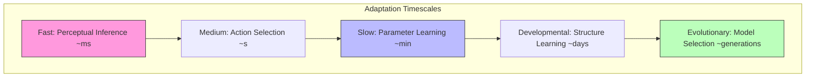

# Adaptation Strategies

Adaptation strategies in the Active Inference framework describe how agents modify their generative models, precision parameters, and behavioral policies to maintain fitness in changing environments. These strategies operate across multiple timescales and hierarchical levels.

## Theoretical Framework

### Free Energy Minimization Strategies

Agents can minimize free energy through complementary strategies:

```math
\begin{aligned}
& F = \underbrace{D_{KL}[q(s)||p(s|o)]}_{\text{divergence}} - \underbrace{\ln p(o)}_{\text{log evidence}} \\
& \text{Strategy 1 (Perception):} \quad q^*(s) = \argmin_q D_{KL}[q(s)||p(s|o)] \\
& \text{Strategy 2 (Action):} \quad a^* = \argmax_a \ln p(o|a) \\
& \text{Strategy 3 (Learning):} \quad \theta^* = \argmax_\theta \ln p(o|\theta) \\
& \text{Strategy 4 (Attention):} \quad \pi^* = \argmin_\pi F(o, q; \pi)
\end{aligned}
```

### Temporal Hierarchy of Adaptation



## Core Strategies

### 1. Allostatic Regulation

Proactive adaptation that anticipates environmental changes:

```math
\begin{aligned}
& \text{Allostatic setpoint:} \quad s^*(t) = s_0 + \Delta s(t) \\
& \text{Predictive adjustment:} \quad \Delta s(t) = \mathbb{E}_{q(\eta)}[f(\eta, t)] \\
& \text{where } \eta \text{ are predicted environmental states}
\end{aligned}
```

### 2. Precision Modulation

Adjusting the gain on prediction errors to handle volatility:

```math
\begin{aligned}
& \pi_t = \sigma(\omega + v_t) \\
& v_t = \kappa v_{t-1} + \varepsilon_t^2 - \langle \varepsilon^2 \rangle
\end{aligned}
```

where $\omega$ is tonic precision, $v_t$ tracks volatility, and $\kappa$ is a decay parameter.

### 3. Structure Learning

Modifying the generative model structure when parameters alone are insufficient:

```python
class AdaptiveAgent:
    """Agent with hierarchical adaptation strategies."""

    def __init__(self, generative_model, learning_rates):
        self.model = generative_model
        self.lr = learning_rates

    def adapt(self, observation, prediction_error):
        """Apply appropriate adaptation strategy based on error magnitude."""
        if prediction_error < self.lr['perception_threshold']:
            self.perceptual_update(observation)
        elif prediction_error < self.lr['learning_threshold']:
            self.parameter_update(observation)
        else:
            self.structure_update(observation)

    def perceptual_update(self, obs):
        """Fast perceptual inference (ms timescale)."""
        self.model.beliefs = self.model.infer_states(obs)

    def parameter_update(self, obs):
        """Slower parameter learning (minutes timescale)."""
        gradient = self.model.compute_parameter_gradient(obs)
        self.model.parameters -= self.lr['params'] * gradient

    def structure_update(self, obs):
        """Structural model revision (days timescale)."""
        candidates = self.model.generate_structure_candidates()
        best = min(candidates, key=lambda m: m.free_energy(obs))
        self.model = best
```

### 4. Epistemic Foraging

Active exploration to reduce model uncertainty:

```math
G_{epistemic}(\pi) = \mathbb{E}_{q(o_\tau|\pi)}[D_{KL}[q(s_\tau|o_\tau, \pi)||q(s_\tau|\pi)]]
```

## Behavioral Signatures

| Strategy | Timescale | Neural Substrate | Computational Cost |
| --- | --- | --- | --- |
| Perceptual inference | Milliseconds | Sensory cortex | Low |
| Action selection | Seconds | Frontal-basal ganglia | Medium |
| Parameter learning | Minutes-hours | Hippocampus, synaptic | Medium |
| Structure learning | Days-weeks | Prefrontal cortex | High |
| Evolutionary | Generations | Genetic | Very high |

## Related Topics

- [[adaptive_systems]] — General adaptive systems theory
- [[learning_mechanisms]] — Core learning in Active Inference
- [[meta_learning]] — Learning to learn
- [[precision_weighting]] — Precision modulation mechanisms
- [[homeostatic_regulation]] — Homeostatic regulation
- [[active_inference]] — Core Active Inference framework
- [[epistemic_foraging]] — Active exploration strategies

## References

- Friston, K. (2010). The free-energy principle: a unified brain theory? *Nature Reviews Neuroscience*, 11, 127-138.
- Pezzulo, G., Rigoli, F., & Friston, K. (2015). Active Inference, homeostatic regulation and adaptive behavioural control.
