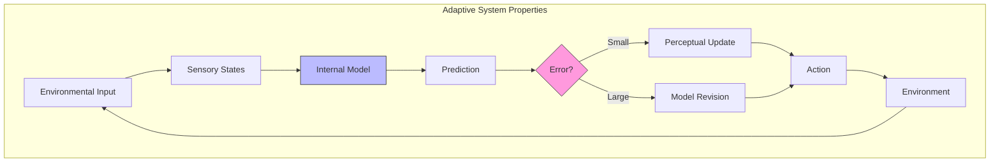

# Adaptive Systems

Adaptive systems are systems capable of modifying their structure and behavior in response to environmental changes. Under the Free Energy Principle, all self-organizing systems that persist over time can be understood as minimizing variational free energy — placing adaptation at the heart of biological and cognitive organization.

## Formal Definition

### Free Energy Principle Perspective

An adaptive system is characterized by a Markov blanket separating internal from external states, where internal dynamics perform approximate Bayesian inference:

```math
\begin{aligned}
& \text{Internal dynamics:} \quad \dot{\mu} = (Q_\mu - \Gamma_\mu) \nabla_\mu F \\
& \text{Active states:} \quad \dot{a} = (Q_a - \Gamma_a) \nabla_a F \\
& \text{where } F = -\ln p(o, s) + \ln q(s)
\end{aligned}
```

### Properties of Adaptive Systems

1. **Self-organization**: Spontaneous emergence of order from local interactions
2. **Robustness**: Maintenance of function despite perturbations
3. **Plasticity**: Capacity for structural and functional change
4. **Anticipation**: Prediction of future states for proactive adjustment



## Types of Adaptation

### Reactive Adaptation

Responding to current perturbations through homeostatic mechanisms:

```math
\dot{x} = -k(x - x^*) + \eta(t)
```

### Predictive Adaptation

Anticipating future states through generative models:

```math
\hat{x}_{t+1} = \mathbb{E}_{q(s_{t+1}|\pi)}[g(s_{t+1})]
```

### Evolutionary Adaptation

Long-timescale model selection through natural selection:

```math
p(m|D) \propto p(D|m) p(m) = e^{-F_m} p(m)
```

## Implementation Patterns

```python
class AdaptiveSystem:
    """Generic adaptive system implementing free energy minimization."""

    def __init__(self, model, environment):
        self.model = model
        self.environment = environment
        self.free_energy_history = []

    def step(self):
        """Single adaptive step: observe, infer, act."""
        observation = self.environment.observe()
        beliefs = self.model.infer_states(observation)
        prediction_error = self.model.compute_prediction_error(observation, beliefs)
        action = self.model.select_action(beliefs)
        self.environment.execute(action)
        self.model.update_parameters(prediction_error)
        self.free_energy_history.append(self.model.compute_free_energy(observation))
        return {'beliefs': beliefs, 'action': action, 'pe': prediction_error}
```

## Applications

- **Biological systems**: Cellular homeostasis, immune adaptation, neural plasticity
- **Cognitive systems**: Perceptual learning, skill acquisition, language development
- **Artificial systems**: Adaptive robotics, self-tuning controllers, evolving algorithms
- **Social systems**: Cultural evolution, organizational adaptation, market dynamics

## Related Topics

- [[adaptation_strategies]] — Specific adaptation strategies in Active Inference
- [[learning_mechanisms]] — Learning as a form of adaptation
- [[homeostatic_regulation]] — Homeostatic mechanisms
- [[emergence_self_organization]] — Emergence in complex systems
- [[knowledge_base/systems/complex_systems]] — Complex systems theory
- [[free_energy_principle]] — Foundational principle

## References

- Friston, K. (2013). Life as we know it. *Journal of the Royal Society Interface*, 10(86).
- Ramstead, M. J. D., et al. (2018). Answering Schrödinger's question: A free-energy formulation.

## See also

- [[knowledge_base/systems/adaptive_systems|Adaptive Systems]]
