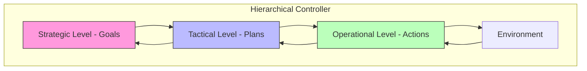

# Advanced Control

Advanced control in Active Inference extends basic homeostatic regulation to include hierarchical, multi-scale, and model-predictive approaches to minimizing expected free energy across complex state spaces.

## Hierarchical Control Architecture

### Multi-Level Inference

```math
\begin{aligned}
& \text{Level } l \text{ dynamics:} \quad \dot{\mu}_l = D\mu_l - \kappa_l \frac{\partial F}{\partial \mu_l} \\
& \text{Cross-level coupling:} \quad \mu_{l+1} \rightarrow \text{prior for } \mu_l \\
& \text{Temporal abstraction:} \quad \Delta t_l = 2^l \cdot \Delta t_0
\end{aligned}
```

Each level operates at a different temporal scale, with higher levels providing contextual priors that constrain lower-level inference and action.



## Model-Predictive Active Inference

### Receding Horizon Control

```math
\pi^* = \argmin_\pi \sum_{\tau=t}^{t+H} G(\pi, \tau)
```

where $H$ is the planning horizon. The agent re-plans at each timestep using updated beliefs.

### Multi-Objective Control

```python
class MultiObjectiveController:
    def __init__(self, objectives, weights):
        self.objectives = objectives
        self.weights = weights

    def compute_expected_free_energy(self, beliefs, policies):
        G_total = 0
        for obj, w in zip(self.objectives, self.weights):
            G_total += w * obj.evaluate(beliefs, policies)
        return G_total
```

## Robust Control

### Uncertainty-Aware Control

Active Inference naturally handles uncertainty through precision-weighted prediction errors:

```math
\varepsilon_{\text{weighted}} = \Pi \cdot (o - g(\mu))
```

where $\Pi$ is the precision matrix encoding confidence in observations.

### Disturbance Rejection

The generative model implicitly handles disturbances by treating them as unmodeled external states that increase free energy, triggering corrective actions.

## Applications

- **Robotic manipulation**: Compliant grasping with uncertainty
- **Process control**: Multi-variable chemical processes
- **Autonomous vehicles**: Hierarchical navigation and obstacle avoidance
- **Building systems**: Multi-zone climate control

## Related Topics

- [[active_inference_for_control]] — Foundational control framework
- [[basic_homeostatic_control]] — Simple control implementations
- [[custom_control_modes]] — Configurable control strategies
- [[hierarchical_inference]] — Hierarchical inference mechanisms
- [[knowledge_base/mathematics/optimal_control]] — Optimal control theory

## References

- Friston, K., et al. (2012). Active inference and agency.
- Pezzulo, G., Rigoli, F., & Friston, K. (2018). Hierarchical active inference.
