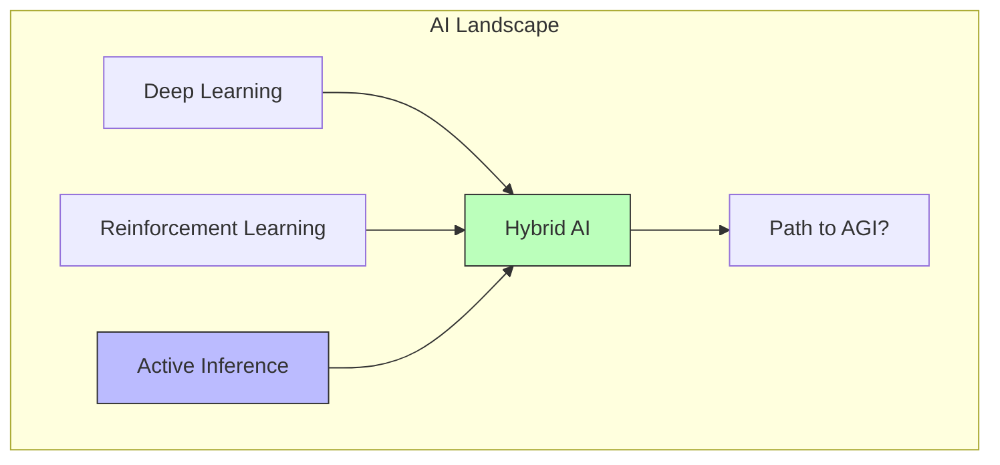

# Artificial Intelligence

## Overview

Artificial Intelligence (AI) viewed through the lens of Active Inference provides a principled framework for designing intelligent agents that perceive, learn, plan, and act under uncertainty. Unlike traditional AI approaches that treat perception, learning, and decision-making as separate problems, Active Inference unifies them under a single imperative: minimize variational free energy.

## AI Paradigms and Active Inference

### Comparison of Approaches

| Paradigm | Objective | Model | Perception | Action |
| --- | --- | --- | --- | --- |
| Classical AI | Logic satisfaction | Symbolic rules | Rule matching | Logical planning |
| Machine Learning | Loss minimization | Parametric function | Feature extraction | Learned policy |
| Reinforcement Learning | Reward maximization | Value function | State estimation | Optimal policy |
| **Active Inference** | **Free energy min.** | **Generative model** | **Belief updating** | **Policy selection** |

### Key Advantages of Active Inference for AI

1. **Unified framework**: Perception, learning, planning, and action from one objective
2. **Intrinsic motivation**: Epistemic drive (curiosity) emerges naturally
3. **Flexible generative models**: Structured Bayesian models vs. black-box networks
4. **Principled uncertainty**: Precision-weighted inference handles noisy, ambiguous inputs
5. **Biological plausibility**: Computational processes map to neural dynamics

## Applications

### Robotics

Active Inference agents for embodied AI:
- Sensorimotor control via predictive coding
- Curiosity-driven exploration of novel environments
- Hierarchical planning for complex manipulation

### Natural Language Processing

Language as predictive inference:
- Sentence processing as sequential belief updating
- Pragmatic inference as policy selection
- Dialogue as multi-agent Active Inference

### Computer Vision

Visual perception as inference:
- Object recognition via generative visual models
- Scene understanding through hierarchical inference
- Active vision (saccades) as epistemic action

### Multi-Agent Systems

Social AI via collective Active Inference:
- Theory of mind through generative model nesting
- Cooperative behavior from shared preference priors
- Stigmergic coordination in swarm robotics

## Relationship to Modern AI

Active Inference is increasingly seen as complementary to deep learning, providing:
- **Interpretability** through explicit generative models
- **Data efficiency** via structured priors
- **Safety** through preference-based constraints
- **Exploration** through epistemic value

## Related Topics

- [[active_inference]] — Core Active Inference framework
- [[reinforcement_learning]] — RL connections and comparisons
- [[multi_agent_active_inference]] — Multi-agent systems
- [[cognitive_architecture]] — Cognitive architectures
- [[neural_active_inference]] — Neural implementations
- [[decision_making]] — Decision-making in AI
