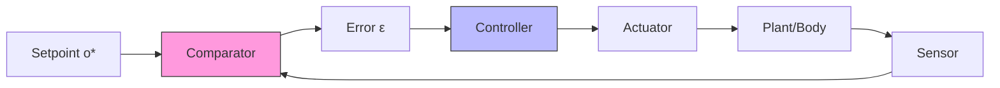

# Basic Homeostatic Control

Basic homeostatic control implements the simplest form of biological regulation through Active Inference: maintaining internal variables near setpoints by minimizing the free energy associated with deviations from preferred states.

## Core Mechanism

### Setpoint Regulation

```math
\begin{aligned}
& \text{Preferred state:} \quad C = \ln p(o^*) \\
& \text{Prediction error:} \quad \varepsilon = o - o^* \\
& \text{Control action:} \quad a = -\kappa \varepsilon
\end{aligned}
```

The agent maintains its internal milieu by treating deviations from preferred observations as prediction errors that must be resolved through action.



### Generative Model

For basic homeostatic control, the generative model is minimal:

```math
\begin{aligned}
& p(o_t | s_t) = \mathcal{N}(s_t, \sigma_o^2) \quad \text{(observation model)} \\
& p(s_{t+1} | s_t, a_t) = \mathcal{N}(s_t + B \cdot a_t, \sigma_s^2) \quad \text{(transition model)} \\
& p(o_t) = \mathcal{N}(o^*, \sigma_p^2) \quad \text{(prior preferences)}
\end{aligned}
```

## Implementation

```python
class HomeostaticController:
    def __init__(self, setpoint, gain=0.1, precision=1.0):
        self.setpoint = setpoint
        self.gain = gain
        self.precision = precision
        self.state_belief = setpoint

    def step(self, observation):
        prediction_error = observation - self.state_belief
        self.state_belief += self.precision * prediction_error * 0.5
        action = -self.gain * (self.state_belief - self.setpoint)
        return action

    def compute_free_energy(self, observation):
        pe_sensory = (observation - self.state_belief) ** 2
        pe_prior = (self.state_belief - self.setpoint) ** 2
        return 0.5 * (self.precision * pe_sensory + pe_prior)
```

## Biological Examples

| System | Variable | Setpoint | Effector |
| --- | --- | --- | --- |
| Thermoregulation | Body temperature | 37°C | Sweating, shivering |
| Glucoregulation | Blood glucose | 90 mg/dL | Insulin, glucagon |
| Osmoregulation | Blood osmolarity | 300 mOsm/L | ADH, thirst |
| pH regulation | Blood pH | 7.4 | Respiration, kidneys |

## Related Topics

- [[homeostatic_control_theory]] — Theoretical foundations
- [[homeostatic_regulation]] — General homeostatic regulation
- [[active_inference_for_control]] — Active Inference control framework
- [[advanced_control]] — More complex control architectures

## References

- Ashby, W. R. (1956). *An Introduction to Cybernetics*.
- Cannon, W. B. (1929). Organization for physiological homeostasis.
