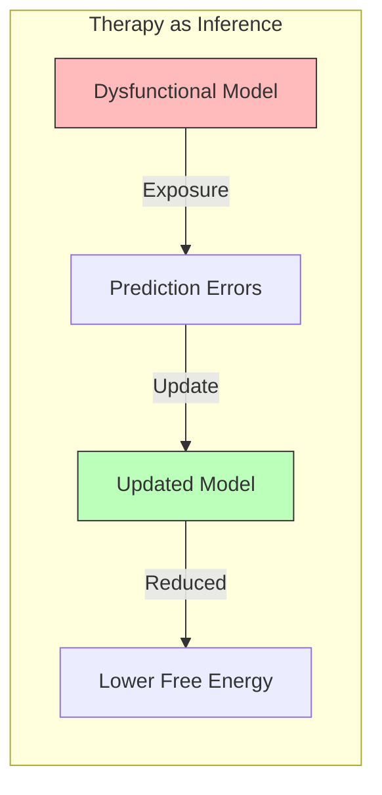

# Clinical Psychology

## Overview

Computational psychiatry applies Active Inference to understand psychopathology as aberrant inference — disorders arise from systematically biased generative models, dysfunctional precision weighting, or impaired model updating. This provides a principled, mechanistic account of mental illness.

## Precision-Based Account of Psychopathology

### Core Framework

```math
\text{Perception} = \arg\min_q F = \arg\min_q \left[ \underbrace{\Pi_s D_{KL}[q(s)||p(s)]}_{\text{prior weight}} - \underbrace{\Pi_o \mathbb{E}_q[\ln p(o|s)]}_{\text{likelihood weight}} \right]
```

Psychopathology arises when precision ratios $\Pi_o / \Pi_s$ are systematically miscalibrated.

### Precision Imbalances in Disorders

| Disorder | Precision Pattern | Phenomenology |
| --- | --- | --- |
| Psychosis / hallucinations | $\Pi_s \gg \Pi_o$ — priors dominate | Perceptual experiences driven by beliefs |
| Autism spectrum | $\Pi_o \gg \Pi_s$ — sensory dominates | Detail-focused, sensory overwhelm |
| Anxiety disorders | $\Pi_s \uparrow$ for threat priors | Threat expectations override evidence |
| Depression | $\Pi_s \uparrow$ for negative priors | Negative beliefs resist updating |
| ADHD | $\Pi$ volatility, unstable precision | Difficulty sustaining attention |
| PTSD | $\Pi_s \uparrow$ for trauma models | Intrusive predictions, hypervigilance |
| OCD | $\Pi_o \uparrow$ for specific contexts | Checking driven by high sensory precision |

## Therapeutic Interventions as Model Updating



- **CBT**: Direct modification of generative model beliefs (priors)
- **Exposure therapy**: Generating prediction errors that update threat models
- **Mindfulness**: Increasing precision of interoceptive signals
- **Pharmacotherapy**: Modulating precision via neuromodulatory systems (5-HT, DA, NE)

## Active Inference Models of Specific Disorders

### Addiction

Compulsive behavior as free energy trap — the agent's generative model predicts relief only from the addictive behavior, creating a local free energy minimum:

```math
G(\pi_{drug}) < G(\pi_{\text{other}}) \quad \text{due to biased C (preferences)}
```

### Chronic Pain

Persistent pain as precision-weighted interoceptive prediction error that resists updating:

```math
F_{\text{pain}} = \Pi_{\text{intero}} \cdot (\text{sensed} - \text{predicted})^2
```

## Related Topics

- [[predictive_coding]] — Predictive coding framework
- [[precision_weighting]] — Precision mechanisms
- [[bayesian_brain_hypothesis]] — Bayesian brain
- [[emotional_processing]] — Emotional processing
- [[cognitive_neuroscience]] — Brain mechanisms
