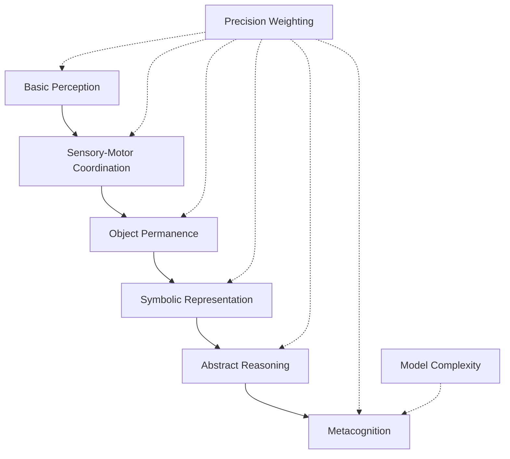

# Cognitive Development Through Active Inference

This document explores cognitive development through the lens of Active Inference, examining how children acquire knowledge, skills, and cognitive capabilities through the minimization of variational free energy in increasingly complex environments.

## 🧠 Developmental Active Inference Framework

### Hierarchical Skill Acquisition

Cognitive development as progressive skill layering:



### Developmental Stages as Model Refinement

```python
class DevelopmentalActiveInference:
    """Active Inference framework for cognitive development."""

    def __init__(self):
        self.developmental_stages = self.initialize_stages()
        self.current_stage = 0
        self.generative_model = DevelopmentalGenerativeModel()
        self.precision_scheduler = PrecisionScheduler()
        self.skill_acquisition = SkillAcquisitionSystem()

    def initialize_stages(self):
        """Initialize developmental stages with increasing complexity."""

        stages = [
            {
                'name': 'sensorimotor',
                'age_range': '0-2 years',
                'model_complexity': 'minimal',
                'key_capabilities': ['perception', 'basic_action'],
                'precision_focus': 'immediate_sensory'
            },
            {
                'name': 'preoperational',
                'age_range': '2-7 years',
                'model_complexity': 'concrete_concepts',
                'key_capabilities': ['symbolism', 'intuitive_reasoning'],
                'precision_focus': 'concrete_experience'
            },
            {
                'name': 'concrete_operational',
                'age_range': '7-11 years',
                'model_complexity': 'logical_operations',
                'key_capabilities': ['conservation', 'classification'],
                'precision_focus': 'logical_consistency'
            },
            {
                'name': 'formal_operational',
                'age_range': '11+ years',
                'model_complexity': 'abstract_reasoning',
                'key_capabilities': ['hypothetical_reasoning', 'metacognition'],
                'precision_focus': 'abstract_validation'
            }
        ]

        return stages

    def developmental_progression(self, experience_stream):
        """Process developmental progression through experience."""

        developmental_trajectory = []

        for experience in experience_stream:
            # Process experience at current developmental stage
            processed_experience = self.process_at_stage(experience, self.current_stage)

            # Assess developmental readiness
            readiness = self.assess_developmental_readiness(processed_experience)

            # Progress to next stage if ready
            if readiness > 0.8 and self.current_stage < len(self.developmental_stages) - 1:
                self.progress_stage()
                developmental_trajectory.append({
                    'stage_transition': self.current_stage,
                    'trigger_experience': experience,
                    'readiness_score': readiness
                })

            # Update generative model
            self.generative_model.update(processed_experience)

            # Acquire skills appropriate to stage
            new_skills = self.skill_acquisition.acquire_skills(
                processed_experience, self.current_stage
            )

        return developmental_trajectory

    def process_at_stage(self, experience, stage):
        """Process experience according to developmental stage."""

        stage_characteristics = self.developmental_stages[stage]

        # Apply stage-appropriate processing
        if stage_characteristics['name'] == 'sensorimotor':
            processed = self.sensorimotor_processing(experience)
        elif stage_characteristics['name'] == 'preoperational':
            processed = self.preoperational_processing(experience)
        elif stage_characteristics['name'] == 'concrete_operational':
            processed = self.concrete_operational_processing(experience)
        else:  # formal operational
            processed = self.formal_operational_processing(experience)

        return processed

    def assess_developmental_readiness(self, processed_experience):
        """Assess readiness for next developmental stage."""

        # Evaluate prediction accuracy at current stage
        current_accuracy = self.evaluate_stage_performance(processed_experience)

        # Assess model complexity handling
        complexity_handling = self.evaluate_complexity_handling(processed_experience)

        # Check for stage-appropriate insights
        stage_insights = self.evaluate_stage_insights(processed_experience)

        readiness = (current_accuracy + complexity_handling + stage_insights) / 3

        return readiness

    def progress_stage(self):
        """Progress to next developmental stage."""

        self.current_stage += 1

        # Update generative model complexity
        self.generative_model.increase_complexity()

        # Adjust precision weighting
        self.precision_scheduler.adjust_for_stage(self.current_stage)

        # Enable new capabilities
        self.enable_stage_capabilities(self.current_stage)
```

## 🔬 Neural Development and Active Inference

### Experience-Dependent Model Refinement

How experience shapes the developing brain:

```python
class ExperienceDependentDevelopment:
    """Experience-dependent refinement of cognitive models."""

    def __init__(self):
        self.neural_architecture = DevelopingNeuralArchitecture()
        self.experience_processor = ExperienceProcessor()
        self.plasticity_manager = PlasticityManager()
        self.connectivity_optimizer = ConnectivityOptimizer()

    def process_developmental_experience(self, experience, age):
        """Process experience through developmental lens."""

        # Age-appropriate experience processing
        processed_experience = self.experience_processor.process_by_age(
            experience, age
        )

        # Experience-dependent plasticity
        plasticity_changes = self.plasticity_manager.compute_plasticity(
            processed_experience, age
        )

        # Neural architecture refinement
        architecture_updates = self.neural_architecture.refine_architecture(
            plasticity_changes
        )

        # Connectivity optimization
        connectivity_updates = self.connectivity_optimizer.optimize_connectivity(
            architecture_updates, processed_experience
        )

        return {
            'processed_experience': processed_experience,
            'plasticity_changes': plasticity_changes,
            'architecture_updates': architecture_updates,
            'connectivity_updates': connectivity_updates
        }

    def simulate_critical_periods(self, developmental_trajectory):
        """Simulate critical periods in development."""

        critical_periods = {
            'visual_cortex': {'start': 0, 'peak': 3, 'end': 7},  # months
            'language': {'start': 6, 'peak': 12, 'end': 36},     # months
            'social_cognition': {'start': 9, 'peak': 18, 'end': 60}  # months
        }

        period_effects = {}

        for period_name, period in critical_periods.items():
            # Simulate experience during critical period
            period_experience = self.simulate_period_experience(
                developmental_trajectory, period
            )

            # Calculate period-specific development
            period_effects[period_name] = self.calculate_period_effect(
                period_experience, period
            )

        return period_effects

    def simulate_period_experience(self, trajectory, period):
        """Simulate experience accumulation during critical period."""

        period_experiences = []
        current_age = 0

        for experience in trajectory:
            if period['start'] <= current_age <= period['end']:
                # Weight experience by distance from peak sensitivity
                weight = self.compute_sensitivity_weight(current_age, period)
                weighted_experience = self.weight_experience(experience, weight)
                period_experiences.append(weighted_experience)

            current_age += 0.1  # Monthly increments

        return period_experiences

    def compute_sensitivity_weight(self, age, period):
        """Compute sensitivity weight for age within period."""

        # Gaussian sensitivity curve
        peak = period['peak']
        width = (period['end'] - period['start']) / 4  # Spread parameter

        weight = np.exp(-((age - peak) ** 2) / (2 * width ** 2))
        return weight
```

### Precision Development

How precision weighting matures over development:

```python
class PrecisionDevelopment:
    """Developmental trajectory of precision weighting."""

    def __init__(self):
        self.precision_profiles = self.initialize_precision_profiles()
        self.attentional_development = AttentionalDevelopment()
        self.emotional_development = EmotionalDevelopment()
        self.cognitive_development = CognitiveDevelopment()

    def initialize_precision_profiles(self):
        """Initialize precision profiles for different developmental stages."""

        profiles = {
            'infancy': {
                'sensory_precision': 0.3,      # Low sensory precision
                'social_precision': 0.9,       # High social precision (faces, voices)
                'prediction_precision': 0.2,   # Limited predictive capacity
                'self_precision': 0.4          # Emerging self-model
            },
            'early_childhood': {
                'sensory_precision': 0.6,
                'social_precision': 0.7,
                'prediction_precision': 0.4,
                'self_precision': 0.6
            },
            'middle_childhood': {
                'sensory_precision': 0.8,
                'social_precision': 0.6,
                'prediction_precision': 0.6,
                'self_precision': 0.7
            },
            'adolescence': {
                'sensory_precision': 0.9,
                'social_precision': 0.8,
                'prediction_precision': 0.7,
                'self_precision': 0.5  # Identity exploration reduces self-precision
            },
            'adulthood': {
                'sensory_precision': 0.95,
                'social_precision': 0.7,
                'prediction_precision': 0.85,
                'self_precision': 0.8
            }
        }

        return profiles

    def develop_precision(self, age, experiences):
        """Develop precision weighting over time."""

        # Determine developmental stage
        stage = self.determine_stage(age)

        # Get base precision profile
        base_profile = self.precision_profiles[stage]

        # Experience-dependent modulation
        modulated_profile = self.modulate_precision(base_profile, experiences)

        # Attentional development influence
        attentional_modulation = self.attentional_development.modulate_precision(
            modulated_profile, age
        )

        # Emotional development influence
        emotional_modulation = self.emotional_development.modulate_precision(
            attentional_modulation, age
        )

        # Cognitive development influence
        final_profile = self.cognitive_development.modulate_precision(
            emotional_modulation, age
        )

        return final_profile

    def modulate_precision(self, base_profile, experiences):
        """Modulate precision based on recent experiences."""

        modulated = base_profile.copy()

        for experience in experiences[-10:]:  # Recent experiences
            if experience.type == 'surprising':
                # Increase precision for surprising modalities
                modulated[experience.modality] = min(
                    modulated[experience.modality] * 1.1, 1.0
                )
            elif experience.type == 'predictable':
                # Slightly decrease precision for over-predictable inputs
                modulated[experience.modality] *= 0.99

        return modulated

    def determine_stage(self, age):
        """Determine developmental stage from age."""

        if age < 2:
            return 'infancy'
        elif age < 7:
            return 'early_childhood'
        elif age < 12:
            return 'middle_childhood'
        elif age < 18:
            return 'adolescence'
        else:
            return 'adulthood'
```

## 🧪 Developmental Milestones as Phase Transitions

### Critical Transitions in Cognitive Development

```python
class DevelopmentalPhaseTransitions:
    """Phase transitions in cognitive development."""

    def __init__(self):
        self.phase_detector = PhaseTransitionDetector()
        self.stability_analyzer = StabilityAnalyzer()
        self.transition_predictor = TransitionPredictor()

    def detect_phase_transitions(self, developmental_trajectory):
        """Detect phase transitions in developmental trajectory."""

        transitions = []

        # Analyze trajectory for discontinuities
        for i in range(1, len(developmental_trajectory)):
            current_state = developmental_trajectory[i]
            previous_state = developmental_trajectory[i-1]

            # Check for qualitative changes
            if self.phase_detector.detect_transition(current_state, previous_state):
                transition = {
                    'transition_point': i,
                    'from_stage': previous_state.get('developmental_stage'),
                    'to_stage': current_state.get('developmental_stage'),
                    'trigger_events': self.identify_trigger_events(
                        developmental_trajectory[max(0, i-5):i+1]
                    ),
                    'stability_change': self.stability_analyzer.analyze_stability_change(
                        previous_state, current_state
                    )
                }
                transitions.append(transition)

        return transitions

    def identify_trigger_events(self, trajectory_segment):
        """Identify events that triggered phase transition."""

        trigger_candidates = []

        for state in trajectory_segment:
            # Look for high surprise events
            if state.get('prediction_error', 0) > 2.0:
                trigger_candidates.append({
                    'type': 'high_surprise',
                    'magnitude': state['prediction_error'],
                    'context': state.get('context', 'unknown')
                })

            # Look for social interaction changes
            if state.get('social_interaction_change', False):
                trigger_candidates.append({
                    'type': 'social_change',
                    'magnitude': state.get('social_complexity', 0),
                    'context': 'social_development'
                })

            # Look for tool use or problem-solving breakthroughs
            if state.get('problem_solving_breakthrough', False):
                trigger_candidates.append({
                    'type': 'cognitive_breakthrough',
                    'magnitude': state.get('complexity_increase', 0),
                    'context': 'problem_solving'
                })

        return trigger_candidates

    def predict_upcoming_transitions(self, current_trajectory):
        """Predict upcoming developmental transitions."""

        predictions = []

        # Analyze current developmental patterns
        current_patterns = self.analyze_current_patterns(current_trajectory)

        # Predict based on typical developmental trajectories
        predicted_transitions = self.transition_predictor.predict_transitions(
            current_patterns
        )

        for prediction in predicted_transitions:
            predictions.append({
                'predicted_stage': prediction['target_stage'],
                'confidence': prediction['confidence'],
                'estimated_timing': prediction['estimated_age'],
                'facilitating_factors': prediction['facilitators'],
                'potential_barriers': prediction['barriers']
            })

        return predictions
```

## 🧬 Language Development as Model Extension

### Linguistic Active Inference

How language acquisition extends cognitive models:

```python
class LinguisticActiveInference:
    """Language development through Active Inference."""

    def __init__(self):
        self.linguistic_model = LinguisticGenerativeModel()
        self.syntax_processor = SyntaxProcessor()
        self.semantics_processor = SemanticsProcessor()
        self.pragmatics_processor = PragmaticsProcessor()

    def process_linguistic_input(self, utterance, context):
        """Process linguistic input through developmental lens."""

        # Syntactic processing
        syntactic_structure = self.syntax_processor.parse_syntax(utterance)

        # Semantic processing
        semantic_content = self.semantics_processor.extract_semantics(
            syntactic_structure, context
        )

        # Pragmatic processing
        pragmatic_interpretation = self.pragmatics_processor.interpret_pragmatics(
            semantic_content, context
        )

        # Update linguistic model
        self.linguistic_model.update_model(
            utterance, syntactic_structure, semantic_content, pragmatic_interpretation
        )

        return {
            'syntax': syntactic_structure,
            'semantics': semantic_content,
            'pragmatics': pragmatic_interpretation
        }

    def simulate_language_acquisition(self, linguistic_experiences):
        """Simulate language acquisition trajectory."""

        acquisition_stages = [
            'phonological',
            'lexical',
            'syntactic',
            'semantic',
            'pragmatic'
        ]

        current_stage = 0
        acquisition_progress = []

        for experience in linguistic_experiences:
            # Process at current stage
            processed = self.process_at_linguistic_stage(experience, acquisition_stages[current_stage])

            # Assess stage mastery
            mastery = self.assess_stage_mastery(processed, acquisition_stages[current_stage])

            if mastery > 0.8 and current_stage < len(acquisition_stages) - 1:
                current_stage += 1
                acquisition_progress.append({
                    'stage_achieved': acquisition_stages[current_stage],
                    'trigger_experience': experience,
                    'mastery_score': mastery
                })

        return acquisition_progress

    def process_at_linguistic_stage(self, experience, stage):
        """Process linguistic experience at specific developmental stage."""

        if stage == 'phonological':
            return self.process_phonological(experience)
        elif stage == 'lexical':
            return self.process_lexical(experience)
        elif stage == 'syntactic':
            return self.process_syntactic(experience)
        elif stage == 'semantic':
            return self.process_semantic(experience)
        else:  # pragmatic
            return self.process_pragmatic(experience)

    def assess_stage_mastery(self, processed_experience, stage):
        """Assess mastery of linguistic stage."""

        # Stage-specific mastery criteria
        criteria = {
            'phonological': lambda x: x.get('phoneme_discrimination', 0) > 0.7,
            'lexical': lambda x: x.get('vocabulary_size', 0) > 50,
            'syntactic': lambda x: x.get('sentence_complexity', 0) > 0.6,
            'semantic': lambda x: x.get('semantic_accuracy', 0) > 0.8,
            'pragmatic': lambda x: x.get('pragmatic_understanding', 0) > 0.7
        }

        return criteria[stage](processed_experience)
```

## 🧪 Educational Applications

### Optimal Learning Trajectories

Designing education based on developmental Active Inference:

```python
class EducationalActiveInference:
    """Educational applications of developmental Active Inference."""

    def __init__(self, learner_profile):
        self.learner_profile = learner_profile
        self.curriculum_optimizer = CurriculumOptimizer()
        self.difficulty_adapter = DifficultyAdapter()
        self.feedback_optimizer = FeedbackOptimizer()

    def design_optimal_curriculum(self, learning_goals, developmental_stage):
        """Design curriculum based on developmental stage and goals."""

        # Assess current developmental level
        current_level = self.assess_developmental_level(developmental_stage)

        # Generate learning trajectory
        trajectory = self.generate_learning_trajectory(
            current_level, learning_goals
        )

        # Optimize curriculum sequence
        optimal_sequence = self.curriculum_optimizer.optimize_sequence(
            trajectory, self.learner_profile
        )

        # Adapt difficulty progression
        difficulty_curve = self.difficulty_adapter.create_difficulty_curve(
            optimal_sequence
        )

        return {
            'curriculum_sequence': optimal_sequence,
            'difficulty_progression': difficulty_curve,
            'estimated_timeline': self.estimate_completion_time(optimal_sequence)
        }

    def adapt_teaching_strategy(self, learner_performance, current_concept):
        """Adapt teaching strategy based on learner performance."""

        # Analyze performance patterns
        performance_analysis = self.analyze_performance_patterns(learner_performance)

        # Identify optimal teaching approach
        teaching_strategy = self.select_teaching_strategy(
            performance_analysis, current_concept
        )

        # Optimize feedback timing and content
        feedback_schedule = self.feedback_optimizer.optimize_feedback(
            performance_analysis, teaching_strategy
        )

        return {
            'teaching_strategy': teaching_strategy,
            'feedback_schedule': feedback_schedule,
            'predicted_improvement': self.predict_learning_gain(
                teaching_strategy, learner_performance
            )
        }

    def predict_developmental_readiness(self, concept_complexity):
        """Predict if learner is developmentally ready for concept."""

        # Assess concept prerequisites
        prerequisites = self.identify_prerequisites(concept_complexity)

        # Check learner's current capabilities
        capability_match = self.assess_capability_match(
            prerequisites, self.learner_profile
        )

        # Predict success probability
        success_probability = self.predict_success_probability(
            capability_match, concept_complexity
        )

        return {
            'readiness_score': capability_match,
            'success_probability': success_probability,
            'recommended_preparation': self.recommend_preparation(
                prerequisites, self.learner_profile
            )
        }
```

## 🔬 Research Directions

### Computational Developmental Psychology

#### Large-Scale Developmental Simulations
- **Brain-scale development**: Simulating neural development over years
- **Cultural influences**: How culture shapes developmental trajectories
- **Individual differences**: Modeling developmental variability

#### Active Inference Developmental Models
- **Precision development**: How precision weighting matures
- **Model complexity growth**: Hierarchical model expansion
- **Critical period mechanisms**: Experience-dependent plasticity

### Educational Technology

#### AI Tutors Based on Developmental Active Inference
- **Adaptive difficulty**: Real-time difficulty adjustment
- **Optimal sequencing**: Concept presentation optimization
- **Feedback timing**: Precision-weighted feedback delivery

#### Developmental Assessment Tools
- **Readiness evaluation**: Predicting learning readiness
- **Progress monitoring**: Tracking developmental progress
- **Intervention design**: Optimizing educational interventions

## 📚 Related Concepts

### Core Development
- [[cognitive_development]] - General cognitive development
- [[learning_mechanisms]] - Learning processes
- [[neural_plasticity]] - Brain plasticity

### Active Inference Development
- [[active_inference]] - Core framework
- [[hierarchical_processing]] - Hierarchical development
- [[precision_weighting]] - Precision development

### Educational Applications
- [[skill_acquisition]] - Skill learning
- [[metacognition]] - Self-awareness in learning
- [[problem_solving]] - Problem-solving development

---

> **Developmental Active Inference**: Cognitive development emerges from the progressive refinement of generative models through experience, with precision weighting guiding attention and learning at each developmental stage.

---

> **Phase Transitions**: Developmental milestones represent phase transitions where cognitive models undergo qualitative changes in complexity and capability.

---

> **Experience-Dependent Refinement**: The developing brain optimizes its generative models through active engagement with the environment, guided by variational free energy minimization.
