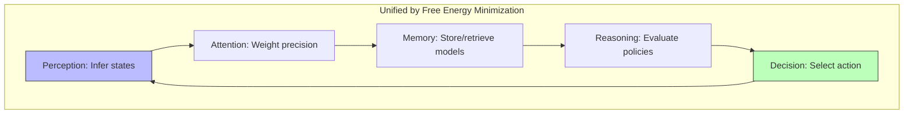

# Cognitive Functions

## Overview

Cognitive functions are the mental processes that enable perception, learning, memory, reasoning, and decision-making. Active Inference provides a unifying framework in which all cognitive functions can be understood as different aspects of free energy minimization through generative model inference.

## Taxonomy of Cognitive Functions

### Perception

Processing sensory input to form beliefs about the environment:

```math
q(s) = \arg\min_q F(q, o) = \arg\min_q \left[ D_{KL}[q(s) || p(s)] - \mathbb{E}_q[\ln p(o|s)] \right]
```

See: [[perception_processing]], [[visual_perception]], [[sensory_processing]]

### Attention

Precision-weighted selection of relevant information:

```math
\text{Attention}(x) = \pi(x) \cdot \varepsilon(x) \quad \text{(precision × prediction error)}
```

See: [[attention_mechanisms]], [[selective_attention]], [[precision_weighting]]

### Memory

Encoding, storage, and retrieval of information:

| Memory System | Active Inference Component | Timescale |
| --- | --- | --- |
| Working memory | Active state maintenance | Seconds |
| Episodic memory | Generative model replay | Minutes-years |
| Semantic memory | Learned parameters (A, B, C, D) | Days-lifetime |
| Procedural memory | Habitual policies E(π) | Weeks-lifetime |

See: [[working_memory]], [[episodic_memory]], [[semantic_memory]], [[memory_systems]]

### Reasoning and Decision-Making

Planning and inference over possible futures:

```math
G(\pi) = \sum_\tau \left[ -\text{info gain}(\pi, \tau) + \text{expected cost}(\pi, \tau) \right]
```

See: [[reasoning_problem_solving]], [[decision_making]], [[planning_as_inference]]

### Executive Functions

Top-level control of cognitive processes:

- **Inhibition**: Precision reduction of inappropriate responses
- **Flexibility**: Switching between generative models
- **Updating**: Revising beliefs in working memory

See: [[executive_functions]], [[cognitive_control]], [[task_switching]]

### Language

Communication as inference:

See: [[language_processing]], [[communication]]

## Cognitive Functions in Active Inference



All cognitive functions arise from the same variational principle applied to different components of the generative model at different timescales.

## Related Topics

- [[attention_mechanisms]] — Attention as precision
- [[decision_making]] — Decision-making
- [[cognitive_neuroscience]] — Neural correlates
- [[executive_functions]] — Executive control
- [[information_processing]] — Information processing
