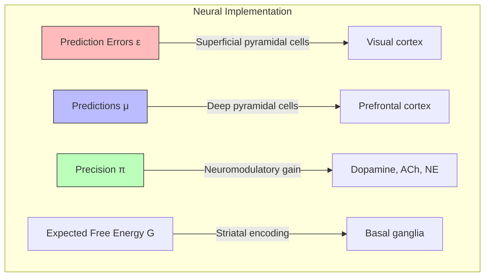

# Cognitive Neuroscience

## Overview

Cognitive neuroscience investigates the neural basis of cognitive processes — how brain dynamics implement perception, attention, memory, language, and decision-making. Active Inference provides a unifying theory: all cognition is variational inference implemented by neural circuits.

## Neural Systems and Active Inference Components

| Brain System | Active Inference Role | Key Process |
| --- | --- | --- |
| Visual cortex (V1-V5) | Hierarchical observation model (A) | Perceptual inference |
| Prefrontal cortex | Policy evaluation, model selection | $G(\pi)$ computation |
| Basal ganglia | Action selection, habit learning | Policy posterior $q(\pi)$ |
| Hippocampus | Transition model, episodic memory | B matrix, context learning |
| Amygdala | Preference encoding | C vector (valence) |
| Cerebellum | Forward model, motor prediction | Predictive control |
| Thalamus | Precision routing | Attention gating |
| Insula | Interoceptive inference | Homeostatic monitoring |

## Neuroimaging Methods

### Mapping Inference to Brain Activity

| Method | Temporal Resolution | Spatial Resolution | Measures |
| --- | --- | --- | --- |
| fMRI | Seconds | Millimeters | Hemodynamic response (BOLD) |
| EEG | Milliseconds | Centimeters | Electrical potentials |
| MEG | Milliseconds | Centimeters | Magnetic fields |
| TMS | Milliseconds | Centimeters | Causal perturbation |
| Single-unit recording | Milliseconds | Single neuron | Spike rates |

### Dynamic Causal Modeling (DCM)

Friston's DCM is the neuroimaging method most aligned with Active Inference:

```math
\dot{x} = f(x, u, \theta) + v \quad \text{(neural state dynamics)}
$$
$$y = g(x, \theta) + e \quad \text{(hemodynamic observation)}
```

DCM treats brain connectivity estimation as Bayesian model inversion — identical to Active Inference but applied to neuroimaging data.

## Neural Correlates of Key Active Inference Quantities



## Related Topics

- [[bayesian_brain_hypothesis]] — Bayesian brain theory
- [[predictive_coding]] — Cortical predictive coding
- [[computational_neuroscience]] — Computational neuroscience
- [[attention_mechanisms]] — Neural attention
- [[neural_computation]] — Neural computation
- [[neural_architectures]] — Neural circuit architectures
