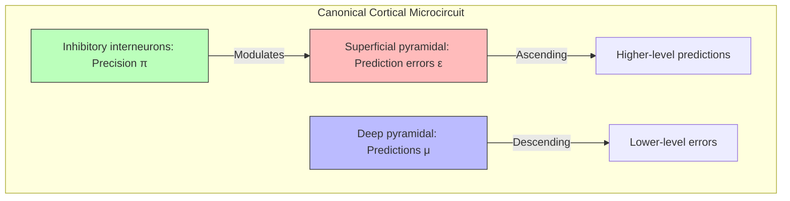

# Computational Neuroscience

## Overview

Computational neuroscience seeks to understand the brain through mathematical models and simulations. Active Inference provides a normative framework: rather than asking "what do neurons compute?", it asks "what problem is the brain solving?" — the answer being: minimizing variational free energy.

## Levels of Analysis

### Marr's Three Levels

| Level | Question | Active Inference Answer |
| --- | --- | --- |
| Computational | What problem? | Minimize free energy (surprise) |
| Algorithmic | What algorithm? | Variational message passing / predictive coding |
| Implementational | What hardware? | Neural circuits with precision-weighted prediction errors |

## Neural Implementation of Active Inference

### Cortical Microcircuit



### Neural Dynamics

```math
\begin{aligned}
& \dot{\mu}_l = D\mu_l - \kappa \left( \Pi_{\varepsilon_l} \varepsilon_l - \frac{\partial g(\mu_l)^T}{\partial \mu_l} \Pi_{\varepsilon_{l-1}} \varepsilon_{l-1} \right) \\
& \varepsilon_l = \mu_{l-1} - g(\mu_l) \quad \text{(prediction error)} \\
& \Pi_{\varepsilon_l} = \text{precision of error at level } l
\end{aligned}
```

### Neuromodulatory Systems

| Neuromodulator | Computational Role | Precision Function |
| --- | --- | --- |
| Dopamine | Expected precision of $G(\pi)$ | Policy confidence |
| Acetylcholine | Sensory precision $\Pi_o$ | Likelihood weighting |
| Noradrenaline | State transition precision $\Pi_s$ | Environmental volatility |
| Serotonin | Temporal discounting | Future precision weighting |

## Key Computational Neuroscience Results

- **Retinal processing**: Efficient coding of natural scenes (Barlow, 1961)
- **Cortical predictive coding**: Rao & Ballard (1999) — visual predictions
- **Bayesian brain**: Knill & Pouget (2004) — probabilistic population codes
- **Free energy principle**: Friston (2010) — unifying brain theory

## Related Topics

- [[bayesian_brain_hypothesis]] — Bayesian brain
- [[cognitive_neuroscience]] — Brain-cognition relationships
- [[predictive_coding]] — Predictive coding
- [[neural_computation]] — Neural computation
- [[neural_coding]] — Neural codes
- [[neural_architectures]] — Neural architectures
