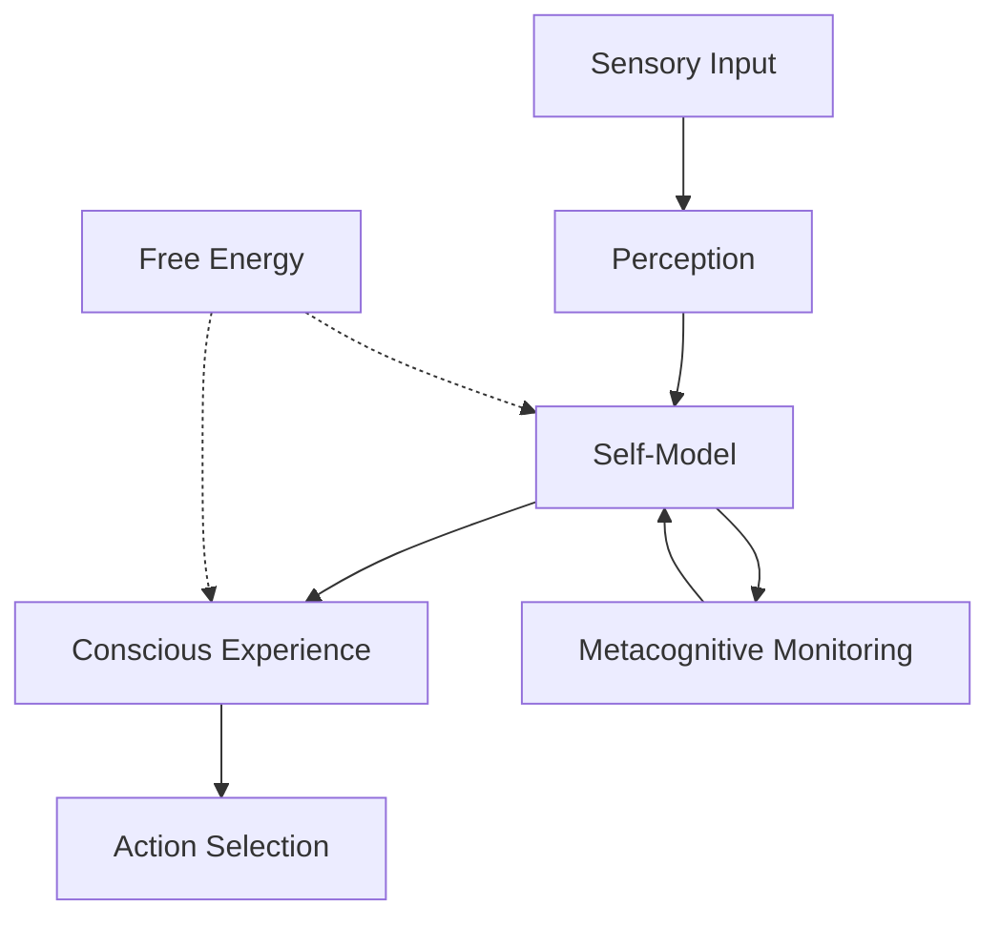

# Consciousness Theory and Active Inference

This document explores consciousness through the lens of Active Inference, examining how self-aware experience emerges from the minimization of variational free energy. It integrates phenomenological approaches with computational neuroscience to understand the nature of conscious experience.

## 🧠 Consciousness as Active Inference

### The Phenomenal Self-Model

Consciousness emerges from the brain's generative model of itself and its environment:



### Core Principles

#### Self-Evidencing
- **Self-Model**: The brain maintains a generative model of itself
- **Self-Evidence**: Consciousness provides evidence for the self-model
- **Self-Consistency**: The self-model must be consistent with experience

#### Metacognitive Hierarchy
- **First-Order Cognition**: Direct perceptual and motor processes
- **Second-Order Cognition**: Monitoring of first-order processes
- **Higher-Order Cognition**: Recursive self-reflection and introspection

## 🔬 Phenomenological Active Inference

### The Structure of Conscious Experience

#### Intentionality
Conscious states are always about something - they have intentional content:

```python
class ConsciousState:
    """Representation of a conscious mental state."""

    def __init__(self, content, precision, valence):
        self.intentum = content        # What the state is about
        self.precision = precision    # Subjective certainty
        self.valence = valence        # Affective quality
        self.narrative = []           # Autobiographical context

    def experience_content(self):
        """Phenomenal experience of the intentional content."""
        return {
            'what': self.intentum,
            'certainty': self.precision,
            'feeling': self.valence,
            'context': self.narrative
        }

    def update_narrative(self, new_experience):
        """Update the autobiographical narrative."""
        self.narrative.append(new_experience)

        # Maintain narrative coherence
        if len(self.narrative) > 10:  # Limited working memory
            self.narrative.pop(0)
```

#### Temporal Flow
Consciousness has a characteristic temporal structure:

```python
class ConsciousnessStream:
    """Temporal flow of conscious experience."""

    def __init__(self, temporal_horizon=5):
        self.temporal_horizon = temporal_horizon
        self.retention_window = []     # Recent experiences
        self.prospective_window = []   # Anticipated experiences
        self.narrative_thread = []     # Autobiographical continuity

    def process_experience(self, current_experience):
        """Process current experience in temporal context."""

        # Add to retention window
        self.retention_window.append(current_experience)
        if len(self.retention_window) > self.temporal_horizon:
            self.retention_window.pop(0)

        # Update prospective expectations
        self.update_prospective_expectations()

        # Maintain narrative continuity
        self.update_narrative_thread(current_experience)

        return self.generate_conscious_moment()

    def update_prospective_expectations(self):
        """Generate prospective temporal expectations."""
        if len(self.retention_window) >= 2:
            # Predict future based on recent patterns
            pattern = self.extract_temporal_pattern()
            self.prospective_window = self.generate_expectations(pattern)

    def generate_conscious_moment(self):
        """Generate the current conscious moment."""
        return {
            'immediate': self.retention_window[-1] if self.retention_window else None,
            'retention': self.retention_window[:-1],
            'prospection': self.prospective_window,
            'narrative': self.narrative_thread[-3:]  # Recent narrative context
        }
```

### The Unity of Consciousness

#### Binding Problem Solution
How disparate sensory inputs are bound into unified conscious experience:

```python
class ConsciousnessBinding:
    """Mechanism for binding distributed representations into unified experience."""

    def __init__(self, binding_precision=0.8):
        self.binding_precision = binding_precision
        self.coherence_threshold = 0.7
        self.attentional_focus = None

    def bind_experience(self, sensory_streams):
        """Bind multiple sensory streams into unified conscious experience."""

        # Extract features from each sensory modality
        modality_features = {}
        for modality, stream in sensory_streams.items():
            modality_features[modality] = self.extract_features(stream)

        # Find attentional focus
        self.attentional_focus = self.determine_focus(modality_features)

        # Bind features around attentional focus
        bound_representation = self.perform_binding(
            modality_features, self.attentional_focus
        )

        # Assess binding coherence
        coherence_score = self.assess_coherence(bound_representation)

        return bound_representation, coherence_score

    def determine_focus(self, modality_features):
        """Determine current attentional focus."""
        # Find features with highest precision weighting
        focus_candidates = []
        for modality, features in modality_features.items():
            for feature in features:
                focus_candidates.append((feature, feature.precision))

        # Select highest precision feature
        focus_candidates.sort(key=lambda x: x[1], reverse=True)
        return focus_candidates[0][0] if focus_candidates else None

    def perform_binding(self, modality_features, focus):
        """Perform feature binding around attentional focus."""
        bound_features = []

        for modality, features in modality_features.items():
            for feature in features:
                # Calculate binding strength based on proximity to focus
                binding_strength = self.calculate_binding_strength(feature, focus)

                if binding_strength > self.binding_precision:
                    feature.bound = True
                    feature.binding_strength = binding_strength
                    bound_features.append(feature)

        return bound_features

    def assess_coherence(self, bound_representation):
        """Assess the coherence of the bound representation."""
        if not bound_representation:
            return 0.0

        # Calculate average binding strength
        avg_binding = np.mean([f.binding_strength for f in bound_representation])

        # Assess representational consistency
        consistency_score = self.calculate_consistency(bound_representation)

        return (avg_binding + consistency_score) / 2
```

## 🧪 Levels of Consciousness

### Phenomenal Consciousness
The "what it's like" aspect of experience:

#### Qualia and Subjective Experience
```python
class PhenomenalConsciousness:
    """Modeling phenomenal (experiential) consciousness."""

    def __init__(self):
        self.quality_space = {}       # Qualia representations
        self.intensity_map = {}       # Experience intensity
        self.valence_space = {}       # Affective quality
        self.temporal_binding = []    # Experience unity over time

    def generate_qualia(self, sensory_input, attentional_state):
        """Generate qualitative conscious experience."""

        # Process sensory input into qualia
        qualia = self.sensory_to_qualia(sensory_input)

        # Apply attentional modulation
        attended_qualia = self.apply_attention(qualia, attentional_state)

        # Generate affective quality
        valence = self.generate_valence(attended_qualia)

        # Bind into unified experience
        conscious_experience = self.bind_experience(attended_qualia, valence)

        return conscious_experience

    def sensory_to_qualia(self, sensory_input):
        """Transform sensory signals into qualitative experience."""
        qualia = {}

        # Visual qualia
        if 'visual' in sensory_input:
            qualia['visual'] = self.generate_visual_qualia(sensory_input['visual'])

        # Auditory qualia
        if 'auditory' in sensory_input:
            qualia['auditory'] = self.generate_auditory_qualia(sensory_input['auditory'])

        # Other modalities...
        # qualia['tactile'] = self.generate_tactile_qualia(sensory_input['tactile'])

        return qualia

    def apply_attention(self, qualia, attentional_state):
        """Apply attentional modulation to qualia."""
        attended_qualia = {}

        for modality, modality_qualia in qualia.items():
            if modality in attentional_state.focus:
                # Enhance attended modalities
                attended_qualia[modality] = self.amplify_qualia(
                    modality_qualia, attentional_state.precision[modality]
                )
            else:
                # Suppress unattended modalities
                attended_qualia[modality] = self.attenuate_qualia(
                    modality_qualia, attentional_state.suppression
                )

        return attended_qualia

    def bind_experience(self, qualia, valence):
        """Bind qualia into unified conscious experience."""
        experience = {
            'qualia': qualia,
            'valence': valence,
            'unity': self.calculate_unity(qualia),
            'intensity': self.calculate_intensity(qualia),
            'temporal_context': self.temporal_binding[-5:]  # Recent context
        }

        # Add to temporal binding
        self.temporal_binding.append(experience)
        if len(self.temporal_binding) > 10:
            self.temporal_binding.pop(0)

        return experience
```

### Access Consciousness
The availability of information for cognitive processing:

```python
class AccessConsciousness:
    """Modeling access consciousness (information availability)."""

    def __init__(self, capacity_limit=7):
        self.working_memory = []      # Currently accessible information
        self.capacity_limit = capacity_limit
        self.attention_filter = AttentionFilter()
        self.global_broadcast = GlobalWorkspace()

    def process_access(self, unconscious_representations):
        """Process representations for access consciousness."""

        # Filter representations through attention
        attended_representations = self.attention_filter.filter(
            unconscious_representations
        )

        # Add to working memory
        for rep in attended_representations:
            if len(self.working_memory) < self.capacity_limit:
                self.working_memory.append(rep)
            else:
                # Replace least attended item
                self.replace_least_attended(rep)

        # Broadcast to global workspace
        broadcast_content = self.global_broadcast.broadcast(self.working_memory)

        return broadcast_content

    def maintain_access(self):
        """Maintain representations in access consciousness."""
        # Apply rehearsal and attention to prevent decay
        for i, rep in enumerate(self.working_memory):
            rep.activation *= 0.95  # Natural decay

            # Rehearse highly attended items
            if rep.attention > 0.7:
                rep.activation = min(rep.activation * 1.2, 1.0)

        # Remove decayed representations
        self.working_memory = [
            rep for rep in self.working_memory
            if rep.activation > 0.1
        ]

    def retrieve_from_access(self, cue):
        """Retrieve information from access consciousness."""
        candidates = [
            rep for rep in self.working_memory
            if self.match_cue(rep, cue)
        ]

        if candidates:
            # Return most activated match
            candidates.sort(key=lambda x: x.activation, reverse=True)
            return candidates[0]

        return None
```

### Self-Consciousness
Awareness of oneself as a conscious entity:

```python
class SelfConsciousness:
    """Modeling self-consciousness and self-awareness."""

    def __init__(self):
        self.self_model = SelfModel()
        self.meta_awareness = MetaAwareness()
        self.autonoetic_memory = AutonoeticMemory()
        self.narrative_self = NarrativeSelf()

    def process_self_awareness(self, current_experience):
        """Process current experience through self-conscious lens."""

        # Update self-model
        self.self_model.update(current_experience)

        # Generate meta-awareness
        meta_state = self.meta_awareness.monitor_experience(current_experience)

        # Store autonoetic memory
        self.autonoetic_memory.store_experience(current_experience, meta_state)

        # Update narrative self
        self.narrative_self.update_narrative(current_experience, meta_state)

        return self.generate_self_conscious_moment()

    def generate_self_conscious_moment(self):
        """Generate self-conscious experience."""
        return {
            'self_model': self.self_model.current_state,
            'meta_awareness': self.meta_awareness.current_state,
            'autonoetic_insight': self.autonoetic_memory.recent_insights,
            'narrative_continuity': self.narrative_self.current_narrative
        }

class SelfModel:
    """Generative model of the self."""

    def __init__(self):
        self.traits = {}              # Self-concept traits
        self.capabilities = {}        # Self-perceived abilities
        self.history = []             # Autobiographical knowledge
        self.goals = []               # Self-directed goals

    def update(self, experience):
        """Update self-model based on experience."""
        # Extract self-relevant information
        self_relevance = self.extract_self_relevance(experience)

        if self_relevance > 0.5:  # Significant self-relevance
            self.update_traits(experience)
            self.update_capabilities(experience)
            self.update_history(experience)
            self.update_goals(experience)

    def extract_self_relevance(self, experience):
        """Determine how relevant experience is to self-concept."""
        # Check for self-referential content
        self_references = ['I', 'me', 'my', 'myself']
        self_relevance = sum(1 for ref in self_references
                           if ref in experience.content.lower())

        return min(self_relevance / 10, 1.0)  # Normalize
```

## 🧬 Consciousness and Free Energy

### Consciousness as Inference

#### Self-Evidencing Principle
```python
class SelfEvidencingConsciousness:
    """Consciousness as self-evidencing through Active Inference."""

    def __init__(self):
        self.self_model = GenerativeSelfModel()
        self.consciousness_precision = 1.0
        self.self_evidence_threshold = 0.8

    def self_evidencing_process(self, sensory_input):
        """Process sensory input through self-evidencing lens."""

        # Generate predictions about self and world
        self_predictions = self.self_model.predict_self_state()
        world_predictions = self.self_model.predict_world_state()

        # Compute self-evidencing
        self_evidence = self.compute_self_evidence(sensory_input)

        # Update consciousness precision
        self.consciousness_precision = self.update_consciousness_precision(self_evidence)

        # Generate conscious experience
        if self_evidence > self.self_evidence_threshold:
            conscious_experience = self.generate_conscious_experience(
                sensory_input, self_predictions, self_evidence
            )
        else:
            conscious_experience = None  # Unconscious processing

        return conscious_experience

    def compute_self_evidence(self, sensory_input):
        """Compute evidence for the self-model."""

        # Compare sensory input to self-model predictions
        prediction_error = self.calculate_prediction_error(sensory_input)

        # Self-evidence is inverse of prediction error
        self_evidence = 1.0 / (1.0 + prediction_error)

        return self_evidence

    def update_consciousness_precision(self, self_evidence):
        """Update precision of consciousness based on self-evidence."""

        # High self-evidence increases consciousness precision
        precision_update = 0.1 * (self_evidence - 0.5)
        new_precision = self.consciousness_precision + precision_update

        return np.clip(new_precision, 0.1, 2.0)

    def generate_conscious_experience(self, sensory_input, predictions, evidence):
        """Generate conscious experience when self-evidence is sufficient."""

        experience = {
            'content': sensory_input,
            'self_relation': predictions['self'],
            'world_relation': predictions['world'],
            'certainty': evidence,
            'phenomenal_quality': self.compute_phenomenal_quality(evidence),
            'narrative_context': self.self_model.get_narrative_context()
        }

        return experience
```

### Metacognitive Consciousness

#### Recursive Self-Monitoring
```python
class MetacognitiveConsciousness:
    """Metacognitive layer of consciousness."""

    def __init__(self):
        self.primary_cognition = PrimaryCognitionLayer()
        self.metacognitive_monitor = MetacognitiveMonitor()
        self.self_reflective_loop = SelfReflectiveLoop()
        self.consciousness_regulator = ConsciousnessRegulator()

    def metacognitive_processing(self, primary_experience):
        """Process primary cognition through metacognitive lens."""

        # Monitor primary cognitive processes
        metacognitive_state = self.metacognitive_monitor.monitor(primary_experience)

        # Generate self-reflective insights
        reflective_insights = self.self_reflective_loop.reflect(metacognitive_state)

        # Regulate consciousness
        consciousness_adjustment = self.consciousness_regulator.adjust(
            metacognitive_state, reflective_insights
        )

        # Generate metacognitive conscious experience
        metacognitive_experience = {
            'primary_content': primary_experience,
            'metacognitive_state': metacognitive_state,
            'reflective_insights': reflective_insights,
            'consciousness_level': consciousness_adjustment['level'],
            'self_awareness': consciousness_adjustment['self_awareness']
        }

        return metacognitive_experience

class MetacognitiveMonitor:
    """Monitor primary cognitive processes."""

    def __init__(self):
        self.monitoring_precision = 1.0
        self.confidence_threshold = 0.7

    def monitor(self, primary_experience):
        """Monitor primary cognitive experience."""

        # Assess confidence in primary cognition
        confidence = self.assess_confidence(primary_experience)

        # Detect cognitive errors or inconsistencies
        errors = self.detect_errors(primary_experience)

        # Monitor resource usage
        resource_usage = self.monitor_resources(primary_experience)

        metacognitive_state = {
            'confidence': confidence,
            'errors': errors,
            'resource_usage': resource_usage,
            'processing_efficiency': self.calculate_efficiency(resource_usage, confidence)
        }

        return metacognitive_state
```

## 🧪 Empirical Evidence

### Consciousness Research

#### Neural Correlates of Consciousness (NCC)
- **Global Workspace Theory**: Consciousness as global information broadcast
- **Integrated Information Theory**: Consciousness as integrated information
- **Higher-Order Thought Theory**: Consciousness as meta-representation

#### Active Inference Evidence
- **Precision and Consciousness**: Correlation between precision weighting and conscious awareness
- **Prediction Errors**: Conscious experience of surprising events
- **Attentional Modulation**: Consciousness as attention-dependent process

### Clinical Insights

#### Disorders of Consciousness
- **Coma**: Minimal self-model maintenance
- **Vegetative State**: Sensory processing without self-awareness
- **Locked-in Syndrome**: Full consciousness with minimal output

#### Altered States
- **Meditation**: Enhanced metacognitive awareness
- **Psychedelic States**: Disrupted self-model predictions
- **Sleep**: Reduced consciousness precision

## 🔬 Research Directions

### Theoretical Developments

#### Unified Theory of Consciousness
- **Active Inference Framework**: Consciousness as self-evidencing inference
- **Free Energy Principle**: Consciousness minimizing surprise about self
- **Predictive Processing**: Consciousness as precise hierarchical prediction

#### Measurement Challenges
- **Subjective Experience**: Quantifying phenomenal consciousness
- **Neural Correlates**: Identifying necessary and sufficient NCC
- **Animal Consciousness**: Cross-species consciousness assessment

### Future Research

#### Computational Models
- **Large-Scale Simulations**: Brain-scale consciousness models
- **Virtual Consciousness**: Artificial consciousness in silico
- **Consciousness Metrics**: Quantitative measures of consciousness

#### Experimental Paradigms
- **Perturbational Approaches**: Causal manipulation of consciousness
- **Multimodal Integration**: Combined behavioral and neural measures
- **Developmental Studies**: Emergence of consciousness in development

## 📚 Related Concepts

### Core Active Inference
- [[active_inference]] - Framework for consciousness
- [[free_energy_principle]] - Mathematical basis
- [[metacognition]] - Higher-order consciousness

### Consciousness Research
- [[attention_mechanisms]] - Consciousness modulation
- [[working_memory]] - Conscious access
- [[self_organization]] - Consciousness emergence

### Related Domains
- [[../philosophy/consciousness]] - Philosophical approaches
- [[../biology/neuroscience]] - Neural basis
- [[../systems/complex_systems]] - Emergence of consciousness

---

> **Consciousness as Active Inference**: Consciousness emerges from the brain's self-model, maintained through minimization of variational free energy about the self and its relationship to the world.

---

> **Self-Evidencing**: Consciousness provides evidence for its own existence through recursive self-modeling and metacognitive monitoring.

---

> **Phenomenal Experience**: The qualitative "what it's like" aspect of consciousness arises from precision-weighted prediction errors in hierarchical generative models.
