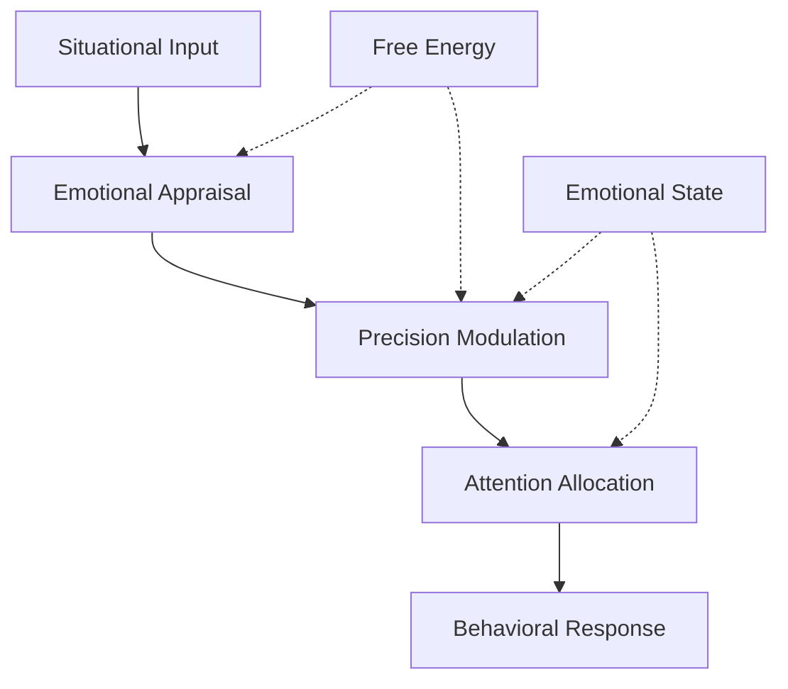

# Emotional Processing Through Active Inference

This document explores emotional processing as an Active Inference mechanism, examining how emotions emerge from the minimization of variational free energy in affective prediction and regulation. It integrates computational neuroscience with affective science to understand the functional role of emotions in cognition.

## 🧠 Emotional Active Inference

### Emotions as Precision-Weighted Predictions

Emotions as affective states that modulate precision weighting:



### Core Emotional Processing Architecture

```python
class EmotionalActiveInference:
    """Emotional processing through Active Inference."""

    def __init__(self, emotional_profile):
        self.emotional_profile = emotional_profile

        # Core emotional components
        self.appraisal_system = EmotionalAppraisalSystem()
        self.precision_modulator = EmotionalPrecisionModulator()
        self.affective_memory = AffectiveMemorySystem()
        self.motivational_system = MotivationalSystem()

        # Emotional state
        self.current_emotion = None
        self.emotional_intensity = 0.0
        self.emotional_valence = 0.0

    def process_emotional_stimulus(self, stimulus, context):
        """Process stimulus through emotional Active Inference."""

        # Emotional appraisal
        appraisal = self.appraisal_system.appraise_stimulus(stimulus, context)

        # Update emotional state
        self.update_emotional_state(appraisal)

        # Modulate precision weighting
        precision_modulation = self.precision_modulator.modulate_precision(
            self.current_emotion, self.emotional_intensity
        )

        # Generate affective response
        affective_response = self.generate_affective_response(
            appraisal, precision_modulation
        )

        # Update affective memory
        self.affective_memory.consolidate_experience(
            stimulus, appraisal, affective_response
        )

        return affective_response

    def update_emotional_state(self, appraisal):
        """Update current emotional state based on appraisal."""

        # Determine primary emotion
        primary_emotion = appraisal['primary_emotion']

        # Calculate emotional intensity
        intensity = self.calculate_emotional_intensity(appraisal)

        # Determine emotional valence
        valence = self.determine_emotional_valence(appraisal)

        # Update current state
        self.current_emotion = primary_emotion
        self.emotional_intensity = intensity
        self.emotional_valence = valence

    def calculate_emotional_intensity(self, appraisal):
        """Calculate intensity of emotional response."""

        # Base intensity from appraisal dimensions
        relevance_intensity = appraisal.get('personal_relevance', 0.5)
        congruence_intensity = 1.0 - appraisal.get('goal_congruence', 0.5)
        coping_intensity = appraisal.get('coping_potential', 0.5)

        # Combine intensity factors
        intensity = (relevance_intensity + congruence_intensity +
                    (1.0 - coping_intensity)) / 3.0

        return np.clip(intensity, 0.0, 1.0)

    def determine_emotional_valence(self, appraisal):
        """Determine positive/negative valence of emotion."""

        goal_congruence = appraisal.get('goal_congruence', 0.5)
        coping_potential = appraisal.get('coping_potential', 0.5)

        # Valence as combination of goal congruence and coping
        valence = (goal_congruence + coping_potential) / 2.0

        # Convert to bipolar scale (-1 to 1)
        return 2.0 * (valence - 0.5)

    def generate_affective_response(self, appraisal, precision_modulation):
        """Generate affective response to emotional stimulus."""

        response = {
            'emotion': self.current_emotion,
            'intensity': self.emotional_intensity,
            'valence': self.emotional_valence,
            'physiological_response': self.generate_physiological_response(),
            'behavioral_tendencies': self.generate_behavioral_tendencies(),
            'precision_modulation': precision_modulation,
            'motivational_state': self.motivational_system.get_current_motivation()
        }

        return response
```

## 🔬 Emotional Appraisal and Prediction

### Appraisal as Bayesian Inference

Emotional appraisal as probabilistic inference over emotional categories:

```python
class EmotionalAppraisalSystem:
    """Emotional appraisal through Bayesian inference."""

    def __init__(self):
        # Emotional categories and their features
        self.emotional_categories = {
            'joy': {'valence': 0.9, 'arousal': 0.7, 'goal_congruence': 0.9},
            'sadness': {'valence': 0.1, 'arousal': 0.3, 'goal_congruence': 0.1},
            'anger': {'valence': 0.2, 'arousal': 0.9, 'goal_congruence': 0.1},
            'fear': {'valence': 0.1, 'arousal': 0.95, 'goal_congruence': 0.0},
            'surprise': {'valence': 0.5, 'arousal': 0.8, 'goal_congruence': 0.5},
            'disgust': {'valence': 0.1, 'arousal': 0.6, 'goal_congruence': 0.2}
        }

        self.appraisal_dimensions = [
            'goal_congruence', 'personal_relevance', 'coping_potential',
            'future_expectancy', 'agency', 'novelty', 'pleasantness'
        ]

    def appraise_stimulus(self, stimulus, context):
        """Appraise stimulus for emotional significance."""

        # Extract appraisal dimensions
        appraisal_dimensions = self.extract_appraisal_dimensions(stimulus, context)

        # Infer emotional category probabilities
        emotion_probabilities = self.infer_emotion_probabilities(appraisal_dimensions)

        # Determine primary emotion
        primary_emotion = max(emotion_probabilities, key=emotion_probabilities.get)

        appraisal = {
            'dimensions': appraisal_dimensions,
            'emotion_probabilities': emotion_probabilities,
            'primary_emotion': primary_emotion,
            'confidence': emotion_probabilities[primary_emotion],
            'intensity_prediction': self.predict_emotional_intensity(appraisal_dimensions)
        }

        return appraisal

    def extract_appraisal_dimensions(self, stimulus, context):
        """Extract appraisal dimensions from stimulus and context."""

        dimensions = {}

        # Goal congruence: Does stimulus help/hinder goals?
        dimensions['goal_congruence'] = self.assess_goal_congruence(stimulus, context)

        # Personal relevance: How important is this to me?
        dimensions['personal_relevance'] = self.assess_personal_relevance(stimulus, context)

        # Coping potential: Can I deal with this?
        dimensions['coping_potential'] = self.assess_coping_potential(stimulus, context)

        # Future expectancy: What does this predict about the future?
        dimensions['future_expectancy'] = self.assess_future_expectancy(stimulus, context)

        # Agency: Who is responsible for this?
        dimensions['agency'] = self.assess_agency(stimulus, context)

        # Novelty: How unexpected is this?
        dimensions['novelty'] = self.assess_novelty(stimulus, context)

        # Pleasantness: Basic hedonic quality
        dimensions['pleasantness'] = self.assess_pleasantness(stimulus)

        return dimensions

    def infer_emotion_probabilities(self, dimensions):
        """Infer probabilities of different emotions."""

        probabilities = {}

        for emotion, emotion_profile in self.emotional_categories.items():
            # Calculate likelihood of dimensions given emotion
            likelihood = self.calculate_emotion_likelihood(dimensions, emotion_profile)
            probabilities[emotion] = likelihood

        # Normalize to get probabilities
        total = sum(probabilities.values())
        for emotion in probabilities:
            probabilities[emotion] /= total

        return probabilities

    def calculate_emotion_likelihood(self, dimensions, emotion_profile):
        """Calculate likelihood of dimensions given emotion profile."""

        likelihood = 1.0

        for dimension, value in dimensions.items():
            if dimension in emotion_profile:
                # Gaussian likelihood centered on emotion profile
                expected_value = emotion_profile[dimension]
                variance = 0.1  # Assumed variance
                gaussian_likelihood = np.exp(-((value - expected_value) ** 2) / (2 * variance))
                likelihood *= gaussian_likelihood

        return likelihood
```

## 🧪 Emotional Precision Weighting

### Emotions as Attention Modulators

How emotions modulate attention through precision changes:

```python
class EmotionalPrecisionModulator:
    """Emotional modulation of precision weighting."""

    def __init__(self):
        # Emotion-specific precision modulation patterns
        self.emotion_precision_patterns = {
            'fear': {
                'threat_precision': 2.0,      # Heightened threat detection
                'peripheral_precision': 1.5,   # Broadened attention
                'central_precision': 0.8       # Narrowed central focus
            },
            'anger': {
                'goal_relevant_precision': 1.8,  # Enhanced goal pursuit
                'social_precision': 1.3,         # Heightened social awareness
                'cognitive_precision': 0.9       # Reduced cognitive flexibility
            },
            'joy': {
                'reward_precision': 1.6,         # Enhanced reward sensitivity
                'social_precision': 1.4,         # Increased social engagement
                'exploration_precision': 1.3      # Broadened exploration
            },
            'sadness': {
                'self_reflective_precision': 1.7,  # Enhanced self-reflection
                'past_precision': 1.5,             # Increased past focus
                'future_precision': 0.7            # Reduced future orientation
            }
        }

    def modulate_precision(self, emotion, intensity):
        """Modulate precision weighting based on emotion."""

        if emotion not in self.emotion_precision_patterns:
            return {}  # No modulation for unrecognized emotions

        base_modulation = self.emotion_precision_patterns[emotion]

        # Scale modulation by emotional intensity
        scaled_modulation = {}
        for precision_type, modulation_factor in base_modulation.items():
            # Intensity scales the modulation effect
            scaled_modulation[precision_type] = 1.0 + (modulation_factor - 1.0) * intensity

        return scaled_modulation

    def apply_precision_modulation(self, precision_weights, emotional_modulation):
        """Apply emotional modulation to precision weights."""

        modulated_weights = precision_weights.copy()

        for precision_type, modulation in emotional_modulation.items():
            if precision_type in modulated_weights:
                modulated_weights[precision_type] *= modulation

        return modulated_weights

    def predict_emotional_impact(self, stimulus, current_precision):
        """Predict how emotion will modulate precision."""

        # Simulate emotional response
        simulated_emotion = self.simulate_emotional_response(stimulus)

        # Calculate precision modulation
        modulation = self.modulate_precision(
            simulated_emotion['emotion'],
            simulated_emotion['intensity']
        )

        # Predict modulated precision
        predicted_precision = self.apply_precision_modulation(current_precision, modulation)

        return {
            'predicted_emotion': simulated_emotion,
            'precision_modulation': modulation,
            'predicted_precision': predicted_precision
        }
```

## 🧬 Affective Memory and Learning

### Emotional Consolidation

How emotions influence memory formation and consolidation:

```python
class AffectiveMemorySystem:
    """Memory system modulated by emotional processing."""

    def __init__(self):
        self.episodic_memory = EpisodicAffectiveMemory()
        self.semantic_memory = SemanticAffectiveMemory()
        self.working_memory = WorkingAffectiveMemory()
        self.consolidation_process = AffectiveConsolidation()

    def consolidate_experience(self, stimulus, appraisal, response):
        """Consolidate emotional experience into memory."""

        # Create emotional memory trace
        memory_trace = self.create_emotional_memory_trace(
            stimulus, appraisal, response
        )

        # Determine memory strength based on emotion
        memory_strength = self.calculate_memory_strength(appraisal, response)

        # Store in appropriate memory systems
        if memory_strength > 0.7:  # High emotional significance
            self.episodic_memory.store_episodic(memory_trace, memory_strength)
            self.semantic_memory.extract_semantic(memory_trace)

        # Update working memory if emotionally relevant
        if appraisal.get('personal_relevance', 0) > 0.6:
            self.working_memory.maintain_affective(memory_trace)

        # Trigger consolidation process
        self.consolidation_process.consolidate_affective(memory_trace, memory_strength)

    def create_emotional_memory_trace(self, stimulus, appraisal, response):
        """Create comprehensive emotional memory trace."""

        trace = {
            'stimulus': stimulus,
            'appraisal': appraisal,
            'response': response,
            'emotional_context': {
                'emotion': response.get('emotion'),
                'intensity': response.get('intensity'),
                'valence': response.get('valence')
            },
            'physiological_state': response.get('physiological_response'),
            'behavioral_context': response.get('behavioral_tendencies'),
            'timestamp': time.time(),
            'context_tags': self.extract_context_tags(stimulus)
        }

        return trace

    def calculate_memory_strength(self, appraisal, response):
        """Calculate emotional memory strength."""

        # Base strength from emotional intensity
        intensity_contribution = response.get('intensity', 0.5)

        # Valence influence (negative emotions often stronger)
        valence = response.get('valence', 0.0)
        valence_contribution = 1.0 + abs(valence) * 0.5  # Stronger for extreme valence

        # Personal relevance
        relevance_contribution = appraisal.get('personal_relevance', 0.5) + 0.5

        # Novelty bonus
        novelty = appraisal.get('novelty', 0.5)
        novelty_bonus = 1.0 + novelty * 0.3

        strength = (intensity_contribution * valence_contribution *
                   relevance_contribution * novelty_bonus)

        return np.clip(strength, 0.0, 1.0)

    def retrieve_emotional_memory(self, cue, emotional_context):
        """Retrieve memories modulated by emotional state."""

        # Search episodic memory
        episodic_matches = self.episodic_memory.search_episodic(cue, emotional_context)

        # Search semantic memory
        semantic_matches = self.semantic_memory.search_semantic(cue, emotional_context)

        # Emotional congruence filtering
        filtered_episodic = self.filter_by_emotional_congruence(
            episodic_matches, emotional_context
        )

        return {
            'episodic_memories': filtered_episodic,
            'semantic_knowledge': semantic_matches,
            'emotional_resonance': self.calculate_emotional_resonance(
                filtered_episodic + semantic_matches, emotional_context
            )
        }
```

## 🧪 Social Emotional Processing

### Empathy and Emotional Contagion

How emotions spread through social Active Inference:

```python
class SocialEmotionalProcessing:
    """Social aspects of emotional processing."""

    def __init__(self):
        self.empathy_system = EmpathySystem()
        self.emotional_contagion = EmotionalContagion()
        self.social_appraisal = SocialAppraisalSystem()
        self.relationship_memory = RelationshipEmotionalMemory()

    def process_social_emotion(self, observed_emotion, social_context):
        """Process emotions in social context."""

        # Empathize with observed emotion
        empathic_response = self.empathy_system.generate_empathy(observed_emotion)

        # Emotional contagion
        contagion_effect = self.emotional_contagion.calculate_contagion(
            observed_emotion, social_context
        )

        # Social appraisal
        social_appraisal = self.social_appraisal.appraise_social_context(
            observed_emotion, social_context
        )

        # Update relationship based on emotional interaction
        self.relationship_memory.update_relationship(
            social_context['agent'], empathic_response, contagion_effect
        )

        return {
            'empathic_response': empathic_response,
            'contagion_effect': contagion_effect,
            'social_appraisal': social_appraisal,
            'relationship_update': self.relationship_memory.get_relationship_state(
                social_context['agent']
            )
        }

    def generate_shared_emotional_experience(self, agent_emotions):
        """Generate shared emotional experience from multiple agents."""

        # Calculate emotional field
        emotional_field = self.calculate_emotional_field(agent_emotions)

        # Determine dominant emotion
        dominant_emotion = self.determine_dominant_emotion(emotional_field)

        # Generate collective emotional response
        collective_response = self.generate_collective_response(
            dominant_emotion, emotional_field
        )

        return {
            'emotional_field': emotional_field,
            'dominant_emotion': dominant_emotion,
            'collective_response': collective_response,
            'emotional_synchronization': self.calculate_synchronization(agent_emotions)
        }
```

## 🧬 Motivational Systems

### Emotion-Driven Motivation

How emotions generate and sustain motivation:

```python
class MotivationalSystem:
    """Motivational system driven by emotional processing."""

    def __init__(self):
        self.drive_system = DriveSystem()
        self.goal_system = GoalSystem()
        self.energy_system = EnergySystem()
        self.persistence_system = PersistenceSystem()

    def generate_motivation(self, emotional_state, goals, current_state):
        """Generate motivation from emotional and goal states."""

        # Emotional drive generation
        emotional_drive = self.drive_system.generate_emotional_drive(emotional_state)

        # Goal-directed motivation
        goal_motivation = self.goal_system.calculate_goal_motivation(goals, current_state)

        # Energy allocation
        energy_allocation = self.energy_system.allocate_energy(
            emotional_drive, goal_motivation
        )

        # Persistence determination
        persistence = self.persistence_system.determine_persistence(
            emotional_state, goal_motivation, energy_allocation
        )

        return {
            'emotional_drive': emotional_drive,
            'goal_motivation': goal_motivation,
            'energy_allocation': energy_allocation,
            'persistence': persistence,
            'overall_motivation': self.integrate_motivational_factors(
                emotional_drive, goal_motivation, energy_allocation, persistence
            )
        }

    def integrate_motivational_factors(self, emotional, goal, energy, persistence):
        """Integrate different motivational factors."""

        # Weighted integration
        emotional_weight = 0.4
        goal_weight = 0.4
        energy_weight = 0.1
        persistence_weight = 0.1

        integrated = (emotional_weight * emotional +
                     goal_weight * goal +
                     energy_weight * energy +
                     persistence_weight * persistence)

        return np.clip(integrated, 0.0, 1.0)
```

## 🔬 Clinical and Applied Implications

### Emotional Disorders

Understanding emotional processing deficits:

```python
class EmotionalDisorderModeling:
    """Modeling emotional disorders through Active Inference."""

    def __init__(self, disorder_profile):
        self.disorder_profile = disorder_profile
        self.appraisal_bias = AppraisalBias(disorder_profile)
        self.precision_abnormality = PrecisionAbnormality(disorder_profile)
        self.affective_memory_distortion = AffectiveMemoryDistortion(disorder_profile)

    def simulate_disordered_emotion(self, stimulus, context):
        """Simulate emotional processing with disorder characteristics."""

        # Biased appraisal
        biased_appraisal = self.appraisal_bias.apply_bias(stimulus, context)

        # Abnormal precision weighting
        abnormal_precision = self.precision_abnormality.apply_abnormality(
            biased_appraisal
        )

        # Distorted affective memory
        distorted_memory = self.affective_memory_distortion.apply_distortion(
            stimulus, biased_appraisal
        )

        # Generate disordered emotional response
        disordered_response = self.generate_disordered_response(
            biased_appraisal, abnormal_precision, distorted_memory
        )

        return disordered_response
```

## 📚 Related Concepts

### Core Emotional Processing
- [[emotional_processing]] - General emotional processing
- [[attention_mechanisms]] - Emotion-attention interactions
- [[decision_making]] - Emotion in decision making

### Active Inference Integration
- [[active_inference]] - Core framework
- [[precision_weighting]] - Precision modulation
- [[hierarchical_processing]] - Emotional hierarchies

### Applied Contexts
- [[working_memory]] - Emotional working memory
- [[social_cognition]] - Social emotional processing
- [[motivation]] - Emotional motivation

---

> **Emotional Active Inference**: Emotions emerge as precision-weighted predictions that modulate attention, memory, and behavior to minimize variational free energy in affective domains.

---

> **Appraisal as Inference**: Emotional appraisal involves Bayesian inference over the causes and consequences of emotionally significant events.

---

> **Precision and Affect**: Emotional states modulate the precision of predictions across sensory, cognitive, and behavioral domains, shaping attention and learning.
