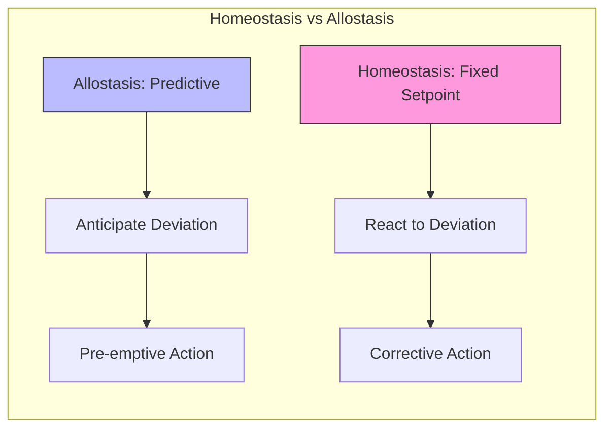

# Homeostatic Control Theory

Homeostatic control theory formalizes the mechanisms by which biological and artificial systems maintain internal stability. Under the Free Energy Principle, homeostasis is recast as free energy minimization: an organism persists by ensuring its sensory states remain within life-compatible bounds encoded as prior preferences.

## Classical Foundations

### Cybernetic Homeostasis

```math
\\begin{aligned}
& \\text{Error signal:} \\quad e(t) = r(t) - y(t) \\\\
& \\text{Controller:} \\quad u(t) = K_p e(t) + K_i \\int_0^t e(\\tau) d\\tau \\\\
& \\text{Plant:} \\quad \\dot{x} = Ax + Bu, \\quad y = Cx
\\end{aligned}
```

### From Homeostasis to Allostasis

Classical homeostasis maintains fixed setpoints. Allostasis extends this through predictive regulation:



## Free Energy Formulation

### Homeostasis as Free Energy Minimization

```math
\\begin{aligned}
& F = D_{KL}[q(s)||p(s|o)] - \\ln p(o) \\\\
& \\text{Prior preferences encode setpoints:} \\quad p(o) = \\mathcal{N}(o^*, \\Sigma_p) \\\\
& \\text{Homeostatic imperative:} \\quad \\min_a F \\Rightarrow o \\rightarrow o^*
\\end{aligned}
```

### Interoceptive Inference

The brain performs inference over interoceptive (body-internal) signals:

```math
\\varepsilon_{intero} = \\Pi_{intero} (o_{intero} - g(\\mu_{intero}))
```

## Hierarchical Homeostasis

```python
class HierarchicalHomeostasis:
    def __init__(self, levels):
        self.levels = levels
        self.controllers = {
            'cellular': HomeostaticController(setpoints={'pH': 7.4, 'temp': 37.0}),
            'organ': HomeostaticController(setpoints={'pressure': 120, 'flow': 5.0}),
            'organism': HomeostaticController(setpoints={'energy': 2000, 'hydration': 1.0}),
        }

    def regulate(self, observations):
        for level_name, controller in self.controllers.items():
            obs = observations[level_name]
            actions = controller.step(obs)
            self.propagate_constraints(level_name, actions)
```

## Stability Analysis

### Lyapunov Stability

```math
\\begin{aligned}
& V(x) = \\frac{1}{2}(x - x^*)^T P (x - x^*) \\quad \\text{(Lyapunov function)} \\\\
& \\dot{V}(x) < 0 \\quad \\forall x \\neq x^* \\quad \\text{(stability condition)} \\\\
& \\text{Under FEP:} \\quad V(x) \\equiv F(x) \\quad \\text{(free energy as Lyapunov function)}
\\end{aligned}
```

## Related Topics

- [[basic_homeostatic_control]] — Simple homeostatic implementations
- [[homeostatic_regulation]] — Biological homeostatic mechanisms
- [[active_inference_for_control]] — Control through Active Inference
- [[adaptation_strategies]] — Adaptation beyond homeostasis
- [[knowledge_base/mathematics/control_theory]] — Mathematical control theory
- [[free_energy_principle]] — Free Energy Principle

## References

- Ashby, W. R. (1956). *An Introduction to Cybernetics*.
- Cannon, W. B. (1929). Organization for physiological homeostasis.
- Sterling, P. (2012). Allostasis: A model of predictive regulation.
- Stephan, K. E., et al. (2016). Allostatic self-efficacy: A metacognitive theory of dyshomeostasis.
