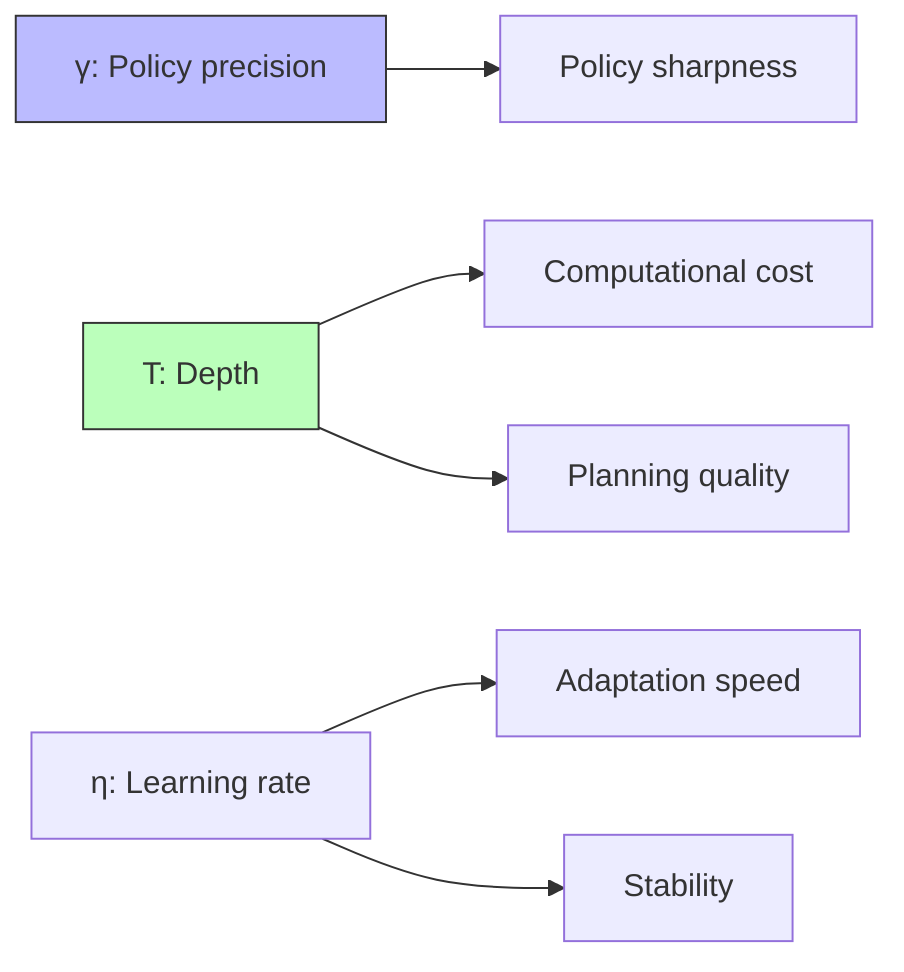

# Inference Configuration

## Overview

Inference configuration specifies the hyperparameters that govern how an Active Inference agent performs inference, learning, and planning. These parameters control the precision-exploitation tradeoff, learning rates, planning horizon, and numerical stability — all without changing the generative model itself.

## Key Configuration Parameters

### Inference Parameters

| Parameter | Symbol | Range | Effect |
| --- | --- | --- | --- |
| Policy precision | $\gamma$ | $(0, \infty)$ | Sharpness of policy selection |
| Number of iterations | $N_{\text{iter}}$ | Positive int | Convergence of belief updates |
| Convergence threshold | $\epsilon$ | $(0, 1)$ | When to stop iterating |
| Policy depth | $T$ | Positive int | How far ahead to plan |
| Policy breadth | $K$ | Positive int | Number of policies to evaluate |

### Learning Parameters

| Parameter | Symbol | Range | Effect |
| --- | --- | --- | --- |
| A learning rate | $\eta_A$ | $[0, 1]$ | Observation model update speed |
| B learning rate | $\eta_B$ | $[0, 1]$ | Transition model update speed |
| D learning rate | $\eta_D$ | $[0, 1]$ | Initial state prior update speed |
| Forgetting factor | $\omega$ | $[0, 1]$ | Parameter decay for non-stationarity |

## Implementation

```python
class InferenceConfig:
    def __init__(self):
        # Inference
        self.gamma = 16.0          # Policy precision
        self.n_iterations = 16     # Max state inference iterations
        self.convergence = 1e-4    # Convergence threshold
        self.policy_depth = 3      # Planning horizon
        
        # Learning rates
        self.lr_A = 1.0           # Observation model learning
        self.lr_B = 1.0           # Transition model learning
        self.lr_C = 0.0           # Preference learning (off by default)
        self.lr_D = 1.0           # State prior learning
        
        # Advanced
        self.forgetting = 1.0     # 1.0 = perfect memory
        self.use_habits = False   # Use E (habit) prior
        self.use_BMA = True       # Bayesian model averaging for states
    
    def sensitivity_analysis(self, param_name, values, agent, task):
        results = []
        for v in values:
            setattr(self, param_name, v)
            agent.configure(self)
            performance = agent.run_task(task)
            results.append({'value': v, 'performance': performance})
        return results
```

### Common Configuration Profiles

| Profile | $\gamma$ | $T$ | $\eta_A$ | Use Case |
| --- | --- | --- | --- | --- |
| Explorer | 1.0 | 1 | 1.0 | Novel environments |
| Balanced | 8.0 | 3 | 0.5 | General purpose |
| Exploiter | 32.0 | 5 | 0.1 | Known environments |
| Learner | 4.0 | 2 | 1.0 | Training phase |

## Sensitivity Analysis

Configuration parameters interact — changing one affects optimal values of others:



## Related Topics

- [[system_definition]] — System definition
- [[learning_mechanisms]] — Learning mechanisms
- [[precision_weighting]] — Precision weighting
- [[policy_evaluation]] — Policy evaluation
- [[meta_learning]] — Meta-learning (learning optimal configurations)
