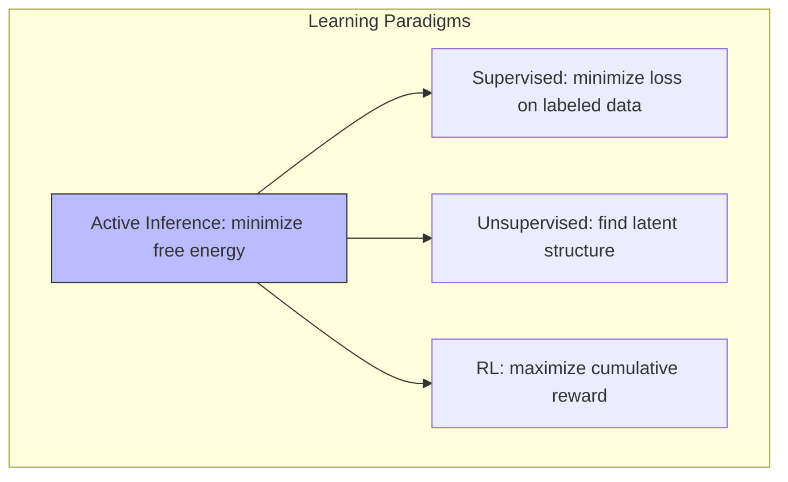

# Learning Models

## Overview

Learning models in Active Inference specify how agents update their generative model parameters through experience. Unlike supervised learning with fixed loss functions, Active Inference learning emerges from the same free energy minimization principle that drives perception and action.

## Parameter Learning (Dirichlet Updates)

### A Matrix (Observation Model)

```math
a_{ij}^{(new)} = a_{ij}^{(old)} + o_i \cdot s_j \quad \Rightarrow \quad A_{ij} = \frac{a_{ij}}{\sum_k a_{kj}}
```

### B Matrix (Transition Model)

```math
b_{ij}^{(a,new)} = b_{ij}^{(a,old)} + s_{t+1,i} \cdot s_{t,j} \cdot \mathbb{1}[a_t = a]
```

### D Vector (Initial State Prior)

```math
d_i^{(new)} = d_i^{(old)} + s_{1,i}
```

## Learning Timescales

| Model Component | What's Learned | Timescale | Update Rule |
| --- | --- | --- | --- |
| States $q(s)$ | Current state beliefs | Milliseconds | Variational inference |
| Parameters A, B | Observation/transition mappings | Minutes-hours | Dirichlet accumulation |
| Preferences C | What is valued | Hours-days | Preference learning |
| Structure $m$ | Model architecture | Days-lifetime | Bayesian model comparison |
| Hyperparameters $\eta$ | Learning rates, precisions | Across tasks | Meta-learning |

## Implementation

```python
class LearningAgent:
    def __init__(self, n_states, n_obs, n_actions, lr=1.0):
        self.a = np.ones((n_obs, n_states))  # Dirichlet prior for A
        self.b = np.ones((n_actions, n_states, n_states))  # Dirichlet prior for B
        self.d = np.ones(n_states)  # Dirichlet prior for D
        self.lr = lr
    
    def learn(self, observation, state_belief, prev_state, action):
        # Update A: observation model
        self.a += self.lr * np.outer(observation, state_belief)
        # Update B: transition model
        self.b[action] += self.lr * np.outer(state_belief, prev_state)
    
    def learn_initial_state(self, first_state_belief):
        self.d += self.lr * first_state_belief
    
    @property
    def A(self):
        return self.a / self.a.sum(axis=0, keepdims=True)
    
    @property
    def B(self):
        return self.b / self.b.sum(axis=1, keepdims=True)
```

## Comparison with Other Learning Frameworks



Active Inference subsumes elements of supervised, unsupervised, and reinforcement learning — all as special cases of free energy minimization.

## Related Topics

- [[learning_mechanisms]] — Learning mechanisms
- [[meta_learning]] — Meta-learning
- [[reinforcement_learning]] — RL connections
- [[learning_theory]] — Learning theory
- [[preference_learning]] — Preference learning
