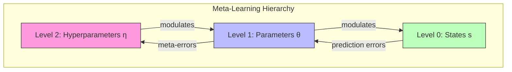

# Meta-Learning

## Overview

Meta-learning ("learning to learn") in Active Inference refers to the process of learning hyperparameters, learning rates, and model structures through experience, enabling agents to adapt more efficiently to new tasks. Within the free energy framework, meta-learning corresponds to inference at higher hierarchical levels that modulate lower-level learning dynamics.

## Active Inference Formulation

### Hierarchical Learning

```math
\begin{aligned}
& \text{Level 0 (state estimation):} \quad q(s_t) \leftarrow \text{minimize } F \text{ w.r.t. states} \\
& \text{Level 1 (parameter learning):} \quad q(\theta) \leftarrow \text{minimize } F \text{ w.r.t. parameters} \\
& \text{Level 2 (meta-learning):} \quad q(\eta) \leftarrow \text{minimize } F \text{ w.r.t. hyperparameters}
\end{aligned}
```

where $\eta$ includes learning rates, precision priors, and model structure variables.

### Precision as Meta-Parameter

The precision of beliefs about parameters acts as a natural meta-learning signal:

```math
\gamma = \text{precision}(q(\theta)) \propto \frac{1}{\text{Var}(q(\theta))}
```

High precision → slow learning (confident parameters), low precision → fast learning (uncertain parameters).

## Meta-Learning Mechanisms

| Mechanism | Description | Active Inference Component |
| --- | --- | --- |
| Learning rate adaptation | Adjust speed of parameter updates | Precision of parameter beliefs |
| Prior learning | Learn good priors from task distribution | Empirical Bayes at higher level |
| Model structure search | Discover optimal model architecture | Bayesian model comparison ($F$) |
| Attention modulation | Learn what to attend to | Precision weighting of predictions |
| Strategy selection | Learn which inference strategies work | Policy habits over meta-policies |

## Implementation

```python
class MetaLearningAgent:
    def __init__(self, base_agent, meta_learning_rate=0.01):
        self.agent = base_agent
        self.meta_lr = meta_learning_rate
        self.task_history = []
    
    def adapt_to_task(self, task, n_trials=50):
        # Store pre-adaptation parameters
        initial_params = self.agent.get_params()
        performance = self.agent.run_task(task, n_trials)
        
        # Meta-update: adjust learning rates based on performance
        final_params = self.agent.get_params()
        param_change = {k: final_params[k] - initial_params[k] for k in initial_params}
        
        # Update meta-parameters (learning rates, precisions)
        for param, delta in param_change.items():
            if abs(delta) > 0.1:  # Parameter changed significantly
                self.agent.learning_rates[param] *= (1 + self.meta_lr)
            else:  # Parameter was stable
                self.agent.learning_rates[param] *= (1 - self.meta_lr * 0.5)
        
        self.task_history.append({'task': task, 'performance': performance})
        return performance
```

### Connection to MAML

Model-Agnostic Meta-Learning (MAML) can be viewed through Active Inference:
- MAML finds initializations that enable fast adaptation → finding good priors $p(\theta)$
- Inner loop = fast parameter learning (level 1)
- Outer loop = slow prior learning (level 2)
- Both minimize expected free energy across task distribution



## Related Topics

- [[learning_mechanisms]] — Learning mechanisms in Active Inference
- [[hierarchical_processing]] — Hierarchical inference
- [[precision_weighting]] — Precision modulation
- [[learning_models]] — Computational learning models
- [[learning_theory]] — Learning theory foundations
