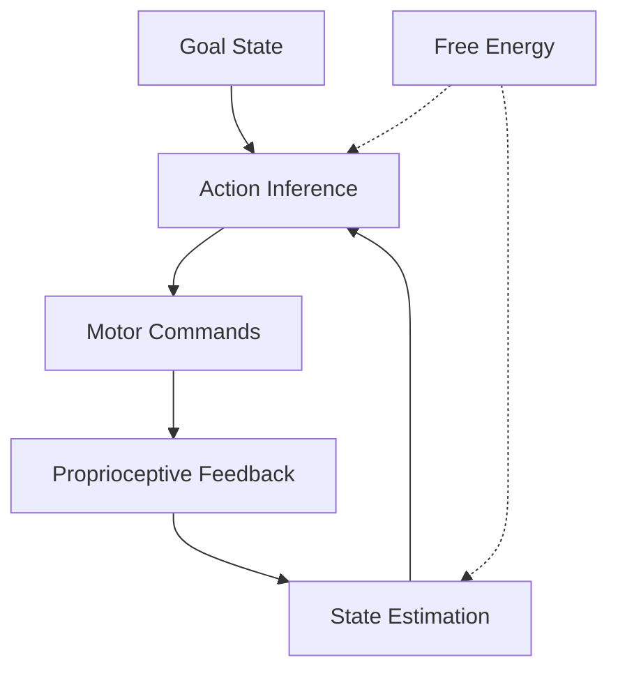

# Motor Control and Sensorimotor Integration Through Active Inference

This document explores motor control and sensorimotor integration as Active Inference processes, examining how action emerges from the minimization of variational free energy. It integrates computational motor control with neuroscience to understand how the brain coordinates perception and action.

## 🧠 Sensorimotor Active Inference

### Action as Controlled Hallucination

Motor control as inference about optimal action sequences:



### Core Sensorimotor Architecture

```python
class SensorimotorActiveInference:
    """Sensorimotor integration through Active Inference."""

    def __init__(self, motor_config):
        self.motor_config = motor_config

        # Core sensorimotor components
        self.forward_model = ForwardModel()          # Predicts sensory consequences
        self.inverse_model = InverseModel()          # Maps goals to actions
        self.state_estimator = StateEstimator()      # Proprioceptive state estimation
        self.precision_controller = PrecisionController()  # Sensory precision modulation

        # Motor control systems
        self.reach_planner = ReachPlanner()
        self.gait_controller = GaitController()
        self.posture_controller = PostureController()
        self.grasp_planner = GraspPlanner()

    def execute_sensorimotor_loop(self, goal_state, current_state):
        """Execute complete sensorimotor active inference loop."""

        # Infer optimal action sequence
        action_sequence = self.inverse_model.infer_actions(goal_state, current_state)

        # Execute actions with forward predictions
        execution_results = self.execute_with_predictions(action_sequence)

        # Update state estimation from proprioception
        updated_state = self.state_estimator.update_state(execution_results)

        # Calculate free energy for learning
        free_energy = self.calculate_motor_free_energy(
            goal_state, updated_state, execution_results
        )

        return {
            'action_sequence': action_sequence,
            'execution_results': execution_results,
            'updated_state': updated_state,
            'free_energy': free_energy,
            'precision_updates': self.precision_controller.get_updates()
        }

    def execute_with_predictions(self, action_sequence):
        """Execute actions while making and testing predictions."""

        execution_history = []

        for action in action_sequence:
            # Generate forward predictions
            predictions = self.forward_model.predict_consequences(action)

            # Execute action
            actual_outcomes = self.execute_motor_command(action)

            # Compare predictions to reality
            prediction_errors = self.calculate_prediction_errors(predictions, actual_outcomes)

            # Update precision based on prediction accuracy
            precision_updates = self.precision_controller.update_precision(prediction_errors)

            execution_step = {
                'action': action,
                'predictions': predictions,
                'actual_outcomes': actual_outcomes,
                'prediction_errors': prediction_errors,
                'precision_updates': precision_updates
            }

            execution_history.append(execution_step)

        return execution_history

    def calculate_motor_free_energy(self, goal, current_state, execution_results):
        """Calculate variational free energy for motor control."""

        # Goal achievement free energy
        goal_fe = self.calculate_goal_free_energy(goal, current_state)

        # Proprioceptive prediction errors
        proprioceptive_fe = self.calculate_proprioceptive_free_energy(execution_results)

        # Motor command complexity
        complexity_fe = self.calculate_complexity_free_energy(execution_results)

        total_fe = goal_fe + proprioceptive_fe + complexity_fe

        return {
            'total': total_fe,
            'goal_component': goal_fe,
            'proprioceptive_component': proprioceptive_fe,
            'complexity_component': complexity_fe
        }
```

## 🔬 Forward and Inverse Models

### Forward Model Learning

Predicting sensory consequences of actions:

```python
class ForwardModel:
    """Forward model for predicting sensory consequences of actions."""

    def __init__(self):
        self.dynamical_model = DynamicalModel()      # State transition predictions
        self.sensory_model = SensoryModel()           # Sensory consequence predictions
        self.error_learning = ErrorDrivenLearning()   # Error-based model updates

    def predict_consequences(self, action, current_state=None):
        """Predict sensory consequences of action."""

        if current_state is None:
            current_state = self.get_current_state()

        # Predict state transitions
        predicted_state = self.dynamical_model.predict_transition(current_state, action)

        # Predict sensory consequences
        predicted_sensory = self.sensory_model.predict_sensory(predicted_state, action)

        return {
            'predicted_state': predicted_state,
            'predicted_sensory': predicted_sensory,
            'prediction_confidence': self.calculate_prediction_confidence(predicted_state)
        }

    def update_model(self, action, actual_consequences, prediction_errors):
        """Update forward model based on prediction errors."""

        # Learn state transitions
        self.dynamical_model.update_transitions(action, actual_consequences['state'])

        # Learn sensory mappings
        self.sensory_model.update_sensory_mappings(
            actual_consequences['state'], actual_consequences['sensory']
        )

        # Error-driven learning
        self.error_learning.update_weights(prediction_errors)

    def calculate_prediction_confidence(self, predicted_state):
        """Calculate confidence in forward prediction."""

        # Based on model uncertainty and training history
        state_uncertainty = self.dynamical_model.get_uncertainty(predicted_state)
        sensory_uncertainty = self.sensory_model.get_uncertainty(predicted_state)

        confidence = 1.0 / (1.0 + state_uncertainty + sensory_uncertainty)

        return confidence
```

### Inverse Model Optimization

Mapping desired consequences to actions:

```python
class InverseModel:
    """Inverse model for mapping goals to actions."""

    def __init__(self):
        self.optimization_engine = OptimizationEngine()
        self.constraint_handler = ConstraintHandler()
        self.redundancy_resolver = RedundancyResolver()

    def infer_actions(self, goal_state, current_state):
        """Infer action sequence to achieve goal state."""

        # Define objective function
        objective = self.define_objective_function(goal_state, current_state)

        # Define constraints
        constraints = self.constraint_handler.get_motor_constraints(current_state)

        # Handle motor redundancy
        redundancy_resolution = self.redundancy_resolver.resolve_redundancy(
            goal_state, current_state
        )

        # Optimize action sequence
        optimal_actions = self.optimization_engine.optimize_actions(
            objective, constraints, redundancy_resolution
        )

        return optimal_actions

    def define_objective_function(self, goal, current):
        """Define optimization objective for motor control."""

        def objective_function(actions):
            """Calculate cost of action sequence."""

            # Predict consequences using forward model
            predicted_trajectory = self.simulate_trajectory(actions, current)

            # Goal achievement cost
            goal_cost = self.calculate_goal_cost(predicted_trajectory[-1], goal)

            # Motor effort cost
            effort_cost = self.calculate_effort_cost(actions)

            # Stability cost
            stability_cost = self.calculate_stability_cost(predicted_trajectory)

            total_cost = goal_cost + effort_cost + stability_cost

            return total_cost

        return objective_function

    def simulate_trajectory(self, actions, initial_state):
        """Simulate state trajectory for action sequence."""

        trajectory = [initial_state]

        for action in actions:
            # Predict next state
            next_state = self.predict_next_state(trajectory[-1], action)
            trajectory.append(next_state)

        return trajectory

    def calculate_goal_cost(self, final_state, goal_state):
        """Calculate cost of missing goal."""

        state_error = self.calculate_state_error(final_state, goal_state)
        return np.sum(state_error ** 2)

    def calculate_effort_cost(self, actions):
        """Calculate motor effort cost."""

        # Sum of squared action magnitudes
        effort = sum(np.sum(action ** 2) for action in actions)
        return effort

    def calculate_stability_cost(self, trajectory):
        """Calculate trajectory stability cost."""

        # Penalize unstable trajectories
        stability_cost = 0

        for i in range(1, len(trajectory)):
            velocity_change = trajectory[i] - trajectory[i-1]
            stability_cost += np.sum(velocity_change ** 2)

        return stability_cost
```

## 🧪 Motor Learning and Adaptation

### Error-Based Motor Learning

Learning through prediction error minimization:

```python
class MotorLearningSystem:
    """Motor learning through Active Inference."""

    def __init__(self):
        self.error_accumulator = ErrorAccumulator()
        self.parameter_updater = ParameterUpdater()
        self.skill_library = SkillLibrary()
        self.adaptation_system = AdaptationSystem()

    def learn_motor_skill(self, skill_examples, performance_feedback):
        """Learn motor skill from examples and feedback."""

        learning_progress = []

        for example, feedback in zip(skill_examples, performance_feedback):
            # Execute skill attempt
            execution_result = self.execute_skill_attempt(example)

            # Calculate learning errors
            learning_errors = self.calculate_learning_errors(
                execution_result, feedback, example
            )

            # Accumulate errors for batch learning
            self.error_accumulator.add_errors(learning_errors)

            # Update motor parameters
            parameter_updates = self.parameter_updater.update_parameters(
                self.error_accumulator.get_accumulated_errors()
            )

            # Store learned skill
            if self.is_skill_mastered(parameter_updates, feedback):
                self.skill_library.store_skill(example['skill_type'], parameter_updates)

            learning_progress.append({
                'example': example,
                'execution': execution_result,
                'errors': learning_errors,
                'parameter_updates': parameter_updates,
                'mastery_level': self.assess_mastery_level(parameter_updates)
            })

        return learning_progress

    def execute_skill_attempt(self, skill_example):
        """Execute attempt at motor skill."""

        # Get skill parameters
        skill_params = skill_example.get('parameters', {})

        # Simulate skill execution
        execution_trajectory = self.simulate_skill_execution(skill_params)

        # Generate performance metrics
        performance_metrics = self.calculate_performance_metrics(
            execution_trajectory, skill_example['goal']
        )

        return {
            'trajectory': execution_trajectory,
            'performance_metrics': performance_metrics,
            'success': self.evaluate_success(performance_metrics, skill_example)
        }

    def calculate_learning_errors(self, execution, feedback, example):
        """Calculate errors for motor learning."""

        # Trajectory errors
        trajectory_errors = self.calculate_trajectory_errors(
            execution['trajectory'], example['demonstration']
        )

        # Performance errors
        performance_errors = self.calculate_performance_errors(
            execution['performance_metrics'], feedback
        )

        # Parameter errors
        parameter_errors = self.calculate_parameter_errors(
            execution, example
        )

        return {
            'trajectory': trajectory_errors,
            'performance': performance_errors,
            'parameter': parameter_errors
        }

    def assess_mastery_level(self, parameter_updates):
        """Assess current mastery level of skill."""

        # Based on parameter stability and performance consistency
        stability = self.calculate_parameter_stability(parameter_updates)
        consistency = self.calculate_performance_consistency()

        mastery = (stability + consistency) / 2.0

        return mastery
```

## 🧬 Hierarchical Motor Control

### Multi-Scale Motor Coordination

Coordinating motor control across time scales:

```python
class HierarchicalMotorControl:
    """Hierarchical motor control across time scales."""

    def __init__(self):
        # Control hierarchies
        self.strategic_level = StrategicMotorControl()    # Long-term planning
        self.tactical_level = TacticalMotorControl()      # Medium-term coordination
        self.execution_level = ExecutionMotorControl()    # Short-term execution

        # Inter-level communication
        self.message_passing = HierarchicalMessagePassing()

    def hierarchical_motor_planning(self, task_goal, current_state):
        """Plan motor actions across hierarchical levels."""

        # Strategic planning (what to achieve)
        strategic_plan = self.strategic_level.plan_strategy(task_goal, current_state)

        # Tactical coordination (how to achieve)
        tactical_plan = self.tactical_level.coordinate_tactics(
            strategic_plan, current_state
        )

        # Execution planning (when to execute)
        execution_plan = self.execution_level.plan_execution(
            tactical_plan, current_state
        )

        # Integrate plans across levels
        integrated_plan = self.integrate_hierarchical_plans(
            strategic_plan, tactical_plan, execution_plan
        )

        return integrated_plan

    def integrate_hierarchical_plans(self, strategic, tactical, execution):
        """Integrate plans from different hierarchical levels."""

        # Resolve conflicts between levels
        resolved_plan = self.resolve_plan_conflicts(strategic, tactical, execution)

        # Optimize for temporal coordination
        temporally_coordinated = self.coordinate_temporally(resolved_plan)

        # Ensure biomechanical feasibility
        feasible_plan = self.ensure_biomechanical_feasibility(temporally_coordinated)

        return feasible_plan

    def execute_hierarchical_control(self, integrated_plan):
        """Execute hierarchically integrated motor plan."""

        execution_results = []

        for time_step in range(len(integrated_plan['trajectory'])):
            # Get control signals from each level
            strategic_signal = self.strategic_level.get_control_signal(time_step)
            tactical_signal = self.tactical_level.get_control_signal(time_step)
            execution_signal = self.execution_level.get_control_signal(time_step)

            # Fuse control signals
            fused_signal = self.fuse_control_signals(
                strategic_signal, tactical_signal, execution_signal
            )

            # Execute fused control
            execution_result = self.execute_control_signal(fused_signal)

            # Update hierarchical states
            self.update_hierarchical_states(execution_result)

            execution_results.append(execution_result)

        return execution_results
```

## 🧪 Sensorimotor Coordination

### Proprioceptive State Estimation

Integrating proprioceptive feedback with motor control:

```python
class ProprioceptiveStateEstimation:
    """Proprioceptive state estimation for motor control."""

    def __init__(self):
        self.kinematic_model = KinematicModel()          # Forward kinematics
        self.dynamic_model = DynamicModel()              # Dynamics model
        self.sensor_fusion = SensorFusion()              # Multi-modal integration
        self.state_filter = StateFilter()                # State estimation filter

    def estimate_body_state(self, proprioceptive_signals, visual_signals=None):
        """Estimate current body state from proprioceptive signals."""

        # Process proprioceptive inputs
        processed_proprioception = self.process_proprioceptive_signals(
            proprioceptive_signals
        )

        # Integrate visual information if available
        if visual_signals is not None:
            integrated_signals = self.sensor_fusion.fuse_signals(
                processed_proprioception, visual_signals
            )
        else:
            integrated_signals = processed_proprioception

        # Estimate kinematic state
        kinematic_state = self.kinematic_model.estimate_kinematics(integrated_signals)

        # Estimate dynamic state
        dynamic_state = self.dynamic_model.estimate_dynamics(
            integrated_signals, kinematic_state
        )

        # Filter state estimate
        filtered_state = self.state_filter.filter_state(
            kinematic_state, dynamic_state
        )

        return {
            'kinematic_state': kinematic_state,
            'dynamic_state': dynamic_state,
            'filtered_state': filtered_state,
            'estimation_confidence': self.calculate_estimation_confidence(filtered_state)
        }

    def process_proprioceptive_signals(self, signals):
        """Process raw proprioceptive signals."""

        processed = {}

        # Muscle spindle processing (length and velocity)
        if 'muscle_spindles' in signals:
            processed['muscle_length'] = self.process_muscle_spindles_length(
                signals['muscle_spindles']
            )
            processed['muscle_velocity'] = self.process_muscle_spindles_velocity(
                signals['muscle_spindles']
            )

        # Golgi tendon organ processing (tension)
        if 'golgi_tendons' in signals:
            processed['tendon_tension'] = self.process_golgi_tendons(
                signals['golgi_tendons']
            )

        # Joint receptor processing (position, velocity)
        if 'joint_receptors' in signals:
            processed['joint_position'] = self.process_joint_receptors_position(
                signals['joint_receptors']
            )
            processed['joint_velocity'] = self.process_joint_receptors_velocity(
                signals['joint_receptors']
            )

        return processed

    def calculate_estimation_confidence(self, filtered_state):
        """Calculate confidence in state estimation."""

        # Based on sensor noise, model uncertainty, and filter convergence
        sensor_confidence = self.calculate_sensor_confidence()
        model_confidence = self.calculate_model_confidence(filtered_state)
        filter_confidence = self.state_filter.get_convergence_confidence()

        overall_confidence = (sensor_confidence + model_confidence + filter_confidence) / 3.0

        return overall_confidence
```

## 🧬 Motor Skill Acquisition

### Skill Learning Through Practice

How motor skills are acquired through repeated practice:

```python
class MotorSkillAcquisition:
    """Motor skill acquisition through practice and learning."""

    def __init__(self, skill_domain):
        self.skill_domain = skill_domain
        self.practice_scheduler = PracticeScheduler()
        self.skill_decomposition = SkillDecomposition()
        self.progress_tracker = ProgressTracker()

    def acquire_motor_skill(self, skill_description, practice_sessions):
        """Acquire motor skill through structured practice."""

        # Decompose skill into components
        skill_components = self.skill_decomposition.decompose_skill(skill_description)

        # Schedule practice sessions
        practice_schedule = self.practice_scheduler.schedule_practice(
            skill_components, practice_sessions
        )

        skill_development = []

        for session in practice_schedule:
            # Execute practice session
            session_result = self.execute_practice_session(session)

            # Analyze performance
            performance_analysis = self.analyze_session_performance(session_result)

            # Update skill model
            skill_update = self.update_skill_model(performance_analysis, session)

            # Track progress
            progress_update = self.progress_tracker.track_progress(
                skill_update, skill_components
            )

            skill_development.append({
                'session': session,
                'performance': performance_analysis,
                'skill_update': skill_update,
                'progress': progress_update
            })

        return skill_development

    def execute_practice_session(self, session_plan):
        """Execute a practice session."""

        session_results = []

        for trial in session_plan['trials']:
            # Set up trial conditions
            trial_setup = self.setup_trial_conditions(trial)

            # Execute motor skill attempt
            skill_execution = self.execute_skill_trial(trial_setup)

            # Provide feedback
            feedback = self.generate_trial_feedback(skill_execution, trial_setup)

            trial_result = {
                'trial': trial,
                'execution': skill_execution,
                'feedback': feedback,
                'success': self.evaluate_trial_success(skill_execution, trial_setup)
            }

            session_results.append(trial_result)

        return session_results

    def analyze_session_performance(self, session_results):
        """Analyze performance across practice session."""

        # Calculate performance metrics
        success_rate = sum(1 for r in session_results if r['success']) / len(session_results)

        # Analyze error patterns
        error_patterns = self.analyze_error_patterns(session_results)

        # Assess skill component mastery
        component_mastery = self.assess_component_mastery(session_results)

        # Generate learning insights
        learning_insights = self.generate_learning_insights(
            success_rate, error_patterns, component_mastery
        )

        return {
            'success_rate': success_rate,
            'error_patterns': error_patterns,
            'component_mastery': component_mastery,
            'learning_insights': learning_insights
        }
```

## 🔬 Clinical Applications

### Motor Rehabilitation

Using Active Inference for motor rehabilitation:

```python
class MotorRehabilitationSystem:
    """Motor rehabilitation using Active Inference principles."""

    def __init__(self, patient_profile, impairment_type):
        self.patient_profile = patient_profile
        self.impairment_type = impairment_type
        self.assessment_system = MotorAssessmentSystem()
        self.therapy_planner = TherapyPlanner()
        self.progress_monitor = ProgressMonitor()

    def design_rehabilitation_program(self, baseline_assessment):
        """Design personalized rehabilitation program."""

        # Assess current motor capabilities
        current_capabilities = self.assessment_system.assess_capabilities(baseline_assessment)

        # Identify impairment-specific challenges
        impairment_challenges = self.identify_impairment_challenges(
            current_capabilities, self.impairment_type
        )

        # Plan therapeutic interventions
        therapy_plan = self.therapy_planner.plan_interventions(
            current_capabilities, impairment_challenges, self.patient_profile
        )

        # Design progress monitoring
        monitoring_plan = self.progress_monitor.design_monitoring(therapy_plan)

        return {
            'current_capabilities': current_capabilities,
            'impairment_challenges': impairment_challenges,
            'therapy_plan': therapy_plan,
            'monitoring_plan': monitoring_plan
        }

    def execute_rehabilitation_session(self, session_plan):
        """Execute rehabilitation therapy session."""

        session_results = []

        for exercise in session_plan['exercises']:
            # Guide patient through exercise
            exercise_execution = self.guide_exercise_execution(exercise)

            # Provide real-time feedback
            feedback = self.generate_realtime_feedback(exercise_execution)

            # Assess exercise quality
            quality_assessment = self.assess_exercise_quality(exercise_execution)

            exercise_result = {
                'exercise': exercise,
                'execution': exercise_execution,
                'feedback': feedback,
                'quality': quality_assessment
            }

            session_results.append(exercise_result)

        # Update rehabilitation model
        model_update = self.update_rehabilitation_model(session_results)

        return {
            'session_results': session_results,
            'model_update': model_update,
            'progress_assessment': self.assess_session_progress(session_results)
        }
```

## 📚 Related Concepts

### Core Motor Control
- [[motor_control]] - General motor control principles
- [[sensorimotor_coordination]] - Sensorimotor integration
- [[action_selection]] - Action planning and selection

### Active Inference Integration
- [[active_inference]] - Core framework
- [[predictive_coding]] - Predictive aspects
- [[hierarchical_processing]] - Multi-level control

### Learning and Adaptation
- [[learning_mechanisms]] - Motor learning
- [[skill_acquisition]] - Skill development
- [[adaptation_mechanisms]] - Motor adaptation

---

> **Motor Active Inference**: Motor control emerges from the minimization of variational free energy, with actions selected to make proprioceptive predictions match desired outcomes.

---

> **Forward-Inverse Model**: The forward model predicts sensory consequences of actions, while the inverse model maps goals to actions, enabling bidirectional sensorimotor inference.

---

> **Hierarchical Coordination**: Motor control operates across multiple time scales, from strategic planning to moment-to-moment execution, coordinated through hierarchical Active Inference.
