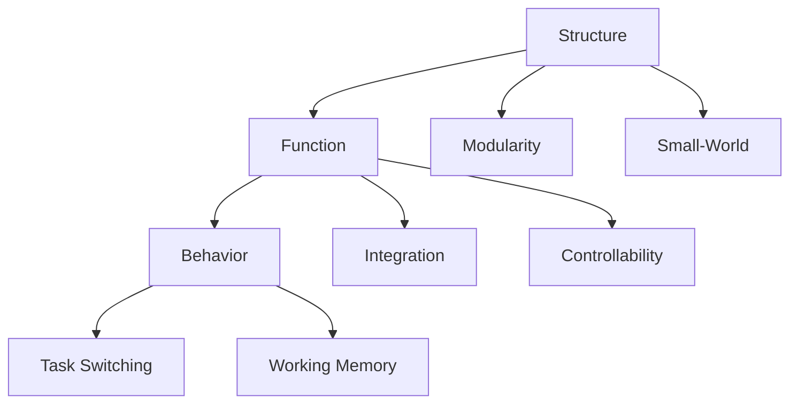

---

title: Network Analysis

type: knowledge_base

status: stable

tags: [networks, analysis, graphs]

semantic_relations:

  - type: relates

    links: [graph_theory, intelligence_networks, cognitive_architecture]

---

# Network Analysis

Network analysis provides tools to quantify structure and function in cognitive and biological networks (connectomes, factor graphs, communication graphs).

## Measures

- Degree/strength distributions; centralities (betweenness, eigenvector)

- Clustering, assortativity, modularity

- Paths, efficiency, controllability

See: [[graph_theory]], [[network_science]], [[cognitive_architecture]].

## Advanced analyses

- Community detection and role discovery (SBM, Louvain, Leiden)

- Multilayer and temporal networks for task dynamics

- Causality and interventions (Do-calculus, invariant prediction)

- Null models and significance testing (degree-preserving rewires)

## Practical workflow

1. Define nodes/edges and weighting (information flow, effective connectivity)

1. Choose appropriate nulls and scales (single vs multi-layer)

1. Quantify metrics tied to hypotheses (e.g., controllability for task switching)

1. Validate with perturbation/ablation and cross-datasets

### Networks in Cognitive Science (at a glance)

