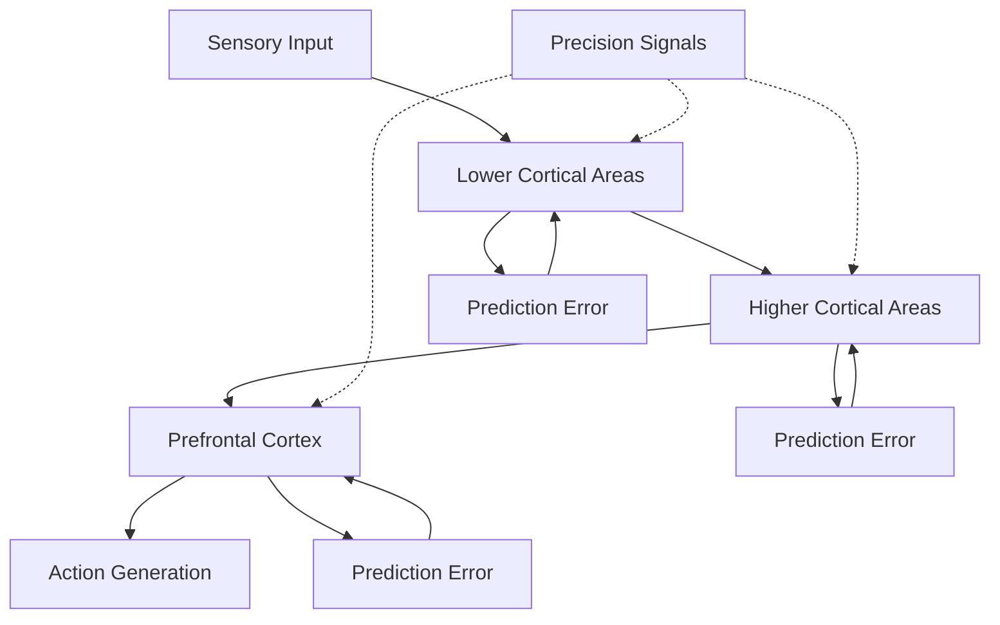

# Neural Implementation of Active Inference

This document explores how Active Inference principles are implemented in neural systems, bridging cognitive theory with neurobiological mechanisms. It examines the neural architecture that supports predictive processing, precision weighting, and hierarchical inference in the brain.

## 🧠 Neural Active Inference Architecture

### Hierarchical Predictive Processing

The brain implements Active Inference through hierarchical predictive processing across multiple cortical levels:



### Key Neural Components

#### Predictive Coding Networks
- **Hierarchical Structure**: Multiple cortical levels with bidirectional connections
- **Top-Down Predictions**: Higher areas predict lower-level activity
- **Bottom-Up Errors**: Lower areas compute prediction errors
- **Precision Weighting**: Neuromodulatory control of error sensitivity

#### Neuromodulatory Systems
- **Dopamine**: Prediction error signaling and precision control
- **Acetylcholine**: Attention and precision modulation
- **Norepinephrine**: Arousal and gain control
- **Serotonin**: Mood and behavioral flexibility

## 🔬 Neural Mechanisms

### Predictive Coding Implementation

#### Error Units and Representation Units
```python
class PredictiveCodingLayer:
    """Neural layer implementing predictive coding."""

    def __init__(self, n_units, precision_parameter=1.0):
        self.representation_units = np.zeros(n_units)  # μ (predictions)
        self.error_units = np.zeros(n_units)          # ε (prediction errors)
        self.precision = precision_parameter           # π (precision)

    def predict(self, bottom_up_input):
        """Generate top-down predictions."""
        # Top-down prediction based on higher-level representations
        self.representation_units = self.top_down_weights @ higher_level_representation
        return self.representation_units

    def compute_errors(self, bottom_up_input):
        """Compute prediction errors."""
        self.error_units = bottom_up_input - self.representation_units
        return self.error_units

    def update_representations(self, learning_rate=0.01):
        """Update representations to minimize prediction errors."""
        # Gradient descent on prediction errors
        representation_gradient = -self.precision * self.error_units
        self.representation_units -= learning_rate * representation_gradient

    def modulate_precision(self, attentional_signal):
        """Modulate precision based on attentional signals."""
        self.precision *= attentional_signal
```

#### Hierarchical Error Propagation
```python
class HierarchicalPredictiveNetwork:
    """Multi-layer predictive coding network."""

    def __init__(self, layer_sizes, precision_decay=0.9):
        self.layers = [PredictiveCodingLayer(size) for size in layer_sizes]
        self.precision_decay = precision_decay

    def forward_pass(self, sensory_input):
        """Forward pass through hierarchical network."""
        current_input = sensory_input

        for i, layer in enumerate(self.layers):
            # Generate predictions
            predictions = layer.predict(current_input)

            # Compute errors
            errors = layer.compute_errors(current_input)

            # Update representations
            layer.update_representations()

            # Prepare input for next layer
            current_input = layer.representation_units

        return self.layers[-1].representation_units

    def backward_pass(self, top_down_input=None):
        """Backward pass with precision-weighted errors."""
        for i in reversed(range(len(self.layers))):
            layer = self.layers[i]

            # Modulate precision based on hierarchical level
            precision_modulation = self.precision_decay ** i
            layer.modulate_precision(precision_modulation)

            # Propagate errors upward if not top layer
            if i > 0:
                error_feedback = self.layers[i-1].top_down_weights.T @ layer.error_units
                self.layers[i-1].error_units += error_feedback
```

### Precision Weighting Mechanisms

#### Neuromodulatory Precision Control
```python
class NeuromodulatoryPrecisionControl:
    """Neuromodulatory control of precision parameters."""

    def __init__(self):
        self.dopamine_level = 1.0
        self.acetylcholine_level = 1.0
        self.norepinephrine_level = 1.0

    def compute_precision(self, prediction_error, context):
        """Compute precision based on neuromodulators and context."""

        # Dopamine modulates prediction error sensitivity
        pe_precision = self.dopamine_level * abs(prediction_error)

        # Acetylcholine modulates attentional precision
        attentional_precision = self.acetylcholine_level * context['salience']

        # Norepinephrine modulates arousal-based precision
        arousal_precision = self.norepinephrine_level * context['arousal']

        # Combined precision
        total_precision = pe_precision + attentional_precision + arousal_precision

        return max(total_precision, 0.1)  # Minimum precision threshold

    def update_neuromodulators(self, reward, novelty, salience):
        """Update neuromodulator levels based on environmental signals."""

        # Dopamine response to reward prediction errors
        self.dopamine_level += 0.1 * reward

        # Acetylcholine response to novelty and salience
        self.acetylcholine_level += 0.05 * (novelty + salience)

        # Norepinephrine response to arousal states
        self.norepinephrine_level += 0.03 * novelty

        # Decay toward baseline
        self.dopamine_level *= 0.99
        self.acetylcholine_level *= 0.98
        self.norepinephrine_level *= 0.97
```

### Active Inference in Action Selection

#### Basal Ganglia Implementation
```python
class BasalGangliaActiveInference:
    """Basal ganglia implementation of active inference action selection."""

    def __init__(self, n_actions, n_states):
        # Striatum (action-value computation)
        self.striatum = np.zeros((n_actions, n_states))

        # Substantia nigra pars compacta (dopamine signaling)
        self.dopamine_prediction_error = 0.0

        # Subthalamic nucleus (Go/No-Go signals)
        self.go_signals = np.zeros(n_actions)
        self.no_go_signals = np.zeros(n_actions)

    def compute_action_values(self, current_beliefs, goal_prior):
        """Compute action values using expected free energy."""

        action_values = np.zeros(len(self.striatum))

        for action in range(len(self.striatum)):
            # Expected free energy for this action
            efe = self.compute_expected_free_energy(action, current_beliefs, goal_prior)
            action_values[action] = -efe  # Negative EFE as value

        return action_values

    def select_action(self, action_values):
        """Select action using basal ganglia Go/No-Go mechanism."""

        # Direct pathway (Go signals)
        self.go_signals = np.maximum(action_values, 0)

        # Indirect pathway (No-Go signals)
        self.no_go_signals = np.maximum(-action_values, 0)

        # Net activation (Go - No-Go)
        net_activation = self.go_signals - self.no_go_signals

        # Action selection (winner-take-all)
        selected_action = np.argmax(net_activation)

        return selected_action

    def compute_expected_free_energy(self, action, beliefs, goal_prior):
        """Compute expected free energy for action selection."""

        # Predicted next beliefs
        predicted_beliefs = self.predict_next_beliefs(beliefs, action)

        # Epistemic affordance (information gain)
        epistemic_value = self.compute_epistemic_value(beliefs, predicted_beliefs)

        # Extrinsic value (goal achievement)
        extrinsic_value = self.compute_extrinsic_value(predicted_beliefs, goal_prior)

        # Expected free energy
        efe = epistemic_value + extrinsic_value

        return efe

    def compute_epistemic_value(self, prior_beliefs, posterior_beliefs):
        """Compute epistemic (information-seeking) value."""

        # KL divergence between prior and posterior
        kl_div = np.sum(prior_beliefs * np.log(prior_beliefs / posterior_beliefs))
        return -kl_div  # Negative because EFE minimizes this

    def compute_extrinsic_value(self, beliefs, goal_prior):
        """Compute extrinsic (goal-directed) value."""

        # KL divergence from goal prior
        goal_divergence = np.sum(beliefs * np.log(beliefs / goal_prior))
        return goal_divergence
```

## 🧪 Experimental Evidence

### Predictive Coding in Visual Cortex

#### Visual Hierarchy Studies
- **Primary Visual Cortex (V1)**: Low-level feature prediction and error computation
- **Extrastriate Cortex (V2-V4)**: Intermediate feature integration
- **Inferior Temporal Cortex (IT)**: Object-level predictions
- **Prefrontal Cortex**: Top-down attentional modulation

#### Experimental Paradigms
- **Mismatch Negativity (MMN)**: Prediction error responses to unexpected stimuli
- **Repetition Suppression**: Reduced responses to predicted stimuli
- **Sensory Adaptation**: Neural adaptation to predictable inputs
- **Contextual Effects**: Influence of expectations on perception

### Precision Weighting in Attention

#### Attentional Modulation
- **Spatial Attention**: Enhanced precision in attended locations
- **Feature Attention**: Increased sensitivity to attended features
- **Object Attention**: Selective processing of attended objects

#### Neuromodulatory Correlates
- **Dopamine**: Reward prediction errors and motivational salience
- **Acetylcholine**: Attentional focus and precision control
- **Norepinephrine**: Arousal and gain modulation

### Active Inference in Motor Control

#### Cerebellum and Motor Learning
- **Forward Models**: Prediction of sensory consequences of actions
- **Error Correction**: Rapid adjustment based on prediction errors
- **Internal Models**: Learned mappings between actions and outcomes

#### Basal Ganglia and Action Selection
- **Action Valuation**: Expected free energy computation
- **Go/No-Go Decisions**: Threshold-based action gating
- **Habit Formation**: Transition from goal-directed to habitual behavior

## 🔬 Neural Oscillations and Active Inference

### Frequency-Specific Processing

#### Theta Rhythm (4-8 Hz)
- **Hippocampal Processing**: Episodic memory and context integration
- **Phase Coding**: Temporal organization of sequential information
- **Cross-Frequency Coupling**: Coordination with gamma rhythms

#### Alpha Rhythm (8-12 Hz)
- **Attention Modulation**: Precision control in sensory cortices
- **Inhibition**: Active suppression of irrelevant information
- **Top-Down Control**: Frontal-parietal attention networks

#### Beta Rhythm (13-30 Hz)
- **Motor Planning**: Action preparation and motor imagery
- **Status Quo Maintenance**: Resistance to change
- **Error Monitoring**: Detection of unexpected events

#### Gamma Rhythm (30-100 Hz)
- **Feature Binding**: Integration of distributed neural representations
- **Conscious Processing**: Correlated with conscious perception
- **Precision Signaling**: High-precision information processing

### Cross-Frequency Coupling

#### Theta-Gamma Coupling
- **Memory Formation**: Hippocampal-cortical dialogue during learning
- **Contextual Binding**: Integration of episodic information
- **Cognitive Control**: Executive function coordination

#### Alpha-Beta Coupling
- **Attention Control**: Frontal-parietal network coordination
- **Motor Preparation**: Action planning and execution
- **Error Correction**: Performance monitoring and adjustment

## 🧬 Developmental Aspects

### Critical Periods and Learning

#### Sensory Development
- **Visual System Maturation**: Critical period for binocular vision
- **Auditory System Development**: Sensitive period for language acquisition
- **Multisensory Integration**: Emergence of cross-modal binding

#### Cognitive Development
- **Theory of Mind Emergence**: Development of mental state attribution
- **Executive Function Development**: Prefrontal cortex maturation
- **Metacognitive Development**: Awareness of cognitive processes

### Neuroplasticity and Adaptation

#### Experience-Dependent Plasticity
- **Synaptic Pruning**: Elimination of unused neural connections
- **Myelination**: Increased conduction velocity with experience
- **Receptive Field Refinement**: Specialization through selective activation

#### Learning-Induced Changes
- **Long-Term Potentiation (LTP)**: Strengthening of active synapses
- **Long-Term Depression (LTD)**: Weakening of inactive synapses
- **Structural Plasticity**: Physical changes in neural connectivity

## 🏥 Clinical Implications

### Neurological Disorders

#### Autism Spectrum Disorder
- **Precision Dysregulation**: Abnormal precision weighting mechanisms
- **Predictive Processing Deficits**: Impaired hierarchical prediction
- **Social Cognition Impairments**: Theory of mind difficulties

#### Schizophrenia
- **Aberrant Salience**: Dysregulated dopamine-mediated precision
- **Prediction Error Abnormalities**: Distorted error signaling
- **Hierarchical Processing Deficits**: Impaired top-down control

#### Parkinson's Disease
- **Dopamine Deficiency**: Impaired precision control mechanisms
- **Motor Prediction Errors**: Abnormal basal ganglia function
- **Action Selection Deficits**: Impaired Go/No-Go signaling

### Therapeutic Approaches

#### Precision-Focused Interventions
- **Attention Training**: Enhancement of attentional precision control
- **Cognitive Behavioral Therapy**: Modification of maladaptive predictions
- **Neuromodulatory Treatments**: Pharmacological precision modulation

#### Prediction Error Correction
- **Error Awareness Training**: Enhancement of error detection capabilities
- **Prediction Calibration**: Adjustment of predictive models
- **Contextual Learning**: Improvement of context-dependent predictions

## 🔬 Research Directions

### Current Challenges

#### Measurement Issues
- **Precision Estimation**: Direct measurement of neural precision parameters
- **Hierarchical Inference**: Tracking information flow across cortical hierarchies
- **Neuromodulatory Dynamics**: Real-time monitoring of neuromodulator levels

#### Theoretical Extensions
- **Quantum Cognition**: Quantum mechanical models of neural processing
- **Non-Equilibrium Thermodynamics**: Free energy in non-equilibrium systems
- **Geometric Approaches**: Differential geometric formulations of inference

### Future Developments

#### Technological Advances
- **High-Density EEG**: Improved temporal resolution of neural dynamics
- **Functional MRI**: Enhanced spatial resolution of network interactions
- **Optogenetics**: Causal manipulation of neural precision mechanisms
- **Brain-Computer Interfaces**: Direct measurement and control of neural states

#### Theoretical Integration
- **Unified Theories**: Integration of Active Inference with other frameworks
- **Cross-Scale Modeling**: Bridging cellular, circuit, and systems levels
- **Developmental Trajectories**: Modeling neural development using Active Inference

## 📚 Related Concepts

### Core Active Inference
- [[active_inference]] - Theoretical framework implementation
- [[free_energy_principle]] - Mathematical foundation
- [[predictive_coding]] - Neural implementation mechanism

### Neural Mechanisms
- [[attention_mechanisms]] - Precision weighting in attention
- [[hierarchical_processing]] - Multi-level neural processing
- [[precision_weighting]] - Neuromodulatory precision control

### Related Domains
- [[../biology/neuroscience]] - Broader neural science context
- [[../mathematics/variational_inference]] - Mathematical inference methods
- [[../systems/complex_systems]] - Systems-level neural dynamics

---

> **Neural Active Inference**: The brain implements Active Inference through hierarchical predictive coding, precision-weighted error minimization, and neuromodulatory control of neural gain and sensitivity.

---

> **Predictive Processing**: The core neural mechanism supporting Active Inference involves top-down predictions, bottom-up prediction errors, and precision-weighted learning across cortical hierarchies.

---

> **Neuromodulatory Precision**: Dopamine, acetylcholine, and norepinephrine systems control the precision of prediction errors, enabling adaptive learning and attentional selection.
