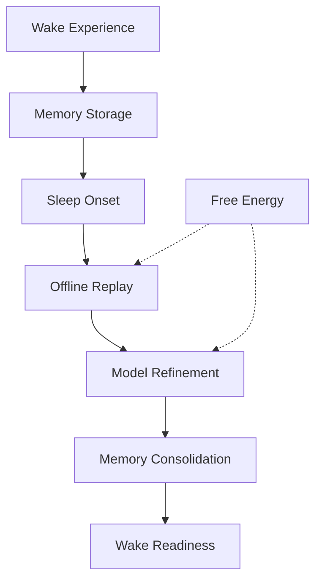

# Sleep and Memory Consolidation Through Active Inference

This document explores sleep and memory consolidation as Active Inference processes, examining how offline learning optimizes generative models during sleep. It integrates sleep neuroscience with computational modeling to understand how the sleeping brain refines predictions and consolidates memories.

## 🧠 Sleep as Active Inference

### Offline Model Optimization

Sleep as a period of unconstrained model refinement:



### Core Sleep Active Inference Architecture

```python
class SleepActiveInference:
    """Sleep processes through Active Inference framework."""

    def __init__(self, sleep_config):
        self.sleep_config = sleep_config

        # Sleep stage managers
        self.nrem_processor = NREMProcessor()         # Slow-wave sleep processing
        self.rem_processor = REMProcessor()           # Dream state processing
        self.sleep_cycle_manager = SleepCycleManager()  # Sleep stage cycling

        # Memory systems
        self.episodic_memory = EpisodicMemorySystem()
        self.semantic_memory = SemanticMemorySystem()
        self.skill_memory = SkillMemorySystem()

        # Offline learning
        self.replay_engine = ReplayEngine()
        self.consolidation_engine = ConsolidationEngine()
        self.precision_optimizer = PrecisionOptimizer()

    def execute_sleep_cycle(self, wake_experiences, sleep_duration):
        """Execute complete sleep cycle with memory consolidation."""

        # Sleep onset preparation
        sleep_preparation = self.prepare_for_sleep(wake_experiences)

        # Sleep cycle execution
        sleep_results = self.run_sleep_cycles(sleep_duration)

        # Sleep offset and wake preparation
        wake_preparation = self.prepare_for_wake(sleep_results)

        return {
            'sleep_preparation': sleep_preparation,
            'sleep_results': sleep_results,
            'wake_preparation': wake_preparation,
            'consolidation_summary': self.summarize_consolidation(sleep_results)
        }

    def prepare_for_sleep(self, wake_experiences):
        """Prepare memory systems for sleep consolidation."""

        # Tag experiences for consolidation priority
        prioritized_experiences = self.prioritize_experiences(wake_experiences)

        # Prepare replay sequences
        replay_sequences = self.prepare_replay_sequences(prioritized_experiences)

        # Initialize consolidation parameters
        consolidation_params = self.initialize_consolidation_parameters()

        return {
            'prioritized_experiences': prioritized_experiences,
            'replay_sequences': replay_sequences,
            'consolidation_params': consolidation_params
        }

    def run_sleep_cycles(self, duration):
        """Run sleep cycles with different processing modes."""

        sleep_results = []
        elapsed_time = 0

        while elapsed_time < duration:
            # Determine current sleep stage
            current_stage = self.sleep_cycle_manager.get_current_stage(elapsed_time)

            # Process according to sleep stage
            if current_stage in ['N1', 'N2', 'N3']:
                stage_result = self.process_nrem_stage(current_stage, elapsed_time)
            elif current_stage == 'REM':
                stage_result = self.process_rem_stage(elapsed_time)
            else:
                break  # Sleep cycle complete

            sleep_results.append({
                'stage': current_stage,
                'start_time': elapsed_time,
                'duration': stage_result['duration'],
                'processing_results': stage_result
            })

            elapsed_time += stage_result['duration']

        return sleep_results

    def process_nrem_stage(self, stage, start_time):
        """Process NREM sleep stage."""

        # Slow-wave sleep processing
        if stage == 'N3':
            processing_result = self.nrem_processor.process_slow_wave_sleep()
        else:
            processing_result = self.nrem_processor.process_light_nrem(stage)

        return {
            'duration': processing_result['duration'],
            'replay_events': processing_result['replay_events'],
            'consolidation_progress': processing_result['consolidation_progress'],
            'precision_updates': processing_result['precision_updates']
        }

    def process_rem_stage(self, start_time):
        """Process REM sleep stage."""

        processing_result = self.rem_processor.process_rem_sleep()

        return {
            'duration': processing_result['duration'],
            'dream_content': processing_result['dream_content'],
            'emotional_processing': processing_result['emotional_processing'],
            'creativity_boosts': processing_result['creativity_boosts']
        }
```

## 🔬 Memory Replay and Consolidation

### Experience Replay During Sleep

Neural replay as Active Inference optimization:

```python
class ReplayEngine:
    """Experience replay system for memory consolidation."""

    def __init__(self):
        self.replay_buffer = ReplayBuffer()
        self.temporal_compressor = TemporalCompressor()
        self.pattern_extractor = PatternExtractor()
        self.replay_scheduler = ReplayScheduler()

    def schedule_replay_sequences(self, experiences, sleep_stage):
        """Schedule replay sequences based on sleep stage and experience priority."""

        # Select experiences for replay
        replay_candidates = self.select_replay_candidates(experiences, sleep_stage)

        # Organize into replay sequences
        replay_sequences = self.organize_replay_sequences(replay_candidates)

        # Schedule timing within sleep stage
        scheduled_replay = self.replay_scheduler.schedule_timing(
            replay_sequences, sleep_stage
        )

        return scheduled_replay

    def execute_replay_sequence(self, replay_sequence):
        """Execute a sequence of memory replay events."""

        replay_results = []

        for replay_event in replay_sequence:
            # Reactivate neural patterns
            reactivation_result = self.reactivate_patterns(replay_event)

            # Strengthen synaptic connections
            strengthening_result = self.strengthen_connections(reactivation_result)

            # Update precision weights
            precision_result = self.update_precision_weights(reactivation_result)

            replay_result = {
                'event': replay_event,
                'reactivation': reactivation_result,
                'strengthening': strengthening_result,
                'precision_update': precision_result
            }

            replay_results.append(replay_result)

        return replay_results

    def reactivate_patterns(self, replay_event):
        """Reactivate neural patterns from memory."""

        # Retrieve memory patterns
        memory_patterns = self.replay_buffer.retrieve_patterns(replay_event['memory_id'])

        # Temporally compress patterns
        compressed_patterns = self.temporal_compressor.compress(memory_patterns)

        # Extract relational patterns
        relational_patterns = self.pattern_extractor.extract_relations(compressed_patterns)

        # Reactivate in neural network
        reactivation_strength = self.calculate_reactivation_strength(relational_patterns)

        return {
            'original_patterns': memory_patterns,
            'compressed_patterns': compressed_patterns,
            'relational_patterns': relational_patterns,
            'reactivation_strength': reactivation_strength
        }

    def strengthen_connections(self, reactivation_result):
        """Strengthen synaptic connections through replay."""

        # Apply spike-timing dependent plasticity
        plasticity_updates = self.apply_stdp(reactivation_result)

        # Update connection weights
        weight_updates = self.update_connection_weights(plasticity_updates)

        # Consolidate strengthened connections
        consolidation_result = self.consolidate_connections(weight_updates)

        return {
            'plasticity_updates': plasticity_updates,
            'weight_updates': weight_updates,
            'consolidation_result': consolidation_result
        }

    def update_precision_weights(self, reactivation_result):
        """Update precision weights based on replay reliability."""

        # Calculate replay prediction errors
        replay_errors = self.calculate_replay_errors(reactivation_result)

        # Update precision based on error reduction
        precision_updates = self.adjust_precision(replay_errors)

        return {
            'replay_errors': replay_errors,
            'precision_updates': precision_updates
        }
```

### Memory Consolidation Processes

Transforming labile memories into stable representations:

```python
class ConsolidationEngine:
    """Memory consolidation through Active Inference."""

    def __init__(self):
        self.system_consolidation = SystemConsolidation()
        self.synaptic_consolidation = SynapticConsolidation()
        self.schema_integration = SchemaIntegration()
        self.forgetting_engine = ForgettingEngine()

    def consolidate_memories(self, replay_results, consolidation_params):
        """Consolidate memories through multiple processes."""

        consolidation_results = {}

        # System consolidation (hippocampus → neocortex)
        consolidation_results['system'] = self.system_consolidation.consolidate_system_level(
            replay_results
        )

        # Synaptic consolidation (cellular level)
        consolidation_results['synaptic'] = self.synaptic_consolidation.consolidate_synaptic_level(
            replay_results
        )

        # Schema integration (meaningful organization)
        consolidation_results['schema'] = self.schema_integration.integrate_schemas(
            replay_results, consolidation_params
        )

        # Selective forgetting
        consolidation_results['forgetting'] = self.forgetting_engine.selective_forgetting(
            replay_results, consolidation_params
        )

        return consolidation_results

    def optimize_generative_model(self, consolidation_results):
        """Optimize generative model based on consolidation."""

        # Extract learning from consolidation
        learning_updates = self.extract_learning_updates(consolidation_results)

        # Update model parameters
        model_updates = self.update_model_parameters(learning_updates)

        # Validate model improvements
        validation_results = self.validate_model_improvements(model_updates)

        return {
            'learning_updates': learning_updates,
            'model_updates': model_updates,
            'validation_results': validation_results
        }
```

## 🧪 Sleep Stage-Specific Processing

### NREM Sleep Processing

Slow-wave sleep for memory consolidation:

```python
class NREMProcessor:
    """NREM sleep processing for memory consolidation."""

    def __init__(self):
        self.slow_wave_generator = SlowWaveGenerator()
        self.replay_coordinator = ReplayCoordinator()
        self.consolidation_optimizer = ConsolidationOptimizer()

    def process_slow_wave_sleep(self):
        """Process slow-wave sleep (N3) for deep consolidation."""

        # Generate slow-wave oscillations
        slow_waves = self.slow_wave_generator.generate_slow_waves()

        # Coordinate replay during up-states
        replay_coordination = self.replay_coordinator.coordinate_replay(slow_waves)

        # Optimize consolidation during down-states
        consolidation_optimization = self.consolidation_optimizer.optimize_consolidation(
            slow_waves
        )

        return {
            'slow_waves': slow_waves,
            'replay_coordination': replay_coordination,
            'consolidation_optimization': consolidation_optimization,
            'duration': self.calculate_stage_duration()
        }

    def process_light_nrem(self, stage):
        """Process light NREM sleep (N1, N2)."""

        # Stage-specific processing
        if stage == 'N1':
            processing = self.process_n1_transitions()
        elif stage == 'N2':
            processing = self.process_n2_spindles()

        return processing
```

### REM Sleep Processing

Dreaming and emotional processing:

```python
class REMProcessor:
    """REM sleep processing for emotional and creative consolidation."""

    def __init__(self):
        self.dream_generator = DreamGenerator()
        self.emotional_processor = EmotionalProcessor()
        self.creativity_engine = CreativityEngine()
        self.problem_solver = ProblemSolver()

    def process_rem_sleep(self):
        """Process REM sleep for emotional and creative processing."""

        # Generate dream content
        dream_content = self.dream_generator.generate_dreams()

        # Process emotions
        emotional_processing = self.emotional_processor.process_emotions(dream_content)

        # Enhance creativity
        creativity_boosts = self.creativity_engine.boost_creativity(dream_content)

        # Solve problems
        problem_solutions = self.problem_solver.solve_problems(dream_content)

        return {
            'dream_content': dream_content,
            'emotional_processing': emotional_processing,
            'creativity_boosts': creativity_boosts,
            'problem_solutions': problem_solutions,
            'duration': self.calculate_rem_duration()
        }

    def generate_dreams(self):
        """Generate dream content through generative model."""

        # Sample from generative model with reduced precision
        dream_samples = self.generative_model.sample_with_low_precision()

        # Combine with recent experiences
        dream_narrative = self.combine_experiences(dream_samples)

        # Add emotional intensity
        emotional_dream = self.add_emotional_intensity(dream_narrative)

        return emotional_dream
```

## 🧬 Precision Optimization During Sleep

### Sleep-Dependent Precision Tuning

How sleep optimizes prediction precision:

```python
class PrecisionOptimizer:
    """Precision optimization during sleep."""

    def __init__(self):
        self.precision_assessment = PrecisionAssessment()
        self.error_analysis = ErrorAnalysis()
        self.precision_adjustment = PrecisionAdjustment()
        self.validation_engine = ValidationEngine()

    def optimize_precision(self, replay_results, sleep_stage):
        """Optimize precision weights based on replay performance."""

        # Assess current precision
        current_precision = self.precision_assessment.assess_precision(replay_results)

        # Analyze prediction errors
        error_analysis = self.error_analysis.analyze_errors(replay_results)

        # Determine precision adjustments
        precision_adjustments = self.precision_adjustment.calculate_adjustments(
            current_precision, error_analysis, sleep_stage
        )

        # Validate adjustments
        validation_results = self.validation_engine.validate_adjustments(
            precision_adjustments, replay_results
        )

        return {
            'current_precision': current_precision,
            'error_analysis': error_analysis,
            'precision_adjustments': precision_adjustments,
            'validation_results': validation_results
        }

    def apply_precision_updates(self, precision_adjustments):
        """Apply precision updates to generative model."""

        # Update sensory precision
        self.update_sensory_precision(precision_adjustments['sensory'])

        # Update motor precision
        self.update_motor_precision(precision_adjustments['motor'])

        # Update cognitive precision
        self.update_cognitive_precision(precision_adjustments['cognitive'])

        # Update emotional precision
        self.update_emotional_precision(precision_adjustments['emotional'])

    def validate_precision_improvements(self, updated_precision):
        """Validate that precision improvements enhance performance."""

        # Test on held-out experiences
        validation_performance = self.test_precision_performance(updated_precision)

        # Calculate improvement metrics
        improvement_metrics = self.calculate_improvement_metrics(validation_performance)

        return {
            'validation_performance': validation_performance,
            'improvement_metrics': improvement_metrics,
            'precision_stability': self.assess_precision_stability(updated_precision)
        }
```

## 🧪 Sleep and Learning Interactions

### Sleep-Dependent Learning

How sleep enhances different types of learning:

```python
class SleepDependentLearning:
    """Sleep-dependent enhancement of different learning types."""

    def __init__(self):
        self.declarative_learning = DeclarativeLearning()
        self.procedural_learning = ProceduralLearning()
        self.emotional_learning = EmotionalLearning()
        self.insight_learning = InsightLearning()

    def enhance_learning_during_sleep(self, wake_learning, sleep_profile):
        """Enhance different types of learning during sleep."""

        learning_enhancements = {}

        # Enhance declarative memory
        learning_enhancements['declarative'] = self.declarative_learning.enhance_declarative(
            wake_learning['declarative'], sleep_profile
        )

        # Enhance procedural skills
        learning_enhancements['procedural'] = self.procedural_learning.enhance_procedural(
            wake_learning['procedural'], sleep_profile
        )

        # Process emotional learning
        learning_enhancements['emotional'] = self.emotional_learning.enhance_emotional(
            wake_learning['emotional'], sleep_profile
        )

        # Generate insights
        learning_enhancements['insight'] = self.insight_learning.generate_insights(
            wake_learning, sleep_profile
        )

        return learning_enhancements

    def optimize_sleep_for_learning(self, learning_goals, current_fatigue):
        """Optimize sleep structure for specific learning objectives."""

        # Assess learning needs
        learning_needs = self.assess_learning_needs(learning_goals)

        # Determine optimal sleep structure
        optimal_structure = self.determine_optimal_sleep_structure(
            learning_needs, current_fatigue
        )

        # Schedule sleep interventions
        sleep_schedule = self.schedule_sleep_interventions(optimal_structure)

        return {
            'learning_needs': learning_needs,
            'optimal_structure': optimal_structure,
            'sleep_schedule': sleep_schedule
        }
```

## 🧬 Clinical Sleep Research

### Sleep Disorders and Memory

Impact of sleep disorders on memory consolidation:

```python
class SleepDisorderModeling:
    """Modeling sleep disorders and their impact on memory."""

    def __init__(self, disorder_type):
        self.disorder_type = disorder_type
        self.sleep_disruption = SleepDisruptionModel(disorder_type)
        self.memory_impairment = MemoryImpairmentModel()
        self.compensation_mechanisms = CompensationMechanisms()

    def simulate_disordered_sleep(self, normal_sleep_structure):
        """Simulate sleep with disorder characteristics."""

        # Disrupt normal sleep structure
        disrupted_sleep = self.sleep_disruption.disrupt_sleep(normal_sleep_structure)

        # Model memory consolidation deficits
        consolidation_deficits = self.memory_impairment.model_deficits(disrupted_sleep)

        # Assess compensation mechanisms
        compensation_effects = self.compensation_mechanisms.assess_compensation(
            consolidation_deficits
        )

        return {
            'disrupted_sleep': disrupted_sleep,
            'consolidation_deficits': consolidation_deficits,
            'compensation_effects': compensation_effects,
            'overall_impact': self.calculate_overall_impact(
                consolidation_deficits, compensation_effects
            )
        }

    def design_interventions(self, disorder_profile, memory_goals):
        """Design interventions to improve sleep-dependent memory."""

        # Assess current sleep pathology
        pathology_assessment = self.assess_pathology(disorder_profile)

        # Identify memory consolidation needs
        consolidation_needs = self.identify_consolidation_needs(memory_goals)

        # Design targeted interventions
        interventions = self.design_targeted_interventions(
            pathology_assessment, consolidation_needs
        )

        return {
            'pathology_assessment': pathology_assessment,
            'consolidation_needs': consolidation_needs,
            'interventions': interventions,
            'expected_outcomes': self.predict_outcomes(interventions)
        }
```

## 🔬 Research Directions

### Computational Sleep Neuroscience

#### Large-Scale Sleep Simulations
- **Brain-scale sleep models**: Simulating sleep processes across the entire brain
- **Individual differences**: Modeling how sleep varies between individuals
- **Developmental changes**: How sleep changes across the lifespan

#### Active Inference Sleep Models
- **Free energy during sleep**: How free energy drives sleep processes
- **Precision dynamics**: How precision changes during sleep stages
- **Model optimization**: Mathematical optimization during offline processing

### Sleep-Based Therapies

#### Memory Enhancement
- **Targeted memory reactivation**: Using cues to enhance specific memory consolidation
- **Sleep structure optimization**: Optimizing sleep architecture for learning
- **Transcranial stimulation**: Using brain stimulation to enhance sleep-dependent learning

#### Clinical Applications
- **Sleep disorder treatments**: New treatments based on Active Inference principles
- **Memory rehabilitation**: Using sleep to enhance memory recovery
- **Learning disorders**: Sleep-based interventions for learning difficulties

## 📚 Related Concepts

### Core Sleep Processes
- [[sleep]] - General sleep processes
- [[memory_consolidation]] - Memory consolidation mechanisms
- [[brain_rhythms]] - Neural oscillations during sleep

### Active Inference Integration
- [[active_inference]] - Core framework
- [[offline_learning]] - Learning without new input
- [[precision_weighting]] - Precision changes during sleep

### Memory Systems
- [[memory_systems]] - Different memory types
- [[episodic_memory]] - Event memory consolidation
- [[procedural_memory]] - Skill memory consolidation

---

> **Sleep Active Inference**: Sleep represents a state of unconstrained Active Inference where the brain optimizes its generative model through memory replay, precision tuning, and consolidation in the absence of new sensory input.

---

> **Memory Replay**: Neural replay during sleep reactivates wake experiences to minimize prediction errors, strengthening important memories and weakening irrelevant ones through selective consolidation.

---

> **Precision Optimization**: Sleep dynamically adjusts prediction precision across sensory, motor, cognitive, and emotional domains, optimizing the balance between flexibility and stability in the generative model.
