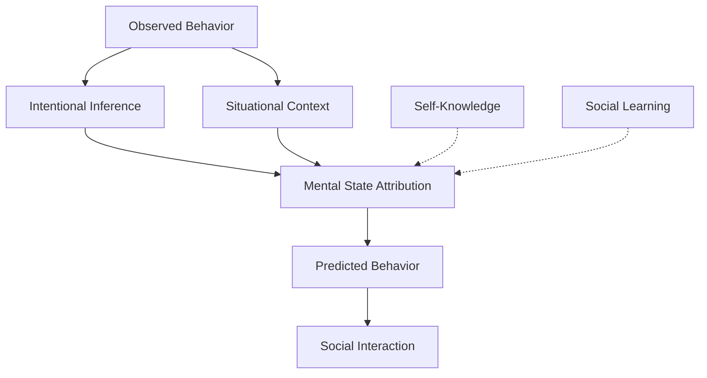

# Advanced Social Cognition and Theory of Mind

This document explores advanced aspects of social cognition through Active Inference, focusing on theory of mind, mentalizing, social prediction, and the neural mechanisms supporting sophisticated social understanding and interaction.

## 🧠 Theory of Mind as Active Inference

### Mental State Attribution

Theory of mind involves inferring others' mental states from their behavior and context:



### Hierarchical Mentalizing

Social cognition operates across multiple levels of inference:

```python
class HierarchicalMentalizing:
    """Multi-level theory of mind processing."""

    def __init__(self):
        self.zero_order = ZeroOrderToM()     # Behavior observation
        self.first_order = FirstOrderToM()   # Single mental states
        self.second_order = SecondOrderToM() # Beliefs about beliefs
        self.third_order = ThirdOrderToM()   # Recursive mentalizing

    def process_social_scene(self, observed_agents, context):
        """Process social scene through hierarchical mentalizing."""

        # Zero-order: Direct behavior observation
        behaviors = self.zero_order.observe_behaviors(observed_agents)

        # First-order: Infer immediate mental states
        mental_states = {}
        for agent in observed_agents:
            mental_states[agent.id] = self.first_order.infer_mental_state(
                agent.behavior, context
            )

        # Second-order: Model agents' beliefs about each other
        second_order_beliefs = self.second_order.model_mutual_beliefs(
            mental_states, observed_agents
        )

        # Third-order: Recursive modeling (if needed)
        if self.requires_third_order(context):
            third_order_model = self.third_order.model_recursive_beliefs(
                second_order_beliefs, mental_states
            )

        return {
            'behaviors': behaviors,
            'first_order': mental_states,
            'second_order': second_order_beliefs,
            'third_order': third_order_model if 'third_order_model' in locals() else None
        }

    def requires_third_order(self, context):
        """Determine if third-order mentalizing is needed."""
        return context.complexity > 0.8 or context.deception_likelihood > 0.5
```

## 🔬 Neural Mechanisms of Social Cognition

### Social Brain Network

Key brain regions involved in social cognition:

```python
class SocialBrainNetwork:
    """Neural network for social cognition processing."""

    def __init__(self):
        # Core social cognition regions
        self.mpfc = MedialPrefrontalCortex()    # Mentalizing
        self.tpj = TemporoparietalJunction()    # Perspective taking
        self.pcc = PosteriorCingulateCortex()   # Self-other distinction
        self.amy = Amygdala()                   # Social emotion processing
        self.ifg = InferiorFrontalGyrus()       # Social communication

        # Connectivity between regions
        self.social_network_connectivity = self.initialize_connectivity()

    def process_social_stimulus(self, social_input):
        """Process social information through the social brain network."""

        # MPFC: Mental state inference
        mental_states = self.mpfc.infer_mental_states(social_input)

        # TPJ: Perspective taking
        perspectives = self.tpj.take_perspectives(social_input, mental_states)

        # PCC: Self-other distinction
        self_other_distinction = self.pcc.distinguish_self_other(
            social_input, perspectives
        )

        # Amygdala: Social emotion processing
        social_emotions = self.amy.process_social_emotions(
            social_input, mental_states
        )

        # IFG: Social communication preparation
        communication_signals = self.ifg.prepare_communication(
            mental_states, social_emotions
        )

        return {
            'mental_states': mental_states,
            'perspectives': perspectives,
            'self_other': self_other_distinction,
            'emotions': social_emotions,
            'communication': communication_signals
        }

    def update_social_learning(self, social_experience, prediction_error):
        """Update social knowledge based on experience."""

        # Update connectivity based on prediction errors
        self.update_connectivity(social_experience, prediction_error)

        # Hebbian learning in social circuits
        self.hebbian_social_learning(social_experience)

        # Precision weighting for social predictions
        self.update_social_precision(social_experience, prediction_error)
```

### Mirror Neuron System

Neural basis for understanding others' actions and intentions:

```python
class MirrorNeuronSystem:
    """Mirror neuron system for action understanding."""

    def __init__(self):
        self.premotor_cortex = PremotorCortex()
        self.inferior_parietal = InferiorParietal()
        self.superior_temporal = SuperiorTemporalSulcus()
        self.mirror_activation = {}

    def process_observed_action(self, observed_action):
        """Process observed action through mirror system."""

        # Infer action goal
        action_goal = self.superior_temporal.infer_goal(observed_action)

        # Simulate action in premotor cortex
        simulated_action = self.premotor_cortex.simulate_action(observed_action)

        # Compute mirror activation
        self.mirror_activation = self.compute_mirror_activation(
            observed_action, simulated_action
        )

        # Generate understanding
        action_understanding = self.generate_understanding(
            action_goal, simulated_action, self.mirror_activation
        )

        return action_understanding

    def compute_mirror_activation(self, observed, simulated):
        """Compute mirror neuron activation patterns."""

        activation = {}
        for muscle_group in observed.muscle_groups:
            # Mirror activation proportional to observed-simulated similarity
            similarity = self.compute_similarity(observed[muscle_group], simulated[muscle_group])
            activation[muscle_group] = similarity * observed.intensity

        return activation

    def generate_understanding(self, goal, simulation, activation):
        """Generate understanding of observed action."""

        understanding = {
            'goal': goal,
            'mechanism': simulation,
            'resonance': activation,
            'intentionality': self.infer_intentionality(goal, activation),
            'emotional_context': self.extract_emotional_context(activation)
        }

        return understanding

    def infer_intentionality(self, goal, activation):
        """Infer whether action is intentional."""

        # High mirror activation with clear goal suggests intentionality
        intentionality_score = min(goal.clarity * np.mean(list(activation.values())), 1.0)

        return {
            'score': intentionality_score,
            'confidence': self.compute_confidence(goal, activation)
        }
```

## 🧪 Social Prediction and Learning

### Social Generative Models

Predicting social behavior through learned social models:

```python
class SocialGenerativeModel:
    """Generative model for social behavior prediction."""

    def __init__(self, n_agents, social_contexts):
        self.n_agents = n_agents
        self.social_contexts = social_contexts

        # Social priors
        self.relationship_prior = self.initialize_relationship_prior()
        self.intent_prior = self.initialize_intent_prior()
        self.norm_prior = self.initialize_norm_prior()

        # Social learning
        self.social_learner = SocialBayesianLearner()

    def predict_social_behavior(self, current_social_state, agent_goals):
        """Predict likely social behaviors given current state."""

        predictions = {}

        for agent_id in range(self.n_agents):
            # Infer agent's mental state
            mental_state = self.infer_mental_state(agent_id, current_social_state)

            # Predict behavior based on mental state and goals
            behavior_prediction = self.predict_behavior(
                mental_state, agent_goals[agent_id], current_social_state
            )

            predictions[agent_id] = {
                'mental_state': mental_state,
                'predicted_behavior': behavior_prediction,
                'confidence': self.compute_prediction_confidence(mental_state, behavior_prediction)
            }

        return predictions

    def infer_mental_state(self, agent_id, social_state):
        """Infer agent's mental state from social context."""

        # Extract agent-specific information
        agent_behavior = social_state.agent_behaviors[agent_id]
        social_context = social_state.relationships[agent_id]

        # Bayesian inference over possible mental states
        mental_state_posterior = self.social_learner.infer_mental_state(
            agent_behavior, social_context, self.intent_prior
        )

        return mental_state_posterior

    def predict_behavior(self, mental_state, goals, social_context):
        """Predict behavior from mental state and goals."""

        # Generate behavior predictions
        behavior_predictions = []

        for intent in mental_state.possible_intents:
            # How intent maps to behavior given goals and context
            behavior = self.intent_to_behavior(intent, goals, social_context)
            probability = mental_state.posterior[intent]

            behavior_predictions.append({
                'behavior': behavior,
                'probability': probability,
                'utility': self.compute_behavior_utility(behavior, goals, social_context)
            })

        return behavior_predictions

    def update_social_model(self, observed_interaction, prediction_error):
        """Update social generative model based on observed interactions."""

        # Update relationship priors
        self.relationship_prior = self.social_learner.update_relationships(
            observed_interaction, self.relationship_prior
        )

        # Update intent priors
        self.intent_prior = self.social_learner.update_intents(
            observed_interaction, prediction_error, self.intent_prior
        )

        # Update norm priors
        self.norm_prior = self.social_learner.update_norms(
            observed_interaction, self.norm_prior
        )
```

### Social Learning Mechanisms

Learning social norms and expectations:

```python
class SocialLearningMechanism:
    """Mechanisms for learning social norms and expectations."""

    def __init__(self):
        self.norm_learner = NormBayesianLearner()
        self.expectation_learner = ExpectationLearner()
        self.reinforcement_learner = SocialReinforcementLearner()

    def learn_social_norms(self, social_interactions):
        """Learn social norms from observed interactions."""

        learned_norms = {}

        for interaction in social_interactions:
            # Extract norm-relevant features
            norm_features = self.extract_norm_features(interaction)

            # Update norm beliefs
            self.norm_learner.update_beliefs(norm_features, interaction.outcome)

            # Learn expectations
            self.expectation_learner.update_expectations(
                interaction, self.norm_learner.current_beliefs
            )

        # Generate norm model
        learned_norms = self.norm_learner.generate_norm_model()

        return learned_norms

    def learn_social_expectations(self, interaction_history):
        """Learn expectations about social behavior."""

        expectations = {}

        for agent_pair in self.get_agent_pairs(interaction_history):
            pair_interactions = self.filter_pair_interactions(agent_pair, interaction_history)

            # Learn dyadic expectations
            dyadic_expectations = self.expectation_learner.learn_dyadic_expectations(pair_interactions)

            # Learn group expectations
            group_expectations = self.expectation_learner.learn_group_expectations(
                pair_interactions, interaction_history
            )

            expectations[agent_pair] = {
                'dyadic': dyadic_expectations,
                'group': group_expectations
            }

        return expectations

    def social_reinforcement_learning(self, social_feedback):
        """Learn through social reinforcement."""

        # Process social rewards and punishments
        for feedback in social_feedback:
            # Update value functions
            self.reinforcement_learner.update_values(feedback)

            # Update social policies
            self.reinforcement_learner.update_policies(feedback)

        # Generate social behavior policy
        social_policy = self.reinforcement_learner.generate_social_policy()

        return social_policy
```

## 🧬 Cultural and Developmental Aspects

### Cultural Learning

How social cognition adapts to cultural contexts:

```python
class CulturalSocialCognition:
    """Social cognition adapted to cultural contexts."""

    def __init__(self, cultural_context):
        self.cultural_context = cultural_context
        self.cultural_learner = CulturalBayesianLearner()
        self.norm_adapter = NormAdapter()
        self.communication_adapter = CommunicationAdapter()

    def adapt_to_culture(self, social_experiences):
        """Adapt social cognition to cultural context."""

        # Learn cultural norms
        cultural_norms = self.cultural_learner.learn_cultural_norms(
            social_experiences, self.cultural_context
        )

        # Adapt theory of mind
        adapted_tom = self.adapt_theory_of_mind(cultural_norms)

        # Adapt communication
        adapted_communication = self.communication_adapter.adapt_communication(
            cultural_norms, self.cultural_context
        )

        return {
            'cultural_norms': cultural_norms,
            'adapted_tom': adapted_tom,
            'adapted_communication': adapted_communication
        }

    def adapt_theory_of_mind(self, cultural_norms):
        """Adapt theory of mind to cultural norms."""

        # Cultural influence on mental state attribution
        cultural_attribution_bias = self.compute_cultural_bias(cultural_norms)

        # Modify mentalizing based on cultural context
        adapted_mentalizing = self.apply_cultural_adaptation(
            self.base_mentalizing, cultural_attribution_bias
        )

        return adapted_mentalizing
```

### Developmental Trajectory

How social cognition develops over time:

```python
class SocialCognitiveDevelopment:
    """Developmental trajectory of social cognition."""

    def __init__(self):
        self.developmental_stages = self.initialize_stages()
        self.social_learning_history = []
        self.current_stage = 0

    def initialize_stages(self):
        """Initialize developmental stages of social cognition."""

        stages = [
            {
                'name': 'implicit_social_understanding',
                'age_range': '0-6 months',
                'capabilities': ['face_preference', 'emotional_contagion']
            },
            {
                'name': 'joint_attention',
                'age_range': '6-12 months',
                'capabilities': ['shared_attention', 'social_referencing']
            },
            {
                'name': 'theory_of_mind_emergence',
                'age_range': '3-5 years',
                'capabilities': ['false_belief_understanding', 'perspective_taking']
            },
            {
                'name': 'advanced_mentalizing',
                'age_range': '5+ years',
                'capabilities': ['second_order_tom', 'complex_emotion_understanding']
            }
        ]

        return stages

    def process_social_experience(self, experience, age):
        """Process social experience through developmental lens."""

        # Determine current developmental stage
        self.current_stage = self.determine_stage(age)

        # Process experience according to stage capabilities
        stage_capabilities = self.developmental_stages[self.current_stage]['capabilities']

        processed_experience = self.process_by_capabilities(
            experience, stage_capabilities
        )

        # Update learning history
        self.social_learning_history.append({
            'experience': experience,
            'processed': processed_experience,
            'stage': self.current_stage,
            'age': age
        })

        return processed_experience

    def determine_stage(self, age):
        """Determine developmental stage based on age."""

        if age < 0.5:  # 6 months
            return 0
        elif age < 1.0:  # 12 months
            return 1
        elif age < 5.0:  # 5 years
            return 2
        else:
            return 3

    def process_by_capabilities(self, experience, capabilities):
        """Process experience according to current capabilities."""

        processed = {}

        for capability in capabilities:
            if capability == 'face_preference':
                processed['face_detection'] = self.detect_faces(experience)
            elif capability == 'emotional_contagion':
                processed['emotion_sharing'] = self.share_emotion(experience)
            elif capability == 'shared_attention':
                processed['joint_attention'] = self.establish_joint_attention(experience)
            elif capability == 'false_belief_understanding':
                processed['belief_attribution'] = self.attribute_false_beliefs(experience)
            # Add other capabilities...

        return processed
```

## 🧪 Clinical and Atypical Social Cognition

### Autism Spectrum Disorder

Social cognition differences in ASD:

```python
class ASDSocialCognition:
    """Social cognition model for Autism Spectrum Disorder."""

    def __init__(self, severity_profile):
        self.severity_profile = severity_profile
        self.mentalizing_system = ImpairedMentalizingSystem(severity_profile)
        self.communication_system = ImpairedCommunicationSystem(severity_profile)
        self.social_motivation = ReducedSocialMotivation(severity_profile)

    def process_social_stimulus(self, social_input):
        """Process social stimulus with ASD characteristics."""

        # Impaired mentalizing
        mental_states = self.mentalizing_system.process_mental_states(social_input)

        # Communication difficulties
        communication = self.communication_system.process_communication(social_input)

        # Reduced social motivation
        motivation = self.social_motivation.compute_social_motivation(social_input)

        # Generate social response
        response = self.generate_social_response(
            mental_states, communication, motivation
        )

        return response

    def generate_social_response(self, mental_states, communication, motivation):
        """Generate social response considering ASD characteristics."""

        # Literal interpretation bias
        if communication.ambiguity > 0.7:
            response = self.literal_response(communication)
        else:
            response = self.typical_response(mental_states, motivation)

        # Reduced eye contact and social engagement
        if motivation.level < 0.5:
            response.engagement = 'reduced'

        return response
```

### Social Anxiety and Depression

Impact on social cognition:

```python
class AnxietyDepressionSocialCognition:
    """Social cognition under anxiety and depression."""

    def __init__(self, symptom_profile):
        self.symptom_profile = symptom_profile
        self.threat_bias = ThreatDetectionBias(symptom_profile)
        self.self_focus = ExcessiveSelfFocus(symptom_profile)
        self.social_withdrawal = SocialWithdrawalTendency(symptom_profile)

    def process_social_interaction(self, interaction):
        """Process social interaction with anxiety/depression biases."""

        # Threat bias in social perception
        threat_assessment = self.threat_bias.assess_social_threat(interaction)

        # Excessive self-focus
        self_focus = self.self_focus.compute_self_focus(interaction, threat_assessment)

        # Social withdrawal tendency
        withdrawal = self.social_withdrawal.compute_withdrawal(
            threat_assessment, self_focus
        )

        # Generate biased social response
        response = self.generate_biased_response(
            interaction, threat_assessment, self_focus, withdrawal
        )

        return response
```

## 🔬 Research Directions

### Advanced Theory of Mind

#### Higher-Order Mentalizing
- **Third-order and beyond**: Modeling beliefs about beliefs about beliefs
- **Recursive mentalizing**: Infinite regress in social cognition
- **Meta-mentalizing**: Thinking about thinking about mental states

#### Cultural Cognition
- **Cross-cultural theory of mind**: Cultural variations in mentalizing
- **Cultural neuroscience**: Neural basis of cultural social cognition
- **Global-local social processing**: Cultural influences on social perception

### Computational Social Neuroscience

#### Neural Network Models
- **Deep mentalizing networks**: Neural networks for theory of mind
- **Social attention networks**: Neural mechanisms for social attention
- **Empathy networks**: Neural basis of emotional contagion

#### Active Inference Social Models
- **Social free energy**: Free energy in social contexts
- **Social precision**: Precision weighting in social cognition
- **Collective inference**: Multi-agent Active Inference

## 📚 Related Concepts

### Core Social Cognition
- [[social_cognition]] - Basic social cognition mechanisms
- [[communication]] - Social communication processes
- [[cooperation]] - Social cooperation and coordination

### Theory of Mind
- [[hierarchical_inference]] - Multi-level social inference
- [[working_memory]] - Social working memory
- [[attention_mechanisms]] - Social attention

### Neural Basis
- [[../biology/neuroscience]] - Neural mechanisms
- [[../biology/social_insect_cognition]] - Comparative social cognition
- [[neural_active_inference]] - Neural implementation

---

> **Advanced Social Cognition**: Social understanding involves hierarchical inference about others' mental states, cultural adaptation, and complex social prediction through Active Inference.

---

> **Theory of Mind Hierarchy**: Social cognition operates across multiple levels, from basic behavior observation to recursive modeling of others' beliefs about beliefs.

---

> **Neural Social Networks**: Specialized brain networks support social cognition, with mirror neurons for action understanding and mentalizing networks for theory of mind.
