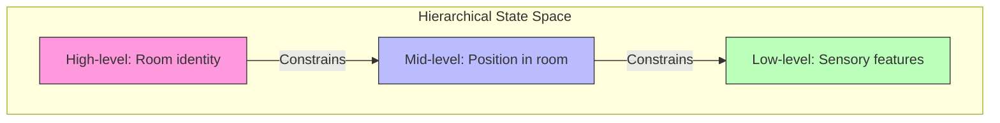

# State Space Abstraction

## Overview

State space abstraction in Active Inference addresses the problem of scaling generative models to complex environments. Naive representation of all possible states leads to combinatorial explosion. Abstraction techniques — factorization, hierarchical decomposition, and coarse-graining — compress the state space while preserving behavioral fidelity.

## Factorization

### Independent State Factors

When states can be decomposed into conditionally independent factors:

```math
s = (s_1, s_2, ..., s_F) \quad \Rightarrow \quad |\mathcal{S}| = \prod_f |\mathcal{S}_f| \quad \text{but } q(s) = \prod_f q(s_f)
```

This reduces computational cost from $O(|\mathcal{S}|^2)$ to $O(\sum_f |\mathcal{S}_f|^2)$.

### Example

| Monolithic State | Factored States | Size |
| --- | --- | --- |
| (location, color, size) | location(10) × color(3) × size(4) | 120 → 17 parameters |

## Hierarchical Abstraction



### Multi-Scale Representations

```math
s_{\text{high}} \to s_{\text{mid}} \to s_{\text{low}} \quad \text{via} \quad B_{\text{high} \to \text{mid}} \text{ (mapping matrices)}
```

## Implementation

```python
class FactoredStateSpace:
    def __init__(self, factor_sizes, factor_names=None):
        self.factor_sizes = factor_sizes
        self.factor_names = factor_names or [f"factor_{i}" for i in range(len(factor_sizes))]
        self.n_factors = len(factor_sizes)
        self.total_states = np.prod(factor_sizes)
    
    def factored_belief(self, beliefs_per_factor):
        return beliefs_per_factor  # Mean-field: list of per-factor beliefs
    
    def joint_state_index(self, factor_states):
        idx = 0
        for i, s in enumerate(factor_states):
            idx = idx * self.factor_sizes[i] + s
        return idx
    
    def compression_ratio(self):
        factored_params = sum(self.factor_sizes)
        joint_params = self.total_states
        return joint_params / factored_params
```

## Abstraction Methods

| Method | Approach | When to Use |
| --- | --- | --- |
| Mean-field factorization | Independent factors | Separable domains |
| Hierarchical grouping | Nested state spaces | Multi-scale problems |
| Coarse-graining | Merge similar states | Large discrete spaces |
| Continuous embedding | States as continuous vectors | High-dimensional |
| Attention-based | Dynamic focus on relevant substates | Context-dependent |

## Related Topics

- [[generative_model]] — Generative model structure
- [[system_definition]] — System specification
- [[hierarchical_inference]] — Hierarchical inference
- [[model_architecture]] — Model architecture
- [[model_complexity]] — Model complexity
