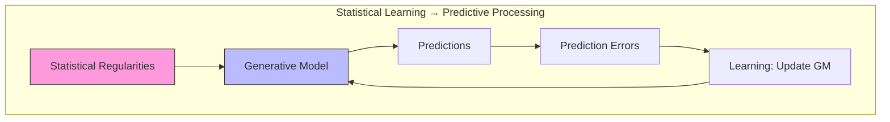

# Statistical Learning

## Overview

Statistical learning is the ability to implicitly extract statistical regularities from sensory input — discovering patterns in sequences, spatial arrangements, and temporal contingencies without explicit instruction. It is a foundational mechanism for the predictive processing framework and Active Inference.

## Core Mechanisms

### Transitional Probability Learning

First demonstrated by Saffran et al. (1996) in infant speech segmentation:

```math
p(B|A) = \frac{\text{freq}(AB)}{\text{freq}(A)}
```

Infants segment words by tracking syllable-to-syllable transition probabilities within speech streams.

### Active Inference Interpretation

Statistical learning corresponds to learning the transition model (B matrix):

```math
B_{ij} = p(s_{t+1} = i | s_t = j) \quad \text{(estimated from experience)}
```

The agent minimizes free energy by building an accurate model of statistical regularities in its environment.

### Multi-Domain Statistical Learning

| Domain | Regularity Extracted | Neural Substrate |
| --- | --- | --- |
| Auditory | Syllable transitions, tone sequences | Superior temporal gyrus |
| Visual | Shape combinations, spatial patterns | Visual cortex |
| Tactile | Texture sequences, haptic patterns | Somatosensory cortex |
| Motor | Action sequences, movement patterns | Basal ganglia, cerebellum |
| Social | Behavioral contingencies | mPFC, TPJ |

## Computational Models

### Bayesian Model

```python
class BayesianStatisticalLearner:
    def __init__(self, n_elements, prior_strength=1.0):
        self.counts = np.ones((n_elements, n_elements)) * prior_strength
        self.transitions = self.counts / self.counts.sum(axis=0, keepdims=True)
    
    def observe(self, sequence):
        for i in range(len(sequence) - 1):
            self.counts[sequence[i+1], sequence[i]] += 1
        self.transitions = self.counts / self.counts.sum(axis=0, keepdims=True)
    
    def surprise(self, item_a, item_b):
        return -np.log(self.transitions[item_b, item_a] + 1e-16)
```

### Chunking vs. Continuous Models

Two competing accounts of statistical learning:
1. **Chunking**: Discrete units are extracted and stored (e.g., "pretty baby" as a word)
2. **Continuous**: Graded transitional probabilities guide perception without explicit segmentation

Active Inference naturally supports both: chunks correspond to discrete states in the generative model, while transition probabilities correspond to the B matrix.

## Relationship to Predictive Processing

Statistical learning is the mechanism by which the brain builds predictive models:



## Related Topics

- [[learning_mechanisms]] — Learning mechanisms in Active Inference
- [[bayesian_brain_hypothesis]] — Bayesian brain
- [[predictive_processing]] — Predictive processing framework
- [[learning_theory]] — Learning theory
- [[implicit_memory]] — Implicit memory systems
- [[synaptic_plasticity]] — Neural plasticity
