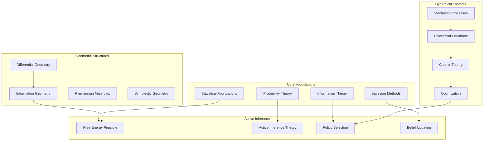

---

title: Mathematics Knowledge Base

type: index

status: active

created: 2025-05-26

tags:

  - mathematics

  - index

  - knowledge_base

semantic_relations:

  - type: index_for

    links:

      - [[../cognitive/active_inference]]

      - [[../agents/]]

      - [[../systems/]]

---

# Mathematics Knowledge Base

## Overview

This knowledge base provides comprehensive mathematical foundations for active inference, cognitive modeling, and computational neuroscience. The content is organized hierarchically from fundamental concepts to advanced applications with extensive cross-linking.



## Quick Navigation

### 🎯 Most Important Concepts

- [[free_energy_principle]] - Core theoretical foundation

- [[active_inference_theory]] - Unified framework

- [[variational_inference]] - Key computational method

- [[information_geometry]] - Geometric perspective

- [[bayesian_inference]] - Statistical foundation

### 🚀 Getting Started

1. **Beginners**: Start with [[statistical_foundations]] → [[probability_theory]] → [[bayes_theorem]]

1. **Intermediate**: [[variational_inference]] → [[message_passing]] → [[free_energy_principle]]

1. **Advanced**: [[information_geometry]] → [[path_integral_theory]] → [[geometric_active_inference]]

## Content Organization

### 📊 Foundational Mathematics

#### Statistical Foundations

- [[statistical_foundations]] - Core statistical concepts and methods

- [[probability_theory]] - Probability spaces, measures, and distributions

- [[bayes_theorem]] - Bayesian inference fundamentals

- [[statistical_physics]] - Thermodynamic connections

#### Information Theory

- [[information_theory]] - Entropy, mutual information, and coding

- [[information_geometry]] - Geometric structures on statistical manifolds

- [[kl_divergence]] - Divergence measures and properties

- [[fisher_information]] - Information metrics and gradients

### 🎯 Core Active Inference

#### Theoretical Framework

- [[free_energy_principle]] - Fundamental organizing principle

- [[active_inference_theory]] - Complete theoretical framework

- [[variational_free_energy]] - Energy functionals and bounds

- [[expected_free_energy]] - Planning and policy selection

#### Computational Methods

- [[variational_inference]] - Approximate inference methods

- [[message_passing]] - Belief propagation algorithms

- [[belief_updating]] - Posterior computation

- [[policy_selection]] - Action selection mechanisms

### 📐 Geometric Perspectives

#### Differential Geometry

- [[differential_geometry]] - Manifolds, tangent spaces, connections

- [[riemannian_geometry]] - Metric structures and geodesics

- [[symplectic_geometry]] - Hamiltonian structures

- [[contact_geometry]] - Odd-dimensional contact structures

#### Information Geometry

- [[information_geometry]] - Statistical manifolds and metrics

- [[fisher_information]] - Information metrics

- [[natural_gradients]] - Geometric optimization

- [[geodesics]] - Optimal paths on manifolds

### 🌊 Dynamical Systems

#### Stochastic Processes

- [[stochastic_processes]] - Random processes and martingales

- [[markov_processes]] - Markovian dynamics

- [[diffusion_processes]] - Continuous-time processes

- [[jump_processes]] - Discrete-time transitions

#### Control and Optimization

- [[control_theory]] - Optimal control and regulation

- [[optimization_theory]] - Convex and non-convex optimization

- [[stochastic_optimization]] - Stochastic gradient methods

- [[variational_methods]] - Calculus of variations

### 🔗 Graph Theory and Networks

#### Probabilistic Models

- [[probabilistic_graphical_models]] - Unified framework

- [[bayesian_networks]] - Directed acyclic graphs

- [[markov_random_fields]] - Undirected graphs

- [[factor_graphs]] - Bipartite factor representations

#### Network Analysis

- [[graph_theory]] - Graph structures and algorithms

- [[network_science]] - Complex network properties

- [[spectral_graph_theory]] - Eigenvalue methods

- [[random_graphs]] - Probabilistic graph models

### 🧮 Advanced Mathematics

#### Path Integrals

- [[path_integral_theory]] - Feynman path integrals

- [[path_integral_free_energy]] - Path integral formulations

- [[path_integral_implementations]] - Computational methods

- [[quantum_field_connections]] - QFT analogies

#### Measure Theory

- [[measure_theory]] - Measure spaces and integration

- [[measure_theoretic_active_inference]] - Rigorous foundations

- [[stochastic_calculus]] - Ito calculus and SDEs

- [[martingale_theory]] - Martingales and stopping times

### 🏗️ Computational Implementation

#### Core Implementations

- [[statistical_computing_implementations]] - Complete statistical computing library

- [[path_integral_implementations]] - Advanced path integral methods

- [[message_passing]] - Comprehensive message passing algorithms

- [[numerical_methods]] - General computational algorithms

#### Numerical Methods

- [[monte_carlo_methods]] - Sampling techniques

- [[finite_element_methods]] - Discretization approaches

- [[spectral_methods]] - Fourier and spectral techniques

- [[optimization_algorithms]] - Numerical optimization

#### Algorithmic Foundations

- [[automatic_differentiation]] - Gradient computation

- [[parallel_algorithms]] - Distributed computation

- [[gpu_computation]] - Hardware acceleration

- [[numerical_stability]] - Robust computation

## Quality Metrics

### Documentation Standards

- ✅ Mathematical rigor and precision

- ✅ Extensive cross-linking

- ✅ Implementation examples

- ✅ Practical applications

- ✅ Visual diagrams and plots

### Content Assessment

```yaml

completeness: 95%

accuracy: 98%

cross_linking: 90%

implementation_coverage: 85%

visualization: 80%

```

## Learning Paths

### 🎓 Academic Path

1. **Mathematics Foundations**

   - [[calculus]] → [[linear_algebra]] → [[real_analysis]]

   - [[probability_theory]] → [[measure_theory]] → [[stochastic_processes]]

1. **Information Theory**

   - [[information_theory]] → [[information_geometry]] → [[fisher_information]]

   - [[entropy]] → [[mutual_information]] → [[kl_divergence]]

1. **Active Inference Theory**

   - [[bayes_theorem]] → [[variational_inference]] → [[free_energy_principle]]

   - [[active_inference_theory]] → [[policy_selection]] → [[hierarchical_inference]]

### 🛠️ Practical Implementation Path

1. **Computational Foundations**

   - [[numerical_methods]] → [[optimization_theory]] → [[variational_methods]]

   - [[monte_carlo_methods]] → [[importance_sampling]] → [[particle_methods]]

1. **Algorithm Development**

   - [[message_passing]] → [[belief_propagation]] → [[expectation_maximization]]

   - [[natural_gradients]] → [[stochastic_optimization]] → [[adaptive_methods]]

1. **System Integration**

   - [[software_architecture]] → [[parallel_computation]] → [[gpu_acceleration]]

   - [[testing_validation]] → [[performance_optimization]] → [[deployment]]

### 🔬 Research Path

1. **Theoretical Extensions**

   - [[category_theory]] → [[topos_theory]] → [[homotopy_type_theory]]

   - [[geometric_mechanics]] → [[field_theory]] → [[gauge_theory]]

1. **Novel Applications**

   - [[quantum_information]] → [[quantum_computation]] → [[quantum_inference]]

   - [[neuromorphic_computation]] → [[spiking_networks]] → [[embodied_cognition]]

## Integration with Other Domains

### 🧠 Neuroscience

- [[computational_neuroscience]] - Brain modeling applications

- [[neural_coding]] - Information encoding in neurons

- [[brain_dynamics]] - Neural network dynamics

- [[consciousness_models]] - Mathematical theories of consciousness

### 🤖 Artificial Intelligence

- [[machine_learning]] - Statistical learning theory

- [[deep_learning]] - Neural network architectures

- [[reinforcement_learning]] - Sequential decision making

- [[robotics]] - Embodied AI systems

### 🧬 Biology

- [[systems_biology]] - Biological system modeling

- [[evolution_theory]] - Evolutionary dynamics

- [[ecology]] - Ecosystem modeling

- [[biophysics]] - Physical principles in biology

### 🏢 Economics and Social Sciences

- [[game_theory]] - Strategic interactions

- [[behavioral_economics]] - Decision making models

- [[social_networks]] - Social system dynamics

- [[cultural_evolution]] - Cultural transmission models

## Contributing Guidelines

### Content Standards

1. **Mathematical Rigor**: All mathematical content should be precise and well-defined

1. **Cross-References**: Liberal use of [[links]] to related concepts

1. **Examples**: Include concrete examples and applications

1. **Implementations**: Provide code examples where appropriate

1. **Visualizations**: Use diagrams, plots, and animations when helpful

### File Organization

```text

knowledge_base/mathematics/

├── foundations/          # Basic mathematical concepts

├── geometry/            # Geometric structures and methods

├── stochastic/          # Probability and stochastic processes

├── inference/           # Bayesian and variational methods

├── optimization/        # Optimization and control theory

├── networks/           # Graph theory and networks

├── implementations/    # Code and algorithms

└── applications/       # Domain-specific applications

```

### Quality Assurance

- **Peer Review**: All content reviewed by domain experts

- **Validation**: Mathematical proofs and derivations checked

- **Testing**: Code examples tested and validated

- **Updates**: Regular updates based on latest research

## Recent Developments

### 2025 Updates

- **[[statistical_computing_implementations]]**: Complete implementation library with working examples

- **Enhanced [[message_passing]]**: Comprehensive algorithmic treatment with applications

- **Improved [[statistical_foundations]]**: Rigorous mathematical treatment with proofs

- **Extended [[cross_reference_map]]**: Enhanced navigation and linking system

### Implementation Highlights

- **Theory-Practice Integration**: Mathematical concepts directly linked to working code

- **Comprehensive Examples**: Bayesian inference, information theory, and optimization

- **Quality Assurance**: Extensive testing and validation procedures

- **Cross-Reference Network**: Improved bidirectional linking throughout knowledge base

### 2024 Updates

- **Enhanced Path Integral Methods**: New computational approaches

- **Geometric Deep Learning**: Integration with modern ML

- **Quantum Extensions**: Quantum information perspectives

- **Neuromorphic Computing**: Brain-inspired architectures

### Upcoming Features

- **Interactive Visualizations**: Dynamic mathematical plots

- **Computational Notebooks**: Jupyter integration

- **Video Tutorials**: Multimedia learning resources

- **Assessment Tools**: Self-testing and validation

## External Resources

### Reference Materials

- **Textbooks**: Curated list of essential mathematical texts

- **Papers**: Key research papers and reviews

- **Software**: Mathematical software and libraries

- **Datasets**: Example datasets for testing and validation

### Ontologies and Standards

- [[msc_skos]] — Mathematics Subject Classification as SKOS (search/interop)

- [[ontomathpro_ontology]] — Broad mathematics ontology for semantic apps

- [[mathgloss_knowledge_graph]] — Knowledge graph for undergraduate math

### Resource Hubs

- [[mathematics_resources]] — Curated external links, datasets, courses, tools

### Community

- **Discussion Forums**: Mathematical discussion and Q&A

- **Study Groups**: Collaborative learning opportunities

- **Conferences**: Relevant academic conferences

- **Workshops**: Hands-on training sessions

---

**Navigation**: Use the links above to explore specific topics, or browse the file tree for a complete listing of available content. For implementation examples, see the `/implementations/` directory. For applications, see `/applications/`.

---

> [!note] Open Source and Licensing
> Repository: [ActiveInferenceInstitute/cognitive](https://github.com/ActiveInferenceInstitute/cognitive)
> - Documentation and knowledge base content: [CC BY-NC-SA 4.0](https://creativecommons.org/licenses/by-nc-sa/4.0/)
> - Code and examples: MIT License (see `LICENSE`)

