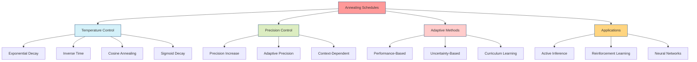

# Annealing Schedules

## Overview

Annealing schedules control the temperature or precision parameters in optimization and inference algorithms, enabling smooth transitions from exploration to exploitation. These schedules are inspired by simulated annealing in statistical physics and play a crucial role in active inference for balancing epistemic and pragmatic value.



## Temperature-Based Annealing

### Exponential Decay

The most common annealing schedule, exponentially decreasing temperature:

```math
T_t = T_0 \alpha^t \quad \text{where} \quad 0 < \alpha < 1
```

**Properties:**
- Fast initial cooling
- Gradual approach to zero
- Good for early exploration, later exploitation

```python
def exponential_annealing(initial_temp: float, decay_rate: float, step: int) -> float:
    """Compute temperature using exponential decay."""
    return initial_temp * (decay_rate ** step)
```

### Inverse Time Decay

Temperature decreases inversely with time, providing slower cooling:

```math
T_t = \frac{T_0}{1 + k t}
```

**Properties:**
- Slower initial cooling than exponential
- Approaches zero asymptotically
- Better for gradual transitions

```python
def inverse_time_annealing(initial_temp: float, decay_rate: float, step: int) -> float:
    """Compute temperature using inverse time decay."""
    return initial_temp / (1 + decay_rate * step)
```

### Cosine Annealing

Smooth annealing following a cosine curve, often used in neural network training:

```math
T_t = T_{\min} + \frac{1}{2}(T_{\max} - T_{\min})\left(1 + \cos\left(\frac{\pi t}{T}\right)\right)
```

**Properties:**
- Smooth transitions
- Periodic behavior possible
- Good for cyclic exploration-exploitation

```python
import numpy as np

def cosine_annealing(t_min: float, t_max: float, step: int, total_steps: int) -> float:
    """Compute temperature using cosine annealing."""
    cos_term = np.cos(np.pi * step / total_steps)
    return t_min + 0.5 * (t_max - t_min) * (1 + cos_term)
```

## Precision-Based Annealing

### Precision Increase Schedules

In active inference, precision often increases over time (temperature decreases):

```math
\gamma_t = \gamma_0 + k t^\alpha
```

where $\gamma$ is precision and $\alpha$ controls the growth rate.

```python
def precision_annealing(initial_precision: float, growth_rate: float,
                       step: int, exponent: float = 1.0) -> float:
    """Compute precision using power-law growth."""
    return initial_precision + growth_rate * (step ** exponent)
```

### Adaptive Precision Control

Precision adjustment based on performance metrics:

```python
class AdaptivePrecisionAnnealer:
    """Adaptive precision annealing based on performance."""

    def __init__(self, initial_precision: float = 1.0,
                 adaptation_rate: float = 0.1):
        self.precision = initial_precision
        self.adaptation_rate = adaptation_rate
        self.performance_history = []

    def update_precision(self, current_performance: float,
                        target_performance: float):
        """Update precision based on performance relative to target."""

        performance_error = target_performance - current_performance

        # Increase precision if performing well (reduce exploration)
        if performance_error > 0:
            self.precision *= (1 + self.adaptation_rate)
        else:
            # Decrease precision if underperforming (increase exploration)
            self.precision *= (1 - self.adaptation_rate)

        # Bound precision
        self.precision = np.clip(self.precision, 0.1, 10.0)

        return self.precision

    def get_temperature(self) -> float:
        """Convert precision to temperature."""
        return 1.0 / self.precision
```

## Active Inference Applications

### Policy Selection Annealing

In active inference, annealing controls the balance between epistemic and pragmatic value:

```python
def active_inference_policy_selection(beliefs: np.ndarray,
                                    efe_values: np.ndarray,
                                    temperature: float) -> Tuple[int, np.ndarray]:
    """Policy selection with temperature-controlled softmax."""

    # Compute policy probabilities using temperature
    scaled_efe = -efe_values / temperature  # Negative because we minimize EFE
    exp_values = np.exp(scaled_efe - np.max(scaled_efe))  # For numerical stability
    policy_probs = exp_values / np.sum(exp_values)

    # Sample policy
    selected_policy = np.random.choice(len(efe_values), p=policy_probs)

    return selected_policy, policy_probs
```

## Implementation Examples

### Complete Annealing Framework

```python
class AnnealingScheduler:
    """Comprehensive annealing scheduler with multiple strategies."""

    def __init__(self, config: Dict):
        self.config = config
        self.step_count = 0

        # Initialize different annealing strategies
        self.schedulers = {
            'exponential': lambda t: config['initial_temp'] * (config['decay_rate'] ** t),
            'cosine': lambda t: self._cosine_schedule(t, config),
            'adaptive': self._adaptive_schedule
        }

        self.current_strategy = config.get('strategy', 'exponential')

    def get_temperature(self) -> float:
        """Get current temperature based on selected strategy."""
        scheduler = self.schedulers[self.current_strategy]
        temp = scheduler(self.step_count)

        self.step_count += 1

        return max(temp, self.config.get('min_temp', 0.01))

    def _cosine_schedule(self, step: int, config: Dict) -> float:
        """Cosine annealing schedule."""
        t_min = config.get('min_temp', 0.01)
        t_max = config['initial_temp']
        total_steps = config.get('total_steps', 1000)

        cos_term = np.cos(np.pi * step / total_steps)
        return t_min + 0.5 * (t_max - t_min) * (1 + cos_term)

# Usage example
config = {
    'initial_temp': 2.0,
    'decay_rate': 0.995,
    'strategy': 'exponential',
    'min_temp': 0.01,
    'total_steps': 1000
}

annealer = AnnealingScheduler(config)
```

## Applications

### Active Inference

- **Epistemic Balancing**: Control exploration-exploitation trade-off through precision annealing
- **Policy Optimization**: Smooth convergence in policy selection
- **Model Learning**: Gradual refinement of generative models

### Machine Learning

- **Neural Network Training**: Learning rate scheduling and regularization
- **Reinforcement Learning**: Exploration schedules in RL agents
- **Bayesian Optimization**: Acquisition function temperature control

## Related Concepts

### Active Inference

- [[active_inference]]
- [[precision_parameter]]
- [[expected_free_energy]]
- [[policy_selection]]

### Optimization

- [[optimization_theory]]
- [[convergence_control]]
- [[gradient_methods]]

### Machine Learning

- [[reinforcement_learning]]
- [[variational_inference]]
- [[bayesian_optimization]]

## References

1. Kirkpatrick, S., Gelatt, C. D., & Vecchi, M. P. (1983). Optimization by simulated annealing. Science.

1. Friston, K., et al. (2017). Active inference and learning. Neuroscience & Biobehavioral Reviews.

## See Also

- [[precision_parameter]]
- [[convergence_control]]
- [[policy_selection]]
- [[exploration_exploitation]]
- [[temperature_parameter]]
- [[active_inference]]
