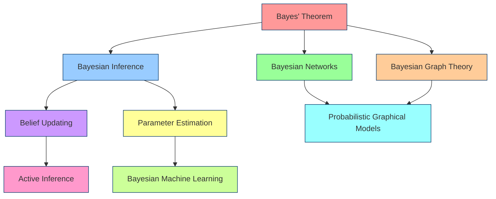
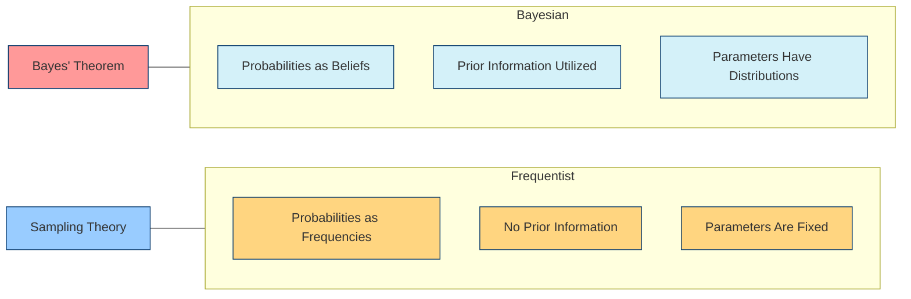
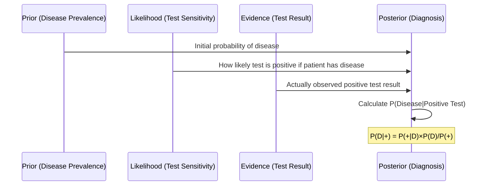

---

title: Bayes' Theorem

type: mathematical_concept

status: stable

created: 2024-03-20

tags:

  - mathematics

  - probability

  - statistics

  - bayesian-inference

semantic_relations:

  - type: foundation

    links:

      - [[probability_theory]]

      - [[conditional_probability]]

  - type: implements

    links:

      - [[bayesian_inference]]

      - [[bayesian_statistics]]

  - type: related

    links:

      - [[bayesian_networks]]

      - [[bayesian_graph_theory]]

      - [[belief_updating]]

      - [[maximum_likelihood_estimation]]

---

# Bayes' Theorem

## Overview

Bayes' Theorem provides a mathematical framework for updating probability estimates based on new evidence. It forms the foundation of [[bayesian_inference|Bayesian inference]] and [[bayesian_statistics|Bayesian statistics]], providing a rigorous approach to reasoning under uncertainty.

## Mathematical Formulation

### Basic Formula

```math

P(A|B) = \frac{P(B|A) \times P(A)}{P(B)}

```

where:

- P(A|B) is the posterior probability of A given B

- P(B|A) is the likelihood of B given A

- P(A) is the prior probability of A

- P(B) is the marginal probability of B

### Alternative Formulations

#### Using Law of Total Probability

```math

P(A|B) = \frac{P(B|A) \times P(A)}{P(B|A) \times P(A) + P(B|A^c) \times P(A^c)}

```

#### Multiple Hypotheses

```math

P(H_i|E) = \frac{P(E|H_i) \times P(H_i)}{\sum_{j=1}^n P(E|H_j) \times P(H_j)}

```

## Conceptual Diagrams

```mermaid

flowchart LR

    A[Prior: P(A)] --> C{Bayes' Theorem}

    B[Likelihood: P(B|A)] --> C

    D[Evidence: P(B)] --> C

    C --> E[Posterior: P(A|B)]

    style A fill:#d4f1f9,stroke:#05386b

    style B fill:#dcedc1,stroke:#05386b

    style C fill:#ffcccb,stroke:#05386b

    style D fill:#ffd580,stroke:#05386b

    style E fill:#d8bfd8,stroke:#05386b

```

### Interpretation Process

```mermaid

graph TD

    A[Prior Beliefs<br>P(Hypothesis)] --> B{New Evidence<br>Observed}

    B --> C[Calculate Likelihood<br>P(Evidence|Hypothesis)]

    C --> D[Apply Bayes' Theorem]

    D --> E[Update to Posterior<br>P(Hypothesis|Evidence)]

    E --> F{More Evidence?}

    F -->|Yes| B

    F -->|No| G[Final Posterior<br>Becomes New Prior]

    style A fill:#d4f1f9,stroke:#05386b

    style B fill:#dcedc1,stroke:#05386b

    style C fill:#ffcccb,stroke:#05386b

    style D fill:#ffd580,stroke:#05386b

    style E fill:#d8bfd8,stroke:#05386b

    style G fill:#d8bfd8,stroke:#05386b

```

### Relationship to Other Bayesian Concepts



## Interpretation and Components

### Components Explanation

| Component | Description | Role in Bayes' Theorem |

|-----------|-------------|------------------------|

| Prior | Initial belief before evidence | P(A) |

| Likelihood | Probability of evidence given hypothesis | P(B\|A) |

| Evidence | Observed data or information | P(B) |

| Posterior | Updated belief after evidence | P(A\|B) |

### Bayesian vs. Frequentist Interpretation



## Applications

### Core Application Areas

```mermaid

mindmap

  root((Bayes'<br>Theorem))

    Machine Learning

      Bayesian Networks

      Naive Bayes Classifiers

      Bayesian Optimization

    Statistics

      Parameter Estimation

      Hypothesis Testing

      Model Selection

    Medicine

      Diagnostic Testing

      Disease Prevalence

      Treatment Efficacy

    Finance

      Risk Assessment

      Portfolio Optimization

      Fraud Detection

    Information Theory

      Shannon Information

      Kullback-Leibler Divergence

      Coding Theory

```

### Example: Medical Testing



## Implementation Methods

### 1. Direct Probability Calculation

```python

def bayes_theorem(prior, likelihood, evidence):

    """Calculate posterior probability using Bayes' theorem"""

    return (likelihood * prior) / evidence

```

### 2. Log Space Calculation (for Numerical Stability)

```python

import numpy as np

def bayes_theorem_log(log_prior, log_likelihood, log_evidence):

    """Calculate posterior probability in log space for numerical stability"""

    return log_likelihood + log_prior - log_evidence

```

### 3. Recursive Bayesian Updating

```python

def recursive_bayesian_update(prior, likelihoods, evidences):

    """Update belief sequentially as new evidence arrives"""

    posterior = prior

    for likelihood, evidence in zip(likelihoods, evidences):

        posterior = (likelihood * posterior) / evidence

    return posterior

```

## Connection to Other Bayesian Methods

### Relationship to [[bayesian_networks|Bayesian Networks]]

Bayes' Theorem forms the foundational calculation within Bayesian Networks, where the conditional probability tables (CPTs) represent the likelihood terms, and belief propagation implements sequential application of the theorem.

### Relationship to [[bayesian_graph_theory|Bayesian Graph Theory]]

In Bayesian Graph Theory, Bayes' Theorem governs the updates of probability distributions over graph structures, enabling probabilistic reasoning about complex relationships represented as graphs.

### Relationship to [[belief_updating|Belief Updating]]

Belief updating generalizes Bayes' Theorem to sequential, possibly hierarchical settings where beliefs (priors) are continuously revised based on new evidence, forming the basis for active inference models.

## References

1. Bayes, T. (1763). An Essay Towards Solving a Problem in the Doctrine of Chances.

1. Laplace, P. S. (1774). Memoir on the Probability of Causes of Events.

1. Cox, R. T. (1946). Probability, Frequency and Reasonable Expectation.

1. Jaynes, E. T. (2003). Probability Theory: The Logic of Science.

1. MacKay, D. J. C. (2003). Information Theory, Inference, and Learning Algorithms.

